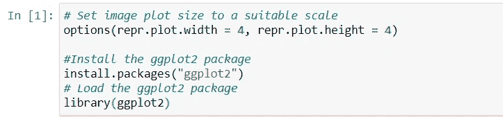
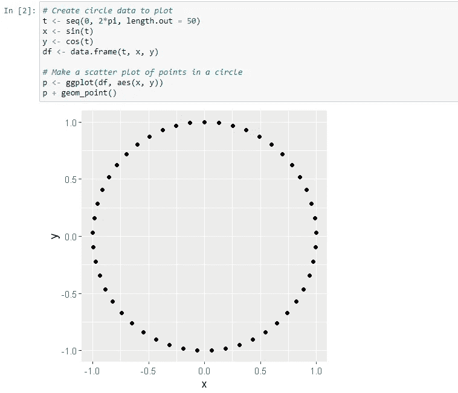
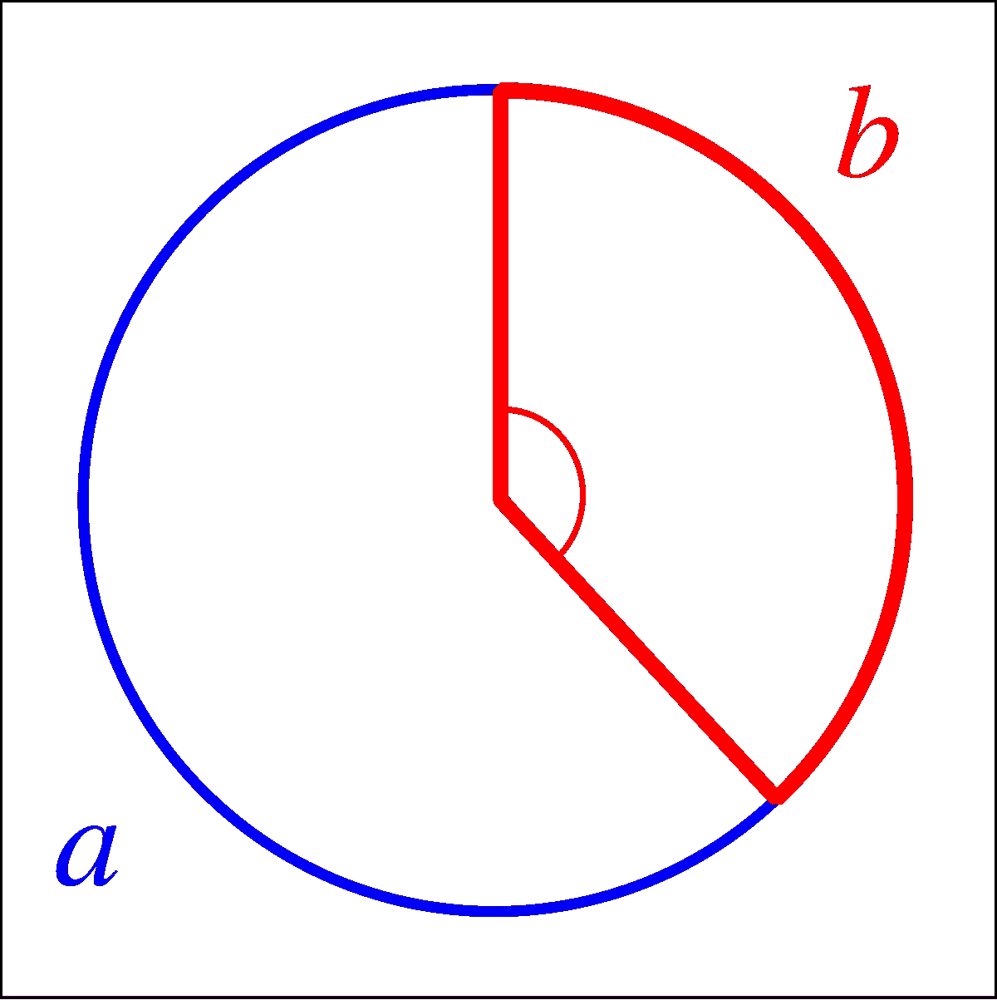
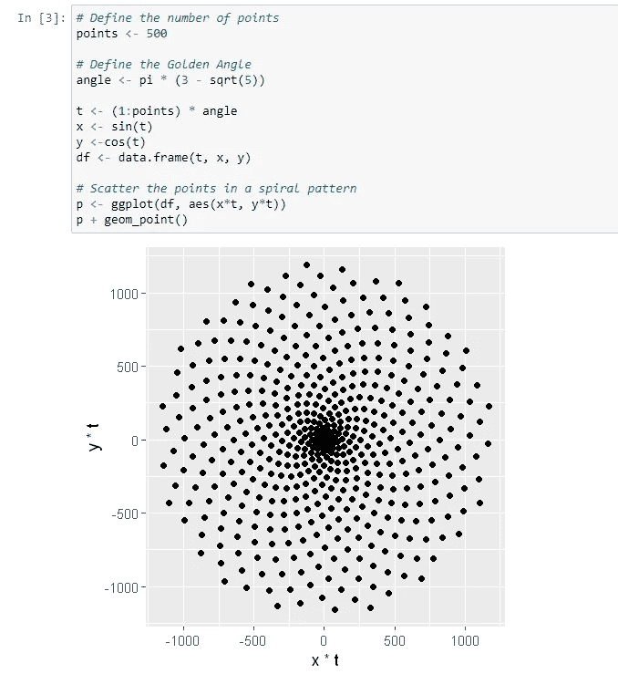
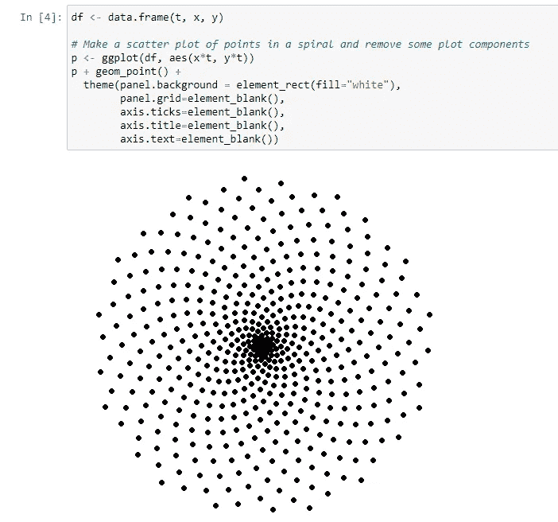
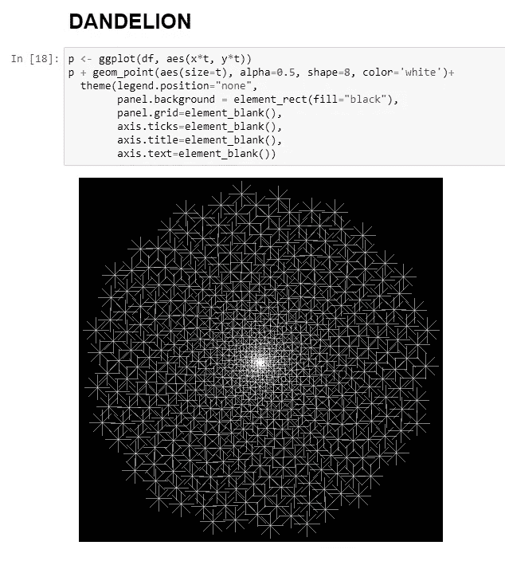
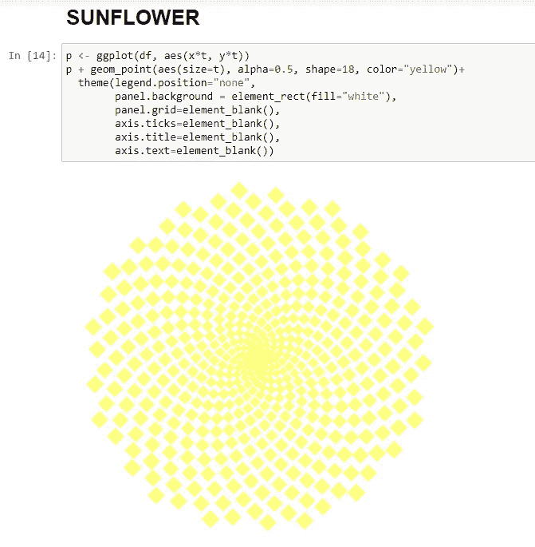

# 叶序:使用 R 的数学规划

> 原文：<https://medium.com/analytics-vidhya/phyllotaxis-mathematical-programming-using-r-d842adb5ef0f?source=collection_archive---------12----------------------->

叶序是指植物茎上叶子的排列，形成独特的自然螺旋模式。

本文基于这一基本概念来演示如何使用 r 中的数学概念来绘制“自然的图案”。本文的范围包括通过使用进一步讨论的步骤来绘制蒲公英和向日葵。

# **预处理步骤:**

**设置合适的图像尺寸，并将“ggplot2”包加载到 R 环境中。**

现在，让我们深入到画花的实际过程。

# **第一步:在一个圆上画点**

我们将使用 **geom_point()** 来绘制 2D 空间中的点。

考虑在半径= 1 的圆上画 50 个点。

**每个(x，y)点都是单位圆*当且仅当* x + y = 1。**

让我们将此扩展到勾股三角恒等式，其中

**sin (θ) + cos (θ) = 1** 对于任意实数θ。

以下代码将应用这一概念来生成一个 50 点的圆形数据图:

# 第二步:使用“黄金角度”的概念

植物以螺旋形排列它们的叶子。在步骤 1 中生成的图中，所有点与原点的距离相同。为了让它们成为一个螺旋图案，我们可以用一个为每个点递增的因子乘以 x 和 y。让“t”成为这个满足要求的因素，让我们用**黄金角**使它和谐。

**黄金角度=π(3√5)**。想象把一个圆的圆周分解成长度为 a 和 b 的两个圆弧，使得 a > b .分解圆使得 **a/b= (a+b)/a** 的角称为**黄金角**。

这里，黄金角是较小的(红色)弧所对着的角。

现在让我们使用下面的代码旋转 500 个点，看看结果。

# 第三步:删除情节中不必要的东西

让我们通过删除以下内容，仅保留视觉效果中所需的部分，来清理之前的情节:

1.  灰色背景
2.  垂直线和水平线的网格
3.  每个轴上的标题
4.  每个轴上的刻度
5.  沿着轴的文本标签

做了必要的工作后，我们得到了如下图:

# 第三步:想象蒲公英和向日葵

通过摆弄决定点的大小、透明度和颜色的参数，找出我们是如何得到蒲公英和向日葵的图案的！

因此，我们已经成功地看到了如何在 r。

值得注意的是，这些图案对形成螺旋的点之间的角度非常敏感。角度的微小变化会产生明显不同的图像！