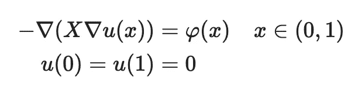
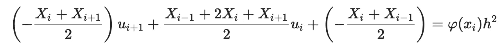

# 基于物理学的机器学习:结合科学计算和机器学习解决逆问题

> 原文：<https://medium.com/analytics-vidhya/physics-based-machine-learning-combining-scientific-computing-and-machine-learning-for-inverse-ddb897eaf2ec?source=collection_archive---------9----------------------->

本文改编自基于物理学的机器学习库 ADCME 文档

[](https://github.com/kailaix/ADCME.jl) [## kailaix/ADCME.jl

### ADCME 图书馆(计算和数学工程的自动微分图书馆)的目标是一般的…

github.com](https://github.com/kailaix/ADCME.jl) 

# 什么是逆向建模？

逆建模问题在数学上可以表述为在给定正模型的输入 X 和输出 u 的情况下寻找未知参数 X

u= *F* ( *θ，* X)

这里 X 和 u 可以是随机过程的样本。可以用 ADCME 处理的逆问题的范围是

1.  正向模型必须*可微*，即∂ *F/* ∂ *X* 和∂ *F/* ∂ *θ* 存在。然而，我们并不要求那些渐变由用户来实现；它们可以用 ADCME 中的自动微分来计算。
2.  前向模型必须是一个*白盒*并通过 ADCME 实现。ADCME 不用于黑盒模型的逆建模。


逆向建模的范例

估计 x 的一个迭代过程如下:我们从初始猜测 X=X⁰开始，假设它是正确的，并且用在 ADCME 中实现的正向建模代码计算预测的输出 u⁰。然后，我们测量预测的输出 u⁰和实际的 u 之间的差异，并应用常规的基于梯度的优化方法来找到最小化该差异的最佳 x。梯度用自动微分法、伴随状态法或两者都用来计算。

这种概念上简单的方法可以解决各种类型的反问题:X，u 是随机的或确定的，未知的 X 可以是值、函数、泛函甚至随机变量。例如，假设正演模型是具有适当边界条件的泊松方程(可视为输入数据 *θ* )，



u(x)是输出，下表列出了可以用 ADCME 解决的四类潜在问题


(*)f*f*的自变量独立于 u*u*(*)f*f*的自变量中至少有一个依赖于 u

# 利用 ADCME 进行逆建模

## 参数逆建模

当 *X* 只是一个标量/向量时，我们称这类问题为**参数反问题**。我们考虑一个人为的解决方案:精确的 *X* 是 1，而*u*(*X*)=*X*(1-*X*)，所以我们有

*φ* ( *x* )=2

假设我们可以观察到 *u* (0.5)=0.25，最初的猜测为 *X* 0 =10。我们使用有限差分法对偏微分方程进行离散，区间[0，1]被均匀划分为 0 =*x(*0)<*x(*1)<…<*x(n)*= 1，其中 *n* =100，*x(I*+1)—*x(I)*=*h【T17*

我们可以用下面的代码片段解决这个问题


在大约 7 次迭代之后，估计的 *X* 0 收敛到 1.0000000016917243。

## 函数逆问题

当 *X* 是不依赖于 *u* 的函数，即位置 *x* 的函数时，我们称这类问题**函数反问题**。解决这类问题的一种常见方法是用参数化形式来逼近未知函数 *X* ，例如分段线性函数、径向基函数或切比雪夫多项式；有时我们也可以将 *X* 离散化，并用离散网格节点上的值的向量来代替 *X* 。

本教程不是针对不同方法的比较。相反，我们展示了如何使用神经网络来表示 *X* ，并通过将其与数值方案相结合来训练神经网络。用传统的伴随状态法计算梯度是很费力的，但用自动微分法却很简单。

让我们假设真实的 *X* 具有以下形式


精确的 *φ* 由下式给出


想法是使用一个神经网络 N(*x*；带有权重和偏差的*w*w*w*，其将位置 *x* ∈R 映射到标量值，使得


为了找到可选的 *w* ，我们用*X*(*X*)= N(*X*)解泊松方程； *w* )，其中数值方案为



这里*Xi*= N(*Xi*； *w* )。

假设我们可以观测到全解 *u* ( *x* )，我们可以将其与解 *u* ( *x* )进行比较； *w* )，以及最小化损失功能


我们在下面的图中显示了精确的 *X* ( *x* )和逐点误差


## 泛函反问题

在**泛函逆问题**中， *X* 是*依赖*于 *u* (或者两者都是 *x* 和 *u* )的函数；它不能与泛函反问题相混淆，而且更难解决(因为方程是非线性的)。例如，我们可能有


对应的 *φ* 是


为了求解泊松方程，我们使用标准的牛顿-拉夫森格式，在这种情况下，我们需要计算残差


和相应的雅可比矩阵


就像函数反问题一样，我们也是用一个神经网络来逼近*X*(*u*)；不同的是神经网络的输入是 *u* 而不是 *x* 。自动微分便于计算*X*'(*u*)。如果我们使用分段线性函数，就只能计算弱意义上的梯度；但这对于神经网络来说不是问题，只要我们使用“tanh”之类的平滑激活函数。

ADCME 还为您准备了内置的牛顿-拉夫森求解器`[newton_raphson](https://kailaix.github.io/ADCME.jl/dev/newton_raphson/#ADCME.newton_raphson)`。要使用这个函数，你只需要提供残差和雅可比


然后我们可以用来解泊松方程

```
newton_raphson(residual_and_jacobian, u0, θ)
```

这里需要注意的是，牛顿-拉夫森算子是一种[非线性隐式算子](https://kailaix.github.io/ADCME.jl/dev/inverse_modeling/#Forward-Operator-Types-1)，它不属于自动微分应用的算子类型。幸运的是，ADCME 提供了一个 API 来抽象这个技术难题，用户可以直接调用`[NonlinearConstrainedProblem](https://kailaix.github.io/ADCME.jl/dev/api/#ADCME.NonlinearConstrainedProblem-Union{Tuple{T},%20Tuple{Function,Function,Union{Array{Float64,1},%20PyObject},Union{PyObject,%20Array{Float64,N}%20where%20N}}}%20where%20T%3C:Real)`来提取梯度。


注意，在这种情况下，我们只有一组观测值，逆问题可能是不适定的，即解不是唯一的。因此，我们所能期望的最好结果是，我们能找到 N( *x* )的解之一；能够重现我们观察到的现象。这确实是我们在这个例子中遇到的情况:重现的解与观测值几乎相同，但我们发现了一个完全不同的 N(*x*； *w* 对比 *X* ( *u* )。


## 随机反问题

最后一类反问题叫做**随机反问题**。在这个问题中， *X* 是一个分布未知的随机变量。因此，解 *u* 也将是一个随机变量。例如，我们在实践中可能有以下设置

*   *u* (0.5)的测量可能不准确。我们可以假设*u*(0.5)∞N(*u0*(0.5)， *σ* 2)其中 *u0* (0.5)是一个观察值， *σ* 是测量值的规定标准偏差。因此，我们想要估计 *X* 的分布，这将产生与 *u* (0.5)相同的分布。这类问题属于**不确定性量化**的范畴。
*   数量 *X* 本身在本质上是随机的，但是它的分布可能是正/负偏斜的(例如，股票价格回报)。我们可以测量几个 *u* (0.5)的样本，想根据样本估计 *X* 的分布。这个问题也被称为**概率逆问题**。

我们不能像往常一样简单地最小化 *u* (0.5)和`u`(为随机变量)之间的距离；相反，我们需要一个度量来衡量两个分布之间的差异——`u`和 *u* (0.5)。可观测量 *u* (0.5)可以以多种形式给出

*   概率密度函数。
*   非标准化对数似然函数。
*   离散样本。

在本教程中，我们考虑第三种类型。其思想是用神经网络为 *X* 构建一个采样器，并通过最小化实际观察到的样本和产生的样本之间的差异来找到最佳权重和偏差。我们是这样训练神经网络的:

我们首先提出一个候选神经网络，它将来自 N(0， *I* 的样本转换为来自 *X* 的样本。然后我们从 N(0， *I* )中随机生成 *K* 个样本{ *z(i)* }， *i* =1，…， *K* 并转换为{*X(I)*； *w* }， *i* =1，… , *K* 。我们求解泊松方程 K *K* 次得到{*u*(0.5； *z(i)* ， *w* )}， *i* =1，…, *K* 。同时，我们从观测值中抽样 *K* 项(例如，用 bootstrap 方法){ *ui* (0.5)}， *i* =1，…, *K* 。我们可以使用概率度量 *D* 来度量{*u*(0.5； *z(i)* ， *w* )}和{ *ui* (0.5)}， *i* =1，…, *K* 。 *D* 有很多选择，比如(方法可能会重叠)

*   瓦瑟斯坦距离(从最优运输)
*   KL-divergence，JS-divergence 等。
*   鉴别器神经网络(来自生成对抗网络)

例如，我们可以考虑第一种方法，并调用 ADCME 提供的`[sinkhorn](https://kailaix.github.io/ADCME.jl/dev/inverse_impl/@ref)`


# 结论

我们介绍了四种类型的逆向建模问题，其中机器学习和科学计算的结合可能是有益的。将这两个领域的精华结合起来，有望解决科学和工程中许多长期存在的挑战性问题

*   科学计算界在过去几十年中开发的数值格式，用于模拟由偏微分方程描述的物理过程，具有收敛、稳定和高效等特点。
*   机器学习擅长从数据中“学习”，特别是神经网络是一个非常强大的通用逼近器。

如果你想了解更多基于物理的机器学习背后的技术工具，下面的页面是一个很好的起点

[](https://kailaix.github.io/ADCME.jl/dev/inverse_modeling/) [## 逆向建模

### 逆向建模(IM)确定了一组参数或函数，利用这些参数或函数，正演模型的输出…

kailaix.github.io](https://kailaix.github.io/ADCME.jl/dev/inverse_modeling/) 

此外，如果你对基于物理的机器学习在现实世界问题中的应用感兴趣，这里的是可能应用的列表。