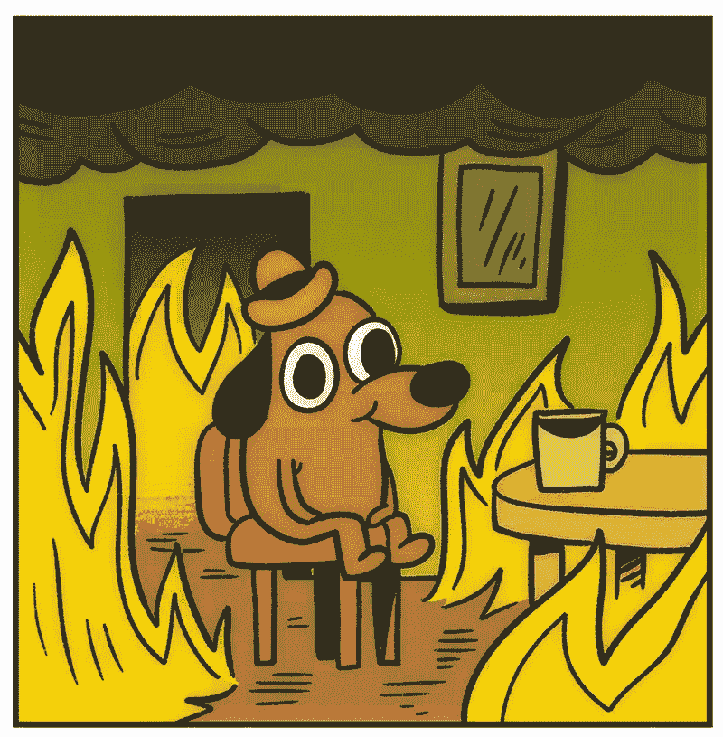
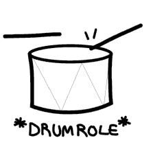

# 像数据科学家一样挑选下一餐

> 原文：<https://medium.com/analytics-vidhya/picking-your-next-meal-like-a-data-scientist-3b1933c9b95a?source=collection_archive---------18----------------------->

*这篇文章由我的数据科学家同事* [*彼得·加西亚*](https://www.linkedin.com/in/peter-garcia/) *共同撰写。你可以在这里* *查看他的媒介账号* [*。*](/@garciapeter924)

所以彼得和我坐在那里，做我们各自的顶点项目。这是一个星期二的晚上，我们的数据科学项目只剩下一周的时间了，我们需要我们能得到的每一分钟。就在那时，饥饿来袭。像往常一样，伴随着饥饿而来的是选择一个地方寻找食物的美妙过程。像往常一样，对于这类决定，彼得和我都举棋不定——所以像任何优秀的数据科学家一样，我们“建立了一个模型”来消除我们自己的个人偏见。


是时候找点乐子了

…对于模型，我们的意思是使用一个简单的函数来决定去哪里，这个函数叫做`numpy`子包`random`中的`choice()`。

```
import numpy as npfood = ['pizza',
        'chinese',
        'mcdonalds',
        'chicken place next to the arepa place',
        'dos toros',
        'chickfilla',
        'mexique',
        'smashburger',
        'shake shack',
        'shortys']# We clearly want THE healthiest of choicesnp.random.choice(food)
```

因此，在 jupyter 笔记本中导入`numpy`之后，我们实例化了该地区的食物选择列表。之后，numpy 的`random.choice()`随机选择了一个地方:

```
`mcdonalds`
```

当然，我们对结果不满意，因为这个结论太容易得出了。所以我们想了一个“先到”的场景。就这样，我们把事情复杂化了，因为为什么不呢。这并不像我们有一个顶点来完成或任何其他时间敏感的事情。



因为我们正在创建一个函数，所以首先要做的是。让我们定义我们的函数和它的参数。`food_list`是我们想去的地方的列表，而`count`是我们将在“第一个到”场景中观察到的实例数量，默认为“第一个到三个”。

```
def get_food(food_list, count = 3):
```

我们将通过使用字典理解来跟踪我们想去吃饭的每个地方的计数，从而开始这个函数。字典的关键字是位置，它们各自的值是它被选择的次数。

```
 food_dict= {item:0 for item in food_list}
```

为什么是字典？好吧，因为我们想做一个“第一次”的场景，我们最终会把这些零转换成数字，代表一个特定的键被随机选择的次数。一个简单的例子是，如果我们必须在比萨饼和中餐之间选择前三名，比萨饼以 3 比 1 获胜，字典最终会是这样的:

```
{'pizza': 3,
 'chinese' : 1}
```

由于`'pizza'`比列表中任何其他选项被随机选择的次数都多，我们的函数将返回`'pizza'`作为要去的地方。

我们的`get_food`函数的下一步是一个`while`循环。

```
while max(list(food_dict.values())) < count:
        increment = np.random.choice(food_list)
        food_dict[increment] += 1
```

在上面的代码中，虽然我们的字典中的最大值(最初是我们创建字典时的`0`)小于“第一个到达”的场景(`count= 3`)，但是我们将从我们的`food_list`中随机选取一个地方，并将其对应的字典值增加`1`。第一个达到我们期望数量的食物将成为我们的赢家。

最后，使用列表理解，我们需要用一个`return`语句来结束函数，这将给出我们想要的:去哪里吃饭！

```
return [place for place in food_list if food_dict[place] == count]
```

因此，将所有这些放在一起，代码看起来有点像这样:

```
food = ['pizza',
        'chinese',
        'mcd',
        'chicken place next to the arepa place',
        'dos toros',
        'chickfilla', 
        'mexique', 
        'smashburger', 
        'shake shack', 
        'phillys']# Remember - healthy foods only! def get_food(food_list, count = 3):

    food_dict= {item:0 for item in food_list}

    while max(list(food_dict.values())) < count:
        increment = np.random.choice(food_list)
        food_dict[increment] += 1

    return [place for place in food_list if food_dict[place] == count]
```

现在是关键时刻。我们将把`food`列表传递给函数，让它做一个“first-to-15”场景。

```
get_food(food, count = 15)
```

这告诉我和彼得我们应该从…



```
['shake shack']
```


对于该功能的未来实现，我们正在考虑让`get_food`从让用户提供选项开始，然后我们可以将这些选项转换成字典。从编码的角度来看，这允许可伸缩性和放手的方法，因为我们不必经常回到代码和修改列表——这将是一个令人头痛的问题，因为位置可以改变，这意味着食物选项也可以改变。

此外，我们实际上并没有从我们的决定中消除任何偏见，因为`food`列表是从我们头脑中产生的一个狭窄的选项列表开始的。使列表更加客观的一种方法可能是使用位置和时间来填充当前营业的餐馆列表——但这有点复杂，因为现在是周二晚上 9 点。

因此，最初开始是两个优柔寡断的人在编写了`np.random.choice()`解决方案后聚在一起做决定，后来变成了 30 分钟的故障排除会议，因为我们正在构建`get_food`功能。也许我们很无聊，也许我们太饿了，无法决定，或者也许…


不管为什么，我们所知道的是，我们现在想享受我们美味的沙克汉堡…哦，还有我们的顶石！