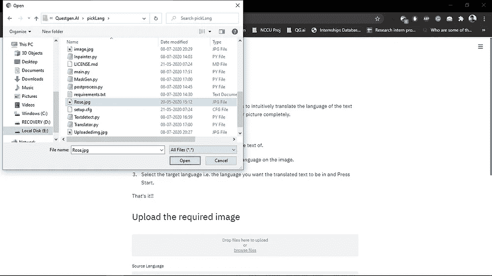

# 图片翻译:无缝实时图像文本翻译

> 原文：<https://medium.com/analytics-vidhya/pictranslate-seamless-live-image-text-translator-882bf2cedc29?source=collection_archive---------19----------------------->

假设你是一名教授，用英语幻灯片做了一次演讲。现在你被指派给**的意大利观众**做另一场演讲。为了更好地理解，您可能希望立即生成一个用**意大利**文本表示的演示文稿，并保持所有内容不变。picTranslate 只需点击几下鼠标就可以做完全相同的事情！！

**结果**

# 介绍

在这篇博客中，我将尝试描述基于人工智能的 **picTranslate** 应用程序的使用和开发。大多数现有的应用程序只专注于翻译写在图像上的文本，并在其他新窗口中显示。这种翻译可能有助于你理解文本，但场景的原创性丢失了，你可能无法将图片与文本联系起来。

考虑到用户的宝贵体验和先进的人工智能技术，picTranslate 被开发用于在将文本转换为所需语言的同时保留图像的背景。**有超过 50 种语言可以互换翻译文本**。这些新图片将会增强你的演讲，使其更具启发性和表现力。

# 技术术语

picTranslate 应用程序的开发涉及许多步骤，但需要考虑的深层阶段有:

*   文本检测和提取
*   文本位置的图像修复
*   文本翻译
*   在修复图像上书写文字。
*   通过 Streamlit 部署应用

**文本检测和提取:**

为了检测文本位置并将其从图像中提取出来，使用了 **AWS Textract API** 。有两种方式提供输入图像，通过 **S3 桶或图像字节数组流**。我选择了后一种方法，因为它效率更高，占用的内存更少。

**检测并提取文本**

**图像修复:**

因为我们已经从图像中移除了文本，所以产生了一些洞。使用基于卷积神经网络的图像修复来填充这些孔洞并重新生成图像。正在对修复方法进行大量研究，picTranslate 利用 **2019 EdgeConnect 修复模型**惊人地重新生成整个图像。

**孔洞再生**

**文字翻译:**

picTranslate 使用 **AWS 翻译 API** 将提取的文本从外语翻译成所需的语言。然后，使用我们的定位模块 OpenCV 将该文本写入重新生成的图像。

**文字被翻译和书写。**

**使用 Streamlit 进行部署:**

对于一些第一次听说 Streamlit 的人来说，这是一个面向 ML 和数据科学从业者的框架，他们远离 web 开发的概念。使用它，可以用 Python 开发漂亮的应用程序，而且它工作起来非常棒！

**Streamlit App 界面**

# **成绩:**

**从英语翻译成意大利语的文本**

# 改进的余地

正如他们所说，“变化是唯一不变的”，这个项目有很多地方需要改进。随着研究的进展，更好和更精确的修复方法可以用于图像再生。有一天，修复和文字书写都将基于人工智能，并且并行进行。字体风格可以工作，使其基于人工智能，而不是使用 OpenCV。当不存在任何效率-计算权衡时，AWS APIs 可以用本地模型替换。

**你可以在我的 Github 个人资料上找到源代码:**

 [## Vaibhav-nn/picTranslate

### 有时我们需要翻译写在图像上的文字，同时保持背景不变。这通常是…

github.com](https://github.com/Vaibhav-nn/picTranslate) 

**我之前写过几篇关于修复和 AWS 的博客:**

[修复及其演变](/analytics-vidhya/image-inpainting-and-its-evolution-a-brief-discussion-ae1d42431308)、[修复方法](/datadriveninvestor/inpainting-of-irregular-holes-using-partial-convolution-paper-summary-e836cd2c44ae?source=---------1------------------)、 [AWS Textract](/datadriveninvestor/deploying-amazon-textract-via-image-bytes-311510434d7a)

> Ramsri Goutham 一直指引着我，没有他，这一切都是不可想象的。

谢谢大家！！