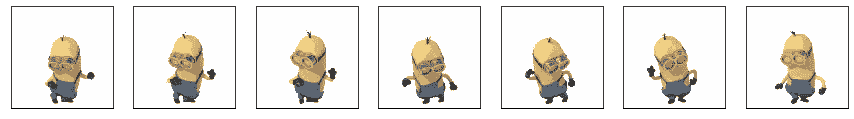
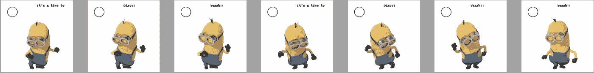

# 枕头图书馆-初学者教程

> 原文：<https://medium.com/analytics-vidhya/pillow-library-tutorial-for-beginners-44d9c110b1bc?source=collection_archive---------12----------------------->


图片来源:谷歌

在这里，我将讨论图像变换:几何，颜色，点一些图像阈值，图像增强应用过滤器，编辑 GIF，在图像上绘图，图像转换和修改批量和滚动图像使用 PIL。

在这里，我不会讨论哪个库更好——OpenCV 或 Pillow 或该领域的任何其他库。但是，我将提到一些要点来帮助您区分这两个库:

*   枕头是专门用于图像处理的。
*   与 OpenCV 相比，Pillow 重量轻，易于使用和安装。
*   OpenCV 与图像处理模块一起加载了计算机视觉算法，并广泛用于基于视觉的机器人。

Pillow 是 PIL- Python 映像库的一个[分支](https://en.wikipedia.org/wiki/Fork_(software_development))，它将支持 Python 3.x

安装枕头库:

```
pip install PIL
```

# 本库的重要类:**图片**

打开图像并获取它的细节。


图片来源:谷歌

裁剪并粘贴图像的各个部分:


请注意左上角香蕉方向的变化

获取图像的波段，并将其合并以创建一个具有不同颜色的新图像。


使用 RGB 波段的 BGR 图像

# 图像变换

1.  **几何变换**

调整图像大小、旋转图像、翻转图像是我们将在这里尝试的变换:


分别使用填充颜色调整大小的图像和 45 度旋转的图像


分别使用缩略图调整大小和使用 Rotate_180 模块旋转

请注意*调整*模块和*缩略图*模块后的变换图像之间的差异。

这将在把图像调整到提到的尺寸后返回新的图像。它会强制图像适应那个尺寸。

`im.thumbnail(size)`:这个模块会改变图像本身的大小，保持图像的长宽比。因此，即使您指定的大小改变了纵横比，它也会根据原始图像的纵横比来改变图像。因此，即使我将(128，128)作为参数传递，它也将返回大小为(128，90)的图像。

`im.rotate()`:除了上述特征之外，它还有一个“*中心*”和“*翻译*”论元。

*   中心:指定要旋转图像的点
*   平移:平移旋转后的图像
*   扩展:如果为 True(1 ),将使旋转后的图像适合框架。默认值—假(0)。

`im.transpose(method)`:用于根据传递的方法转置图像。下面是可以传递的具有不言自明的名称的方法。

*   `Image.ROTATE_180`
*   `Image.ROTATE_270`
*   `Image.ROTATE_90`

2.**颜色变换**

要将图像从 RGB 模式更改为灰度模式:


灰度图像、1 位图像、8 位图像

3.**点变换和图像阈值处理**

点变换只是改变每个像素的值。使用这个概念，我们可以为高于/低于特定灰度值(这里，低于 250)的灰度图像设定阈值，像素将采用该值(这里，255)


明亮图像和阈值图像。

4.**图像增强**

PIL 图书馆提供了各种过滤器平滑，锐化，模糊，轮廓，改变图像的对比度，亮度，色彩平衡。

要使用不同的滤镜，请使用以下命令从 PIL 库中导入 ImageFilter:

```
from PIL import ImageFilter as ifilter
```


模糊图像和轮廓图像


分别锐化和平滑图像

使用 ImageEnhance 模块更改图像的亮度、色彩平衡和对比度。要导入 ImageEnhance 模块，请使用

```
from PIL import ImageEnhance as ienhance
```


90%的亮度和色彩平衡图像


90%对比度和锐化图像

5.**编辑 gif 并在图像上绘图**

探索 gif 的一些基本方法:

*   `im.n_frames`:返回 GIF 中的帧数。
*   `im.tell()`:返回当前帧号。
*   `im.seek(frame_no)`:导航到传递的 frame_no 值。



GIF 帧索引从 0 到 6



已编辑 GIF 的框架

6.**批量图像转换/修改**

在这里，我们将大量 JPEG 图像的大小改为(128，128)，并将格式改为“PNG”。在这里，您可以尝试其他代码来进行任何您想要的修改，而不是更改大小。

7.**滚动图像**

为一些 delta 像素移动图像:这在深度学习的[数据扩充](https://towardsdatascience.com/data-augmentation-for-deep-learning-4fe21d1a4eb9)中很有用。


原始图像和滚动图像

总之，我们可以使用 Pillow 库进行图像转换、增强和批量修改。除了 JPEG，PNG，GIF，它还支持 BMP，DIB，EPS，PCX 等。等等。

如果你觉得有用，请为我鼓掌！

查看 python 笔记本中枕头库的一些不同示例，网址为:

[](https://github.com/vaibhavkpatel1/JupyterNotebooks/blob/master/Pillow%20Library.ipynb) [## vaibhavkpatel 1/JupyterNotebooks

### permalink dissolve GitHub 是 4000 多万开发人员的家园，他们一起工作来托管和审查代码，管理…

github.com](https://github.com/vaibhavkpatel1/JupyterNotebooks/blob/master/Pillow%20Library.ipynb)