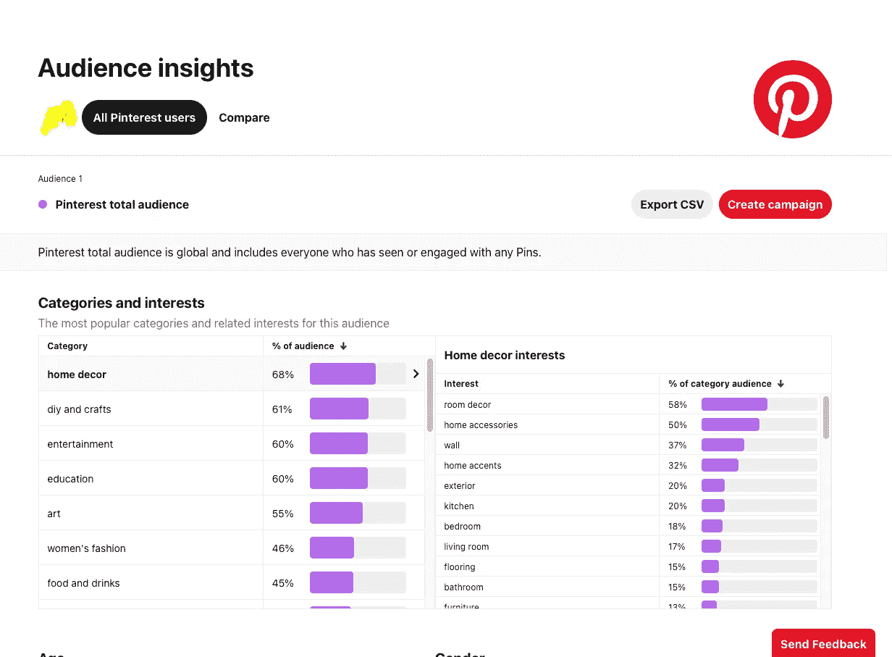
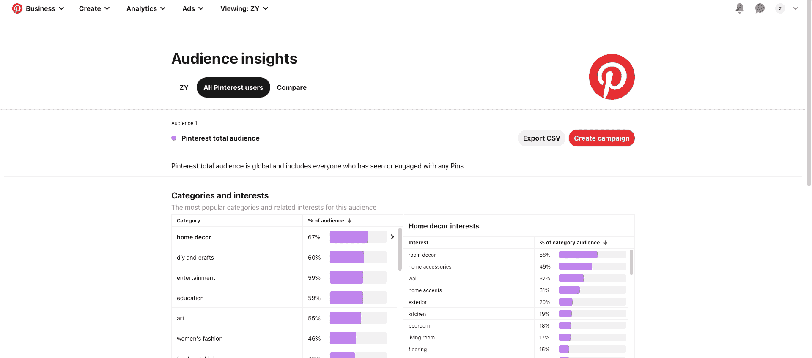
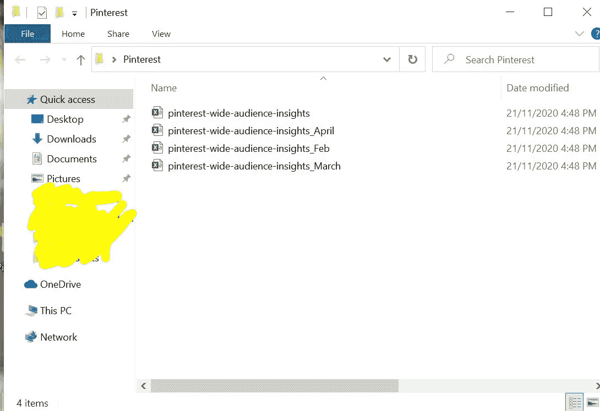
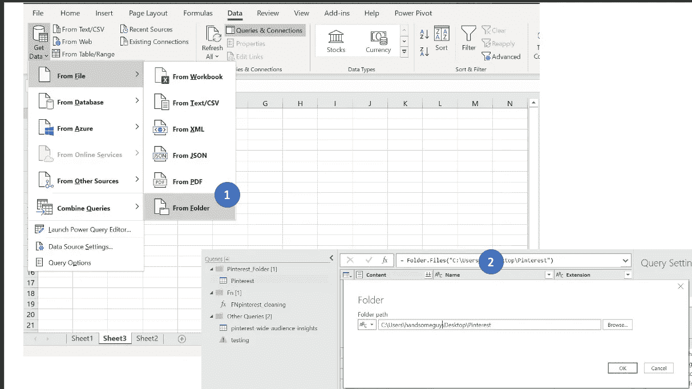
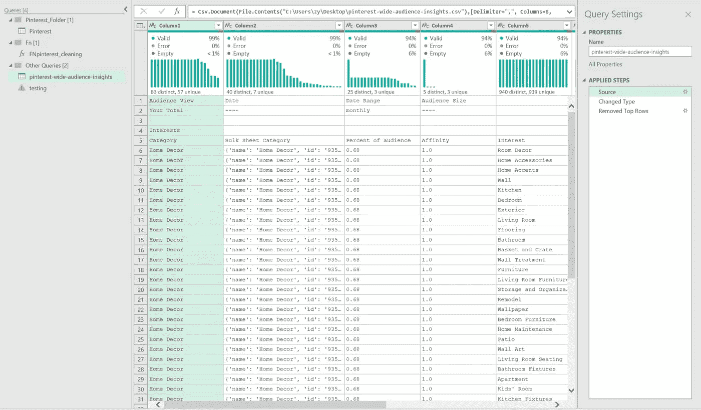
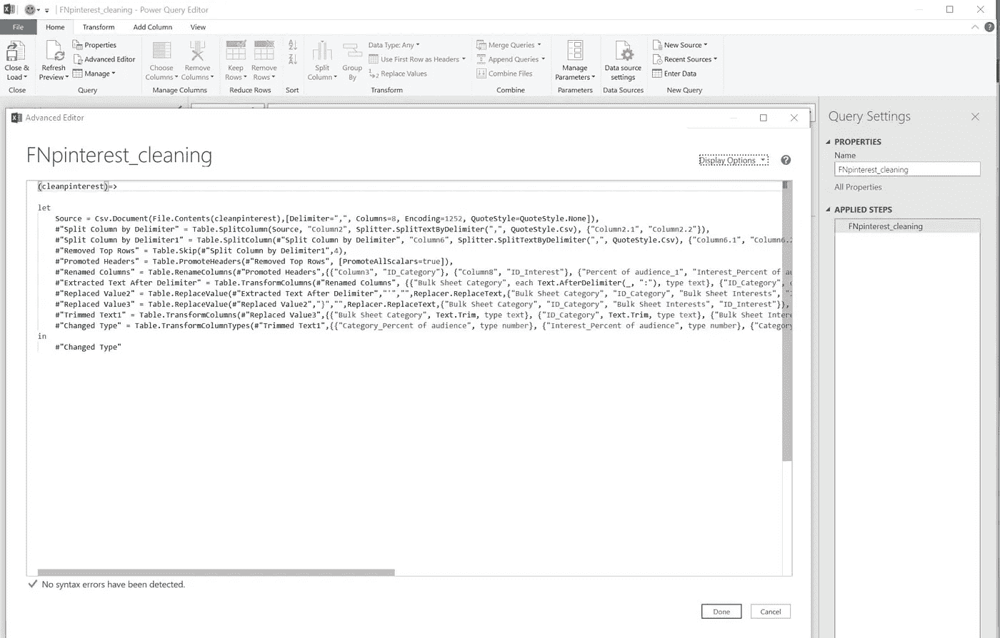
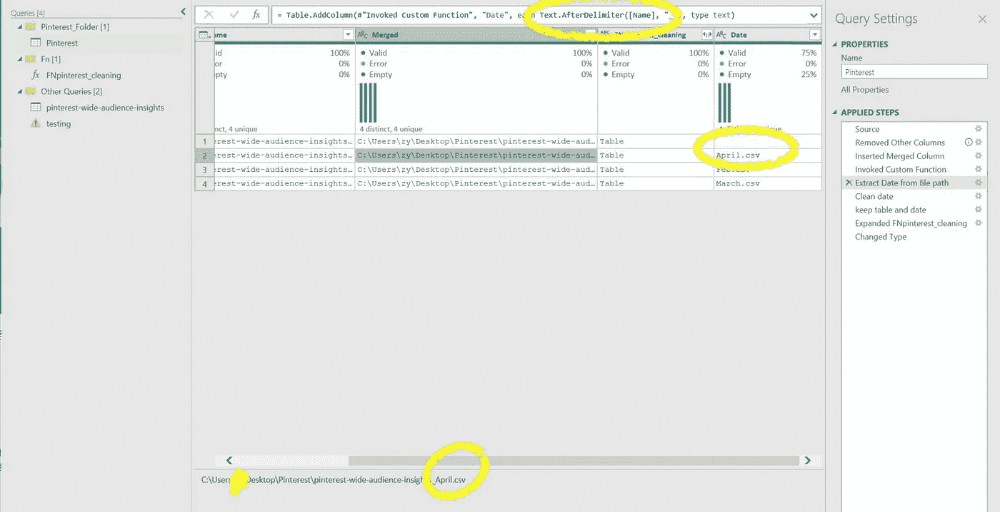
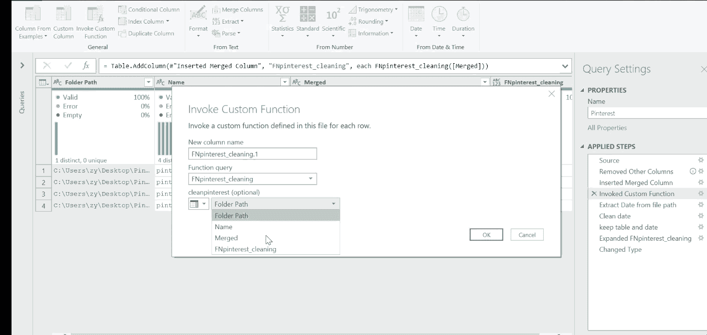
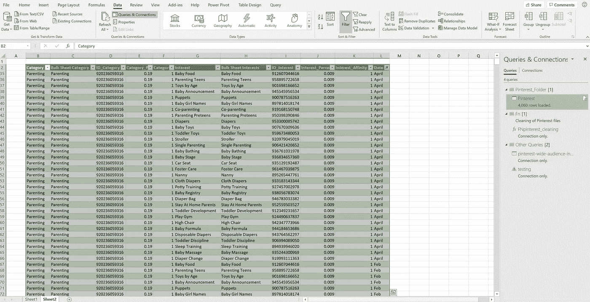

# Pinterest x 免费 Excel x PowerQuery 模板

> 原文：<https://medium.com/analytics-vidhya/pinterest-x-free-excel-x-powerquery-template-5a408bc38b83?source=collection_archive---------25----------------------->

就个人而言，在这次疫情期间，Pinterest 与其他社交媒体平台相比，相当有趣，引人注目，令人耳目一新。无论是人气还是股价。Pinterest 第三季度月度活跃用户的国际增长率为 46%，股价今年迄今已飙升 256%。


[https://unsplash.com/photos/hOGKh5qHNAE?utm_source=unsplash&UTM _ medium = referral&UTM _ content = creditShareLink](https://unsplash.com/photos/hOGKh5qHNAE?utm_source=unsplash&utm_medium=referral&utm_content=creditShareLink)

> https://www . fool . com/investing/2020/11/22/up-over-250-in-2020-is-Pinterest-stock-still-a-buy/



Pinterest 受众洞察仪表板

有了这些信息，我决定冒险买一些 Pinterest 的股票，并决定为我未来的在线商店尝试这个平台。【Pinterest 业务中有一些非常有趣的分析>分析>受众洞察，作为一个好奇的数据人，我下载了可用的原始数据，以了解什么是 ***【引擎盖下】*** 。



下载用于分析的原始数据

```
*Interests
Category,Bulk Sheet Category,Percent of audience,Affinity,Interest,Bulk Sheet Interests,Percent of audience,Affinity
Home Decor,”{‘name’: ‘Home Decor’, ‘id’: ‘935249274030’}”,0.67,1.0,Room Decor,”{‘name’: ‘Room Decor’, ‘id’: ‘916836567854’}”,0.58,1.0*
```

> 对于 Excel 用户来说，OG 格式并不友好。让自动化成为 Excel 友好的

天啊，所有的数据都以 csv 格式排列在一起，在 excel 中手动分离并不容易，更不用说每月更新了。
理想情况下，在 Excel 中，我们可以使用“Delimited”并通过“comma”进行拆分，但是{' …'}之间的文本和在顶部附加较新的月份数据带来了一些挑战。让我们也不要忘记人类的错误，因为这是容易发生的，无论何时任何人都在做这样的每月世俗任务。(有罪必罚)
我决定用 PowerQuery 创建一个解决方案，并构建一个自定义函数来 ***清理和追加数据*** ，供那些对每月网站分析感到好奇的 Pinterest 用户使用。

> W **hy 写自定义函数？**

1.  清洁。csv 自动减少人为错误
2.  以所需的格式附加数据，以便于分析
3.  腾出你的时间去处理更重要的任务



重命名文件夹中的文件名

# 步骤 1:创建文件夹

创建一个新文件夹，命名为“Pinterest_Data”或任何让你开心的名字:)
这是你把所有。csv 文件到此文件夹中，在 csv 文件的末尾添加“_[月][年]”，例如 Pinterest_10_2020.csv。(对于此示例，我没有添加[年])



从文件夹中读取的步骤

# 步骤 2:使用 PowerQuery 通过文件夹读取文件

转到数据>获取数据>从文件>从文件夹，您的文件路径将出现在源文件下。由于我们正在将每月数据文件转储到该文件夹中，PowerQuery 将自动拾取新添加的文件。
我们将在创建自定义功能后继续以下步骤，因此我们不需要永远重复这些步骤:)



清理一个。csv 文件



# 步骤 3:创建自定义函数

从步骤 2 复制一个查询，并将其重命名为 FNpinterest_cleaning。在这个查询中，我将修剪、删除字符，并按分隔符进行分割，以便可以使用

一旦我对数据格式感到满意，让我们在查询“let”开始之前单击“Advanced Editor”Add()= >，并将此函数命名为(cleanpinterest)，作为一种最佳实践，最好给出一个描述性的名称，以便更容易与查询进行识别。*用(cleanpinterest)* 替换原始路径名



日期提取

# 步骤 4:从文件中提取下载日期

这就是有趣的地方:)还记得在第 1 步中，我们用“_[month][year]”将文件重命名为。csv 文件，由于文件中没有任何日期，我们需要创建一些东西来标识日期。
接下来，我要创建一个新列，并按文本分割文件路径。以“_”分隔，这是我们的月份。Woola，现在我们能够在调用函数时识别文件的日期。

> 在这里阅读官方文档[](https://docs.microsoft.com/en-us/powerquery-m/understanding-power-query-m-functions)

**

*调用自定义函数来清理其他。战斗支援车*

# *步骤 5:调用函数清理所有文件*

**

*表或数据透视表中的最终输出*

# *第六步:完成*

*完成:)您可以随意跳舞，或者用我们通过这种自动化节省下来的额外时间为自己泡一杯咖啡。
下一步可能是深入了解您的数据。给我一个 DM，如果你想要我写的函数的副本。*

*如果您使用我的模板，您只需要重新创建步骤 1。
**如果你们中有人知道 Pinterest 中的以下术语“受众百分比、亲和力、兴趣”是什么意思，请发表评论:)感谢***