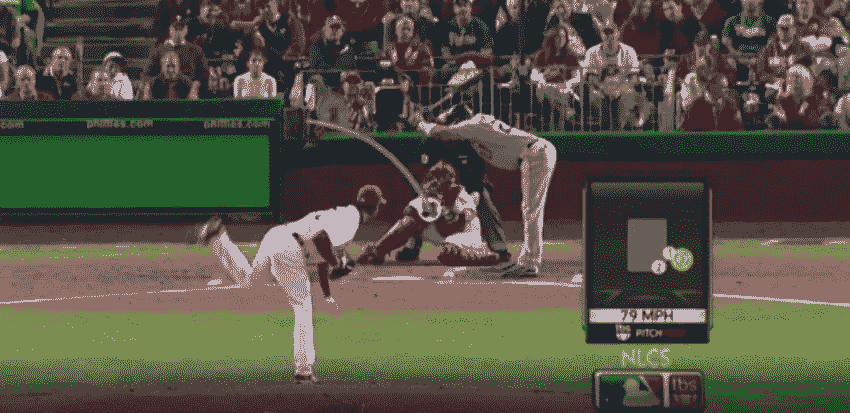

# 音高预测—第 1 部分

> 原文：<https://medium.com/analytics-vidhya/pitch-predict-part-1-7001516d9f40?source=collection_archive---------7----------------------->

使用机器学习来预测下一次投球



这是涵盖 Lambda School 最近的数据科学项目的一系列文章中的第 1 部分。项目 [github repo 可以在这里找到](https://github.com/labs15-baseball-pitch-predictor)。为了获得一些使用 [Plotly Dash](https://plot.ly/dash/) 的经验，我还创建了一个[仪表盘应用，这里是](https://pitch-predict.herokuapp.com/)。这个系列的第 2 部分可以在这里找到[，第 3 部分](/@jmancuso82/pitch-predict-part-2-637e3578d3e8)[在这里](/@jmancuso82/pitch-predict-part-3-2f648d8fe825)。

# 介绍

*项目和我们目标的概述*

在美国职业棒球大联盟中击球的任务是极其困难的。考虑一个伟大的击球手的基准是 0.300 的平均击球率——这只是 30%的成功率。如果击球手知道投手下一次可能投什么球，他成功的机会就会大大增加。投手比击球手(或一般人)意识到的更容易预测吗？对于一个协作数据科学组项目，基于封装了投手的先前倾向、击球手的先前倾向、游戏状态、最近 n 次按时间顺序排列的投球和投手-击球手先前比赛历史的数据，我们开始使用机器学习模型来尝试回答这个问题。

该项目旨在为进一步的研究奠定基础，并有可能成为一个应用程序，该应用程序将投球预测功能与当前比赛、投手和击球手的实时信息结合在一起，呈现在一个有吸引力的用户界面中。在制定设计决策时考虑到了这种可能性，许多组件都被设计成通用的，并且可以根据弹性资源进行扩展。

# 数据采集

*解释我们的数据来自哪里，其高级特征，我们如何存储和访问它，以及它是如何细分的*

通过 [pybaseball](https://github.com/jldbc/pybaseball) 包从 Statcast 收集音高数据。Pybaseball 的 statcast 类允许我们按日期范围查询球场。在确定了 2017 年、2018 年和 2019 年*(直到 8/31/19)常规赛的开始和结束日期后，我们能够将数据加载到包含每个常规赛的每个记录球场的熊猫数据帧中。这些数据帧随后要进行初步的数据清理。清理之后，数据帧被压缩并作为 pickle 文件存储在 github 中。

```
import pandas as pd
from pybaseball import statcastdrop_cols = ['spin_dir','spin_rate_deprecated', 'break_angle_deprecated','break_length_deprecated', 
             'game_type', 'tfs_deprecated', 'tfs_zulu_deprecated', 'umpire']#2017
df = statcast('2017-04-02', '2017-10-02')
df = df.drop(columns=drop_cols)df.to_pickle(path='pitches_2017.pkl', compression='zip')
```

考虑到未来的项目开发，数据除了被压缩并作为 pickle 文件存储在主项目 GitHub 存储库中之外，还作为 pickle 文件和 csv 文件存储在 S3 存储桶中。这些 csv 文件随后被用于创建红移表，包含 2010 年至 2019 年的所有常规赛投球。这种存储架构是为这个项目的未来迭代而设计的，以便扩展模型将被训练的投手的数量，并创建实时投球预测 web 应用程序。对于当前项目的范围，模型训练和预测是在 Jupyter 实验室笔记本上的 AWS sage maker ml . m 4 . 4x 大型实例上生成的。项目[仪表盘](https://pitch-predict.herokuapp.com/)是使用 Plotly Dash 创建的，托管在 Heroku 上。

# 数据预处理/特征工程

*工程特征和方法的解释*

正如在数据科学领域经常出现的情况一样，花费在这个项目上的大部分时间都用于数据清理、处理和特性工程。一开始，我们对项目进行了高层次的概述，并试图规划所有必要步骤的蓝图，以及我们希望如何将来自 Statcast 的原始音高数据转换为我们希望的格式，以作为机器学习模型的输入向量。

**清理坏的/错误的数据**

在不深入细节的情况下，在数据争论和功能工程的过程中，我们在数据中遇到了一些小故障，所以我们在前面添加了一些代码，试图解决大部分问题。基本上，这包括剔除少量未安装 Statcast 摄像机跟踪系统的海外比赛，用 NaN 值替换未知的球场类型，在少数情况下将球数从 4 个固定为 3 个，以及其他一些类似错误数据的小例子。

**一个 *ll* 节距数据的工程特征:**

虽然原始 Statcast 数据本身包括大量的特征，但我们试图发挥创造力，提出一些非常酷的附加特征，试图增强我们的预测模型的性能。由于每个投手都有独特的球路和个人倾向，试图用所有投手的数据建立一个预测模型是徒劳的。由于这个原因，我们知道我们想要预测的每个投手都必须从所有投球的完整数据集中筛选出来。在达到这一步之前，我们设计了许多适用于所有投手的功能。

**游戏状态特征**

Statcast 数据包括计数的当前状态(通过球的特征和击球的特征)，但我们还想使用 12 个可能的计数作为分类变量。我们将球和击球组合成一个字符串表示，其中 0–0 计数编码为“00”，3–2 编码为“32”，等等。此外，我们进一步将计数映射为 3 个类别，代表计数是否偏向投手、击球手或计数是否中立。有理由认为，投手处理这些情况的方式不同，他们对投球的选择应该根据计数的有利程度而有很大的变化。

接下来，我们创建了一个特征来表示得分差异，或者投手团队领先或落后多少分。接下来，使用 baserunners 的数据，我们将 baserunner 特性从使用 baserunner id 转换为二进制 1/0，不管每个垒上是否有一个跑步者。此外，我们增加了一个功能，是否有任何球员在任何基地对基地空，也有一个功能，是否基地加载。当跑垒员在垒上连续投球时，投手可能在他的倾向上有微妙的不同，而当垒上是空的时，则相反。一垒上的跑垒员有偷垒和前进的潜力，所以也许一些投手不太可能在泥土中扔出那么多可能远离捕手并让跑垒员前进到得分位置的破球。也许一个在二垒上的跑垒员清楚地看到接球手的投球信号，并有可能偷到信号，并用自己的信号提示击球手，这可能会影响投手的投球选择。也许这些趋势中的一些可以有助于机器学习模型进行预测。

**打击区和击球手挥棒/追逐特征**

使用来自 Statcast 摄像系统的位置数据，基于特定击球手的高度/姿势的击球区边界，以及本垒板的尺寸，我们创建了一个特征，将每个投球分类为在击球区内或击球区外(不管裁判称之为球还是击球)。此外，使用来自 Statcast 的*‘描述’*特征，我们提取了指示击球手在投球时挥杆的描述，并创建了表示击球手是否挥杆的二元特征。通过组合这些工程特征，我们创建了一个特征来表示击球手*是否追逐了一个在好球区之外的球。我们认为这在以后创建关于每个击球手的球探报告时会很有用，因为如果击球手倾向于在好球带外追逐某些类型的球，投手可能会在比赛前知道这些信息，并且他可能更有可能对该球员投出某些类型的球。*

```
*def make_strikezone_swung_and_chase_features(df):
    df = df.copy()

    #create swung column
    def swung(x):
        swung = ['foul','hit_into_play','swinging_strike',
                 'hit_into_play_no_out', 'hit_into_play_score',
                 'foul_tip','swinging_strike_blocked',
                 'foul_bunt','missed_bunt']
        return 1 if x in swung else 0 df['batter_swung'] = df['description'].apply(swung)

    #initialize in_strikezone and chased features:
    df['in_strikezone'] = 1
    df['chased'] = 0

    df['ball_high'] = df['plate_z'] > df['sz_top']
    df['ball_low'] = df['plate_z'] < df['sz_bot']
    df['ball_left'] = df['plate_x'].apply(lambda x: x < -0.73)
    df['ball_right'] = df['plate_x'].apply(lambda x: x > 0.73)
    df['in_strikezone'] = df['ball_high'] + df['ball_low'] +    df['ball_left'] + df['ball_right']

    df['in_strikezone'] = df['in_strikezone'].apply(lambda x: 0 if x    > 0 else 1)

    df['chased'] = df['batter_swung'] - df['in_strikezone']
    df['chased'] = df['chased'].apply(lambda x: 1 if x == 1 else 0)
    return df*
```

***音高类别和空值插补***

*不幸的是，Statcast 数据库中很小一部分(约 0.4%)的音高，可能是由于相机系统中的随机故障或其他原因，缺少该音高的音高类型分类值。为了保持每场比赛的球场连续性，而不是简单地从数据帧中删除所有这些行，我们决定估算这些值。我们的插补策略只是使用给定投手的音高类型的总体分布，并进行随机猜测，使用这些分布作为随机猜测的权重。接下来，我们将不同的投球类型映射成一个更一般的投球类型类别:快速球(4 缝线、2 缝线、切球、伸卡球)、破球(曲球、滑球、指节曲球、螺旋球)和变速球(变速球、指节球和易夫球)。*

***接下来:***

*接下来，[第 2 部分](/@jmancuso82/pitch-predict-part-2-637e3578d3e8)将继续进行特征工程，包括创建击球手侦察报告(趋势和成功与不同类型的投球)，投手侦察报告，比赛流程/尾随投球特征，以及来自投手/击球手先前比赛历史的投球趋势。最后，[第 3 部分](/@jmancuso82/pitch-predict-part-3-2f648d8fe825)将涵盖模型选择、训练和模型预测分析。*