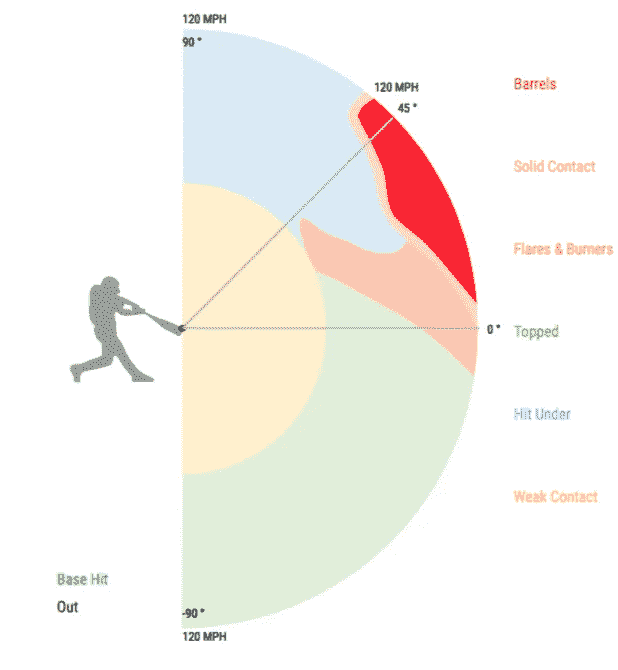
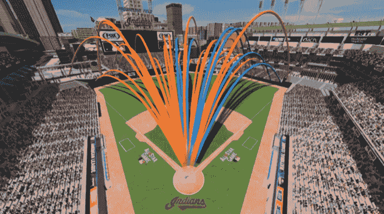

# 音高预测—第二部分

> 原文：<https://medium.com/analytics-vidhya/pitch-predict-part-2-637e3578d3e8?source=collection_archive---------17----------------------->

## 使用机器学习来预测下一次投球


这是涵盖 Lambda School 最近数据科学项目工作的系列文章的第 2 部分。项目 [github repo 可以在这里找到](https://github.com/labs15-baseball-pitch-predictor)。为了获得一些使用 [Plotly Dash](https://plot.ly/dash/) 的经验，我还创建了一个[仪表盘应用，这里是](https://pitch-predict.herokuapp.com/)。这个系列的第一部分可以在这里找到[，第三部分](/@jmancuso82/pitch-predict-part-1-7001516d9f40)[在这里](/@jmancuso82/pitch-predict-part-3-2f648d8fe825)。

**击球手球探报告**



根据直觉，大联盟级别的大多数球队都会创建一份关于他们对手的球探报告，我们想尝试使用 Statcast 球场数据库中的数据来重现这一过程。除了速度、位置、中断距离和角度以及与投球本身相关的各种其他数据之外，Statcast 数据还包括一些关于击球手击球的很酷的功能。这些数据包括发射速度和球离开球棒进入比赛场地的角度/轨迹。它还包括*击球平均值*、 *woba* (基于基础平均值加权)和 *iso* 值(一种力量统计)的估计值，这些值基于以相似速度和角度/轨迹击球的汇总数据。基本上，有时候击球手运气不好，直接打了一个直线球，正好打在防守球员的位置上，然后接住球。如果球在任何一个方向都有几英尺远，就会造成一次垒打或多次垒打。这些估计的统计数据在某种程度上消除了由于直接击中外野手而变得不走运的差异，并提供了击球手何时在球场上进行稳固接触的更准确表示，以及该接触将导致安打或击球手到达垒的相关时间百分比。

对于每个打者，我们过滤了打者面对的所有投球的数据帧，并记录了每个投球类型类别面对的投球的总百分比，认为如果击球手面对某个投球类型类别的百分比异常高，可能有一个潜在的原因，即投手对那个打者这样做。此外，我们汇总了每种投球类别中击球的平均击球率、woba 和 iso 值。最后，我们计算了每种投球类型(投球在好球区内且击球手选择不挥棒的频率)的击球手的*击球百分比*的特征，以及每种投球类别的击球手追逐好球区外的频率。最后，基于击球手在每种投球类型下挥杆的次数相对于球被投入比赛的次数(而不是失误或犯规)的比率，我们为每种投球类型创建了一个*“比赛中挥杆的球”*百分比。



所有这些击球手侦察报告功能的目标基本上是试图捕捉特定击球手对不同投球类型类别的任何优势和劣势，这可能在比赛之前就知道，并将复制影响投手对给定击球手的投球选择的真实世界侦察报告。

为了防止数据泄漏，其中关于击球手倾向的未来/未知数据被用于创建这些集合，击球手侦察报告被逐月迭代地创建。最初的种子统计数据是从 2017 年的球场数据中计算出来的，然后从 2018 年到 2019 年 8 月底的常规赛的每个月，我们只根据以前的信息计算了当月所有球场的击球手球探报告。该月的统计数据随后与之前的 2017 年数据连接在一起，并包含在之前的数据中，用于下个月的计算。此外，为了减少由于小样本量造成的异常数据的影响，如果击球手没有面对过 100 个该类型的投球，我们为该击球手的球探报告分配该类型的 NaN 值。后来，我们使用基于击球顺序中击球手位置的聚合数据来估算这些 NaN 值，认为来自相同击球顺序位置的相似击球手的统计数据是足够接近的近似值。

```
start_dates = ['2018-03-29', '2018-05-01', '2018-06-01', 
               '2018-07-01', '2018-08-01', '2018-09-01', 
               '2019-03-28', '2019-05-01', '2019-06-01', 
               '2019-07-01', '2019-08-01']
end_dates =  ['2018-04-30', '2018-05-31', '2018-06-30', 
              '2018-07-31', '2018-08-31', '2018-10-01', 
              '2019-04-30', '2019-05-31', '2019-06-30', 
              '2019-07-31', '2019-08-31']def pre_process_step2(pre_processed_step1, start_dates, end_dates):
    df = pre_processed_step1.copy()

    #initialize empty list to store dfs (concat them together later)
    df_list = []

    #iterate over each period
    for i in range(len(start_dates)):
        #make the prior and current dfs:
        prior_df = df[df['game_date'] < start_dates[i]]
        current_df = df[(df['game_date'] >= start_dates[i]) &   (df['game_date'] <= end_dates[i])]

        #add the batter scouting report
        batters_df = make_batters_df(prior_df)
        current_df = pd.merge(current_df, batters_df, how='left', on='batter')

        #append the df to the list
        df_list.append(current_df)

    step2_df = pd.concat(df_list, sort=False)
    return step2_df
```

在数据预处理的这一点上，我们决定将数据帧保存到 pickle 文件并存储在 github 中。这是一个自然的停止点，因为在选择一个特定的投手之后会进行进一步的预处理。

**投手球探报告**

由于项目的时间限制，我们无法训练模型并比较数据集中每个投手的预测。我们决定将我们的模型集中在几个精选的投手身上，这些投手有大量的投球样本。

一旦选择了特定的投手，并且从所有投球的数据库中过滤了他所投出的投球的子集，我们就使用类似于击球手侦察报告的方法来制作关于该投手先前倾向的特征。在这里，我们再次试图避免未来未知数据的数据泄漏影响我们对该投手的总统计数据，因此我们使用相同的逐月迭代方法，将 2017 年的数据作为种子或先前的数据库。我们根据击球手的惯用手将数据分成两个子集，假设投手接近左手和右手击球手的方式不同，足以单独考虑。我们计算了该投手投出每种投球类型类别的倾向，既包括总体倾向，也包括按计数类别进一步分层的倾向(相对于击球手，他是在前方、后方还是中立位置)。

**游戏按游戏特点**

接下来，在一个游戏接一个游戏的基础上，我们添加了一些与特定游戏相关的特征到数据帧中。这些特征可以进一步被分类为与整体游戏状态相关，或者与最近投球的游戏流程/结果相关。

*a)击球顺序和投球数*

使用每个 at-bat 的 at-bat 编号和投球编号(以及击球手 id)，我们逆向设计了整个游戏中每个击球手的击球顺序。我们创建了击球顺序槽功能(包括捏击手和投手，并添加了一个二元功能，如果击球手是投手或位置球员)，此外还保留了整场比赛的连续投球总数。如果一名投手有任何倾向，例如在比赛的第二次或第三次击球顺序中投掷更多的突破球，我们希望我们的机器学习模型能够发现这一点。

*b)游戏流程特点*

仅仅因为投手在历史上以一定的频率投出某种类型的球，由于各种原因，每场比赛都有很大程度的差异。一个主要的影响因素是，在任何一天，每一个投手都可能比另一个晚上投出更多的命令和控制。也许是降水或湿度影响了他的握球和曲球旋转的能力，所以那场比赛他可能会投出更多的快速球和变速球。或者可能因为任何原因，他在努力投好球和/或用他的快速球让对手出局，但是他在那一天用他的滑球和曲球取得了更多的成功。为了试图概括这些变量，我们根据他最近投出的拖尾球创造了一些特征。

对于最后三次投球，我们跟踪了投球类型、位置、击球手是否挥棒、追逐以及投球的结果(球、击球或击球)。对于之前的五个和之前的十五个投球，我们创建了计算这些最近投球的投球类型类别百分比的功能，并且我们还跟踪了投掷的击球百分比。

最后，我们想尝试概括投手可能有的任何倾向，甚至可能在投手自己不知道/潜意识的层面上，在放弃保送、安打、跑垒或全垒打后，或在三振打者后投球。我们为与之前 bat 相关的每个场景创建了二进制特性。

**投手-击球手之前的比赛特点**

我们设计的最后一类特征是基于以前所有击球手面对投手时的投球类型频率。同样，我们在这里使用逐月迭代的方法来防止数据泄漏。对于每种投球类型类别，我们只是创建了一个在所有之前的比赛中该投球类型相对于该击球手的总百分比的特征。如果投手在之前的数据库中从未面对过某个特定的击球手，我们就用他的总体倾向来对比相同的左手或右手的击球手。

**特色工程概述**

总的来说，虽然 Statcast 数据，也就是说，包括大量的功能，我们创建了几十个更多的功能，希望能够增强我们的预测模型。下面是对这些特性的简要概述:

*   游戏状态:计数，计数类别，运行差异，跑垒特点
*   与打击区域相关的特征:在打击区域内，击球手挥棒，追逐
*   音高类型类别
*   击球手球探报告:每种球路类型的投球数百分比、估计击球平均数、woba 和 iso 值、击球率百分比、击球率百分比、挥杆率百分比
*   投手球探报告:投球类型趋势，整体并基于计数类别，由击球手的左/右手划分
*   个人游戏特点:击球顺序，投球数
*   游戏流程特征:跟踪投球趋势(L3，L5，L15)和位置信息，击球手挥动，追逐，投球结果，和跟踪命中率%
*   击球前成绩:保送，三振，安打，全垒打，得分
*   投手-击球手对决历史:之前击球手对击球手的投球倾向

**接下来:**

第 3 部分，涵盖模型选择、训练和预测分析。