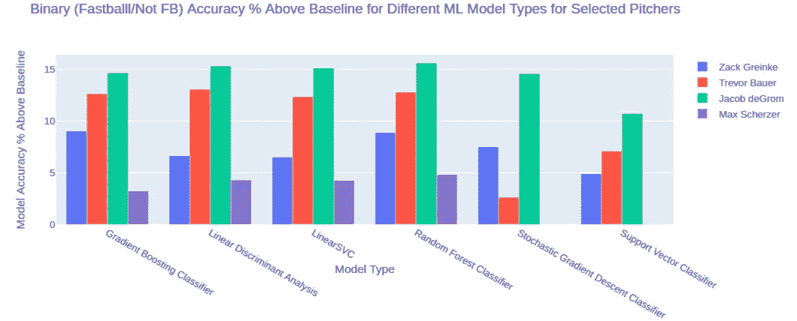
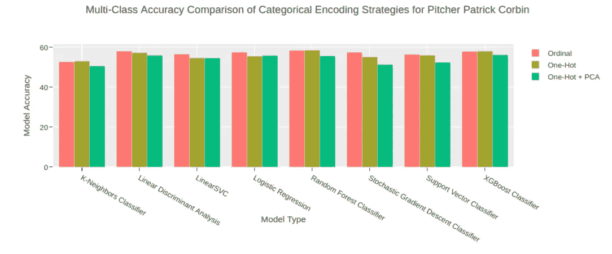
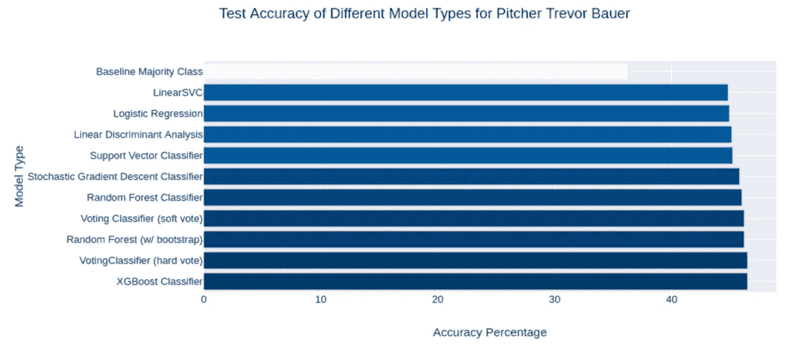

# 音高预测—第 3 部分

> 原文：<https://medium.com/analytics-vidhya/pitch-predict-part-3-2f648d8fe825?source=collection_archive---------16----------------------->

## 使用机器学习来预测下一次投球


这是涵盖 Lambda School 最近数据科学项目工作的系列文章的第 3 部分。项目 [github repo 可以在这里找到](https://github.com/labs15-baseball-pitch-predictor)。为了获得一些使用 [Plotly Dash](https://plot.ly/dash/) 的经验，我还创建了一个[仪表盘应用，这里是](https://pitch-predict.herokuapp.com/)。这个系列的第一部分可以在这里找到[，第二部分](/@jmancuso82/pitch-predict-part-1-7001516d9f40)[在这里](/@jmancuso82/pitch-predict-part-2-637e3578d3e8)。

# 模型开发和超参数

*解释模型开发过程、使用的技术和超参数*

**二元分类模型**

最初，我们将预测建模作为一个二元分类问题来处理。我们想要建立一些基线模型来预测一个球可能是快速球还是不是快速球。毕竟，作为一名击球手，知道投手将要投出的球的确切类型当然是有用的，但是如果没有这种特定的洞察力，知道快速球还是非快速球也会提供巨大的竞争优势。如果他知道一个快速球即将到来，他可以保持高度警惕，及时开始挥杆，赶上更高的速度。相反地，对于坏球或越位的几毫秒额外的预期/阻止也会给一个大联盟水准的击球手带来优势。

**多类分类模型**

接下来，我们使用了与我们的二元分类模型类似的方法，但是我们没有使用快速球/非快速球作为目标变量，而是使用了特定的音高类型。当然，不同类型球场的数量因投手而异，因为不是每个投手都有自己的球场类型。

对于我们所有的预测建模，我们测试了几种不同类型的模型，并比较了几种模型类型的预测准确性，这些模型类型用于少数几个选择的首发投手，这些投手在 2018-2019 年投掷了大量样本。

**分类变量编码策略**

对于我们的二进制分类模型，我们使用定制的顺序编码策略对分类变量进行编码。对于包含关于前一个音高的结果描述的信息的特征，我们使用滑动标度来沿着光谱映射值。范围从击球和界外球的较低值，到投球出局、结果未知的击球入球的更中性值，到更多负面结果的较高值，如球、被投球击中、击球入球和无出局记录，最后，击球入球得分为最高值。以前的投球结果使用了类似的频谱，击球最低，击球进入比赛-未知更高，球最高。计数和计数类别(前方、中立、后方)也按照滑动标度进行编码，从最喜欢的投手到最不喜欢的投手，在最不喜欢的投手到最不喜欢的投手，以及中间的中立计数情况。很难准确确定这些值作为机器学习模型中输入向量的一部分的适当范围，但是，与随机标签或顺序编码相比，我们认为根据某种类型的极性谱从好到坏的结果/情况进行映射是更好的选择。

对于我们的多类分类模型，我们决定尝试和测试两种不同的分类变量编码策略，看看这种选择会如何影响模型的准确性。除了自定义的顺序编码，我们还使用了一个热点编码，以及一个热点编码加主成分分析，99%的方差解释为阈值。

**数字特征缩放**

为了最好地说明数字数据中的潜在异常值对机器学习模型的过大影响，我们选择了鲁棒缩放器作为所有数字特征(击球手侦察报告特征、投手倾向和百分比等)的缩放方法。

**列车试运行**

对于每个投手，我们将数据分成 85% / 15%的训练测试部分。分割是基于日期计算的，因此 85%测试集由前 85%的投掷组成，而测试集是最近 15%的投掷。这种方法确保未来未知数据的泄漏不会用于模型的训练。

```
def train_test_split_by_date(df, train_fraction):
    train_idx = int(len(df) * train_fraction)
    train_end_date = df.loc[train_idx].game_date
    train = df[df['game_date'] < train_end_date]
    test = df[df['game_date'] >= train_end_date]
    print('train shape: ' + str(train.shape))
    print('test shape: '+ str(test.shape))
    return train, test
```

**型号选择**

对于二元分类模型，我们从 sklearn 库中训练了几种不同类型的模型，包括随机森林、梯度提升树分类器、支持向量机、线性 SVC、线性判别分析模型和随机梯度下降分类器。对于多类分类模型，我们使用了所有这些模型，但是用 XGBoost 代替 sklearn 来代替梯度提升树，并且还添加了逻辑回归分类器和 K-最近邻分类器。

**超参数优化**

对于每个模型，我们在各种超参数范围内进行网格搜索或随机搜索，包括不同的正则化策略以防止模型过度适应训练集，对每个模型进行至少三重交叉验证。我们将搜索结果存储在一个 pandas 数据框架中，并根据验证准确度分数进行排序。根据所需的处理能力和该模型类型训练所需的时间，我们随后为每种类型使用了前 30–100 个超参数调整模型，并在测试集上测试了准确性，并为每种不同的模型类型保存了前 10 个最准确的模型，以供进一步分析和稍后输入到集合投票分类器中。

# 模型解释

*模型结果分析*

**二元模型:**

前面提到的交叉验证 gridsearch 和随机搜索是在四个不同的投手上进行的，这些投手是从 2018-2019 年数据中样本最多的首发投手中选出的。被选中的投手是雅各布·德格罗姆、特雷弗·鲍尔、马克斯·谢尔和扎克·格林基。

对于每个投手，来自训练集的多数类被用作简单的猜测，基线模型准确性来比较不同模型的准确性。具体来说，在训练集中快速球/非快速球的目标变量的投球百分比较高的那个百分比，被选为测试集中每个投球的简单猜测。然后将每个模型的准确度分数与简单猜测的准确度进行比较。在四名投手中，在将所有模型分组在一起并取模型准确性与天真猜测之间差异的平均值后，Jacob deGrom 显示出准确性增加的百分比最高，比天真猜测高出不到 15%。Max Scherzer 的模型精确度远没有那么成功，其平均差异比 naive guess 好大约 3%。



当按投手分组并比较使用的模型类型时，随机森林相对于基线天真猜测具有最高的准确性，高出约 12%。稍微在随机森林下，梯度增强树、LDA 模型和线性支持向量机平均比天真猜测高大约 9-10%。随机梯度下降分类器和 sklearn SVC 表现差得多，平均比简单猜测高出约 6%。

我们意识到，这种仅针对四个投手的分析不太可能是结论性的或具有统计意义的，在我们面临的项目持续时间的时间限制中，我们认为这可能足以证明这些选定投手的模型类型之间的一些差异。

**多类模型:**

正如您在下面的图表中看到的，分类变量编码的选择对模型准确性没有太大的整体影响。虽然显示的结果只是一个投手的样本，但我们比较的少数其他投手也观察到类似的结果(非常微小的%差异)。应该注意的是，虽然执行 PCA 通常会稍微降低精度，但是执行超参数优化和模型训练所花费的时间减少了。不幸的是，我们没有测量这些时间差，我一定会记得在未来的项目中进行跟踪。因此，根据最终目标，为了节省时间而牺牲少量的准确性，一个热编码+ PCA 可能是可行的方法。



下图显示了 Trevor Bauer 的不同模型类型之间的精确度差异。正如你所看到的，他在训练集中最常见的音高类型的基线多数类将导致大约 37%的测试准确度。使用每种模型类型的最佳超参数优化模型显示出比基线高约 9–11%的精度改进。使用来自其他 8 种模型类型的硬投票的集成模型投票分类器与用于最高准确度的 XGBoost 分类器并列。



## 下一步/进一步研究

不幸的是，由于这个学校项目的时间限制，我们无法进一步深入分析模型。我们确实执行了一些基本的特征重要性分析，使用了 ELI5 排列重要性，但是我们最初几次尝试修剪对模型没有贡献的特征导致了准确度分数的降低，所以我们放弃了这条路。我想进一步探究特性的重要性，并寻找哪些特性对模型贡献最大，哪些贡献最小的一般趋势，并使用它来进一步细化，也许会激发出特性工程的新想法。

如果有更多的时间，或许更多的计算资源，我想为更多的投手样本训练模型。这将允许进一步检查整体的准确性与基线的改善，并允许进一步研究和比较，例如，什么类型的投手比其他人更可预测。显而易见，一个投出 5 种不同类型球的投手可能比一个只投出 2 种球的投手更难预测，但是先发投手和中继投手的整体差异呢？也许不太容易预测的投手会有更大的成功，这可以反映在其他的统计数据上，例如自责分率和胜投率。

最后，如果模型可以被证明对于更大的投手样本具有超过基线预测能力的有意义的准确性，实时预测应用可以有一些实际的使用案例。MLB 广播团队可以使用该应用程序在屏幕上向在家的观众显示预测。或者，真正的棒球经理可以使用应用程序实时生成的预测，并在投球前向击球手发出预测信号，特别是在准确度最高的情况下。相反，从投手的角度来看，这种数据可以用于发现他可能更可预测的特定趋势和情况，并且他可以潜在地采取措施，以便在这些情况下更加随机化投球选择。

总的来说，这是一个有趣的项目 Statcast 数据虽然不完美，但却是一个非常有价值的棒球资源，有丰富的见解可供提取。我喜欢创造性地创造新功能的挑战，尤其是击球手侦察报告功能。不管怎样，如果你做到了这一步，我希望你喜欢阅读这个项目！如果感兴趣的话，这里还有到 [github repo](https://github.com/labs15-baseball-pitch-predictor) 和[仪表盘](https://pitch-predict.herokuapp.com/)的链接。