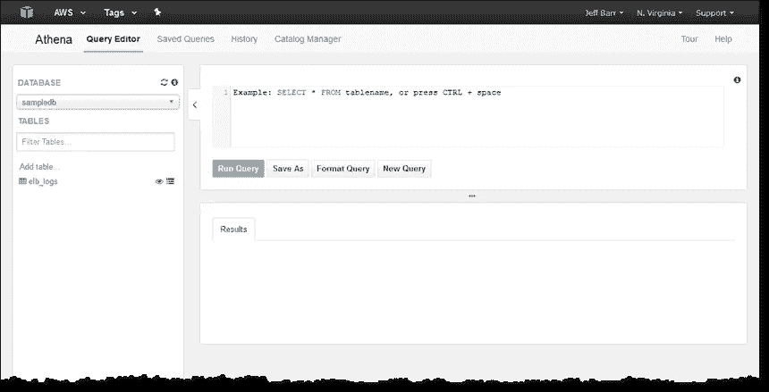

# AWS Athena(或 Presto)中的数据透视表

> 原文：<https://medium.com/analytics-vidhya/pivot-table-in-aws-athena-or-presto-764661eaa0fd?source=collection_archive---------1----------------------->

# 背景

数据透视表是 Excel 中最常用的报表功能之一。用户不需要编程背景来执行数据分析。

```
+---------------+-------+---------------+--------------+
| Item Category | Price |    Region     | Sales Person |
+---------------+-------+---------------+--------------+
| Furniture     |    10 | North America | Jane         |
| Technology    |     5 | Asia Pacific  | Jane         |
| Furniture     |    12 | North America | Tom          |
| Technology    |     8 | North America | Tom          |
+---------------+-------+---------------+--------------+
```

假设有一份销售报告，如上图*(为演示目的进行了大量简化)*所示，报告了所有地区的所有销售人员销售的订单。透视表启用多维度提问。

**举例:*各地区各品类总销售额***

为了回答这个问题，可以在 Excel 上创建一个数据透视表，设置如下配置

*   行=项目类别
*   列 **=** 区域
*   价值=总和(价格)

如下所示的输出将回答这个问题。

```
+---------------+--------------+---------------+
| Item Category | Asia Pacific | North America |
+---------------+--------------+---------------+
| Furniture     |              |            22 |
| Technology    |            5 |             8 |
+---------------+--------------+---------------+
```

假设你的公司做得很好，上个月有 1000 万份订单。现在假设您的分析师在一个有 1000 万行的 excel 上运行数据透视表。希望他或她还会留下来参加下个月的分析。

在本帖中，我们将描述如何在 Athena 上实现这一点——一种高度可扩展的方式来查询大量数据。

# 亚马逊雅典娜



雅典娜用户界面。左边是表格列表。右边是执行查询并查看结果

[Athena](https://aws.amazon.com/athena/) 是 AWS 提供的托管查询服务。查询引擎基于 [Presto](https://docs.aws.amazon.com/athena/latest/ug/presto-functions.html) 。Athena 支持 presto 中的大多数操作符，是在 s3 中查询数据的流行选择。随着最近[联邦查询](https://docs.aws.amazon.com/athena/latest/ug/connect-to-a-data-source.html)的发布，Athena 也可以查询其他数据源，比如 Postgres。真的很棒。

# 浏览一个例子

## 示例:每个地区每个类别的总销售额

在这种情况下，用户将从数据透视表的 excel 中选择

*   行=项目类别
*   Colum =区域
*   价值=总和(价格)

*通过 Athena 实现以上查询。假设该表被称为*

*上面的查询将产生下面的输出。如果我们使用 Excel 中的数据透视表，输出与前面的示例完全相同。*

```
*+---------------+--------------+---------------+
| Item Category | Asia Pacific | North America |
+---------------+--------------+---------------+
| Furniture     |              |          22.0 |
| Technology    |          5.0 |           8.0 |
+---------------+--------------+----------------*
```

## *说明*

*首先是内部查询。内部查询的输出示例如下所示。*

```
*+---------------+---------------------------------------+
| Item Category |                  kv1                  |
+---------------+---------------------------------------+
| Furniture     | {North America=[10, 12]}              |
| Technology    | {Asia Pacific=[5], North America=[8]} |
+---------------+---------------------------------------+*
```

*列 kv1 主要由函数**multimap _ agg**multimap _ agg("区域"，金额)kv1 填充。*

*根据[文件](https://prestodb.io/docs/0.172/functions/aggregate.html)*

```
***multimap_agg**(*key*, *value*) → map<K,array<V>>Returns a multimap created from the input key / value pairs. Each key can be associated with multiple values.*
```

*请注意，kv1 列是一个映射，key = region，values =该地区的所有价格。基于以上所述，它将表明*

*   *对于家具类别，在北美有两个订单，价格分别为 10 美元和 12 美元*
*   *对于技术类别，亚太地区有一个 5 美元的订单，北美有一个 8 美元的订单*

*在内部查询之后，最后一步是对值求和。Presto 提供了多种[数组](https://prestodb.io/docs/current/functions/array.html)辅助函数。为了对值求和，我们将使用 reduce 运算符。*

```
***reduce**(*array(T)*, *initialState S*, *inputFunction(S*, *T*, *S)*, *outputFunction(S*, *R)*) → RReturns a single value reduced from array. inputFunction will be invoked for each element in array in order. In addition to taking the element, inputFunction takes the current state, initially initialState, and returns the new state. outputFunction will be invoked to turn the final state into the result value. It may be the identity function (i -> i).*
```

> *减少(kv1['亚太']，0.0，(s，x) -> s + x，s-> s)为“亚太”*

*这条线的作用是*

1.  *查看行值，并用 kv1['Asia Pacific']选择亚太区的值*
2.  *初始化 reduce 以对值求和*
3.  *创建一个名为“亚太”的专栏*

# *结论*

*我希望以上内容可以作为 Athena 上数据透视表的快速指南。*

*如果你注意到，我们必须事先确定地区:亚太和北美。可惜我找不到动态生成列表的方法。如果你有建议，请告诉我。*