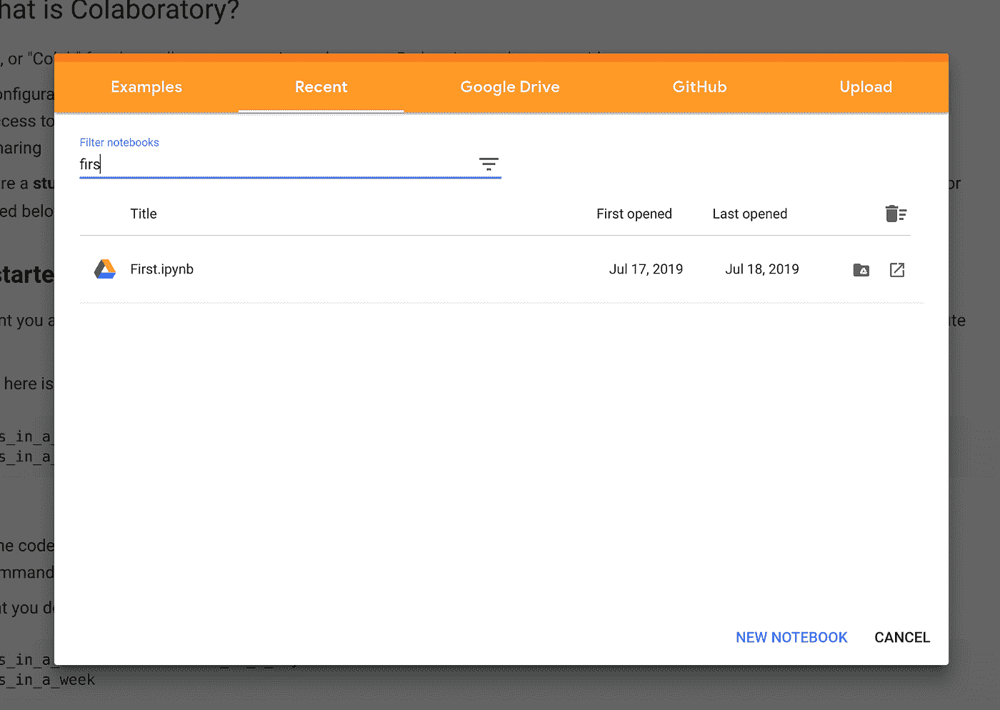
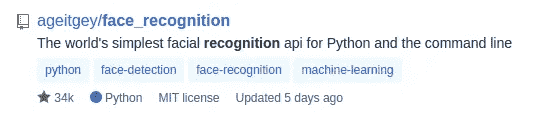
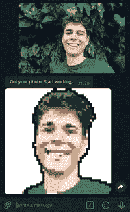

# 像素化我:创建一个电报机器人，使美丽的像素化的个人资料图片

> 原文：<https://medium.com/analytics-vidhya/pixelate-me-creating-a-telegram-bot-to-make-beautiful-pixelated-profile-pictures-7e2901004466?source=collection_archive---------18----------------------->

最近，照片的质量一直在快速增长。然而，我们中的许多人希望给我们的生活添加一些像素风格的图像。

为了解决这个问题，我们将为 Telegram 创建一个机器人，它将使用 Google Colab 在 15 分钟内处理我们的照片和所有这些。

我们将使用 Google Colab，因为它免费提供 GPU 实例。经过 15 分钟的编码，你将能够生成这样的图像:


**算法结果**

# 创建 Google Colab 文件

Google Colab 笔记本提供免费的 GPU 实例，使用 PyTorch 或 TensorFlow 等已知的深度学习库来加速图像处理。要创建 Google Colab 笔记本，请转到 colab.research.google.com 的[](https://colab.research.google.com/)****→“新笔记本”****

****

**图一。创建新的 Google Colab 笔记本**

# **人脸检测和分割**

**为了检测照片中我们感兴趣的区域，我们将使用人脸检测算法— **人脸识别**。**

****

**人脸识别**

**要安装这个包，只需运行`!pip3 install face_recognition`。让我们定义一个函数，该函数将一幅图像作为输入，并返回图片上被裁剪了一些填充的最大的脸:**

**用户可以使用 **get_cropped_image** 功能检测最大的面部和裁剪图像**

**请注意，我们在检测到的边界框周围明确添加了填充，因为人脸检测算法通常会忽略头发、脖子、耳朵等。**

**至于分段部分，我们将使用 Grapy-ML，它可以通过使用以下代码来安装:**

```
!git clone https://github.com/Charleshhy/Grapy-ML > /dev/null
```

**要使用分段网络，我们需要使用 **gdown** 包下载权重。在笔记本中运行以下代码:**

**下载细分模型的权重**

**让我们定义细分模型的初始化:**

**初始化分段网络的辅助函数**

# **主算法**

**该算法由以下步骤组成:**

*   **检测人脸并选择最大的一个**
*   **用填充裁剪图像**
*   **在裁剪的图像上分割人物**
*   **像素分解**
*   **使用卷积查找和添加轮廓**

**让我们定义`pixelate`函数:**

**该函数将图像(np.ndarray)或路径(str)作为输入，并返回图像的 dict**

# **电报机器人**

**有几个 telegram API 包装器，我们将使用 **pyTelegramBotAPI。****

```
!pip3 install requests > /dev/null
!pip3 install pyTelegramBotAPI > /dev/null
```

**现在，我们可以导入我们需要的所有内容:**

```
import logging
from io import BytesIOimport numpy as np
import requests
from PIL import Image
from skimage.transform import rescale, resizeimport telebot
```

**要使用 Telegram API，您需要从 [@BotFather](https://t.me/BotFather) 获取您的机器人令牌。给机器人写一条消息，然后按照指令去做。添加令牌变量:**

```
TOKEN = '4346%%%%%:AAH7TebGbSKim6cPPC_um6Tt3yKzy%%%%%%'
```

**最后，我们可以用一个消息处理程序初始化一个机器人，它返回一个发送消息的文本:**

**用两个简单的处理程序初始化机器人**

**然而，我们需要以某种方式检查用户是否发送了图像，对其进行处理，并将结果发送回来。我们可以通过多一个处理程序来实现:**

**现在，使用`bot.polling()`运行机器人并查看结果**

```
**Constructing DeepLabv3+ model...**
**Number of classes:** 21
**Output stride:** 16
**Number of Input Channels:** 3**2020-05-09 18:15:05,687** (__init__.py:420 MainThread) INFO - TeleBot: "Started polling."
**2020-05-09 18:15:05,688** (util.py:59 PollingThread) DEBUG - TeleBot: "Received task"
**2020-05-09 18:15:05,691** (apihelper.py:54 PollingThread) DEBUG - TeleBot: "Request: method=get url=[https://api.telegram.org/bot43xxxxxxx:xxxxTebGbSKim6cPPC_um6Tt3yKzy1frPx0/getUpdates](https://api.telegram.org/bot434680657:AAH7TebGbSKim6cPPC_um6Tt3yKzy1frPx0/getUpdates) params={'offset': 1, 'timeout': 20} files=None"
**2020-05-09 18:15:25,725** (apihelper.py:64 PollingThread) DEBUG - TeleBot: "The server returned: 'b'{"ok":true,"result":[]}''"
**2020-05-09 18:15:25,726** (__init__.py:323 PollingThread) DEBUG - TeleBot: "Received 0 new updates"
**2020-05-09 18:15:25,727** (util.py:63 PollingThread) DEBUG - TeleBot: "Task complete"
```

****

**我们的机器人工作了！**

## **就是这样！代码可在[**GitHub**](https://github.com/olegkhomenko/pixelate-me-tg)T5 或 [*Google Colab*](https://colab.research.google.com/github/olegkhomenko/pixelate-me-tg/blob/master/pixelate_me_tg.ipynb) 获得**