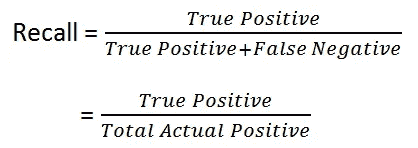
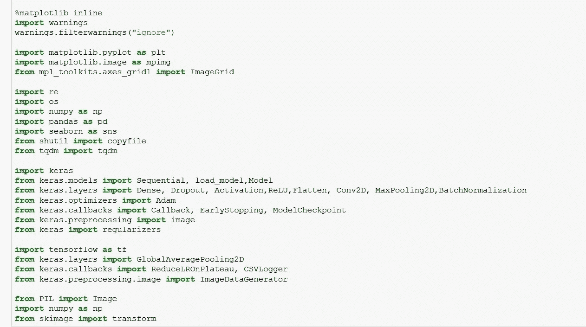
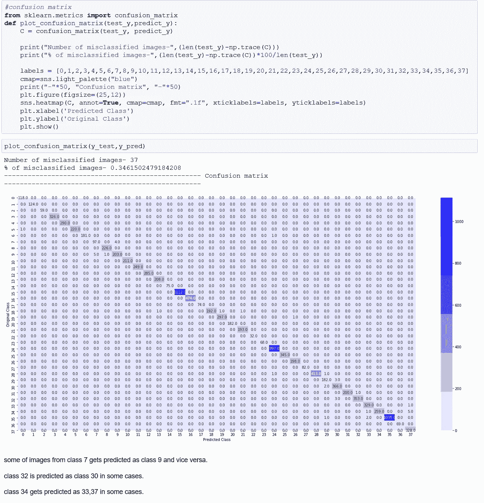

# 植物医生:检测植物中的疾病！

> 原文：<https://medium.com/analytics-vidhya/plants-doctor-detecting-diseases-in-plants-e5c44c569bdb?source=collection_archive---------2----------------------->

## 建立植物病害检测系统指南。


让·拉科斯克在 [Unsplash](https://unsplash.com?utm_source=medium&utm_medium=referral) 上拍摄的照片

# 目录-

1.  介绍
2.  数据描述
3.  使用的度量
4.  损失函数
5.  数据探索
6.  列车测试分离
7.  系统模型化
8.  图像预测
9.  法斯泰图书馆
10.  结果
11.  参考

# 简介-

据联合国粮食及农业组织(UN)称，跨境植物病虫害影响粮食作物，给农民造成重大损失，威胁粮食安全。

近年来，跨界植物病虫害的传播急剧增加。全球化、贸易和气候变化，以及几十年来农业集约化导致的生产系统复原力下降，都起到了一定作用。

跨界植物病虫害很容易传播到几个国家，达到流行病的程度。疾病的爆发和激增会给农作物和牧场造成巨大损失，威胁脆弱农民的生计，同时威胁数百万人的粮食和营养安全。

利用深度学习，我们试图创建一个可以检测植物疾病的模型。

# 数据集描述-

我使用了*“植物村数据集”*，可从以下链接获得-

```
git clone https://github.com/spMohanty/PlantVillage-Dataset
cd PlantVillage-Dataset
```

*   数据集包含 54，305 幅图像。这些图像涵盖了 14 种作物:*苹果、蓝莓、甜椒、樱桃、葡萄、橙子、桃子、土豆、覆盆子、大豆、南瓜、草莓和番茄*。
*   它包含 17 种真菌性疾病、4 种细菌性疾病、2 种霉菌(卵菌)疾病、2 种病毒性疾病和 1 种由螨虫引起的疾病的图像。12 种作物也有健康叶片的图像，这些叶片没有明显受到疾病的影响。
*   该数据集包含 38 类作物病害对，列表如下

*1-苹果黑星病【T12 苹果黑腐病
3-苹果雪松锈病
4-苹果健康
5-蓝莓健康
6-樱桃健康
7-樱桃白粉病
8-玉米灰斑病
9-玉米普通锈病
10-玉米健康
11-玉米大斑病
12-葡萄黑腐病
13-葡萄黑麻疹
15-葡萄叶枯病
16 晚疫病
24-树莓健康
25-大豆健康
26-南瓜白粉病
27-草莓健康
28-草莓叶枯病
29-番茄细菌性斑点病
30-番茄早疫病
31-番茄晚疫病
32-番茄叶霉病
33-番茄七斑叶螨
34-番茄二斑叶螨
35-番茄靶斑【T34*

# 使用的度量-

在后面的部分，我们会看到这是一个不平衡数据集的问题，所以我们不能依赖于准确性。

所以我们在这里使用-

*   精确
*   回忆
*   F1 _ 分数

让我们理解以下指标-

1.  *-它表达了我们的模型所说的相关的数据点实际上是相关的数据点的比例。*

**

*2. ***召回***——指被我们的模型正确分类的相关结果总数的百分比。*

**

*3.***F1 _ Score***——可以解释为精度和召回率的加权平均，其中 F1 得分在 1 时达到最佳值，在 0 时达到最差得分。*

**

# *损失函数-*

*这里我们使用分类交叉熵作为损失函数来最小化。也称为*软最大损耗*。它是一个 *Softmax 激活*加上一个*交叉熵损失*。如果我们使用这个损失，我们将训练一个 CNN 来输出每个图像在 C 类上的概率。它用于多类分类。*

**

# *探索数据-*

*首先，我们需要导入一些基本的库来简化我们的工作。*

**

*   *我们提到包含图像的文件夹的路径，并获得图像文件夹中所有类的列表。*

**

*作为运行上述代码的结果，我们得到了下面的输出-*

**

*   *现在让我们看看每个类中有多少图像，并将这些信息表示为一个数据帧。*

**

*这是上面代码的输出-*

**

*   *正如你所注意到的，每个类别中的图像数量是不同的，所以这是一个不平衡数据的例子&因此我们不能依赖于准确性。*
*   *如果我们对图像总数求和，我们将得到 54305 幅图像。*
*   *接下来，我们将尝试使用下面的代码获取每个图像的路径和标签*

**

*   *让我们从每门课中画出 10 张图片，并想象出来-*

****

*   *下一步，从每个类中画出一张图片并给它们贴上标签怎么样*

**

# *列车-测试分离-*

*将数据分为训练和测试的过程*

*   *在数据文件夹中创建两个文件夹，命名为 train 和 test。*
*   *在训练和测试文件夹中创建 c 子文件夹，其中 c 是数据文件夹中与类别同名的类别数。*
*   *现在制作一个包含图像路径的数据框(例如 Apple__Apple_scab/00075aa8..)作为文件名、标签和类名。*
*   *使用 numpy 生态数生成器，生成 54305(等于图像数)的数，其中 n=1(试验数)，p=0.8(训练大小)。*
*   *在 df 中的 filename 上开始一个循环，如果生成的数字是 1，那么将那个图像(filename)附加到 train，否则它将进入测试。*

*下图显示了将数据分为训练和测试以及设置训练和测试目录的代码-*

**

# *建模-*

*   *我已经尝试了各种模型，但在这里我写的是最适合这种情况的模型。*
*   *在尝试了各种模型之后，我发现 Inception V3 模型是最好的模型。*
*   *所以让我们借助迁移学习来了解它在这里是如何使用的。*
*   *我们还在这里应用了图像增强，它用于通过使用水平/垂直翻转、旋转、图像亮度变化、水平/垂直移动等来人为地增加数据集中图像的变化，这种图像增强是由 ImageDataGenerator 执行的。*

**

*   *我们使用来自目录的 Keras 流来获取训练和测试数据。记住在 test_generator 中设置 shuffle=False，否则预测时会有随机性。*

**

*   *最后，我们必须定义我们的模型结构，这里我们使用迁移学习的概念。*
*   *迁移学习是一种机器学习方法，其中为一项任务开发的模型被重新用作第二项任务模型的起点。*
*   *在这里，我们使用 inception v3 模型，它是在 imagenet 数据集上训练的，并根据我们的需要修改最后几层，并编译和打印它的摘要。*

**

*   *由于它是不平衡的数据，我们在这里不能使用准确性作为度量，我们需要使用 F1_score、precision 和 recall，但问题是 Keras 没有这些度量，所以我们通过 Keras 的回调方法获得它。*

**

*   *现在是时候引入 keras 中可用的其他回调并适应模型了。*

**

*   *绘制训练和测试损失以及训练和测试数据的各种指标*

******

*   *对测试数据的预测——为了避免奇怪/随机的输出，我们需要在使用 predict_generator 之前重置测试生成器。*

**

*   *y_pred 有预测的标签，但我们不能简单地说出预测是什么，因为我们所能看到的只是像 0，1，4，1，0，6…
    这样的数字，最重要的是，我们需要将预测的标签与它们的唯一 id(如文件名)进行映射，以找出我们对哪个图像预测了什么。*

**

*   *让我们把混乱、精确和回忆矩阵形象化*

**

*混淆矩阵*

**

*回忆矩阵*

**

*精度矩阵*

# *对图像的预测-*

*   *为了对单个图像进行预测，让我们定义一个函数****【pred _ img***，它将绘制图像并给出图像所属的类。**

****

*   **对一些图像的预测-**

****

# **FAST-AI 库-**

*   **同样的问题尝试一个新的库怎么样，所以这里我在尝试 Fast ai library 来检测植物中的病害。**
*   **第一步是导入库**

****

*   **加载数据并获取 data-imagedatabunch . from _ folder 中存在的类可用于加载具有以下结构的数据。**

**火车**

```
**-Class1 -Class2
 -...**
```

**-有效**

```
**-Class1 -Class2 -...**
```

****

*   **使用 show_batch 方法显示随机的一批图像。**

****

*   **这里，我们使用 resnet34 架构进行建模，该架构通过 fastai 库的 cnn_learner 方法使用，为了拟合该模型，使用 fit_one 周期，该周期基本上随着时间的推移改变学习速率以实现更好的结果。**

****

*   **解释结果，用最高损失、混淆矩阵和最混淆的预测绘制图像-**

****

*   **在单一图像上预测-**

****

**因此，我们可以得出结论，FASTAI 库非常容易使用。我们可以用一行代码得到不同的方法。**

# **结果-**

**我们用漂亮的表格总结结果-**

****

*****参考文献-*****

**1-【https://arxiv.org/ftp/arxiv/papers/1604/1604.03169.pdf **

**2-[https://blog . keras . io/building-powerful-image-class ification-models-using-very-little-data . html](https://blog.keras.io/building-powerful-image-classification-models-using-very-little-data.html)**

**3-[https://github.com/bkleyn/plant_diseases](https://github.com/bkleyn/plant_diseases)**

> **感谢您的阅读！！！**