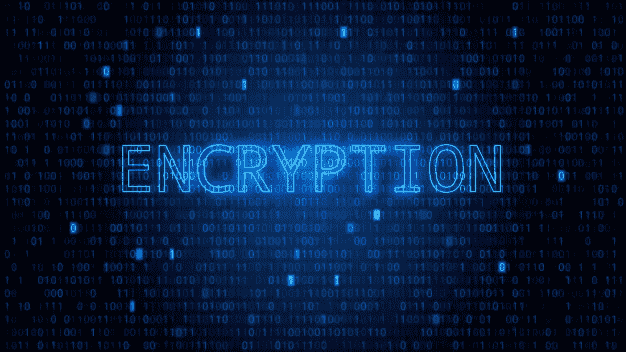

# 使用 Python3 玩公平密码加密

> 原文：<https://medium.com/analytics-vidhya/play-fair-cipher-encryption-using-python3-f91c42931f52?source=collection_archive---------0----------------------->

大家好，因为我最近迷上了密码学，所以我想为什么不试着编码用来加密的算法。我最喜欢的是 PlayFair Cipher，所以我认为它很容易编码，但真的花了我很多时间。首先让我们看看什么是公平密码和算法的工作，然后我们可以深入代码。

加密

> 公平密码
> 这是第一个实用的…