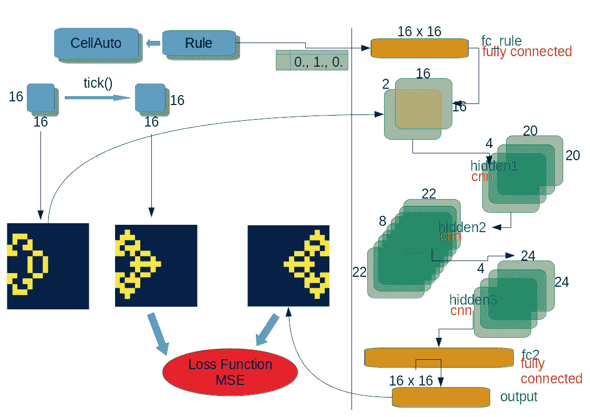

# 玩康威的生活游戏

> 原文：<https://medium.com/analytics-vidhya/playing-conways-game-of-life-3ee5872d127a?source=collection_archive---------19----------------------->

卷积神经网络的细胞自主之旅

**元胞自动机**是计算机早期发展起来的一种离散计算系统。

它是[自动机理论](https://en.wikipedia.org/wiki/Automata_theory)的一部分，以模拟的形式在物理和生物等不同领域有许多应用
你可以在这里阅读更多关于细胞自动机[。](https://en.wikipedia.org/wiki/Cellular_automaton)

在这里，我们将经历训练不同模型来预测下一代(状态)的过程

*   **开发代表元胞自动机的 python 类**
*   **训练康威的生活游戏 Pytorch 模型**
*   **训练神经网络多规则模型，根据预定义的规则**预测下一个状态
*   **基于两种结果状态对规则类进行分类**

***在这里******[***你可以找到本教程的所有代码源代码。***](https://github.com/meirdrago/ml/blob/master/game_of_life.ipynb)***

**CellAuto** 是一个应用规则生成下一代的类。
下一代矩阵是基于每个单元的邻居总和计算的。

该规则基于 2 个列表参数**活，死**。
**活动**列表—如果当前单元是活动的(例如，其值= 1)并且其 8 个邻居的总和在列表中，则该单元将继续活动，否则将死亡。

来自维基百科

# CellAuto 类

规则的一个特例是*{活:[2，3]，死:[3]}* 叫做 [**康威的生活游戏**](https://en.wikipedia.org/wiki/Conway%27s_Game_of_Life)

系统可以汇聚成许多重复的模式。

来自维基百科

在这里定义了[动画的实用类](https://gist.github.com/meirdrago/4e4870951a7dd2d6ad98c05c2f5672b1)

# 预测康威下一代生活游戏的卷积模型

在本节中，我们将训练一个模型来预测下一代。
数据集包含单一规则——*康威的人生游戏。*

请注意，3 个卷积层由获得直接邻居信息的 3×3 滤波器组成。

然而，与典型的图像处理 CNN 不同，我们不需要比直接邻居更多的信息。

由于这个原因，除了最后一个完全连接的层之外，没有进行下采样，该层返回到*损失函数所需的输入大小。*

# 训练模型

在每个时期，我们将随机生成新的数据集。

在一个 16x16 的网格上，出现**数据重复**
的可能性非常小。事实上，由于在每个游戏开始时 1 和 0 的初始随机设置是一个[二项式分布](https://en.wikipedia.org/wiki/Binomial_distribution)，计算其 [CDF](https://en.wikipedia.org/wiki/Cumulative_distribution_function) 显示 99%的置信度，将会有**至少 11 个** 1，其中概率为 0.5。
在这种情况下，初始数据重复的概率至少为:

**损失函数**是输入(计算下一代)和预测(预测下一代)之间的标准 [MSE](https://en.wikipedia.org/wiki/Mean_squared_error)

预测的输出是连续浮点型，而计算的是离散的零和一
这个损失函数对于我们的需要来说是**过精确的**，因为我们只需要最小化 **L(计算的—舍入的(预测的)】**，然而在我们的情况下，它确保了更快的收敛

在**验证函数**中，我们生成小数据集并计算误差百分比。如果下降到 0.5%以下，我们就结束训练。

训练后，我们可以使用 util Animator 类比较我们的预测和实际计算数据:

# 多规则训练模型

在这里，我们将升级模型，以便能够用 3 个不同的规则预测下一代细胞自动机。

每个规则都应用了与模型完全不同的行为

模型输入将是当前生成矩阵(16x16)和规则鉴别器向量(大小为 3)

请注意规则向量如何将自己合并到第一个卷积层中作为单独的通道，我发现它在准确性和时间收敛方面比任何其他配置(如 3 个卷积层之间或之后的完全连接)好得多。

# 逆向工程细胞自动机

在本节中，我们将训练一个模型来对产生 2 个结果代的确切规则进行分类。
这次输入将是代表 2 个结果代的 2 个 16×16 矩阵，以及代表规则类的大小为 3 的输出向量。

每个输入矩阵集合起来分离通道，然后进行上采样和下采样
,最后有 2 个完全连接的层达到其最终大小

我希望你喜欢这次 Cellula Autonom 之旅和它的 CNN 实现。你可以在这里找到所有的代码源