# 与艾玩蛇

> 原文：<https://medium.com/analytics-vidhya/playing-snake-with-ai-2ea68f0e914a?source=collection_archive---------3----------------------->

## 比较不同的算法以最大化分数。

> [https://github.com/stschoberg/snakeGame](https://github.com/stschoberg/snakeGame)

## 游戏

街机经典，蛇，是一个单人的，基于网格的游戏，挑战玩家尽可能长一条蛇。玩家引导蛇在网格中寻找苹果，每接触一个苹果，蛇的身体就会增长一个单位的长度。但是，如果蛇与自己的身体或网格的边界发生碰撞，游戏结束。随着蛇的成长，它变得越来越难以在自己的身体周围活动和吃苹果。目标是让蛇在与自身或墙壁发生碰撞之前尽可能长时间地生长(即尽可能多吃苹果)。

## 该项目

作为人，我们可以制定不同的策略来玩好这个游戏。例如，我们可以直奔苹果，尽量远离蛇身体的其他部分，或者我们可以在屏幕上之字形移动，以最大化屏幕上我们可以移动的自由空间。

如果我们可以直观地为 Snake 提出成功的策略，我们应该能够将这些策略编码到算法中，以便构建人工智能来玩这个游戏。这个项目的目标是实现和分析各种算法，从极其幼稚的算法到更加复杂的算法，以便在游戏中最大化一个分数。

## 实施

首先，该表扬的我会表扬。感谢 [techwithtim](https://techwithtim.net/tutorials/game-development-with-python/snake-pygame/) 提供了玩这个游戏的基础代码，所以我可以开始接触人工智能了。为了让游戏不那么复杂，我确实不得不改变他的一些设计选择。

我们的游戏是一个 20x20 的网格，每个蛇的身体单位和苹果占据一个空间。这条蛇一次只能移动 NSWE 一个街区。当蛇接触到墙壁或自身时，游戏重置。与其他实现不同，snake 不能从屏幕的一边绕到另一边。当蛇死亡时，它会随机出现在长度为 1 的网格上。当蛇吃掉苹果时，另一个苹果会随机出现在格子中蛇不在的地方。

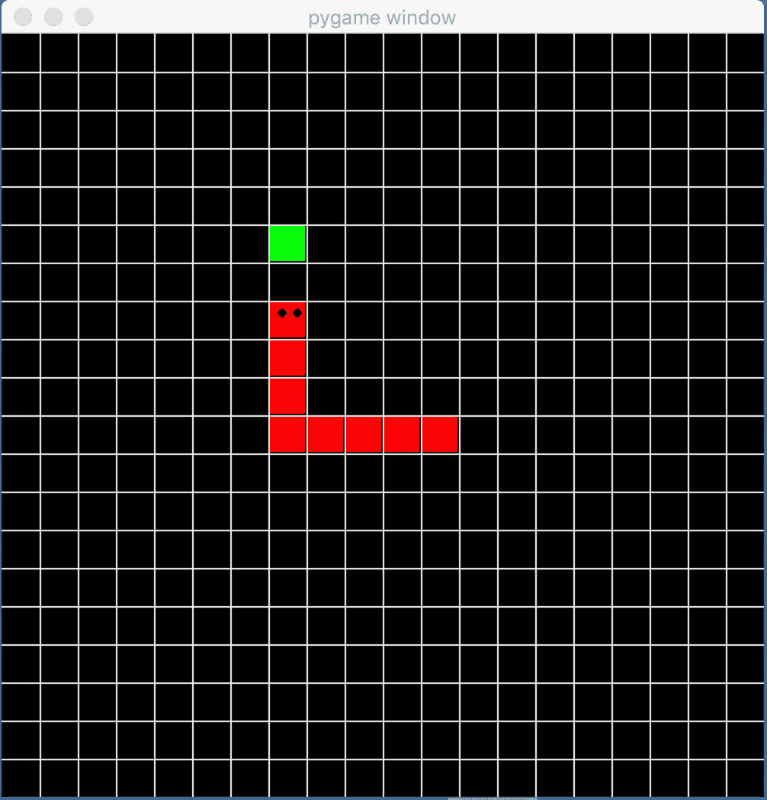

在一个完美的游戏中，这条蛇会吃 400 个苹果，长 400 个单位(20x20 网格)。我们现在可以更精确地重新定义我们的目标。**找到一种算法，使平均分数在[0，400]** 的范围内最大化。

# 算法

本节重点介绍确定性算法，以最大化分数。对于给定的输入，确定性算法将总是产生相同的输出。换句话说，我们将决策逻辑编码到算法中(例如，不要转向你的身体，选择到达苹果的最短路径)。当给定蛇的位置(蛇占据的单元列表)和苹果的位置以及确定性算法时，蛇将总是沿着相同的路径到达苹果。

对于每个算法，我将提供一些直觉、问题、游戏性和从不同运行中收集的数据。

## 确定性算法:编码决策逻辑

## 1.随机:一种愚蠢的方法

完全随机化的算法是最简单的，也是最不成功的，让人工智能玩游戏的方法。给定一个蛇的位置(被蛇占据的单元格列表)，AI 随机移动一个有效的单元格。这个想法没有利用所有提供的信息(苹果的位置)，游戏看起来很随机。

大多数时候，游戏以 1 分结束。偶尔会以 2 分结束。

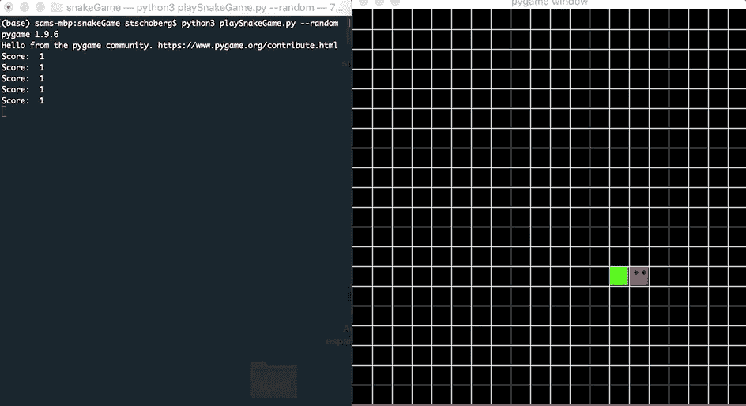

完全随机化的算法。

试验的数据并不令人惊讶。

```
Number of Runs: 64
Min: 1.000
Q1: 1.000
Median: 1.000
Q3: 1.000
Max: 3.000
Mean: 1.078
The 95.0% confidence interval of the mean score is between 0.997 and 1.159.
```

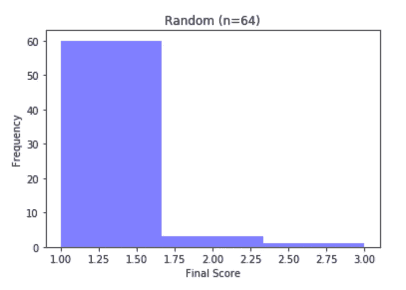

## 2.最短路径:好一点

在随机化方法中没有使用额外的信息之后，下一步使用所有可用的信息是有意义的。在下一个算法中，我们将使用苹果的位置来引导蛇到正确的方向。

在每一步，AI 将计算所有 NSWE 方格(即所有可能的移动)中蛇和水果之间的曼哈顿距离。曼哈顿距离就是从 A 点移动到 b 点所需的 NSWE 步数。人工智能选择与苹果距离最短的方向，并朝那个方向移动。它会重新计算所有 1 步相邻方块的距离，然后再次移动。这个过程一直持续到它找到果实或者死去。这个算法保证找到从蛇头到苹果的最短路径，因为它总是朝着最靠近苹果的方向移动。你应该能在下面的 GIF 中注意到这一点。

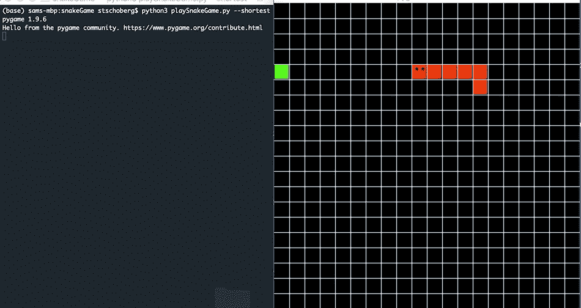

这种算法的得分明显更高。

```
Number of Runs: 53
Min: 3.000
Q1: 9.000
Median: 13.000
Q3: 15.000
Max: 31.000
Mean: 12.962
The 95.0% confidence interval of the mean score is between 11.375 and 14.549.
```

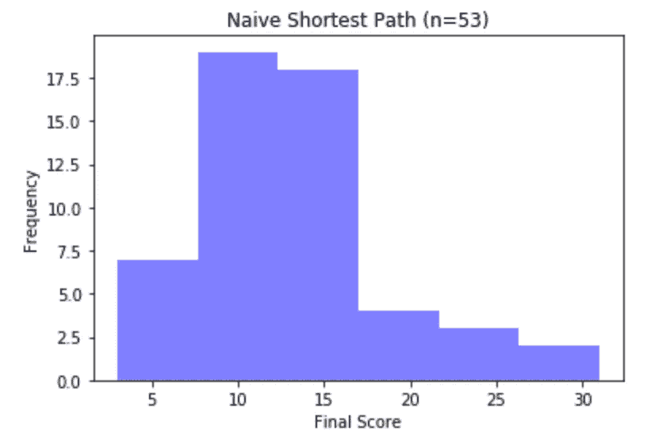

虽然算法更好，但还是会犯傻乎乎的错误。例如，如果从头部到苹果的最短路径包括蛇的身体，它仍然会走那条路径，游戏将结束。参见下面的示例。

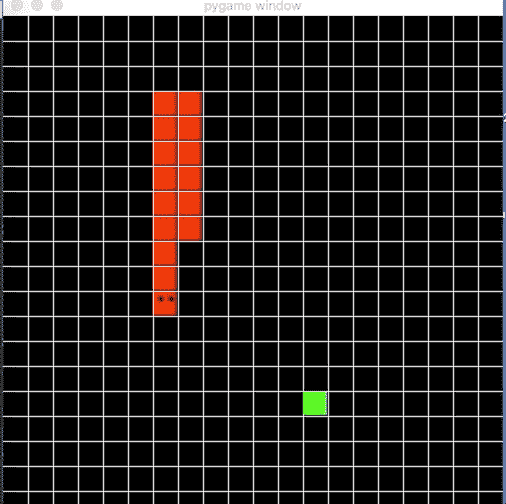

我们将修改我们的最短路径算法，这样蛇就永远不会选择与自己身体相撞的方向。

## 2.1 最短路径:无自碰撞

这和上面的算法是一样的，但是蛇永远不会转弯，不会和自己的身体发生碰撞。如果蛇把自己困在一个盒子里，它将不得不与它的身体碰撞，游戏将结束。你会看到，视觉算法产生了一些有趣的动作，让蛇摆脱困境。我无法捕捉 GIF 中的大部分动作，所以我建议您克隆 repo 并在本地测试它。

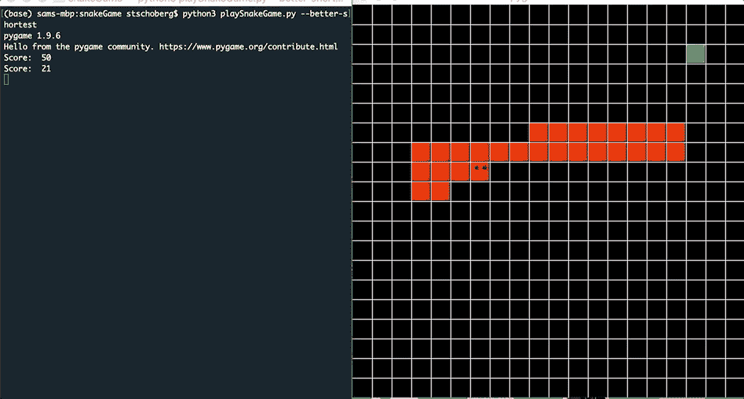

正如预测的那样，当蛇避免自我碰撞时，我们会得到更好的分数。

```
Number of Runs: 50
Min: 8.000
Q1: 26.250
Median: 34.000
Q3: 39.000
Max: 57.000
Mean: 33.720
The 95.0% confidence interval of the mean score is between 30.813 and 36.627.
```

这个算法有一个特点，那就是我们选择搜索方块到苹果的距离的顺序的结果。先看看下面的 GIF。我们发现了一条逃跑的蛇。当蛇到达与苹果相同的一排时，它向左转并继续进入墙中，而不是找到通向苹果的路径。

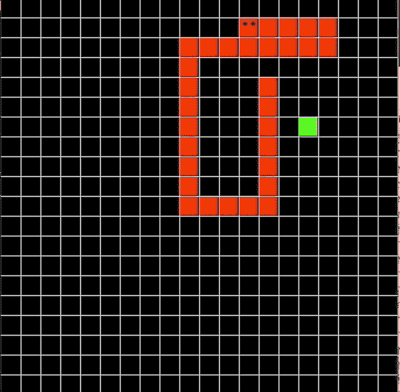

这里，它又一次一帧一帧地慢下来。请记住两件事。首先，蛇不会向它身体所在的方向移动。第二，当决定向哪个方向移动时，蛇按照右、左、上、下的顺序看方块。看一下第一帧。蛇只会考虑向左和向下两个方向。因为 LEFT 和 DOWN 与水果的距离相同，所以算法必须决定选择哪个方向。这个决定会在算法中引入偏差。在这个版本中，算法选择它看到的第一个方向，在这个例子中是左。

蛇选择向左移动后，类似的情况出现。这条蛇看着右边、左边、上面、下面的街区，知道它只能向左、向上或向下走。再一次，因为所有三个方向离苹果的曼哈顿距离相同，所以算法必须做出任意选择。在这个版本中，它选择它看到的第一个东西，所以蛇向左移动。这种情况一直重复，直到蛇撞到墙上

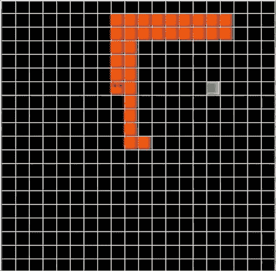

我们可以说，当蛇只能移动到靠近苹果的一个相邻的街区，但是这个街区被蛇自己的身体占据时，就发生了逃跑蛇(RAS)现象。然后，蛇必须做出决定，在 2+苹果之间移动，等距块。在这些块之间选择的不同方式导致算法的不同风格。我们将看看这些不同的口味是否能提高平均分数。

## 2.2 最短路径:无自碰撞，随机 RAS 选择

我们可以选择一个随机的区块，而不是总是从苹果等距列表中选择第一个看到的区块。这将很有可能防止蛇反复选择同一个方向，直到它跑出屏幕(如上图所示)。相反，随机运动可能会将蛇移动到一个街区，在那里到苹果的最短距离路径不会被它的身体阻挡。

很明显，在这种特定情况下，随机移动可能有助于提高游戏分数，但目前还不清楚随机移动是否会提高算法的平均分数。这取决于 RAS 情况在游戏中出现的频率。判断这一点的数学方法超出了我的能力范围，所以我们要作弊并使用统计数据。但是首先，这里是这个版本的**最短路径的基线统计:没有自我碰撞**。

```
Number of Runs: 50
Min: 4.000
Q1: 25.000
Median: 35.000
Q3: 44.500
Max: 67.000
Mean: 35.060
The 95.0% confidence interval of the mean score is between 31.078 and 39.042.
```

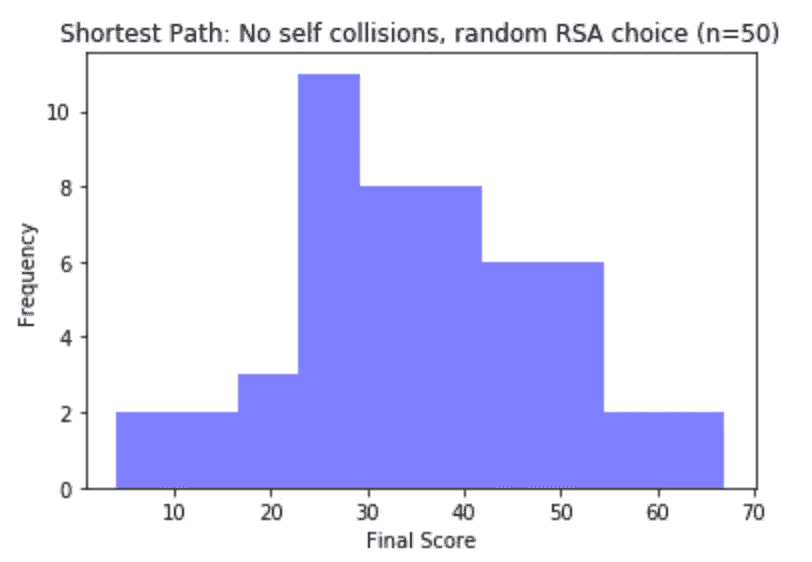

从基线统计数据来看，新版本的最短路径表现稍好。我们将计算两个独立算法平均值的 T 检验。

```
Ttest_indResult(statistic=0.5461821125601, pvalue=0.5861820444893)
```

因为 p 值很高，我们不能拒绝相同分数的零假设。我们不能断定这两种算法的平均分有什么不同。从统计学上来说，我们不能说我们的随机口味比选择我们看到的第一个街区更好。

## 3.哈密尔顿循环(更像蛮力)

如果算法运行时间不是问题，我们可以建立一个机器人，保证得分完美的游戏。我们将使用一个叫做哈密顿圈的概念。在一个哈密尔顿循环中，在返回到任何一个空间之前，蛇将只访问网格中的所有空间一次。这保证了蛇在每个循环中至少吃一个苹果，并且只有当棋盘满了的时候，蛇才会跑进它的尾巴。

在算法中，我们将硬编码一个已知的哈密尔顿循环。这条蛇将在屏幕上曲折前进，然后使用顶行返回到左上角的空间重复曲折前进。

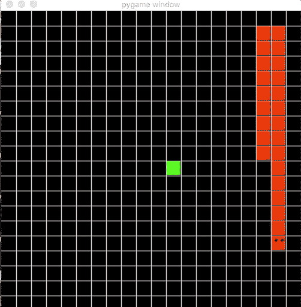

你可以看到，在开始的时候，蛇需要一段时间才能找到苹果。随着蛇的长度越来越长，可供苹果产卵的空间越来越少。正因为如此，蛇找到苹果的速度更快，蛇的生长速度也加快了。

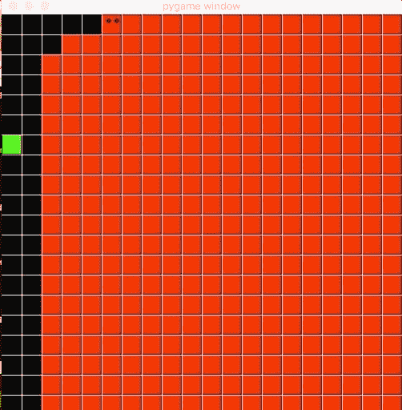

这个版本不需要统计。通过重复哈密尔顿循环，蛇保证得到满分。

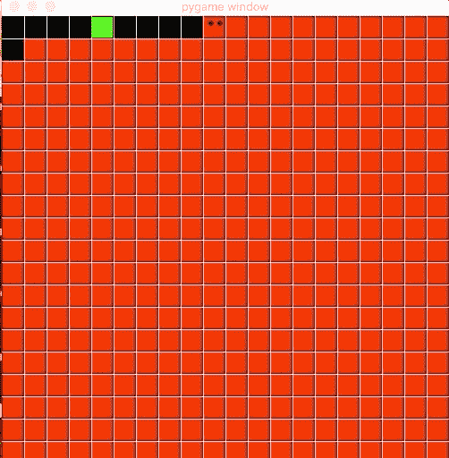

## 结论

总结一下，我们研究了不同的确定性方法来让机器人玩贪吃蛇游戏。随机算法没用。使用一个聪明的最短路径算法很快，当与随机算法相比，甚至与人类相比时，会给出相当好的分数。最好的算法使用哈密尔顿循环，并保证获胜(但速度慢)。

其他方法包括使用非确定性算法来玩游戏。机器人不是编码决策逻辑，而是自己学习。请留意另一篇文章中的一些内容。