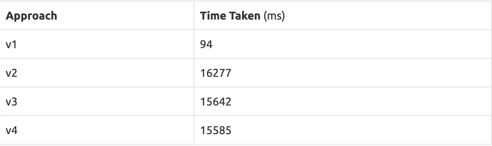

# 使用 Scala——实现过滤器

> 原文：<https://medium.com/analytics-vidhya/playing-with-scala-implementing-filters-c1ec5ccd6528?source=collection_archive---------12----------------------->


照片由 [Clément H](https://unsplash.com/@clemhlrdt?utm_source=medium&utm_medium=referral) 在 [Unsplash](https://unsplash.com?utm_source=medium&utm_medium=referral) 上拍摄

很长一段时间我远离 **Scala，**仅仅是因为我从使用 Scala 的人那里听到了很多恐怖的故事，以及为什么 Java 更好。显然，我是根据封面来判断这本书的。Java 和 Scala 是截然不同的两个世界，如果我们试图把它们混在一起，那么产生的代码肯定是令人恐惧的。

最近我开始学习 Scala(为了工作),我已经开始喜欢上它了。我尝试了多种实现过滤功能的方法，找到了一些。

什么是`**filter**`？–它根据给定的条件过滤集合。

它接受一个谓词，该谓词是一个计算结果为`true`或`**false**`的函数，然后返回给定谓词为真的所有项的集合。

对于所有的方法，我都使用相同的函数签名。

```
def filter[T](predicate: T => Boolean) (seq: Seq[T]) : Seq[T] = {
  .....
}
```

**靠近点**看看函数签名。

1.  它应用于给定的类型`T`。
2.  它接受一个谓词，该谓词是一个接受 T 类型输入并返回`true`或`false`的函数。
3.  它需要一个类型为`T`的`Sequence`，在其上应用过滤器。
4.  最后，filter 返回类型为`T`的过滤后的`Sequence`

**方法 1:** 这在一个`Seq`上使用标准的`collect`函数，它只收集那些`predicate`函数返回`true`的项目。

```
def filterV1[T](predicate: T => Boolean) (seq: Seq[T]) : Seq[T] = {
     seq.collect({
       case item if predicate(item) => item
     })
}
```

**方法 2:** 这种方法对给定序列使用模式匹配，并递归地累加支持给定谓词函数`true`的项目。为了优化递归，它被设计成尾部递归方式。`@tailrec`注释用于验证尾部递归行为。

```
**def** filterV2[T](predicate: T => Boolean)(seq: Seq[T]): Seq[T] = {
  @tailrec
  **def** filterInner(acc: Seq[T], originalSeq: Seq[T]): Seq[T] = {
    originalSeq **match** {
      **case** *Nil* => acc
      **case** first :: last => 
        **if** (predicate(first)) filterInner(acc :+ first, last) 
        **else** filterInner(acc, last)
    }
  } filterInner(*Nil*, seq)
}
```

**方法 3:** 这里我们在序列上使用了一个名为`foldLeft`的函数，它采用一个函数来执行折叠操作。只有当谓词为真时，它才会将该项追加到累加器中。

```
**def** filterV3[T](predicate: T => Boolean)(seq: Seq[T]): Seq[T] = {
  seq.foldLeft(*Seq*[T]()) {
    (acc, item) => **if** (predicate(item)) acc :+ item **else** acc
  }
}
```

**方法 4:** 这种方法与方法 3 非常相似，只是方式相反。

```
**def** filterV4[T](predicate: T => Boolean)(seq: Seq[T]): Seq[T] = {
  seq.foldRight(*Seq*[T]()) {
    (item, acc) => **if** (predicate(item)) acc :+ item **else** acc
  }
}
```

比较这些方法的性能。

我生成了一个由 **100k 个数字**组成的随机列表，并对每种方法应用了`isEven`谓词。



性能表

不足为奇的是，标准的`**filter**`函数是最快的，只需要`**9ms**`，但是使用起来并不有趣

无论如何，这是一个有趣的练习。你知道做这件事的更多方法吗？请分享。

**感谢阅读**，

凯瓦利亚