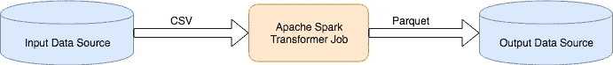
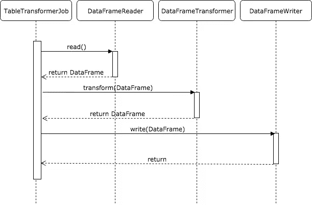
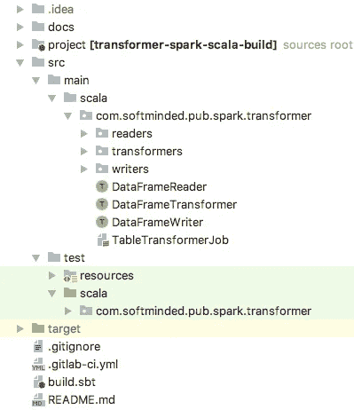
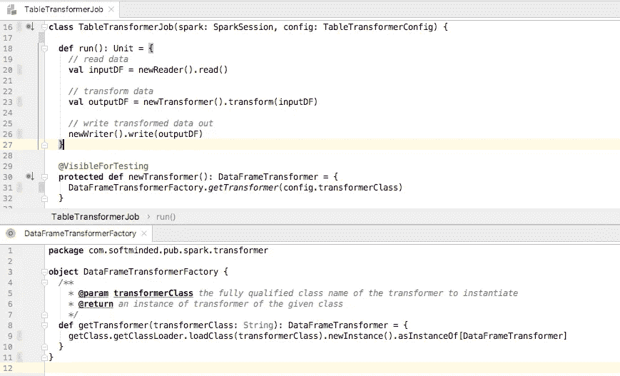
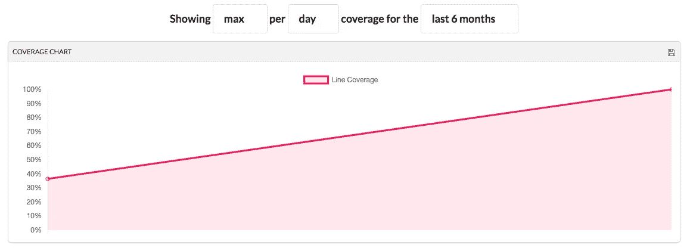
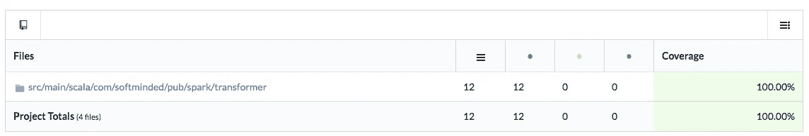
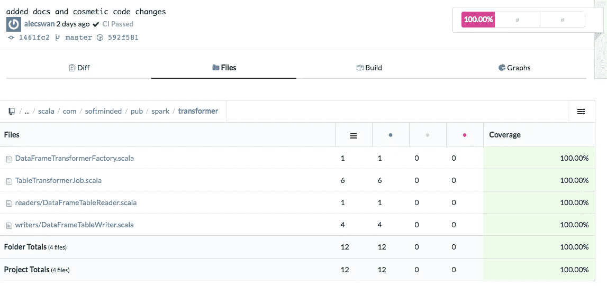

# Scala 中 Spark 作业的谨慎开发

> 原文：<https://medium.com/analytics-vidhya/playing-with-spark-in-scala-warm-up-game-8bfbb7cfbcc4?source=collection_archive---------3----------------------->

不可否认，Apache Spark 是目前最流行的数据处理工具之一。云平台，如 AWS，将 Spark 打包在它们的无服务器(AWS Glue)和托管(AWS EMR)产品中，降低了与自行管理 Spark 集群相关的开销。好消息是，它降低了与管理 Spark 相关的操作复杂性，并降低了新用户的准入门槛。与此同时，这将 Spark 呈现为云中闪亮的收缩包装黑匣子，它无需我们了解其内部工作原理就能工作。但是如果我们试着把它从云上拿下来，打开它，在家里玩呢？

Spark 是一个分布式系统，这意味着它将需要完成的工作横向分布在多个执行器上。例如，Spark 可以将输入数据分割成分区，并将分区分配给执行器，指示它们处理所分配分区中的数据。然而，这并不意味着每个 Spark 部署都必须有多个物理机。事实上，一个设计良好的分布式系统可以在您的笔记本电脑上运行，允许您在本地测试其功能。此外，这样的系统允许你在你最喜欢的 IDE 中运行它们，利用它所有好的特性，比如代码完成、动态编译和调试。

在本文中，我介绍了一名软件工程师尝试在 Spark 中构建一个简单的数据转换，并按照我们通常测试软件的方式进行测试。

> 本文中开发的代码可以在[https://gitlab.com/softminded/transformer-spark-scala](https://gitlab.com/softminded/transformer-spark-scala)获得

文章的其余部分组织如下:

- [数据处理用 Apache Spark](#8387)
- [设计对象模型](#bf9f)
- [开发工作流程](#f227)
- [读写 Spark 中的数据](#84bd)-
-[单元测试 Spark 作业](#74e6)-[总结](#7d4c)

## 用 Apache Spark 进行数据处理

Apache Spark 用于执行数据转换和数据查询。数据转换的一个例子是将数据从面向行的格式(如 CSV)转换为列格式(如 Parquet)。查询的一个例子是在本地硬盘上的 CSV 文件中存储的雇员目录中搜索具有给定姓氏的雇员。请记住，Spark 是一个处理引擎，并不实现自己的持久存储。相反，Spark 从外部存储器读取数据，执行数据转换和查询，并将结果写入外部数据存储器，该存储器可能不同于提供输入数据的存储器。这是一个 Spark transformer 作业的数据流图，该作业将数据从 CSV 格式转换为拼花格式。



在本文中，我们介绍了数据转换器的开发工作流，它将数据从一种格式转换为另一种格式。这里的主要焦点是探索当开发运行在 Apache Spark 上的代码时，我们如何利用软件工程工具、技术和过程。

对任何工作来说，使用正确的工具都很重要。软件工程师使用交互式开发环境(ide)来编写代码。ide 具有代码自动完成、动态代码编译、代码调试支持(如断点、表达式监视、资源利用监控等)等特性。对于这个项目，我使用了 IntelliJ IDE。尽管我选择 Scala 作为这个练习的编程语言，但是本文中描述的实践也适用于 Spark 支持的其他语言，比如 Python。

## 设计对象模型

我们在本文中构建的 Spark 作业的一个用例是将数据从基于行的格式转换成列格式。这意味着作业需要能够读取初始数据、转换数据并将转换后的数据写入目标。Spark 提供了几个编程抽象，如 RDD、数据帧和数据集，来表示它所操作的数据。与 rdd 不同，数据帧和数据集有与之相关联的模式。然而，Dataset schema 是强类型的，而 DataFrame schema 更通用，事实上，它只是 Dataset[Row]的类型别名。由于该作业将生成一个列格式，它将有一个模式，因此我们希望使用 DataFrame 或 Dataset 来表示输出数据。因为作业应该能够转换不同种类的数据，例如客户、订单、行项目，所以模式在编译时可能是未知的，可能需要从配置文件中读取。由于这些原因，我发现 DataFrame 对于这个项目来说是一个合适抽象。

以下是主要对象接口的列表:

*   **data frame reader**—*read():data frame*方法，将数据读入 data frame；数据来源和数据格式是一个扩展类的实现细节；
*   **data frame transformer**—*transform(input df:data frame)的特征:DataFrame* 方法，从给定的数据帧转换数据并返回结果；
*   **DataFrameWriter** —带有 *write(DataFrame)的特征:将给定数据帧写入其目的地的单元*方法；目的地和数据格式是扩展类的实现细节；
*   **TableTransformerJob** —一个具有 *run():Unit* 方法的类，该方法协调读取、转换和写入转换后的数据，如下所示:



此时，我们可以开始考虑如何使用 Spark 读取、转换和写入数据。

## 开发工作流程

当我们准备编写第一行代码时，考虑一下代码组织和构建过程是个好主意。我使用 [spark-sbt.g8 模板](https://github.com/MrPowers/spark-sbt.g8)为这个项目创建文件夹结构、示例代码和构建配置。这个项目使用 SBT 作为 Scala 构建工具，你可以在 Git repo 中查看 [SBT 配置](https://gitlab.com/softminded/transformer-spark-scala/blob/master/build.sbt)。这是 IDE 中项目组织结构的样子:



该项目使用 GitLab 进行源代码和 CI/CD 管道管理。这里的目标是使用一个单一的服务来托管源代码、运行测试、显示项目状态以及在出现问题时发送通知。GitLab CI/CD 管道配置文件。gitlab-ci.yml 驻留在源存储库的根目录中，允许我们使用标准 Git 工作流管理配置更改。该文件包含 Docker 映像的名称，该映像应该用于提供构建容器和安装必要的依赖项、运行测试、报告代码覆盖率等的脚本。

评估我们编写的代码的质量很重要。为了做到这一点，我们将编写单元和集成测试来验证代码是否如预期的那样运行并产生期望的结果。单元测试是白盒测试，它试图测试每一行代码，而不测试它与外部 API 的集成。“白盒测试”意味着测试作者知道确切的实现，并且能够针对其不同的代码分支。单元测试的有效性可以通过它们执行的代码部分来衡量。单元测试需要快速运行，让我们能够验证代码的质量并快速迭代。为此，单元测试模拟对外部数据源和其他第三方依赖项的调用，这会大大降低单元测试的速度。例如，在这个项目中，我使用优秀的 [Mockito Scala](https://github.com/mockito/mockito-scala) 库来模拟 SparkSession。你可以在马丁·福勒的文章中找到更多关于在测试中使用模拟的信息。

另一方面，集成测试是黑盒测试，它检查集成点并从接口级别测试代码，允许代码进行所需的外部调用，例如从文件中读取数据。我使用术语“集成测试”来指代“狭义集成测试”，正如在[马丁·福勒的集成测试文章](https://martinfowler.com/bliki/IntegrationTest.html)中所描述的。我将“广泛集成测试”称为“端到端测试”。

单元和集成测试作为构建过程的一部分运行。英寸 gitlab-ci.yml 文件我配置了 gitlab 的 CI/CD 管道，将代码覆盖结果推送到 CodeCov.io 服务。这要求在 CodeCov.io 上生成一个身份验证令牌，并将 CODECOV_TOKEN 环境变量设置为令牌值。这可以通过在 GitLab 中的 Settings->CI/CD->Variables 页面上用 TOKEN 值创建一个 CODECOV_TOKEN 变量来轻松完成。本文使用的 GitLab 项目可以通过点击[这个链接](https://gitlab.com/softminded/transformer-spark-scala)来访问。

## 在 Spark 中读写数据

Spark 集成了不同的[数据源](https://spark.apache.org/docs/latest/sql-data-sources.html)，提供了几个读取不同格式数据的 API，比如[data frame reader # textFile(String):Dataset<String>](https://spark.apache.org/docs/latest/api/java/org/apache/spark/sql/DataFrameReader.html#textFile-java.lang.String-)从文本文件中读取数据。Spark 还允许用 Spark 会话将数据帧注册为虚拟表或视图。一旦注册，该视图就可以在通过调用[spark session # SQL(String):Dataset<Row>](https://spark.apache.org/docs/latest/api/java/org/apache/spark/sql/SparkSession.html#sql-java.lang.String-)执行的 SQL 查询中使用。

假设我们的数据源已经被调用者用 SparkSession 注册为一个表。基于这一假设，我们实现 DataFrameTableReader 如下:

DataFrameTableReader 类采用 SparkSession 和 DataFrameTableReader。Config 作为构造函数参数，并使用它们运行 Spark SQL 查询，从表中选择具有 config 中指定的名称的数据。我们采用类似的方法实现 DataFrameTableWriter 类，如下所示:

我们还实现了 TableTransformerJob—ETL 转换的主要入口点，它通过读取、转换和写入数据来编排 ETL，如下所示:

## 单元测试火花作业

让我们编写一个单元测试，验证 transformer job 是否用正确的参数调用了读取器、转换器和写入器。为此，我们使用以下类签名在测试源树中创建一个 TableTransformerJobSpec 类:

FunSuite 是 ScalaTest 库中的一个类，它为在 Scala 中编写测试提供支持。ScalaTest 支持[不同的测试风格](http://www.scalatest.org/user_guide/selecting_a_style)，我选择了一个简单但足够描述性的风格，它允许我提供一个描述并用`test(“description”) {}`块注册一个测试。

MockitoSugar 是来自 [Mockito Scala](https://github.com/mockito/mockito-scala) 库的特性，它在 Mockito Java API 的基础上提供了抽象，增加了对更像 Scala 的语法的支持，比如下面代码中使用的 mock[DataFrameReader]。这也允许我们使用传统的带有`when(thisHappens).then(doThis)`和`verify(that).happened`调用的期望验证风格的 Mockito 测试。

SparkSessionLender 是一个特征，我通过将 SparkSession 生命周期管理责任从测试代码卸载到这个特征中，实现了[贷款模式](http://www.scalatest.org/user_guide/sharing_fixtures#loanFixtureMethods)。以下方法创建一个本地 SparkSession，并将其传递给作为参数传递的测试函数。将此代码提取到一个单独的方法中，允许我们在一个地方调整 SparkSession 设置，例如，为了启用我们将在下面的集成测试中使用的 Hive 集成。

现在，让我们在 TableTransformerJobSpec 中添加一个单元测试，模拟 SparkSession、reader、transformer 和 writer，只关注测试数据是否正确地从 reader 传递到 transformer 以及从 transformer 传递到 writer。我喜欢使用 given-when-then 注释风格来区分设置测试夹具的代码部分、调用被测代码的代码部分和验证后置条件的代码部分。

让我们将这些更改推送到 GitLab，这将触发构建管道并更新项目的状态，如下所示。


可以理解的是，代码覆盖率相当低，因为我们模拟出了大部分代码的功能。期望的代码覆盖率水平是特定于应用程序的，不同的工程团队有不同的代码覆盖率标准，例如类、方法和代码行的覆盖率。在[测试覆盖文章](https://www.martinfowler.com/bliki/TestCoverage.html)中，Martin Fowler 描述了代码覆盖的价值，并为建立这样的标准提供了一些基本原理。

在我们添加更多的测试来增加代码覆盖率之前，让我们使我们的转换过程更加灵活一些。我们转换器工作的目的是将数据从一种格式转换成另一种格式。该工作应该能够处理不同类型的数据，如客户数据或来自订单处理系统的数据。我们引入一个 DataFrameTransformerFactory 类，它将创建一个 transformer 的实例，给定完全限定的 transformer 类名作为`transformerClass`参数。考虑到作业的`config.transformerClass`设置，我们还将 TableTransformerJob 更改为委托给 DataFrameTransformerFactory 进行转换器实例化。

让我们编写一个单元测试来测试这个新功能，它增加了对配置驱动的转换器实例化的支持。但是首先，让我们创建一个 FakeDataFrameTransformer 类，测试会将作业配置为委托给它，然后验证由假转换器返回的数据是否被传递给了编写器。我们实现了假的 transformer 来产生结果(`outputDF`)，我们可以在下面的测试中进行比较:

现在，我们已经准备好实现一个单元测试，验证作业是否正确地实例化并委托给 FakeDataFrameTransformer。

测试通过了，但是让我们再次检查它是否真的覆盖了我们期望它执行的行。IntelliJ 允许我们通过点击下面截图中最右边的图标来运行测试。


测试完成后，我们可以检查 transformer job 和 factory 类，并观察测试所覆盖的每一行左边的绿色标记。



这很酷，我们已经通过了测试，并运行了我们期望的代码行。那么，让我们运行所有的测试，并确认它们都仍然通过。我们可以在 IntelliJ 中或者通过执行`sbt clean coverage test coverageReport`命令来做到这一点，该命令正是我们的构建过程所运行的命令。现在，我们可以用一个描述性的 Git 注释来提交对 Git 的更改，比如“添加了一个单元测试来验证 TableTransformerJob 委托给了配置中设置的 transformer 类”并将其推送到 GitLab，从而触发构建管道。完成后，我们在 GitLab 中的项目页面显示测试覆盖率上升，如下所示。


好的，这很好，那么让我们通过点击 codecov 徽章来探索哪些代码还没有被测试覆盖。这将显示 DataFrameTableReader 和 DataFrameTableWriter 都没有被覆盖，因为我们所有的测试到目前为止都模拟了它们。

让我们添加一个测试，该测试在内存中生成一些测试数据，用 SparkSession 将其注册为一个表，并要求 TableTransformerJob 编排该数据的身份转换。

> 来自[维基百科](https://en.wikipedia.org/wiki/Identity_transform):身份转换是一种数据转换，它将源数据不加修改地复制到目标数据中。

在不依赖于输入数据语义的情况下，身份转换非常有用。这种情况包括压缩以原始文本格式存储的输入数据，或者将大的输入文件分割成更小、更多的文件，以便提高并行处理大量文件的能力。下面显示了标识转换器的实现。

在下面的测试中，我们不使用 mocks，让 transformer 作业负责实例化 reader、transformer 和 writer，就像在生产中一样。我们生成一些假的输入数据，并用 SparkSession 将其注册为一个表。输入数据应由 DataFrameTableReader 读取，并传递给 IdentityDataFrameTransformer，后者将返回没有任何修改的数据。然后，数据将被提供给 DataFrameTableWriter，以将其存储在用 SparkSession 注册的输出表中。但是，DataFrameTableWriter 假定输出表已经存在，因此要求测试使用适当的模式创建该表。请记住，Spark 没有自己的持久存储，而是委托其他技术进行持久存储管理。其中一项技术是 [Apache Hive](http://hive.apache.org/) ，它支持本地文件系统上的持久存储。要启用 Hive 支持，我们需要做两件事:

*   在 build.sbt 中添加 spark-hive 依赖:
    `*libraryDependencies* += **“org.apache.spark”** %% **“spark-hive”** % **“2.4.3”** % **“provided”** *// for integration testing*`
*   在 SparkSessionLender # withLocalSparkContext:
    `**val** spark = SparkSession.*builder*()
    .appName(**“spark testing”**)
    .master(**“local”**)
    **.enableHiveSupport()**
    .getOrCreate()`内配置的 SparkSession 中启用配置单元支持

让我们使用 [Loan 模式](http://www.scalatest.org/user_guide/sharing_fixtures#loanFixtureMethods)来实现代码，该代码在给定表名和模式的情况下创建一个表，执行测试函数，并通过删除表来进行自我清理。

现在，我们已经准备好编写一个集成测试，测试 DataFrameTableReader、DataFrameTableWriter 和 IdentityDataFrameTransformer 中的代码。该测试通过使用来自 [spark-fast-tests](https://github.com/MrPowers/spark-fast-tests) 库的 assertSmallDataFrameEquality(actualDF，expectedDF)断言输出表包含与输入表相同的数据来验证身份转换是否正常工作。我们使用`import spark.implicits._`引入一些 Spark 助手函数，使 Spark 数据帧的工作变得更简单，例如，通过调用 RDD#toDF 创建一个包含测试输入数据的数据帧。

让我们通过在本地运行`sbt clean coverage test coverageReport`来验证我们所有的测试仍然通过。之后，我们可以用描述性的注释将我们的更改提交给 Git，并将其推送到 GitLab，从而触发构建管道。构建过程完成后，GitLab 中的项目状态如下所示。


这看起来相当不错——我们所有的测试都通过了，我们实现了 100%的代码覆盖率。下面来自 CodeCov.io 的截图展示了我们的代码覆盖率是如何随时间变化的，以及当前的逐行覆盖率统计数据。



代码超龄趋势(CodeCove.io)



项目顶层包(CodeCove.io)中包含的行的摘要



每个类中包含的行的分解(CodeCove.io)

我们的代码状态非常好，所以让我们在 Git 中标记这个代码状态，以防我们将来想要检查这个代码状态。

```
git tag -a warmup-0.1 -m "identity transformation with tests and code coverage"
git push --tags
```

## 摘要

在这篇文章中，我们开始从软件工程的角度探索在 Scala 中使用 Spark 代码。我们在 Git 中创建了一个源代码库，并在 GitLab 中为它配置了一个 CI/CD 管道。我们集成了管道以将代码覆盖度量推送到 CodeCov.io，并实现了单元和集成测试以实现高水平的覆盖。在我们的单元测试中，我们试验了对象模仿技术。在集成测试中，我们生成了一个样本数据集，并用 SparkSession 将其注册为一个表。我们启用了 Spark 与 Hive 的集成，以便允许测试将转换后的数据写入由本地文件系统支持的 Hive 表。在下一篇文章中，我们将通过实现一个实际用例的数据转换来继续这一探索。