# 播放印度尼西亚地名中的单词

> 原文：<https://medium.com/analytics-vidhya/playing-words-from-locality-names-in-indonesia-b1b92cc9146d?source=collection_archive---------34----------------------->

Sylwia Bartyzel 在 [Unsplash](https://unsplash.com?utm_source=medium&utm_medium=referral) 上拍摄的照片

你知道仅在印度尼西亚就有大约 652 种方言吗？它是如此的多样化，以至于我们已经根据他们自己的方言给它起了很多名字。有时，文字本身反映了历史、地理特征，甚至神话。举例来说，在印尼，我们有一个地方叫做 *Kulon Progo* ， *Kulon* 的意思是西方，而 *Progo* 类似于一条名为 *Progo* 的河流，所以一般位于 *Progo* 河的西方。这让我想起见过这么搞笑的名字(*字面！*)对于巴布亚中部的村庄，它被称为[‘哈哈’村](https://goo.gl/maps/Qr1TqgKScpR6YwqW8)。也许定居者一直在笑？我们永远无法确定…哈哈

考虑到有将近 84，000 个村庄，做一些小的分析来发现仅仅基于单词的关于这些数据的随机而有趣的事实是很有趣的，对吗？我根据内政部的空间数据集分析了四级行政( ***desa* 意为印尼**的村庄)名称，之前从上一篇文章*中清理了 [*这里的*](https://towardsdatascience.com/exploring-village-boundaries-spatial-dataset-in-indonesia-part-1-cleaning-and-identifying-data-cf94d0099359) 。*这一分析过程可在[Google coll labs](https://colab.research.google.com/drive/1rVp1o2L5vzDLID5zTTMMOQkO2xF9bU_T#scrollTo=xzSJyR1ktsW7)上获得，使用 Pandas 和自然语言处理(NLP)，并在 Tableau 和 Plotly 的可视化方面提供一些帮助。

# 检查字母和单词数

首先，让我们简单地统计一下印度尼西亚所有行政区域使用的字母和单词的数量。

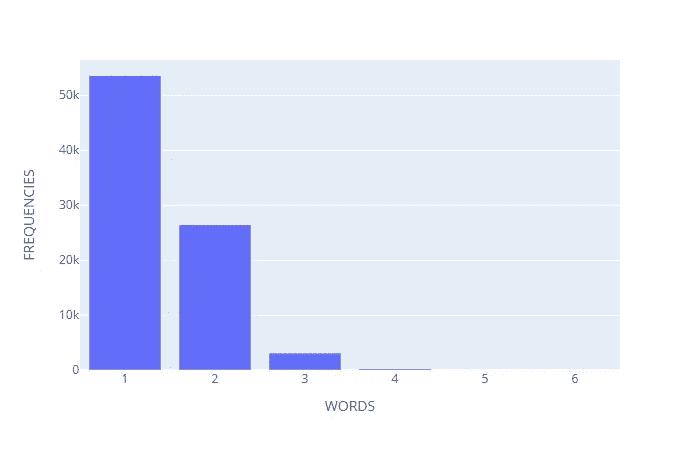

占所有地方 60%的印尼村庄名称往往只用一个词。与此同时，有少数地方使用了 4 到 6 个单词来表示他们的区域。五个场馆使用超过六个单词，如下所列。它们都有相同的起源，都位于苏门答腊，其中苏门答腊巴拉特有五分之三。

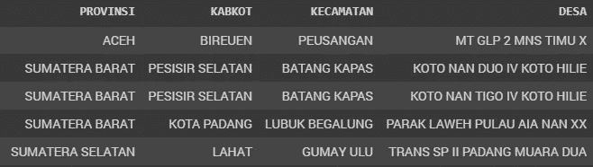

> 嗯，如果我每次都要把这些地方写进我的送货地址，我会发疯的。

那么，在印度尼西亚的这些村庄中，有史以来最长的字符是什么样的呢？

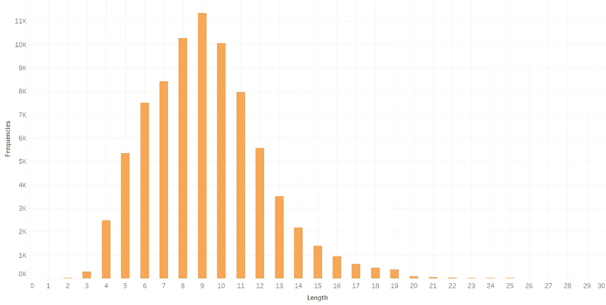

大多数奥运村只有 7 到 10 个字母(支持者超过 8000 人),而用 9 个字母来命名场馆是最常见的。有 13 个村庄只由两个单词组成，大部分位于印度尼西亚东部地区。也许对美国来说，这是州/地方的缩写，但在印尼相信我，这不是。这是一个有着超级简短名字的真实地方。我想知道他们为什么选择这些名字。

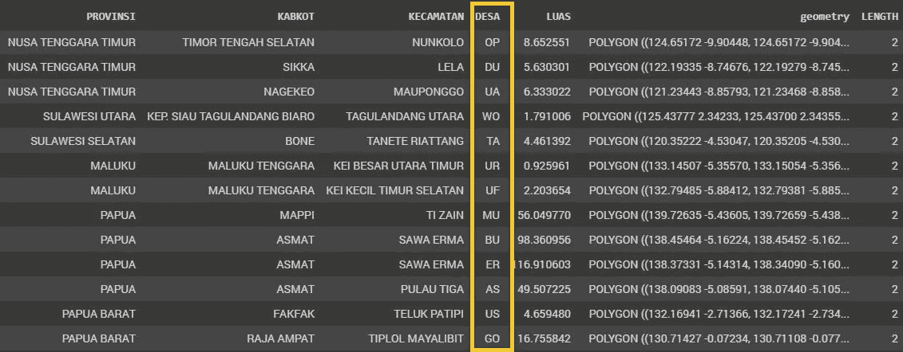

> 在印度尼西亚，我去了一趟马鲁古的吾尔村。
> 
> 对不起，我的什么？

与此同时，一个名为**Jinang Kampung pans ur Ampang Pulai**的地方成为所有地点中最长的村庄名称。你一定要看看他们[的网址。哇……那太长了。什么样的地方有 30 个字母，不算空格，只比整个字母表长两个字？更有趣的是，这个地方位于南苏门答腊的佩西西尔塞拉坦，与之前使用单词最多的地区是同一个地区。](https://jinangkampungpansurampangpulai.nagari.pesisirselatankab.go.id/first)

> 是啊，也许这些社区太有想象力了…

# 最常见的名字

> 印度尼西亚人最常用的名字是什么？

***查亚*** (英语中的*胜利*)是印尼最受欢迎的名字，拥有 1.117 个席位， ***巴鲁*** ( *新*)仅差 16 个席位，紧随其后的是 ***丹戎*** ( *海角*)，只有 950 多个用户。同时， ***双溪*** ( *河*)和 ***巴图*** ( *石*)分别以 610 和 560。方向名称— ***巴拉特*** (w *est* )和 ***帖木儿*** (e *ast* ) —在 550 和 553 站点附近几乎共享相同的结果。

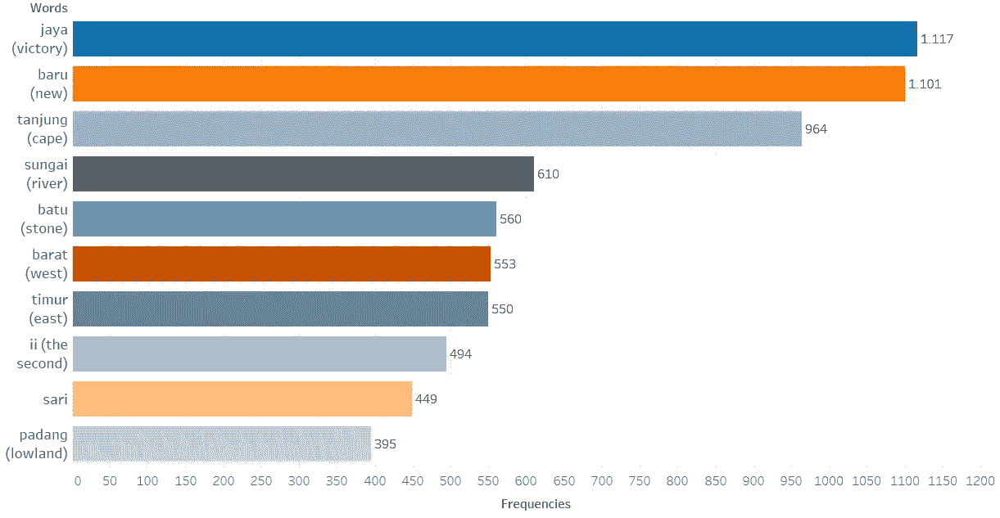

但是，让我们仔细看看印度尼西亚的七个主要地区…

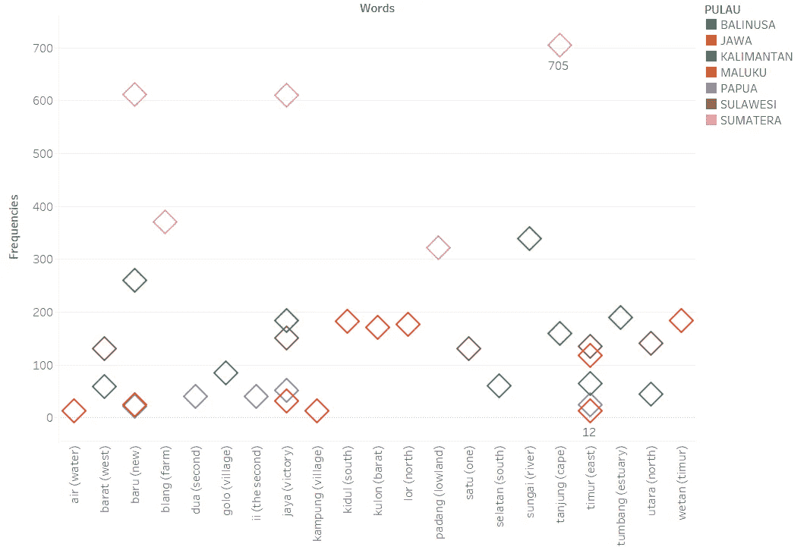

如你所见，前两个常用词(*和 ***【巴鲁】*** )已经被他们全部使用，苏门答腊地区倾向于主导这些术语的使用。除此之外，苏门答腊人还用他们当地的方言如 ***布朗*** ( *农场*)***巴东*** ( *低地*)作为别称。这一趋势也为其他成员所效仿，例如，努沙登加拉的 ***戈洛*** ( *村*)和源于加里曼丹的达亚克部落的 ***通邦*** ( *河口/水湾*)。*

*有些族群偏爱某个特定的词，例如加里曼丹和苏门答腊分别偏爱使用***【Sungai】***(*【river】*)和***【Tanjung】***(*cape*)，因为其地理位置主要位于河岸和海角附近，而非其他任何地区。与此同时，其他地区——巴厘岛、爪哇、努沙登加拉——由于广泛的地区隔离，倾向于将方向名称作为他们最喜欢的选择，而爪哇人更喜欢用他们自己的文化定制它。最后， ***巴图*** *(石头)*这个词在地域分析上并不突出。*

# *类似地理名称的地方*

*嗯，处理超过 80，000 条记录已经很累了，尝试根据地理特征对它们进行分类是大量的工作。但是，我尽了最大努力来汇编这份关于他们自己文化的资料，它只涵盖了将近 10%的数据。但大部分数据有时会重叠，例如 **Bukit Datar。** *武吉*像一座小山，而*达塔尔*则表示平地(低地)，两者相互矛盾。*

*这是我收集到的来自当地方言的地名列表。其中有些可能因为某些原因没有收录或者在翻译中丢失。*

*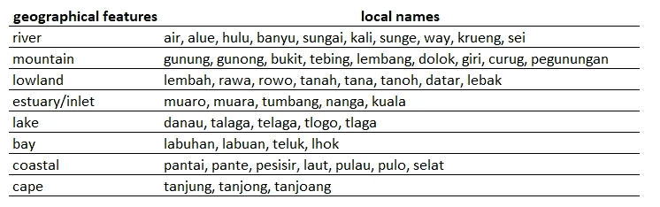*

*所以，这是结果…*

*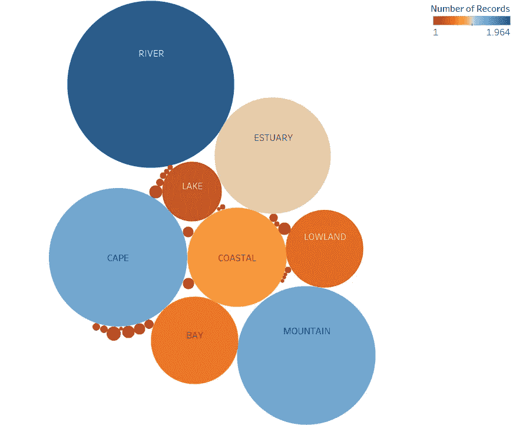*

*正如之前预测的那样，许多地区选择具有*河*特征的名字作为他们的最爱，其次是*山*和*海角*地理特征。令人惊讶的是， *cape* 虽然只有三个关键词支持，却排在第三位。其他特征如*海岸*和*河口*也获得了不错的知名度，而缺乏决定根据其他少数特征命名的区域，如*湖*、*低地*和*海湾*。除此之外，正如我前面所说的，有些地名具有不止一个地理特征，这就形成了一个小小的圆圈。*

*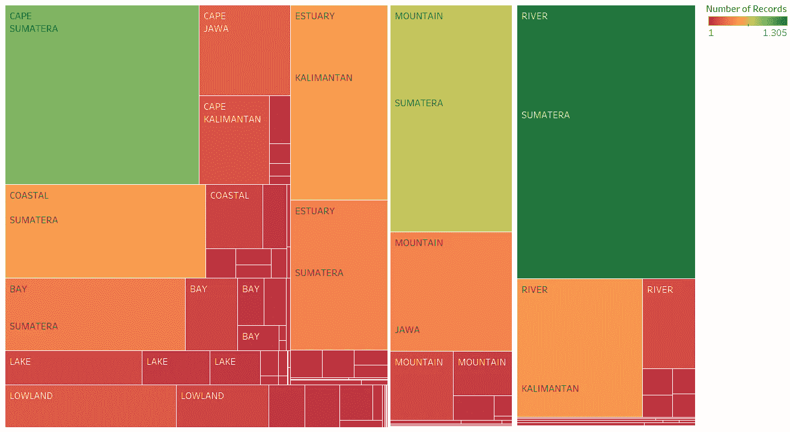*

*根据分类，我发现苏门答腊有许多与地理特征相似的名称，而 river 和 cape 比其他任何术语都被过度使用。此外，*海岸*和*海湾*特征分享了它们最大的比例，主要在苏门答腊。遵循同样的趋势，加里曼丹也有许多位置就在水湾旁边和河边，以它们的名字命名。最后，*山*名还负责爪哇的大部分场馆。同时，*湖泊*和*低地*区域对大部分地区影响较小。*

# *使用指南针方向名称的地方*

*我认为将包括名字之间的方向的名字分类是令人陶醉的。对于方向，我破例使用区的名称(三级行政)，因为当使用村庄名称时，结果无足轻重，仅获得 3%的总特征。当使用地区名称时，我得到了 13%多一点，略高于 3%。*

*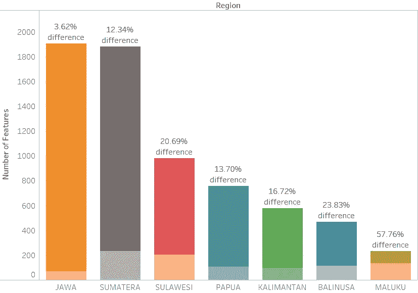*

*总的来说，许多使用方向名称的地区至少占了 12%,除了 Java 不到 5%,是所有地区中比例最低的。这可能是由于高度多样化的名称共享造成的。按照这一趋势，苏门答腊岛也是仅次于爪哇的第二低的地区，但是比其他任何地区显示出最多的方向位置。另一方面，尽管马鲁古是数量最少的地区，但它的人口占大多数，比其他任何地区都多，有一半以上的人口。*

*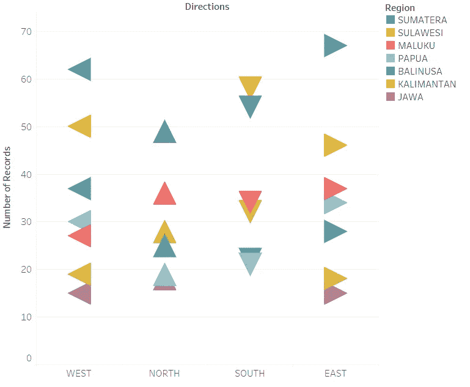*

*说到方向分类，除了*南*外，大部分都是苏门答腊虾占多数。与排名第二的苏门答腊岛相比，苏拉威西岛已经使用了很多去南方的方向。正如你已经知道的那样，马鲁古岛在地名中所占的比例最大。大多数情况下，它在三个球场上使用它:北，南，东，数量几乎相同，而西稍微落后。*

# *讨论*

*谈到语言，印度尼西亚是高度多样化的。它可能需要在自然语言处理方面做一些进一步的工作，包括字典、词干和词汇化，以产生像样的工作。这将是令人惊讶的。*

*在整个过程中，由于对方言理解的限制，我只管理了一小部分数据。因此，结果可能会有一些差异，降低了准确性。此外，我认为这些名字确实是高度多样化的，这似乎不可能进行全球分析。出于某种原因，当小规模应用时，它将产生巨大的工作，至少目前是这样。*