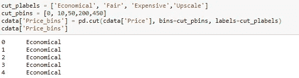

# Playstore 应用程序—数据清理和业务洞察

> 原文：<https://medium.com/analytics-vidhya/playstore-apps-business-insights-50fcedcbcfb?source=collection_archive---------17----------------------->

尼尔·索尼在 [Unsplash](https://unsplash.com?utm_source=medium&utm_medium=referral) 上拍摄的照片

假设:你是一家名为“RapidApps”的公司的数据分析师，该公司开发 Android 应用程序并将其放在 playstore 上。你的客户经理找到你，让你检查哪些付费应用被低估了，哪些应用的价格可以在不影响需求的情况下调整。让我们着手一个有限数据集的原型。

请在[https://github . com/ind goddess/Improve _ Revenue _ Of _sub 低估 _Apps](https://github.com/indgoddess/Improve_Revenue_Of_Undervalued_Apps) 找到数据集和 Jupyter 笔记本

手头的艰巨任务..确实是..

我们从数据分析开始—调用 head()、info()、describe()方法。我们需要考虑付费应用，而忽略免费应用。有必要清理，使一些其他列像大小，评论，安装，价格为数字和列像“上次更新”作为日期时间对象。此外，检查数据可能重复的实例，并删除那些行。

某些列如“类型”、“当前版本”在我们的上下文中没有附加值，因此我们将选择删除这些列。

填充空值—“评级”、“尺寸”、“Android 版本”列。我们在小数据集上操作，所以我们不能丢失 NaN 值的行，而是用平均值或最常见的值来填充值。

我们根据类型/内容评级/价格来分组，以查看应用数量。同一类型/内容评级的应用程序价格差异很大。我们在这里看到了完成使命的一线希望。

娱乐类应用的价格在 0.99 到 399.99 美元之间

基于价格的应用分发严重扭曲。因此，让我们根据价格将应用程序分为 4 类——经济、公平、昂贵和高档。注意熊猫中 cut()的使用。[https://pbpython.com/pandas-qcut-cut.html](https://pbpython.com/pandas-qcut-cut.html)

经济型应用的价格在 0-10 美元之间

我们将评级和评论划分为区间，以便更好地汇总我们的数据。

我们的目标是在某个类别、一定数量的评论和一定的价格范围内找到应用程序的平均价格。如果任何应用程序低于计算的平均值，我们可以建议这些应用程序可以定价更高，而不会赶走客户。

对于具有 10 K 经济范围评论的艺术设计类别，平均价格为 1.99 美元。

我们已经创建了一个包含平均价格的数据框架‘cat _ rev _ price’。我们将尝试检查所有符合上述标准的应用程序的价格是否低于或高于该标准的平均值。

让我们确定更多这样的标准，以作出明智的决定。我们做了更多的列分组标准，并找到每个分组的方法。

我们有 7 组 a-g，如下所示:

a.类别、大小、价格 b .类别、评级、价格 c .类别、评论、价格

d.类别、类型、价格、类型、内容评级、价格、类型、Android 版本、价格、类别、更新年份、价格

我们现在有七个二元标准来帮助决定一个应用程序的价格是否应该增加。我们如何使用它们？

我们可以使用一种叫做**多数投票、**的技术，在这种技术中，我们根据所有标准来决定一个应用程序的价格是否应该上涨。

想象这是一次选举，每个标准都是一个投票者。对于每个应用程序，我们将计算每个结果的投票数，大多数将被宣布为获胜者。请注意，因为我们有七个标准，每个标准有两个可能值，所以不可能出现平局。

对于多数表决，我们使用“模式”。

大约 58%的应用程序= 436 个应用程序可以定价更高

您的客户经理非常激动，但她想知道这会对收入产生多大影响。

我们可能会依靠安装数量作为代理，但不幸的是，我们的`Installs`栏只给出了范围，而不是确切的数字。

然而，由于缺乏更好的信息，我们仍然使用安装。计算新旧价格之间的差额，并乘以安装次数。

通过获取平均值来计算被低估的应用程序的新价格

计算被低估的应用的影响

计算对公司收入的总体影响

我们了解了以下内容—

*   关于组织中使用数据科学的业务环境
*   关于原型的重要性

享受阅读！！！