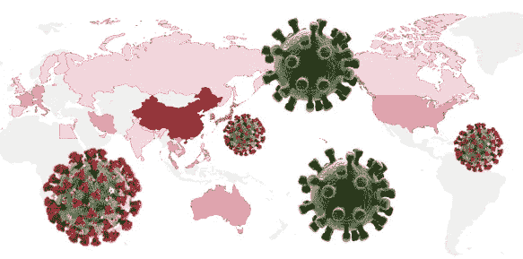

# 冠状病毒和 PMI

> 原文：<https://medium.com/analytics-vidhya/plot-the-u-s-economic-leading-indicator-pmi-with-plotly-3aaf263a9ef9?source=collection_archive---------12----------------------->

**冠状病毒与采购经理人指数**

从这个月开始，我们应该特别关注冠状病毒对美国经济的影响。正如这篇新闻文章“[被冠状病毒拖慢，中国公司努力重开](https://www.nytimes.com/2020/02/17/business/china-coronavirus-economy.html)”指出的，世界第二大经济体已经关闭了三周。冠状病毒爆发已导致数万人患病，爆发的中心湖北…