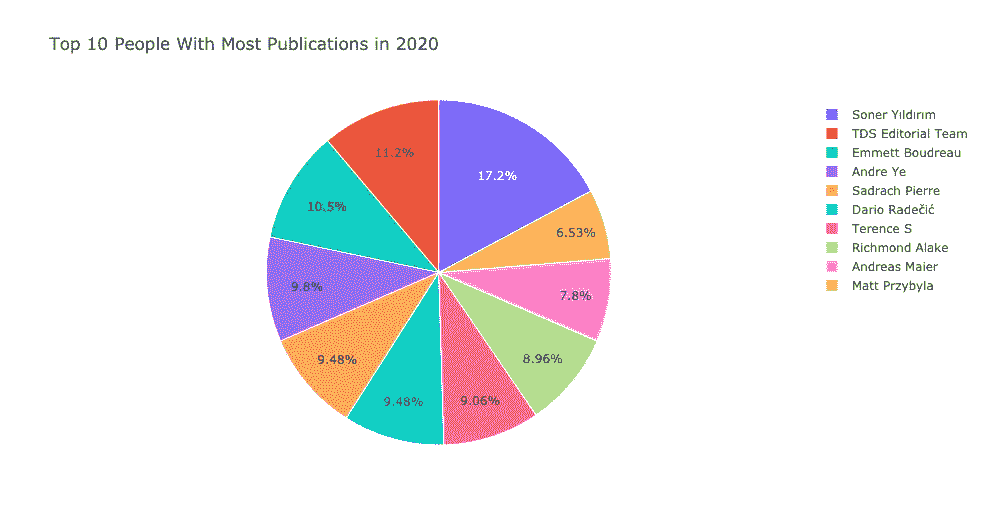
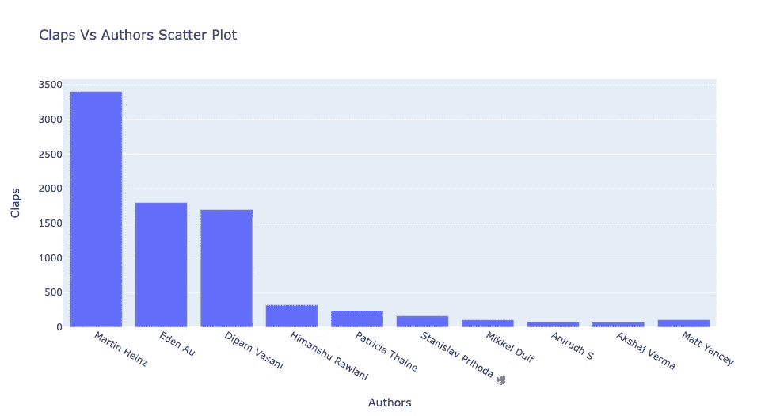

# 阴谋策划

> 原文：<https://medium.com/analytics-vidhya/plot-with-plotly-basics-9ae546dc03ae?source=collection_archive---------13----------------------->


来自 Plotly.com 的 Plotly 标志

不管我们在学什么或做什么，我们都从基础开始，从基础开始，从核心开始。然后我们学习更多的工具和技术、技巧和捷径——我们学习把事情做得更好，让它变得更“高级”。

今天，我们将看看另一个工具来“提升”我们的数据可视化技能。

## 什么是 plotly？为什么要用？

Plot 是一个免费的开源图形库，可以制作令人惊叹的交互式图形。它做了 Seaborn 和 Matplotlib 所做的一切，但对查看者来说更有趣。

数据:从 2020 年 1 月 1 日到 2020 年 10 月 31 日，所有文章和作者数据都直接摘自《走向数据科学》。

# 如何入门？

为了用 plotly 可视化，你需要很好的理解 Matplotlib 和 Seaborn。

如何导入:

```
import plotly.graph_objects as go
```

你还会看到:`import plotly.express as px` *。*这个包装器允许更简单的语法，但代价是对图形的控制。`plotly.graph_objects`对你的创作有更大的控制权。此外,`plotly.express`仍然是相当新的一些错误。

```
top_ten_authors = df["author"].value_counts().keys().tolist()[:10] #selecting top 10number_published = df["author"].value_counts().values.tolist() # num of pub correspoding to the top 10 authorstrace = go.Pie(labels = top_ten_authors, #assigning label
              values = number_published, #assigning values
              marker = {'line': {'color': 'white', 'width': 1}}, # generating the lines
              #hoverinfo="value"
              )data = [trace]layout = go.Layout(title="Top 10 People With Most Publications in 2020"); pie_fig = go.Figure(data=data, layout = layout); pie_fig.show() 
```



```
x = df['author'][:25] 
trace = go.Bar(x = x ,
               y=df['claps'],
               text = df["reading_time"])
data=[trace]
#defining layout
layout = go.Layout(title='Claps Vs Authors Scatter Plot',xaxis=dict(title='Authors'),yaxis=dict(title='Claps'),hovermode='closest')
#defining figure and plotting bar_fig = go.Figure(data=data,layout=layout)bar_fig.show()
```



能够与图表互动对浏览者来说是很棒的。他们可以通过放大、缩小和平移可视化来进一步探索数据。