# Plotly 和袖扣——用于 EDA 和演示的交互式 Python 可视化工具

> 原文：<https://medium.com/analytics-vidhya/plotly-and-cufflinks-an-interactive-python-visualization-tool-for-eda-and-presentations-4490b11cfbcd?source=collection_archive---------9----------------------->

在 2019 年尼日利亚 PyCon 上，我谈到了如何使用一个名为 Cufflinks 的 Python 库来构建交互式的美丽情节，以及如何使用 Plotly 来托管情节。在这篇文章中，我将带你了解如何用它们来制作非常有见地的情节。

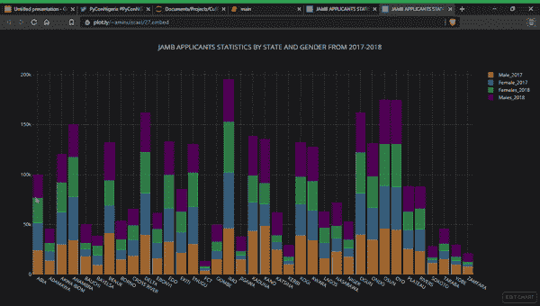

用袖扣绘制的尼日利亚各州 JAMB 申请人统计数据(2017-2018)

首先，在我们开始袖扣的可视化之前，我们需要了解 EDA 的概念，以及为什么它在数据科学和数据分析领域如此重要。

# **EDA 是什么？**

> 探索性数据分析(EDA)是可视化和分析数据以从中提取洞察力的过程。换句话说，EDA 是为了更好地理解数据集而总结数据的重要特征的过程。—代码 Heroku

EDA 在数据科学领域非常有用，因为它有助于我们更好地理解数据，并且通过使用它，我们可以得出趋势和特征之间的关系，最终导致生成和选择直接影响模型性能或得出统计推断的有用特征。它有助于使数据成为洞察的必要条件，而不仅仅是对其内容做出假设和假说。在进入机器学习或统计建模领域之前，这一点非常重要，非常重要的是要确保数据确实如其所声称的那样，并且数据集中没有明显的异常或模糊。当从数据中做出或得出统计推断时，EDA 应该是每个数据科学家的核心部分。

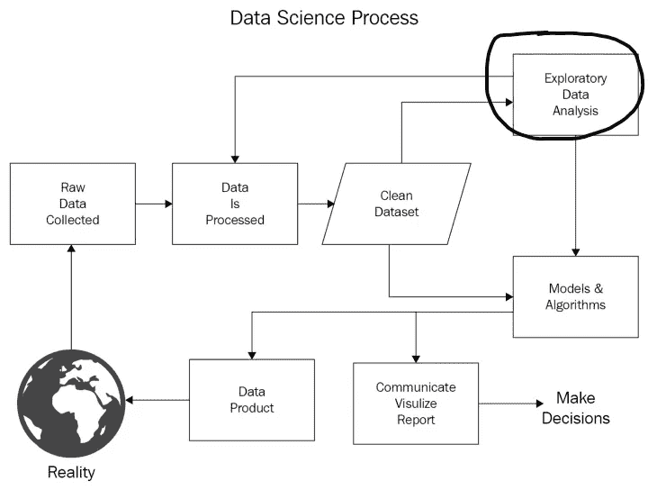

现在我们已经完全理解了 EDA 的概念以及它的重要性，让我们使用一个非常交互式的 Python 可视化工具:Plotly 和袖扣来深入研究数据可视化。我确信许多用 python 编码的数据科学家更熟悉 Matplotlib 和 Seaborn 可视化库。我知道有些人可能从未听说过袖扣或 plotly，所以让我快速回顾一下 Plotly 和袖扣是怎么回事。

**Plotly** 是一家技术计算公司，总部位于魁北克省蒙特利尔市，开发在线数据分析和可视化工具。Plotly 为个人和协作提供在线绘图、分析和统计工具，以及用于 Python、R、MATLAB、Perl、Julia、Arduino 和 REST 的科学绘图库。Plotly 建立在 d3.js 之上，是一个专门的图表库，可以直接用于熊猫数据帧，这要归功于另一个名为 Cufflinks 的库。

**袖扣**将 Plotly 与熊猫连接起来，直接创建数据帧的图形和图表。这是一个 Python 库，用于设计图形，尤其是交互式图形。它可以绘制各种图形和图表，如直方图，条形图，箱线图，传播图等等。它主要用于数据分析以及财务分析。袖扣是一个互动的可视化库，你可以用它来震撼你的观众。

因此，为了我们的可视化，我们将使用一种包装材料，名为袖扣，设计用于熊猫数据框。因此，我们的整个堆栈是 cufflinks > plotly > plotly . js > D3 . js，这意味着我们获得了 Python 编码的效率和令人难以置信的交互式图形功能。

## **袖扣相对于其他绘图库的优势**

我知道你可能习惯了其他 python 绘图库。但是 Plotly 和袖扣有很多好处，比如:

1.  **动态剧情**
2.  **托管服务**
3.  **只需要一行代码就可以做出图**
4.  **100%离线工作**

# 入门指南

> **pip 安装计划**
> 
> **pip 安装袖扣**

Plotly 和袖扣目前只适用于 Jupyter 笔记本。

首先，在我们继续之前，我们需要导入必要的库…

[熊猫 0.20.3](https://pandas.pydata.org/pandas-docs/stable/install.html)
[剧情 2.4.1](https://plot.ly/python/getting-started/)
[袖扣 0.12.1](https://plot.ly/ipython-notebooks/cufflinks/)

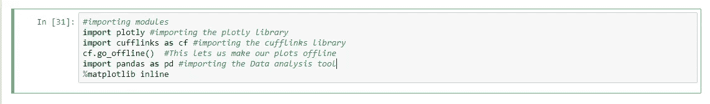

**注意**:cf . go _ offline()函数允许您将您的图设为离线，这意味着您的图不会在线保存在您的 plotly 帐户上。脱机绘制的好处是，在选择保存之前，您可以在笔记本中对绘图进行更改。此外，要在线保存您的地块，您需要创建一个 plotly 帐户。你可以在这里创建一个

要切换回在线模式，您可以使用以下语法:

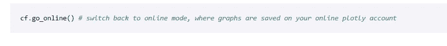

## **数据**

我收集的大部分数据都是通过网络搜集的，来自尼日利亚统计局。我使用的数据是:

*   尼日利亚电力消费(1971 年至 2014 年)
*   JAMB 2017–2018 年申请人数据
*   3 月至 7 月的丹格特水泥库存

接下来，我们需要将数据导入笔记本。

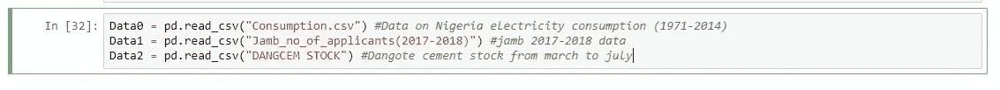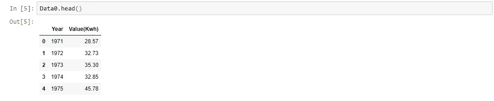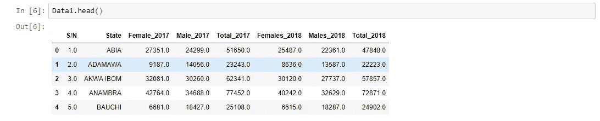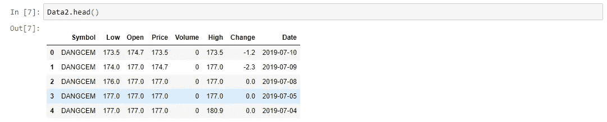

# 创建地块

## **线条图**

***DANGCEM 股票(3-7 月)2019* :**

我用下面的代码块用**丹格特水泥**股票数据做了一个线图。

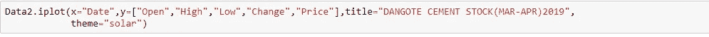

输出:

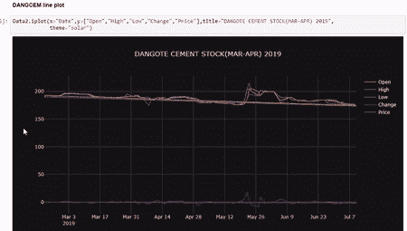

从显示的结果中，您可以看到当您将鼠标悬停在图形上时，图形会做出响应，您还可以放大图形，单击图例以获得有关数据的更多信息。此外，情节不是静态的，它只需要一行代码来制作情节，这不是很棒吗？！

***边框数据线图*** :

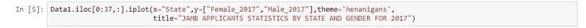

输出:

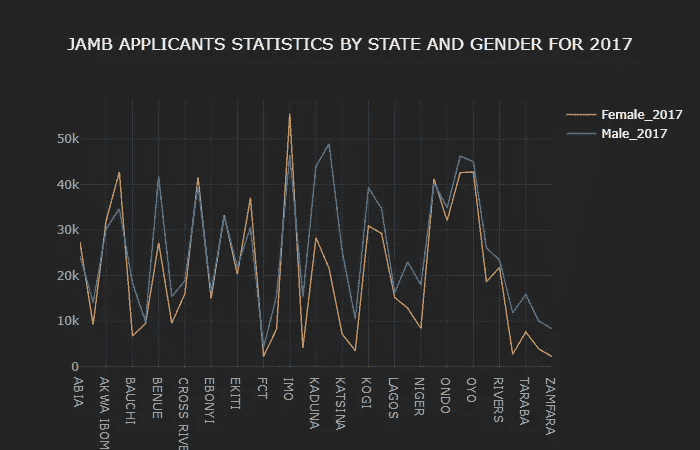

***尼日利亚用电量线图*** :

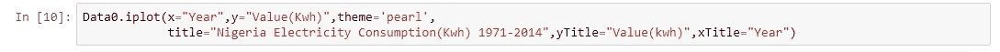

输出:

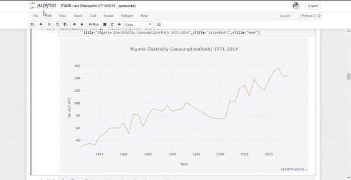

**注意:**你可以选择使用任何你想要的主题，它不可能总是全黑的。您可以使用下面的代码块了解袖扣上可用的主题:

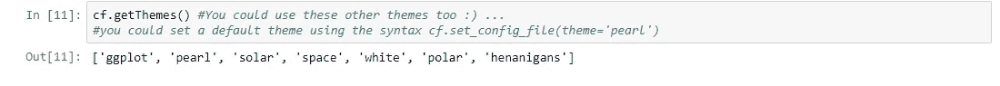

**柱状图**

***边框数据栏图***

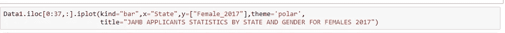

输出:

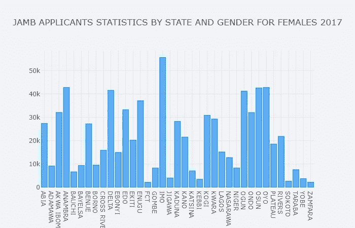

您也可以通过将 barmode 设置为“堆叠”来绘制堆叠条形图

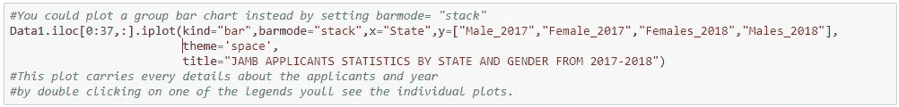

输出:

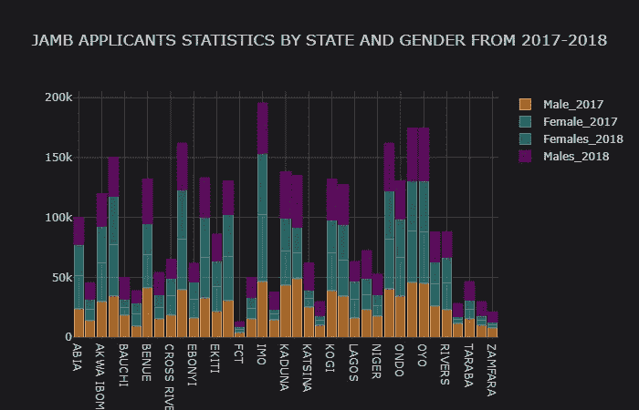

帖子开头就能看出反应

**箱线图**

***方框图上的用电量***

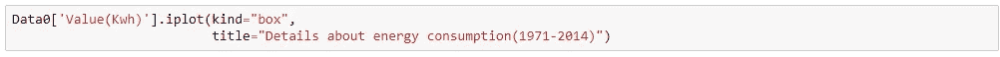

输出:

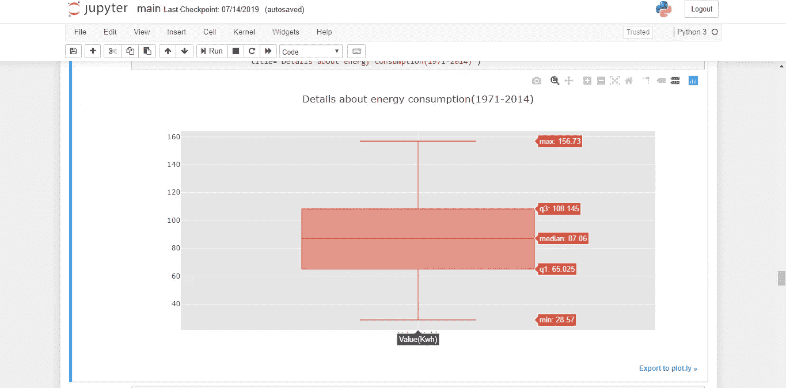

***当日顺股票箱线图(3-7 月)2019***

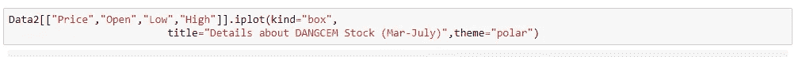

输出:

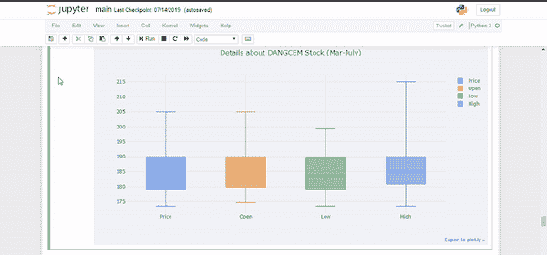

还有其他一些很酷的图可以尝试，如散点图，面积图，气泡图等。您可以在此查看文档

# 托管地块

是的，由于 Plotly，您可以选择主持任何情节并与世界上的任何人分享。我将带您了解举办这些活动的步骤。

对于主持的情节，我将主持这个特别的节目，因为它是由 2019 年尼日利亚 Pycon 的观众选择的😃

第一步:

在 Jupyter 笔记本上完成绘图后，点击“导出至 plot.ly”

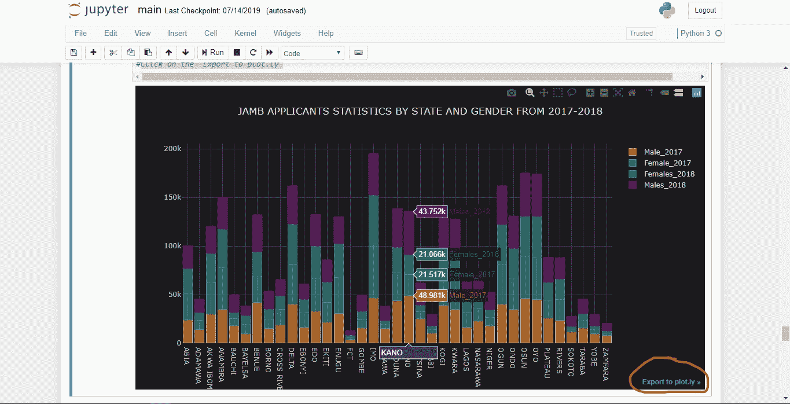

它会将您重定向到一个仪表板。

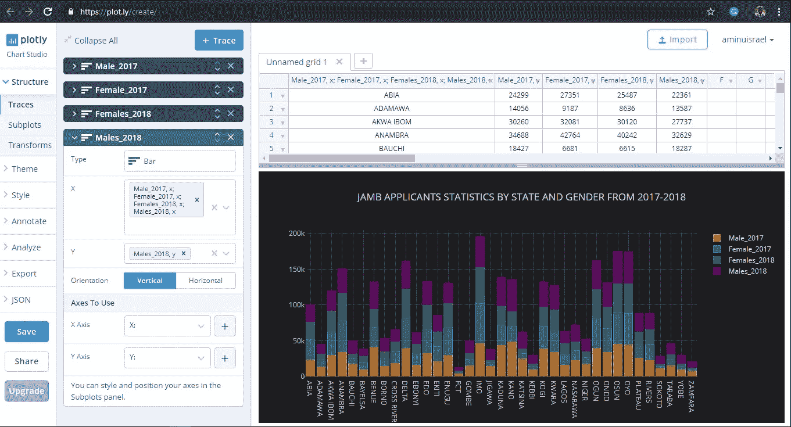

第二步:

点击保存

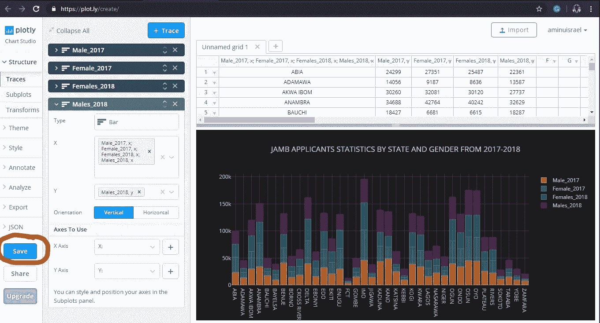

将出现一个弹出窗口，告诉您如何选择保存您的图

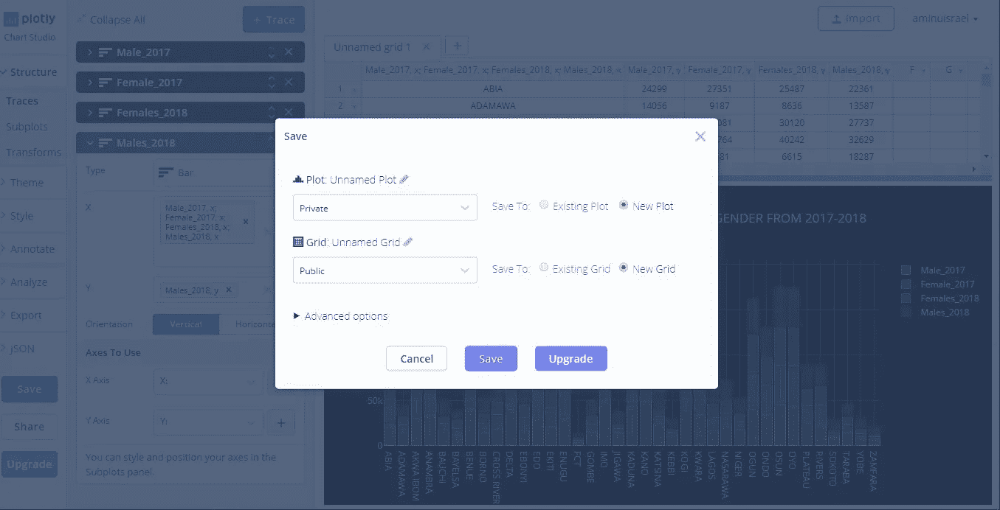

您可以将绘图更改为公共或私有，而代表您的数据的网格更改为私有或公共，这取决于您正在处理的内容，我们选择将绘图和网格也设置为公共。之后，点击保存

第三步:

你会看到一个分享按钮，然后会弹出一个这样的页面。

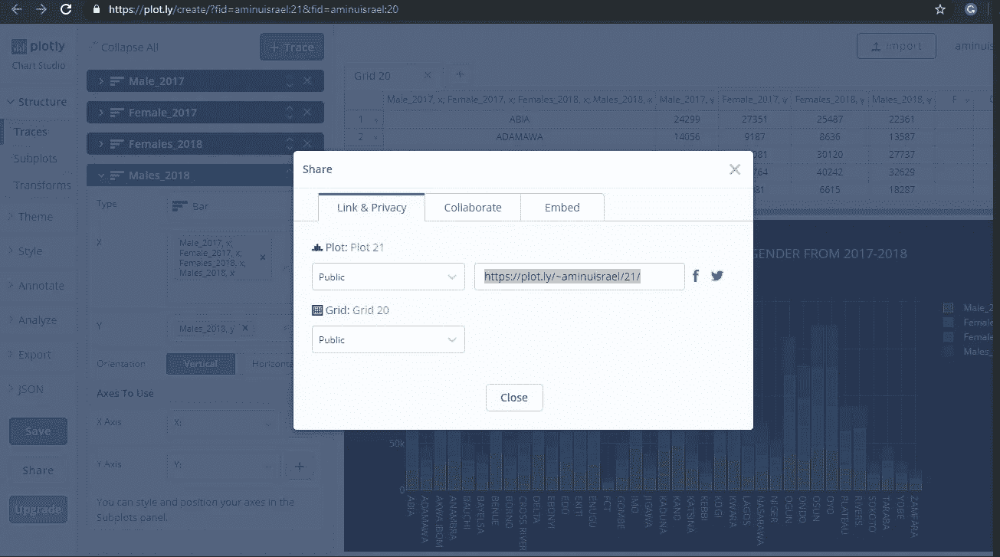

你看，你的图和数据已经成功托管，你可以复制并粘贴链接“[https://plot.ly/~aminuisrael/21](https://plot.ly/~aminuisrael/21)”到你的网络浏览器上。

当您粘贴 URL 时，您将能够看到您的托管图、数据、代码，并且您可以将图设置为全屏进行演示。

这个项目可以在 GitHub [这里](https://github.com/AminuIsrael/Cufflinks-and-Plotly-Tutorial)找到。感谢您的阅读和愉快的分析。