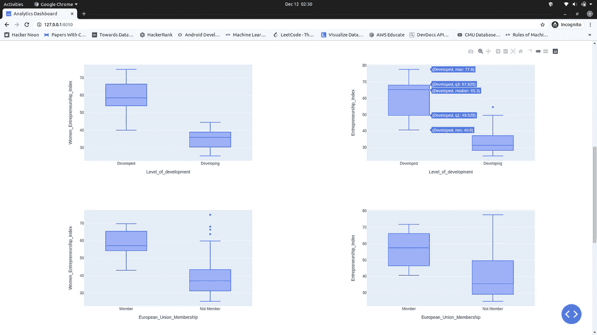

# Plotly Dash:构建分析仪表板的初学者指南

> 原文：<https://medium.com/analytics-vidhya/plotly-dash-a-beginners-guide-to-building-an-analytics-dashboard-cedf297e01f1?source=collection_archive---------1----------------------->

你好世界，欢迎来到我的第一篇媒体文章！我相信你在这里是因为你想创建一个美观的仪表板，但不知道从哪里开始，或者不知道你需要什么技能。别担心，我会掩护你的。这篇文章将带你一步一步地走过这段旅程，我会尽量让它简单。我们开始吧！


***何苦呢？***

我们都听说过无数次了——“数据是新的石油”。嗯，这是真的，但它到底是什么意思？数据无处不在。企业跟踪用户的活动，如他们的购买习惯、以前查看的产品、位置细节等，并花费大量资金来提炼这些数据以获得有价值的见解。数据可视化有助于决策者根据提取的前所未见的信息做出明智的商业决策，从而提高客户保持率和利润。因此，这是一个非常有用和受欢迎的技能。

***什么是 Plotly Dash？***

Dash 是一个开源 python 框架，用于构建交互式数据可视化 web 应用程序。它由 plotly 团队开发，于 2017 年年中发布。它建立在 Flask，Plotly.js，React.js 的基础上，非常容易学习，因为 Dash 抽象了所有困难的部分。


***先决条件***

我建议您为此创建一个虚拟环境，但这是可选的。这些都是创建 Dash 应用程序所需的东西:

1.  支持 Python 2 和 Python 3
2.  Pandas 数据操作和分析 python 库

```
pip install pandas
```

3.plotly——交互式数据可视化 python 库

```
pip install plotly-express
```

4.破折号

```
pip install dash==1.18.1
```

这就是你所需要的。
*(注意:从 dash 0.37.0 开始，dash 会自动安装 dash-renderer、dash-core-components、dash-html-components 和 dash-table，使用已知的兼容版本。您不需要也不应该再单独安装这些部件，只需安装仪表板本身。—* [Dash 文档](https://dash.plotly.com/introduction) *)*

***我们开始吧...***

Dash apps 由以下几个组成:
1。数据源/数据库连接
2。由`dash_core_components` 和`dash_html_components`
3 组成的仪表板布局。通过回调进行互动。

```
import dash
import pandas as pd
import plotly.express as px
import dash_core_components as dcc
import dash_html_components as html# Initialise the app 
app = dash.Dash(__name__) # Connect to database or data source here#Define graphs here# Define the app Layout here
app.title = 'Analytics Dashboard'
app.layout = html.Div() # Define callbacks here# Run the app 
if __name__ == '__main__':     
   app.run_server(debug=True)
```

" *Dash 包括“热重装”，当您使用* `app.run_server(debug=True)` *运行应用程序时，默认情况下会激活此功能。这意味着当你修改代码时，Dash 会自动刷新你的浏览器。*——[仪表板文档](https://dash.plotly.com/introduction)

**数据源/数据库连接**

获取数据有两种方式:
1。CSV 文件
`df = pd.read_csv('dataset_name.csv')`
2。连接到 SQL 数据库

(如果使用这个，需要安装 Python MySQL 连接器)

```
# Database Credentials
ENDPOINT=”co9od6lav8.ap-south-1.r1ds.amazonaws.com” #replace 
PORT=”3306"
USR=”admin”
REGION=”ap-south-1"
DBNAME=”mysql”# Database connection 
try:
  conn = mysql.connector.connect(host=ENDPOINT, user=USR, passwd=’sih2020’, port=PORT, database=DBNAME)
  c = conn.cursor()
  c.execute(‘SELECT * FROM table_name’)
  query_results = c.fetchall() 
  #print(query_results)
except Exception as e: 
  print(“Database connection failed due to {}”.format(e))df = pd.read_sql_query('SELECT * FROM table_name',conn)
```

**Dash App 布局**

这个组件描述了应用程序的前端将是什么样子。如果我们不定义布局，应用程序将不会启动。

1.  dash_html_components
    这是 dash 最酷的地方。一个人只需要关于 HTML 和 CSS 的基本知识。`dash_html_components`库提供了可以通过 python 渲染的 HTML 组件。组件在你的应用程序中生成一个`<div>Hello Dash</div>` HTML 元素。属性总是第一个属性，但是可以省略。
2.  dash _ core _ components
    `dash_core_components`包括一组高级组件，如下拉菜单、图表、降价模块等等。图形组件使用 plotly.js 来呈现交互式数据可视化/图形。

```
app.title = 'Analytics Dashboard'
app.layout = html.Div()
```

**破折号回调**

Dash 帮助我们设计动态 ui，可以通过反应式和功能性 Python 回调来定制。简而言之，当您想要呈现一个依赖于用户通过下拉菜单、单选按钮、滑块等输入的图形时，回调就会出现。回调链接输入组件，如下拉菜单和输出组件，如图形。

*“声明性组件的每个元素属性都可以通过回调来更新，并且属性的子集，如* `*dcc.Dropdown*` *的* `*value*` *属性，都是用户可以在界面中编辑的。”* — [仪表板文档](https://dash.plotly.com/introduction)

***让我们用我上面解释的所有概念创建一个仪表板…***

***输出:***



附加资源:
[https://www . ka ggle . com/baby ODA/women-entrepreneur-and-labor-force](https://www.kaggle.com/babyoda/women-entrepreneurship-and-labor-force)
【https://dash.plotly.com/】

***结论***

Plotly Dash 是一个很棒的开源 python 框架，可以免费创建一个具有漂亮可视化效果的分析仪表板。它是初学者友好的，因为 Dash 抽象掉了大部分耗时的工作。在本文中，您已经学会了从头开始创建一个分析仪表板。太棒了。下一步将是理解 Dash 中回调是如何工作的。万事如意！不断学习。