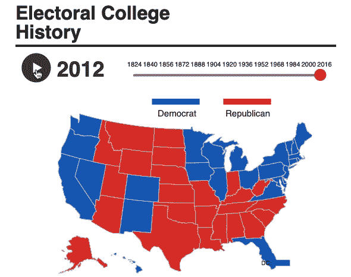

# 用 Plotly 创建美丽的地理地图

> 原文：<https://medium.com/analytics-vidhya/plotly-for-geomaps-bb75d1de189f?source=collection_archive---------0----------------------->

鸣谢:[TIME.COM](https://time.com/4561347/presidential-election-results-interactive/)(有些手机可能无法显示互动剧情。使用笔记本电脑。)

**GeoMap 中丰富的信息**

如果你是零售营销人员，你可能会问下一个增长机会的领域。如果你是政治学家，你可以用州或县来演示投票结果。如果你是流行病学家，你可以解释一种新病毒的传播途径。所有这些任务都有一个共同点:可视化地图上的信息以采取行动。在本文中…