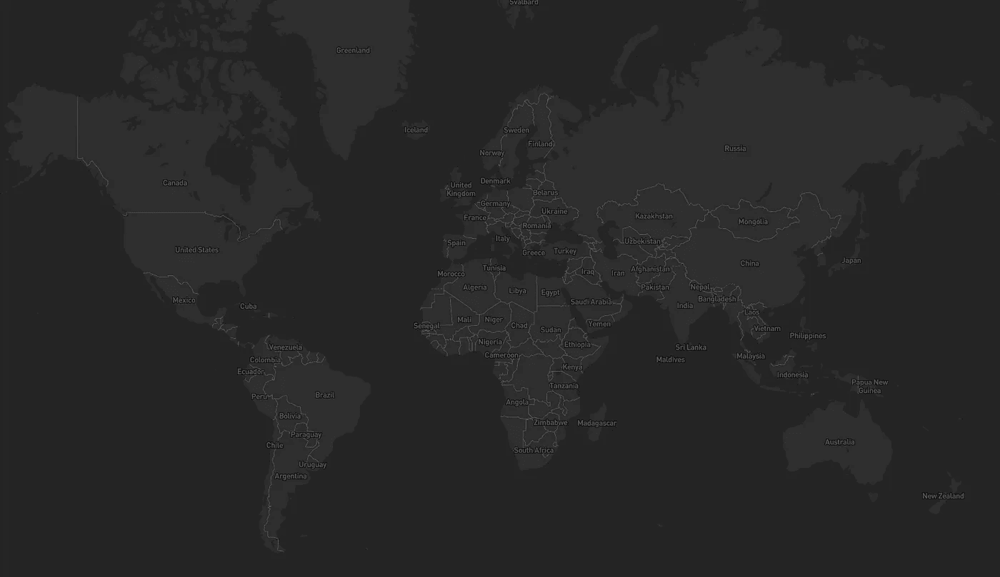
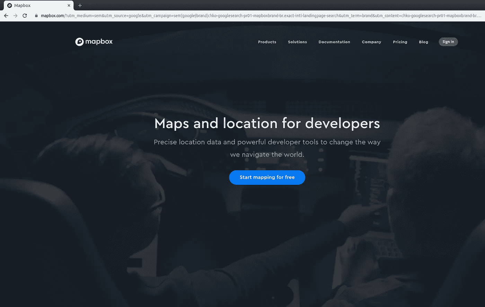
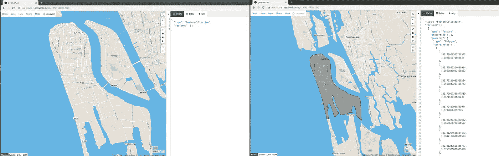
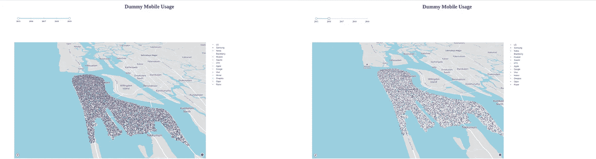
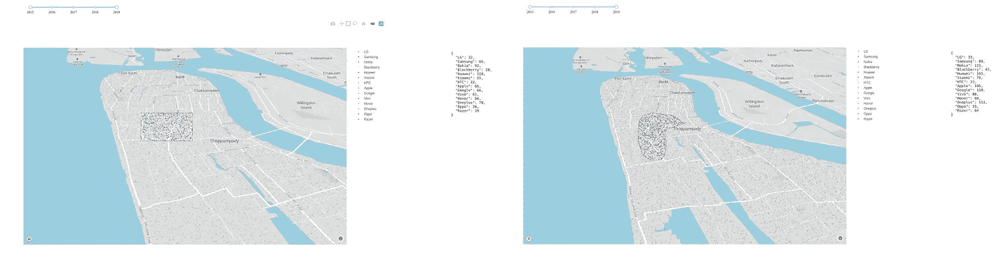

# 使用 Plotly 和 Dash 绘制地理散点图

> 原文：<https://medium.com/analytics-vidhya/plotting-geo-scatter-plot-using-plotly-and-dash-778b8afbdf68?source=collection_archive---------3----------------------->



数据可视化已经成为从数据中挖掘模式和洞察的有效工具。可视化与地理坐标相结合有助于探索地理空间数据。地理散点图是一种散点图，其中数据点绘制在地理坐标上，而不是笛卡尔坐标上。我们将使用 [*破折号*](https://dash.plot.ly/) 组件和[*mapbox maps API*](https://docs.mapbox.com/api/maps/)*在 mapbox 地图上创建地理散点图。Dash 是一个高效的框架，用于构建基于 flask、react.js、plotly.js 编写的 web 应用程序。它非常适合使用 python 构建具有高度自定义接口的数据可视化应用程序。我们在这里使用 dash 的两个主要组件。Dash HTML 组件([*dash _ HTML _ component*](https://dash.plot.ly/dash-html-components))提供了围绕 HTML、CSS 和 javascript 的 python 抽象，而 dash core 组件([*dash _ core _ component*](https://dash.plot.ly/dash-core-components))提供了交互式用户界面的组件。*

# *数据描述*

*智能手机用户的快速增长为全球新的智能手机进入者铺平了道路。在这里，我创建了 2015 年至 2019 年高知地区(印度喀拉拉邦)智能手机用户的数据集。这些数据是为了学习 dash 和 plotly 的唯一目的而创建的，因此不应该从观想中推断出任何东西。数据是使用 python *faker* 和 *random* 库生成的(数据创建的范围在本文之外)。该数据包含以下属性:*

**年份，纬度，经度，移动**

# *属国*

*某些 python 库不能作为 python 中的内置库。其中包括 [*熊猫*](https://pypi.org/project/pandas/)[*身材匀称*](https://pypi.org/project/Shapely/) 和 [*Dash*](https://pypi.org/project/dash/) 。这些需要使用 pip 或 conda 安装程序进行安装(取决于我们创建的环境)。*

*为了使用交互式定制在线地图，我们还需要创建 mapbox 帐户并生成访问令牌。访问令牌有助于将 API 请求与我们的 mapbox 帐户相关联。*

**

*概括一下:*

> *1.安装所需的 python 库— Pandas、Shapely、Dash*
> 
> *2.创建地图框帐户*
> 
> *3.创建 API 访问令牌*

# *数据准备*

*在绘制地理散点图之前，需要根据要求划定地理边界。这有助于分析分散点和划定边界内的地理位置之间的相关性(如果有的话)。首先，通过 [geojson.io](http://geojson.io/) 设置多边形边界，然后使用 python shapely 库检查数据点是否落在有界位置内，可以明确排除有界位置外的散射点。绘制多边形并保存 geojson 文件。*

**

*为所需位置创建 geojson 文件*

*需要导入数据和 geojson 文件。使用 geojson 文件过滤数据框(df)中的位置。过滤完成后，我们将数据保存在 csv 文件中。该文件稍后可用于绘制地理散点图。*

```
*import json
import pandas as pd
from shapely.geometry import Point
from shapely.geometry.polygon import Polygonwith open(‘KochiMainland.geojson’) as data_file: 
 data = json.load(data_file)df = pd.read_csv(‘KochiMobile.csv’)lon = []
lat = []
mob = []
year = []
for i in range(len(df)):
 if(polygon.contains(Point(df[‘Longitude’][i],df[‘Latitude’][i]))):
  lon.append(df[‘Longitude’][i])
  lat.append(df[‘Longitude’][i])
  year.append(df[‘Year’][i])
  mob.append(df[‘Year’][i])

newDf = pd.DataFrame({‘Year’:year,’Longitude’:lon,’Latitude’:lat,’Mobile’:mob})
newDf.to_csv(‘KochiMobile.csv’)*
```

*一旦数据被过滤并准备好绘制，现在我们可以开始创建地理散点图。让我们开始导入必要的库并初始化 dash 应用程序。*

```
*import dash
import json
import random
import numpy as np
import pandas as pd
import plotly.graph_objs as go
import dash_core_components as dcc
import dash_html_components as htmlfrom faker import Faker
from collections import Counter
from dash.dependencies import Input,Output,Stateapp=dash.Dash()*
```

*由于手机的数量很大，每年都在变化，我更喜欢随机分配不同的颜色来描绘不同的智能手机用户。我们还需要为文本创建一个背景色和颜色。*

```
*colors = {
 ‘backgroundMain’: ‘#ffffff’,
 ‘backgroundSub’ : ‘#000000’,
 ‘textMain’: ‘#000000’,
 ‘textSub’ : ‘##ffffff’
}
r = np.rint(np.random.uniform(0,255,len(df[‘Mobile’].unique())))
g = np.rint(np.random.uniform(0,255,len(df[‘Mobile’].unique())))
b = np.rint(np.random.uniform(0,255,len(df[‘Mobile’].unique())))def rgb(r,g,b):
 return ‘rgb(‘+str(r)+’,’+str(g)+’,’+str(b)+’)’*
```

*(r，g，b)组合稍后用于为每部智能手机设置标记颜色。现在，让我们使用 dash html 组件来设置整个仪表板的布局。该脚本类似于以下内容:*

```
*app.layout = 
html.Div([html.Div([html.H1(‘Dummy Mobile Usage’)],style= {‘textAlign’:’center’,’color’:colors[‘textMain’]}),
html.Div(html.P(id=’title-rangeslider-break’),style={‘padding-top’:’10px’}),
html.Div([dcc.RangeSlider(id = ‘range-slider’,min = 2015,max = 2019, marks = {i:{‘label’:str(i),’style’:‘color’:colors[‘backgroundSub’]}}
for i in range(2015,2020)},value = [2015,2019])],style = {‘width’:’20%’,’padding-left’:’80px’}),
html.Div(html.P(id=’rangeslider-graph-break’)),
html.Div([html.Div(dcc.Graph(id = ‘geoscatterplot-graph’),
style={‘width’:’70%’,’float’:’left’}),
html.Div(html.Pre(id = ‘json-data’),style={‘width’:’10%’,’float’:’right’,’padding-top’:’100px’})],style={‘display’:’flex’,’justify-content’:’space-between’}),],style={‘height’:’70%’})*
```

*web 应用程序的前端将有 4 个主要组件。一个*表头组件*、*范围滑块组件*、*图形组件*和*输出显示组件*。顾名思义，Header 组件将包含仪表板的标题。范围滑块允许用户选择要绘制散点图的年份范围。图形组件保存地理散点图。最后，如果在散点图中进行了任何选择，我们需要显示我们定义的 HTML 容器的详细信息，以保存这些组件。在这些主要组件之间，我们需要提供 HTML 段落组件*。这是为了分配每个主要组件前后的空间。在设置了前端用户界面之后，我们必须提供回调装饰器来包含组件之间的交互性。首先，让我们为地理散点图构建回调。**

```
*[@app](http://twitter.com/app).callback(Output(‘geoscatterplot-graph’,’figure’),[Input(‘range-slider’,’value’)])
def chloroplethGraphPlot(value):
 data = []
 year = [i for i in range(value[0],value[1]+1)]
 print(‘year::’,year)
 for i,mob in enumerate(df[‘Mobile’].unique()):
  data.append(go.Scattermapbox(
  lat=df[(df.Mobile==mob) & (df.Year.isin(year))][‘Latitude’],
  lon=df[(df.Mobile==mob) & (df.Year.isin(year))][‘Longitude’],
  mode=’markers’,
  marker=go.scattermapbox.Marker(
  opacity=0.8,size=4,color=rgb(r[i],g[i],b[i])
  ),
  text=df[df[‘Mobile’]==mob][‘Mobile’],name = mob
  ))
  layout = go.Layout(
  #title = ‘Dummy Chloropeth’,
  autosize=True,
  hovermode=’closest’,
  height=900,
  width=1400,
  mapbox=go.layout.Mapbox(
  accesstoken=mapbox_access_token,
  bearing=0,
  center=go.layout.mapbox.Center(
  lat=9.934200203046808,
  lon=76.2551855659548),
  pitch=60,
  #style=shaz13_custom_style,
  zoom=15
  ))
 return{‘data’:data,’layout’:layout}*
```

**我们之前已经解释过，mapbox_access_token* 需要从 mapbox 帐户生成。令牌值需要硬编码或作为全局变量提供。*

*回调装饰器中有一个输出参数和一个输入参数。正如我们所讨论的，地理散点图将是输出。范围滑块将是输入。最小值和最大值(来自范围滑块)作为值传递给函数。基于这些值，创建数据跟踪列表。在图形布局中设置图形的宽度、高度和其他布局。一旦数据跟踪和布局准备就绪，返回它们。*

*类似地，需要创建一个新的装饰器来定义地理散点图和输出显示之间的交互性。*

```
*[@app](http://twitter.com/app).callback(Output(‘json-data’,’children’),[Input(‘geoscatterplot-graph’,’selectedData’)])
def selectedDataPlot(selectedData):
    try:
      SelectedMobile = []
      for i in range(len(selectedData[‘points’])):
        SelectedMobile.append(selectedData[‘points’][i][‘text’])
        print(Counter(SelectedMobile)
      return json.dumps(Counter(SelectedMobile),indent=2)
    except:
      print(‘NoneType Error’)
    return*
```

*输出显示组件是回调装饰器的输出参数。输入将是从地理散点图中选择的区域。这里我们统计一下各个智能手机公司旗下的智能手机数量。*

*如前所述，我们已经开展了必要的兴趣活动。让我们启动 dash 应用服务器。*

```
*if __name__=='__main__':
    app.run_server(host='0.0.0.0',port=80)*
```

*现在查看位于 [http://0.0.0.0:80](http://0.0.0.0/) 的可视化应用程序。总而言之，我们已经实现了基于范围滑块选择的兴趣活动，如下所示:*

**

*左:2015–2019，右:2015:2016*

*类似地，我们还实现了基于图形中套索/框选择的交互性。兴趣活动如下所示:*

**

*左:方框选择，右:套索选择*

*还有许多其他简单的组件和交互性可以添加到应用程序中。例如，我们可以绘制一个更清晰、更吸引人的饼状图，而不是显示字典数据。另外，你可以尝试用日期范围选择器来代替普通的范围选择器。*