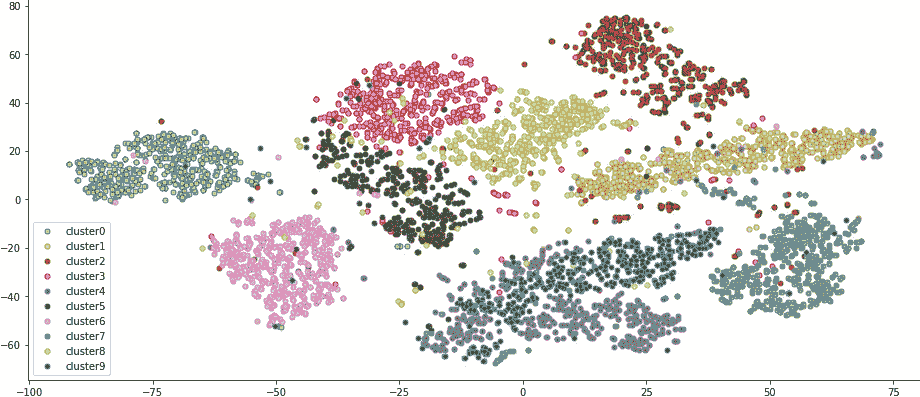
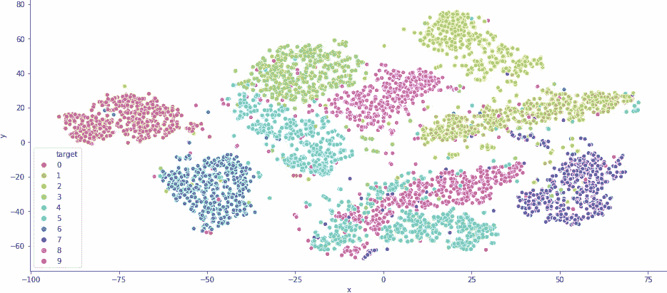

# 在 Python 中绘制聚类

> 原文：<https://medium.com/analytics-vidhya/plotting-graphs-in-python-8f7b4ca1a4ae?source=collection_archive---------2----------------------->

图片由 [Kadres](https://pixabay.com/users/Kadres-5332138/?utm_source=link-attribution&amp;utm_medium=referral&amp;utm_campaign=image&amp;utm_content=2531455) 从 [Pixabay](https://pixabay.com/?utm_source=link-attribution&amp;utm_medium=referral&amp;utm_campaign=image&amp;utm_content=2531455) 拍摄

我艰难地学会了使用 seaborn。我想在图表上绘制多个集群。现在，除了 matplotlib 之外，不需要使用任何库就可以做到这一点。但是，使用熊猫和海牛提供了一个优雅的方式来绘制同样的场景。在这里，我想与你分享这两种方法，以便你可以避免我所经历的苦难。

为了绘制聚类图，我们将使用 MNIST 数据集。它由从 0 到 9 的手写数字图像组成，因此数据集中总共有 10 个聚类。让我们获取数据并对其进行处理，以绘制二维图表。

MNIST 数据集有 70，000 个样本，但我们将只使用前 5，000 个样本进行绘图。MNIST 数据集中的每个样本都有 784 个特征，对应于 784 个像素。使用`data.shape`或`mnist.feature_names`可以看到这一点。因此，要绘制 2d 图形，我们需要将这 784 个特征减少到 2 个特征。这可以使用任何降维技术来完成，如 PCA 或 t-SNE。但是 [t-SNE 更适合聚类](https://towardsdatascience.com/visualising-high-dimensional-datasets-using-pca-and-t-sne-in-python-8ef87e7915b)，所以我们将使用相同的方法。

现在我们准备绘制一个我们的集群的二维图。

# **天真的方式**

使用`matplotlib`绘制这些聚类的一种方法是创建一个字典来保存每个聚类的“x”和“y”坐标。该字典的关键字将是“cluster1x”、“cluster1y”、“cluster2x”、“cluster2y”等形式的字符串，相应的值将是各个坐标的列表。我们还可以创建一个字典来保存聚类的标记颜色。下面是完成同样工作的代码。

现在，为了绘制，我们可以迭代所有的集群，如下所示。

# **利用熊猫和海牛**

我们首先创建 MNIST 数据集的 pandas 数据框架，并将从 t-SNE 约简中获得的列添加到其中。之后，我们使用 seaborn 散点图来绘制我们的图表，就这么简单。

如果想详细了解散点图函数的参数，可以使用`help(sns.scatterplot)`。希望你今天学到了新东西。

如果你在代码中发现任何错误，或者知道更好的做事方法，我会很乐意知道。