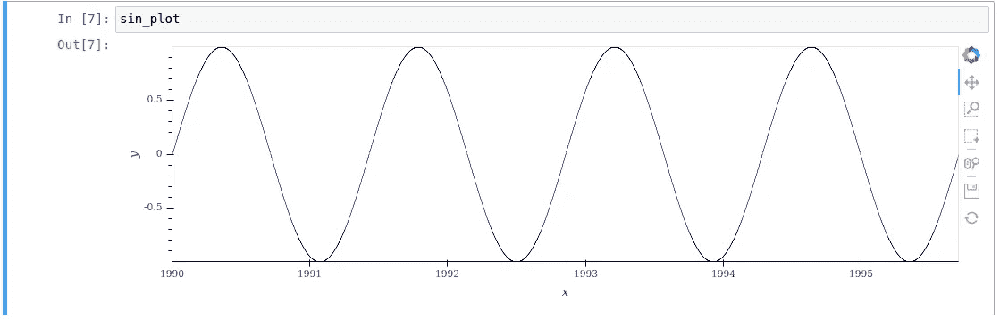

# 绘制数百万个点— Datashader

> 原文：<https://medium.com/analytics-vidhya/plotting-millions-of-points-datashader-1b9bb147a02a?source=collection_archive---------5----------------------->

最近，我在寻找一些 Python 库，它们可以轻松处理大型数据集，并允许交互以更好地了解数据。这个故事会给你一些快速的例子，告诉你如何使用 Datashader 来实现题目中的语句。

如果你想看代码，去 Github 或者用 T2 活页夹启动 Jupyter 笔记本。

像 Matplotlib 这样的基本库可以处理相当多的数据，但是没有提供与图形交互的机会。在另一端，像 Plotly 或 Bokeh 这样的库很容易交互，但只有当数据长度没有达到极限时(T4 Bokeh 大约 30 万点，Plotly[大约 1 千点)。当数据超过这个库的限制，而我们仍然希望从交互性中获益时，该怎么办？](https://plot.ly/python/webgl-vs-svg/)

# holo viz——holo views 和 Datashader 等

[Holoviz](https://holoviz.org/) 是一组开源库，它创建了一个伟大的生态系统，用于绘制和提供这些图作为应用程序/仪表板。

> HoloViews 专注于将您的数据与适当的元数据捆绑在一起，以支持分析和可视化，使您的原始数据*和*在任何时候都可以平等地访问。对于那些习惯于传统数据处理和绘图工具的人来说，这个过程可能并不熟悉，本入门指南旨在从较高的层面演示它是如何工作的。关于每个主题的更多详细信息，请参见[用户指南。](https://holoviews.org/user_guide/)

Holoviz 的一个库是 [Datashader](https://datashader.org/) ，它允许扩展像 Plotly 或 Bokeh 这样的库的功能，以显示超过其默认点数限制的内容。

> Datashader 是一个用于分析和可视化大型数据集的[开源](https://github.com/bokeh/datashader/) Python 2 和 3 库。具体来说，Datashader 旨在将数据集“栅格化”或“聚合”成可以作为图像查看的规则网格，从而可以简单快速地查看数据的属性和模式。Datashader 可以在 16GB 的笔记本电脑上一秒钟左右绘制 10 亿个点，并且可以轻松扩展到核外、分布式或 GPU 处理，以处理更大的数据集。

可以将来自 [Dask](https://dask.org/) 数据框的数据直接传递给 Holoviews，从而轻松绘制大量数据。

下面是如何用交互式工具在几毫秒内绘制 300 万个点的示例片段，Bokeh 提供了开箱即用的工具。

```
import pandas as pd
import numpy as np
from dask import dataframe as dd
import holoviews as hv
from holoviews.operation.datashader import datashade

hv.extension('bokeh')

def get_data():
    x = pd.date_range(start='1990-01-01', freq='1min', periods=3000000)
    y = np.sin(np.linspace(0, 8 * np.pi, len(x)))
    df = pd.DataFrame(y, index=x)
    return dd.from_pandas(df, npartitions=8)

df = get_data()
points = hv.Points((df.index, df[0]))sin_plot = datashade(points).opts(height=300, responsive=True) 
```



正弦图的结果

我将创建更多的片段和例子来展示 HoloViews 的一些功能，等等。

附:给我反馈，如果你想看到一些具体的✌️