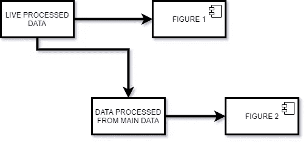
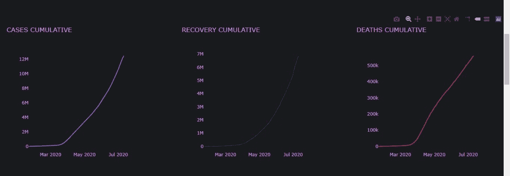

# 使用 Dash 和 Plotly 绘制具有实时数据的多个图形

> 原文：<https://medium.com/analytics-vidhya/plotting-multiple-figures-with-live-data-using-dash-and-plotly-4f5277870cd7?source=collection_archive---------5----------------------->

每当谈到数据的可视化时，plotly 都会作为一个突出的包在多个选项中进行选择，尤其是在谈到交互性时，它还附带了 Dash，这是一个用于创建强大仪表板的便捷框架。当你有实时数据和多个数字时。

斯蒂芬·道森在 [Unsplash](https://unsplash.com?utm_source=medium&utm_medium=referral) 上拍摄的照片

有时为每个数字设置一个间隔并让 Dash 在该间隔内更新数字是很容易的，但是要考虑您使用的数据是否在所有数字之间共享。所以你必须在每次回调中处理数据，没错！..你必须多次做同样的计算，而且你不能在回调之外更新数据，因为那样的话数据就不会被更新，你也不能使用全局变量，因为这会破坏你的应用程序，尤其是当你有用户输入的时候。

一种方法是创建一个隐藏的 div，处理并存储数据，然后用它作为回调的输入，你可以在[这里](https://dash.plotly.com/sharing-data-between-callbacks)找到这个例子

但是如果是这样呢

也就是说，对于每个图形，您都必须处理主实时数据中的数据。在这种情况下，您必须在每个回调中处理从 JSON 字符串中读取的数据，这也是计算开销很大的，并且您可能会遇到错误。

因此，更好的方法是使用多个输出

我将使用我最近创建的 COVID 19 的 Live dashboard 示例向您展示，您可以在此处找到源代码，也可以查看[应用](https://covid19livetracking.herokuapp.com/)

那我们开始吧。现在，由于这篇文章主要关注 Dash 中的实时数据处理，我不会沉迷于这些情节是如何创建的。所以初始化 app.py 文件后的第一步。正在为你的应用创建布局

现在你可以看到我们还没有为 ***dcc 指定图形属性。Graph*** 这是因为我们将使用回调函数向它提供图形。

> 记住您给这些数字的 id，因为它将在回调的输出中使用

所以现在我们将写回我们的电话

因此，您可以看到，我们使用 fig_1 和 fig _ 2 ids 来指定回调的输出，该函数在单个回调中处理所有数据并创建所有图形，因此，我们没有使用不同的回调来更新不同的图形，而是使用单个回调来完成所有计算，这降低了计算成本。此外，查看回调输入，它是一个间隔组件。这个组件控制回调被调用的频率，例如你可以在布局中看到 *dcc 的间隔属性。间隔*设置为 360*1000，这意味着它每 360 秒更新一次，即 6 分钟

但是在某些情况下，如果您希望以不同的时间间隔更新数据，那么您必须使用多个回调，但是在这种情况下，您只需将隐藏的 divs id 添加到处理数据的主回调输出中。记得将数据转换成 JSON 格式，以字符串的形式存储它

> 上面的代码是一个虚拟代码，只是为了便于解释，所以我建议不要复制粘贴它。但是你可以去[回购](https://github.com/imZain448/Covid_19_Dashboard/blob/master/app.py)获得完整的源代码

就这样，现在你知道如何为你的应用高效地处理实时数据了

最后是一些我推荐参观的文章

*   [使用 Python Dash 构建实时流仪表盘的简单步骤](/@lowweihong/simple-steps-to-build-a-live-stream-dashboard-using-python-dash-23562dea9d3f)
*   [使用 Python Plotly 库和 Web 服务构建实时仪表板](https://towardsdatascience.com/building-a-real-time-dashboard-using-python-plotly-library-and-web-service-145f50d204f0)