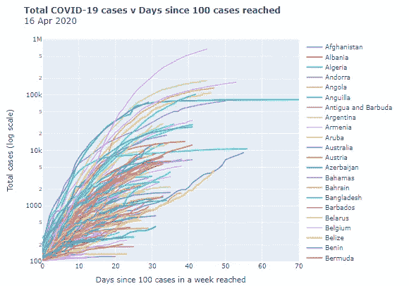
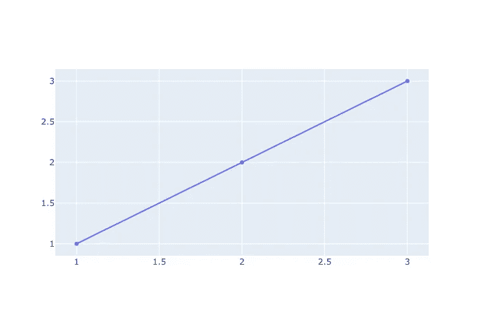
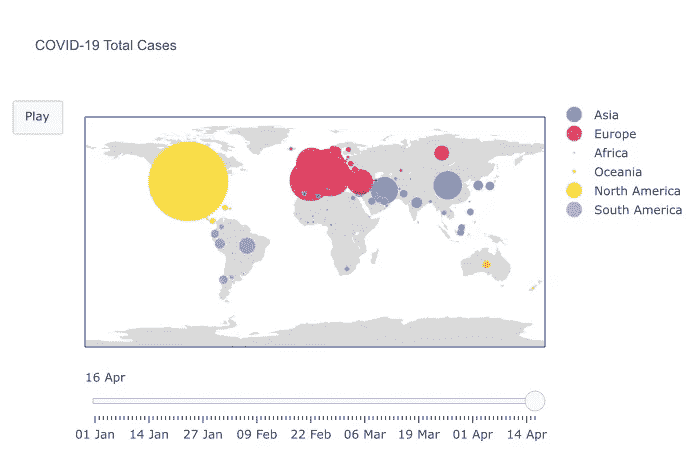

# 用 Python 和 Plotly 绘制疫情

> 原文：<https://medium.com/analytics-vidhya/plotting-the-pandemic-with-python-and-plotly-e8011a141e3c?source=collection_archive---------6----------------------->



## 使用 Python、Plotly 和 Elastic Beanstalk 创建和部署您自己的交互式仪表板，以监控新冠肺炎疫情的进度。

可视化是理解和交流数据含义的强大工具。当前对新冠肺炎疫情进展数据的日常饮食中的真理和意义的探索激发了许多令人敬畏的数据可视化的例子。

这篇博客详细介绍了如何使用新冠肺炎数据构建自己的引人注目的交互式图表，将它们包装到仪表板中，并使用开源软件将其部署到互联网上。这里的可以找到一个例子[。所有的代码都可以在](http://www.randomseed42.co.uk/) [github](https://github.com/LUNDR/covid-19) 上找到。

该博客分为 5 个部分，带您了解设置和配置、一个示例可视化的编码(一段时间内新冠肺炎案例的动画地图)以及创建随时可部署的 dash 应用程序:

1.  编码设置
2.  读入和争论数据
3.  用 plotly 创建交互式图表
4.  使用 dash 创建仪表板
5.  将应用部署到 AWS Elastic Beanstalk

# 1.编码设置

**软件**

在数据科学的世界里，有许多不同的软件和操作系统可以使用，这取决于资源和喜好。作为最低要求，你需要 Python 3.5+和 git 来进行版本控制。还推荐使用代码编辑器和包管理器。我使用以下内容:

*   Python 3.7
*   包管理器:Anaconda 4.8.3
*   版本控制:git
*   编辑:Spyder，Jupyter Lab 和 Notepad++
*   操作系统:Windows 10

如果你有一个不同的设置，下面的说明不会有很大的不同，但是请记住，终端中的一些命令可能是不同的，你可能需要安装额外的依赖项。

**版本控制**

使用版本控制是一个很好的实践，当您开始部署时会用到它。假设您已经安装了 git，那么您可以从终端完成这项工作。

打开 conda 终端(从 windows 的开始菜单)并创建一个新目录。请注意，如果您使用的是 Linux 操作系统，您将需要使用正斜杠，而不是反斜杠。

```
mkdir .\covid-app
```

进入那个目录。

```
cd .\covid-app
```

制作一个自述文件(标题为“新冠肺炎 app”)。

```
echo "# covid-19 app" >> readme.md
```

开始版本控制。

```
git init
```

将自述文件添加到版本控制中。

```
git add readme.md
```

提交文件。

```
git commit -m "first-commit"
```

(可选)如果您有一个 github 帐户，您现在可以在那里建立一个存储库并链接到它。

```
git remote add origin remote repository [repository url] 
git remote -v git push origin master
```

瞧。您已经设置了版本控制。

**创造新环境**

人们会忘记这样做。这一点很重要，因为在安装互相冲突的包时，你可能会陷入混乱。如果你已经在一个环境中做了，事情出错了，很容易关闭环境并重新开始。如果你没有，你可能会面临一个配置/卸载的噩梦。

在 conda 终端中，创建一个新环境，并使用一个您会记住的名称。

```
conda create --name [environment-name]
```

然后进入环境(每次打开终端时都必须这样做)。

```
conda activate [environment-name]
```

**配置**

在您的环境中，您需要安装几个额外的包

```
conda install jupyterlab plotly dash palettable
```

如果你不安装 jupyterlab，那么你需要单独安装 pandas 和 numpy。

```
conda install pandas numpy
```

要设计应用程序，您需要安装(conda 不提供)。

```
pip install dash_bootstrap_components
```

为了让 plotly 图表显示在 **jupyter 笔记本**中，你还需要一些附加组件，按照 [plotly 文档](https://plotly.com/python/getting-started/#jupyterlab-support-python-35)中的说明进行操作

# 2.读入和争论数据

在您的新冠肺炎应用文件夹中，创建一个新的。py 或 ipynb 文件，并使用 pandas 导入数据。

这些数据来自欧洲疾病预防和控制中心，该中心(在撰写本文时)每天发布各国病例和死亡的最新情况。与所有数据一样，您应该了解您正在绘制的内容，以及它的注意事项和限制。你可以在他们的[网站](https://www.ecdc.europa.eu/en)上了解更多。

如果你看一眼，

这些数据通常非常干净，所以幸运的是没有太多事情要做。但是,“dateRep”列(即日期)不会被识别为日期时间对象，而是按照从最近到最早的顺序排列。如果不加以纠正，它会给我们以后带来问题。

**日期格式**

要纠正该问题:

*   将“日期报告”列转换为日期时间
*   按照每个国家的时间顺序对数据进行重新排序
*   重新索引数据以防止创建聚合时出错

**创建“全球”/“世界”数据集合**

我们还对每天的全球病例和死亡总数感兴趣，但是你会看到它不在数据集中，所以我们需要创建它。

要为整个世界创建条目:

*   创建一个汇总所有国家/地区的图表。
*   为*数据中的每一列添加新“World”系列的值。*
*   将“World”的值添加到原始数据集中。

**按国家创建累计病例和死亡总数**

数据集只包含每天的数字，我们希望绘制出病例和死亡是如何随着时间的推移而累积的。

**创建变量，根据大陆给出颜色**

首先，读入一个文件，该文件通过三个字母的 ISO-3 代码(存在于两个数据集中)将国家和大陆进行匹配，然后将其合并到*数据中。*最后创建一个颜色字典，将各大洲用一种颜色映射，这将在以后使用。

**创建一个字符串形式的日期列表**

对于将日期作为字符串的滑块，比使用日期时间格式更容易

# 3.用 plotly 创建交互式图表

我们现在准备开始制作一些图表。

正如许多软件包一样，在 plotly 中有多种方式来做事情，我只向您展示一种。下图显示了 plotly 地块的高级架构。导入 plotly.graph_objects 库后，您将构建一个“图形”字典，其中包含:

*   一个**‘数据’**元素。词典列表。列表中的每个字典定义了图表的类型(如散点图/条形图)和要绘制的数据。如果您想要在同一个图表上显示多个系列(也称为轨迹)，您可以将更多的词典添加到列表中。
*   (可选)**‘布局’**参数，用于控制图表布局的几乎每个方面。你可以在 plotly [文档](https://plotly.com/python-api-reference/generated/plotly.graph_objects.Layout.html)中读到更多
*   (可选)如果您要添加任何形式的动画，您还需要将一个字典列表传递到**‘frames’**元素中，该元素定义了在动画的每一帧应该绘制什么样的 vie 图表。

然后调用`go.Figure()`来创建图表。

它应该是这样的:



基本图表

现在，我们准备构建一个稍微复杂一点的东西，看起来像这样，有一个滑块显示随时间变化的快照，还有一个“播放”按钮启动一个动画，显示随时间变化的案例。



**构建新冠肺炎病例总数的动画地图**

首先，初始化图形字典。

**“数据”**

要创建“数据”元素，请选择加载图表时希望作为默认视图的日期——我已经将其设置为最近的一天。然后对数据集进行子集划分，只包含当天的数据。

因为我们希望每个大陆在地图上有自己的系列(颜色),我们将循环遍历各个大陆，为每个大陆创建单独的轨迹，这些轨迹将一起出现在地图上。在每一个循环中，根据上面创建的“颜色”字典，给大陆分配一种颜色。然后，在创建跟踪字典之前，数据按洲名(“cont”)进一步细分。在每个循环结束时，为每个洲创建的 data_dict 被附加到*图*字典的数据元素中。

因为我们想让这个图表随着时间的推移而动画化，所以我们需要定义帧。这些将是上面为图中的“数据”元素定义的相同图表，但是重新绘制了数据集中每个日期的数据。我们将通过采用与上面相同的代码来实现这一点，但是添加了一个额外的循环，以便也可以循环几天。

同时，我们将需要捕获步骤列表。步长是布局参数，它将帧链接到滑块上的日期，并定义如何在帧之间切换。

在我们进入循环之前，我们创建空列表来捕获帧和步骤。在外部循环中，我们创建了一个*‘frame’*字典，它将收集每天的所有踪迹。在内部循环结束时，它被附加到*图形*字典的“帧”元素中。每次外部循环在新的一天开始时，都会重新创建*帧*字典。

在每个外部循环(代表一天)中，还定义了一个*‘step’*字典。然后，在每个循环结束时，将其添加到*‘步骤’*列表中。

现在我们已经有了添加滑块所需的步骤。这是通过在列表中创建一个字典来实现的，它是整个图形的“布局”字典的一个参数。“步骤”列表作为一个参数添加到滑块字典中。

最后，我们需要定义布局。

最后，我们可以将整个图形放在一起，并存储为“map1”

地图的整个代码应该如下所示:

到目前为止，我们已经读入了数据，添加了一些额外的功能，并创建了一个交互式的动画图表。但这一切仍然只在我们的代码编辑器/终端中运行。现在我们需要准备部署。

# 4.使用 dash 创建仪表板

一旦您创建了一个或多个图形，您可以使用 dash 将它们一起放入仪表板。Dash 允许您创建一个由 plotly 构建的相对简单的方法来完成这项工作。

导入所需的包后。你可以用几行代码创建你的第一个基于浏览器的应用。

运行上面的代码后，您应该会看到下面的消息。这意味着您的仪表板已启动并在本地运行。如果你将`[http://127.0.0.1:8050/](http://127.0.0.1:8050/)`粘贴到你的浏览器中，你应该会看到地图出现，并且是完全交互式的。

**创建更复杂的仪表板**

您可以添加更多的图表到您的仪表板，包括进一步的。Div 术语。

您还可以通过在“样式”字典中包含 css 样式参数来设置仪表板的样式。您还可以通过更新初始应用程序定义来导入现成的样式表。

你的应用程序更复杂的样式将引导你进入 HTML 和 CSS 如果你不熟悉这些，有很多很好的解释，比如 [W3 学校](https://www.w3schools.com/html/)，在 dash 框架中增加元素非常容易。

# 5.将应用部署到 AWS Elastic Beanstalk

现在你已经创建了你的应用程序，你希望其他人能够看到你的创造性天才的成果。你想通过互联网提供它。同样，有许多途径可以做到这一点。我选择弹性豆茎是因为它的灵活性和可伸缩性。有了一个简单的仪表板(就像这样)，你可以很高兴地部署到 heroku 或亚马逊 S3。然而，如果你正在考虑构建一些更复杂的需要用户输入(因此需要回调)的东西，那么 elastic beanstalk 会更好；尤其是当你预计交通流量很大的时候。

部署前，您需要在 covid19-app 目录文件夹中创建一个“app”子文件夹，其中包含以下内容:

*   **application . py**——包含 dash 应用代码。请注意，这必须称为“application.py ”,而不是 app.py 或任何其他名称。
*   **figures.py** —包含图表的代码。创建图表的代码可以放在应用程序文件的顶部，但是我发现把它们分开会更整洁，也更容易调试。
*   **requirements.txt** —包含需要安装在 elastic beanstalk 实例上的 python 包
*   **assets/** —包含任何图像、css 文件和补充数据的文件夹。

**更新 application.py 文件**

为了便于部署，应用程序代码需要看起来稍有不同。

请注意添加的`application = app.server`和对最后两行的更改。

如果您已经将图表分离成 figures.py，您还需要将它们导入 application.py 文件。

**创建一个 requirements.txt 文件**

该文件应该如下所示:

**建立 AWS 账户**

如果你没有 AWS 账户，那么你需要在[https://aws.amazon.com/](https://aws.amazon.com/)办一个。我建议从第 27 步开始，遵循这篇[博客](/@miloharper/a-beginner-s-guide-to-creating-your-first-python-website-using-flask-aws-ec2-elastic-beanstalk-6a82b9be25e0)中的指示。

**安装 AWS 客户端**

接下来，您需要下载 eb 客户端。从您的终端运行:

```
pip install awsebcli --upgrade --user
```

确保您在 covid19-app/app 文件夹中，然后初始化一个弹性 beanstalk 环境。

```
eb init
```

出现提示时，选择您附近的地区。接受默认值，包括 python 版本——即使我在本地运行 python 3.7，我也需要为 Elastic Beanstalk 选择 3.6。当询问您是否要设置 ssh 时，选择“否”。当它询问您是否要使用“代码提交”时，也选择“否”。

接下来，确保应用程序文件夹中的所有文件夹和文件都已提交。

```
git add .
git commit -m "commit in preparation from deploy"
```

**在环境中创建应用程序的实例**

```
eb create
```

您可以接受默认设置，然后等待应用程序创建。完成后，您应该会看到一个“CNAME”链接。将该链接粘贴到您的浏览器中，您应该会看到您的应用程序出现。

```
CNAME:[http://covid-app-dev.eu-west-2.elasticbeanstalk.com/](http://covid-app-dev.eu-west-2.elasticbeanstalk.com/)
```

如果您对应用程序代码进行了更改，只需 git add、git commit 和 run

```
eb deploy
```

你的应用将会更新。

如果你看到一个错误，而不是你的应用程序，你可以检查日志。

```
eb logs
```

日志会指出代码中的错误(通常是缺少逗号或不匹配的括号！)并帮你调试。

就这样，你开始运行了。现在有时间花无数的时间来设计和创建新的图表。

**参考文献:**

*[https://medium . com/@ Milo Harper/a-beginner-s-guide-to-creating-your-first-python-website-using-flask-AWS-ec2-elastic-beanstalk-6a 82 b 9 be 25 e 0](/@miloharper/a-beginner-s-guide-to-creating-your-first-python-website-using-flask-aws-ec2-elastic-beanstalk-6a82b9be25e0)*[https://medium . com/@ Austin lasser/plotly-dash-and-the-elastic-beanstalk-命令行-89fb6b67bb79](/@austinlasseter/plotly-dash-and-the-elastic-beanstalk-command-line-89fb6b67bb79)