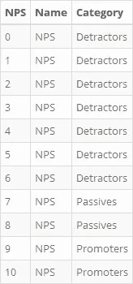

# 绘制 NPS 数据

> 原文：<https://medium.com/analytics-vidhya/plottingnps-2958b642a51f?source=collection_archive---------14----------------------->

## 使用 GGPlot 绘制 NPS 数据的分步演练


# 1.介绍

净推动者得分(NPS)是一个值得信赖的指标，无数企业使用它来决定客户是企业的诋毁者还是推动者。网上有大量的资源来证明这一指标的使用，包括像[qualtrics.com](https://www.qualtrics.com/experience-management/customer/net-promoter-score/)、[wikipedia.org](https://en.wikipedia.org/wiki/Net_Promoter)和[netpromoter.com](https://www.netpromoter.com/know/)这样的网站。

NPS 值的计算非常简单:*NPS = %推广者—%反对者*。

有两个选项可用于显示 NPS 值:

1.  首先是指标的真正本质，这是一个条形图，NPS 分数显示在图上。
2.  其次是显示数据的密度图。

本插图提供了一个有用的指南，使用`[R](https://www.r-project.org/)`编程语言中的`[ggplot2](https://ggplot2.tidyverse.org/)`来可视化这两种方法的 NPS 数据。

# 2.建立

## 2.1.装载包裹

首先，必须建立环境。第一步是加载将要使用的包。

```
library(ggplot2)
library(dplyr)
library(magrittr)
library(tidyr)
```

## 2.2.生成数据

下一步是生成 NPS 数据。为此，`sample()`功能用于在 *6* 和 *10* 之间产生*1000 个*值。为方便起见，第一个 *20* 值打印如下。

注意，该伪数据是通过使用函数生成的。但是，这些数据可以从任何调查软件中收集，并在此时输入到数据管道中。唯一的先决条件是数据是一个单一的数字向量，这些数字都是介于 *0* 和 *10* 之间的整数，包括这两个数字。

```
set.seed(123)
NpsData <- sample(x=6:10, size=1000, replace=TRUE, prob=c(0.06, 0.05, 0.05, 0.42, 0.42))
NpsData %>% head(20) %>% print()> [1] 9 10 9 6 8 9 10 6 10 10 7 10 10 10 9 6 9 9 9 7
```

## 2.3.检查数据

接下来，为了确认数据看起来正确，为生成的数据计算描述性统计数据。为此，`summarise_all()`函数用于计算一些关键的统计数据。

```
NpsData %>%
    data.frame() %>% 
    summarise_all(list(Min=min, Max=max, Mean=mean, `Standard Deviation`=sd, Count=NROW)) %>%
    gather("Statistic", "Value") %>% 
    mutate_at("Value", round, 2)
```


# 3.选项一:使用柱状图可视化

## 3.1.总结 NPS 数据

为了计算 NPS 分数，对数据执行以下步骤:

1.  要挟数据到一个`data.frame`；
2.  添加一个`Category`变量来确定分数的类别；
3.  统计每个类别的得分数；
4.  计算不同类别的百分比；
5.  计算 NPS 分数；和
6.  将它再次强制输入到一个`data.frame`中，以添加一个名为`NPS`的新变量。

一旦生成，数据就可以可视化了。

```
NpsScore <- NpsData %>% 
    data.frame(Score=.) %>% 
    mutate(Category="Promoters"
          ,Category=ifelse(Score<=8, "Passives", Category)
          ,Category=ifelse(Score<=6, "Detractors", Category)
          ,Category=factor(Category, levels=c("Promoters", "Passives", "Detractors"))
          ) %>% 
    count(Category, name="Count") %>% 
    mutate(Percentage=Count/sum(Count)) %>% 
    (function(x){
        Pro <- x %>% filter(Category=="Promoters") %>% select(Percentage) %>% pull()
        Det <- x %>% filter(Category=="Detractors") %>% select(Percentage) %>% pull()
        return((Pro-Det)*10)
    }) %>% 
    data.frame(Score=.) %>% 
    mutate(Name="NPS")
```


## 3.2 生成柱状图数据框

为了正确显示 NPS 分数，生成一个空数据框，每一行代表一个可能的分数。这样做的原因是为了充分显示条形图。生成该数据的方法是使用`seq()`函数创建一个有序的数字序列，从 *0* 到 *10* ，每次递增 *1* 。

```
NpsFrame <- seq(from=0, to=10, by=1) %>% 
    data.frame(NPS=.) %>% 
    mutate(Name="NPS"
          ,Category="Promoters"
          ,Category=ifelse(NPS<9,"Passives",Category)
          ,Category=ifelse(NPS<7,"Detractors",Category)
          ,Category=factor(Category, levels=c("Promoters", "Passives", "Detractors"))
          ,NPS=factor(NPS, levels=0:10)
          )
```



## 3.3 将它们全部连接在一起

接下来，将 NPS 分数和 NPS 帧连接在一起，以便在每一行上复制 NPS 分数。这是通过使用`left_join()` 功能，并使用`Name`作为两帧之间的连接变量来完成的。

```
FinalData <- left_join(x=NpsFrame
                      ,y=NpsScore
                      ,by="Name"
                      )
```


## 3.4 绘制最终输出

最后，使用`ggplot()`函数和以下图层绘制结果:`geom_bar()`、`geom_point()`和`geom_label()`。

遵循以下步骤:

1.使用`Name`变量作为唯一的美学变量，通过管道将`FinalData`数据框输入到`ggplot()`函数中。

2.添加一个`geom_bar()`层，使用`Category`变量来确定使用哪种颜色来填充列，然后使用颜色“深灰色”在类别周围添加一个边框，并给它一个 *0.5* 单位的宽度。

3.使用以下参数添加一个`geom_point()`层:

*   3.1.“T15”是使用匿名函数创建的。这样就可以操作`ggplot()`功能使用的数据，而无需使用另一个外部变量。该操作被有效地用于创建可以在该层中使用的单个 NPS 分数。
*   3.2.`aes`是用于`y`轴的美学；在这种情况下是 NPS 分数。这用于确定该点在图上的位置。
*   3.3.`shape`是一个`plus`符号，用来确定点的准确位置，方便人眼看到。
*   3.4.`size`是符号的大小，在本例中是 *25* 个单位。

4.使用以下参数添加一个`geom_label()`层:

*   4.1.再次操作`data`，以确定与`geom_point()`中使用的值相同的值。
*   4.2.`stat`是用来计算标签位置的统计量；在这个例子中是值`identity`，它有效地告诉`ggplot`使用数据自己的身份，并且不为数据计算任何其他统计。
*   4.3.`aes`用于确定`label`应该是来自`Score`变量的值，并且应该放置在`y`轴上的`Score`位置。实际上，这种美学被用来决定标签的值应该是什么，以及它应该放在图中的什么位置。
*   4.4.`size`'用来确定标签的大小；在这种情况下是 *5* 个单元。

5.使用`scale_y_continuous()`层确定应使用多少个断点，以及`y`轴的极限。

6.使用`scale_fill_manual()`层确定三个不同类别中应使用的颜色。

7.使用`theme()`层的`axis.text.y.left`参数隐藏`y`轴的轴文本。

8.使用`coord_flip()`图层，翻转绘图的坐标，使其从左到右显示为一个条形。

9.使用`labs()`层标记轴，以确保正确的信息显示在正确的位置。

```
FinalData %>% 
    ggplot(aes(Name)) +
    geom_bar(aes(fill=Category), colour="darkgrey", width=0.5, alpha=0.5) +
    geom_point(data=function(x) {x <- x %>% select(Name, Score) %>% mutate(Score=round(Score,2)) %>% distinct()}
              ,stat="identity"
              ,aes(y=Score)
              ,shape="plus"
              ,size=25
              ) +
    geom_label(data=function(x) {x %>% select(Name, Score) %>% mutate(Score=round(Score,2)) %>% distinct}
              ,stat="identity"
              ,aes(y=Score, label=Score)
              ,size=5
              ) +
    scale_y_continuous(breaks=seq(0,10,1), limits=c(0,10), oob=squish) +
    scale_fill_manual(values=c("#66bd63", "#fdae61", "#d73027")) +
    theme(axis.text.y.left=element_blank()) +
    coord_flip() +
    labs(title="NPS Score"
        ,fill="Category"
        ,y="NPS Score"
        ,x="NPS"
        )
```


# 4.选项二:使用密度图可视化

## 4.1.生成密度图数据框

为了可视化密度图，不需要对数据进行总结，但最好保持其原始形式。然而，它需要进行以下操作:

1.  要挟进去一个`data.frame`；和
2.  添加`Category`变量。

```
FinalFrame <- NpsData %>% 
    data.frame(Score=.) %>% 
    mutate(Category="Promoters"
          ,Category=ifelse(Score<=8, "Passives", Category)
          ,Category=ifelse(Score<=6, "Detractors", Category)
          ,Category=factor(Category, levels=c("Promoters", "Passives", "Detractors"))
          )
```


## 4.2 可视化密度图数据

密度数据帧一旦生成，就可以通过`ggplot()`可视化，使用以下美学:`geom_bar()`和`geom_density()`。

使用了以下步骤:

1.  通过管道将`FinalData`数据框输入到`ggplot()`函数中，使用`Score`变量作为唯一的美学。
2.  添加一个`geom_bar()`层，使用类别变量来确定用来填充列的颜色，然后使用颜色“深灰色”在类别周围添加一个边框，并给它一个透明度值 *0.3* 。
3.  添加一个`geom_density()`层，使用一个美观的`y`值来确定这个值应该是数据的“计数”，而不是数据的“密度”，然后给它一个“蓝色”，并将大小增加到 *1* 单位。
4.  使用`scale_fill_manual()`图层，确定三个不同类别应使用的颜色。
5.  使用`scale_x_continuous()`层确定`x`轴的断点和极限。
6.  使用`theme()`层从图中删除图例。
7.  使用`labs()`图层为绘图添加标签。

```
FinalFrame %>% 
    ggplot(aes(Score)) +
    geom_bar(aes(fill=Category), colour="darkgrey", alpha=0.3) +
    geom_density(aes(y=..count..), colour="blue", adjust=3, size=1) +
    scale_fill_manual(values=c("#66bd63", "#fdae61", "#d73027")) +
    scale_x_continuous(breaks=seq(0,10,1), limits=c(-0.5,10.5)) +
    theme(legend.position="none") +
    labs(title="Density Plot of NPS"
        ,x="Score"
        ,y="Count"
        )
```


# 5.结论

正如所看到的，净推动者得分是一个有用的指标，可以看出客户是企业的推动者，被动者或诋毁者的百分比。该指标可以在一个简单的柱状图中显示，图表上显示一个静态值，也可以显示为一个密度图，显示不同类别客户的比例。这两种方法都在本简介中提供，从数据操作到绘图有一步一步的指导。

# 6.附言

**出版物**:本报告也在以下网站发布:

*   RPubs:[RPubs/chrimaho/plotting NPS](http://rpubs.com/chrimaho/PlottingNPS)
*   GitHub:[GitHub/chrimaho/plotting NPS](https://github.com/chrimaho/PlottingNPS)
*   中:[中/chrimaho/PlottingNPS](/@chrimaho/2958b642a51f?source=friends_link&sk=382557ae6dd6227d004eb42a374fbb8f)

**更改日志:**本出版物于以下日期修改:

*   2020 年 1 月 29 日:原始出版日期