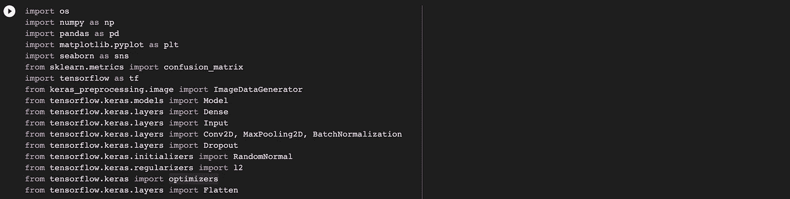
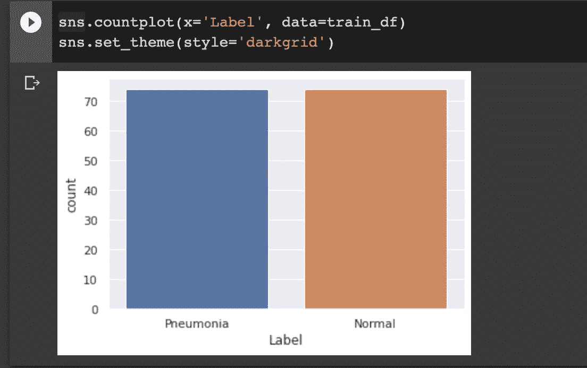
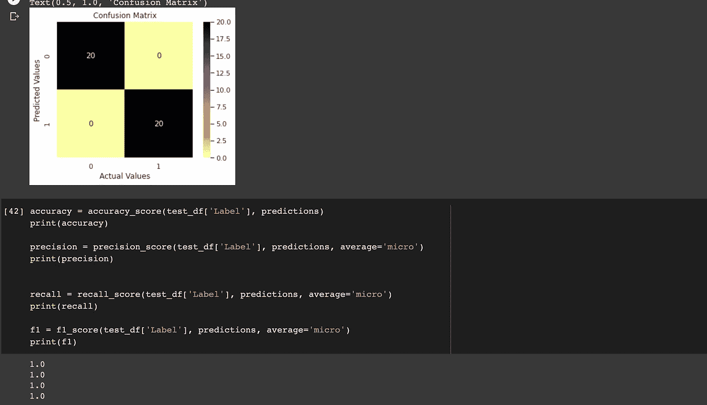

# 使用卷积神经网络进行肺炎预测

> 原文：<https://medium.com/analytics-vidhya/pneumonia-prediction-using-convolutional-neural-networks-e6d91595446?source=collection_archive---------26----------------------->

人工智能(AI)的发展已经允许其应用于从医疗诊断、治疗到预后的医学领域。卷积神经网络(CNN)完全处于深度学习之下，是人工智能的一个分支，可用于医学成像，通过 x 射线成像诊断健康状况，用于肺炎检测，MRI 扫描检测脑瘤，乳房 x 线照相和 MRI 图像上的乳腺癌检测等。这是因为 CNN 有能力检测任何图像的微小特征，并且还可以被优化以确保图像的所有像素。这种图像分割算法还允许在身体重要器官的图像中识别和分割疾病。目前普遍可用的用例包括眼底疾病分割、通过核磁共振成像的[大脑](https://arxiv.org/abs/1712.03747)和胸部 x 光检测[肺炎](https://arxiv.org/pdf/2004.06578.pdf)。

在这篇文章中，我们将利用包含总共 188 张胸部 x 光图像的 [Kaggle 数据集](https://www.kaggle.com/khoongweihao/covid19-xray-dataset-train-test-sets)来预测任何给定患者是否患有肺炎。由于这是一个医疗数据集，我们将尽最大努力设计最佳模型，以确保模型的准确性，因为将患病患者分类为健康患者或健康患者的模型肯定不适合公共使用。

使用由谷歌提供的免费 GPU 服务的[谷歌 Colab IDE](https://colab.research.google.com/) ，我们试图通过实现用于图像分类的著名的 [VGG-16](https://arxiv.org/pdf/1409.1556.pdf) 架构来做到这一点，从零开始，并通过[迁移学习](https://machinelearningmastery.com/transfer-learning-for-deep-learning/#:~:text=Transfer%20learning%20is%20a%20machine,model%20on%20a%20second%20task.)来比较它的使用。

我们导入模型设计、拟合和测试所需的库。

由于准确性对这项任务非常重要，我们将确保所提供的数据集包含数量相当平衡的数据，既包括正常的胸部 x 射线，也包括显示存在肺炎的数据。我们这样做的原因是，我们可以设计一个非常好的模型，它可以在数据集上以高精度完美地训练，但在例如 98%的正常胸部 x 射线和 2%的患病胸部 x 射线的情况下，模型在达到拟合测试集的高精度后，*将变得如此习惯于*只有正常的胸部 x 射线，以至于难以识别患病的胸部 x 射线。我们将继续深入研究这个问题。

这表明我们在训练数据集中有相同数量的正常和含肺炎的 x 射线图像，每组 70 个图像。所以我们可以走了！

当用数据训练模型时，为了不花费太多时间，我们可以像这里一样实现回调功能，其目的是告诉模型在达到特定的精度阈值(或损失)后何时停止，这节省了时间，因为在这一点之后没有进一步训练的必要，并且我们也不想冒[过度拟合](https://www.coursera.org/lecture/convolutional-neural-networks-tensorflow/a-conversation-with-andrew-ng-ytkyQ)数据集的风险。在这种情况下，我使用了 90%的模型精度。

拟合在第 7 个历元停止，因为在该点，精度已经超过 90%阈值。

如前所述，我们需要确保数据集相对于图像的类别标签是平衡的，并且我们还需要确保尽管模型是准确的，但它仍然可以准确地区分正常的胸部 x 射线和患病的胸部 x 射线。这让我们想到了[召回、精确度和 f1 分数](https://machinelearningmastery.com/precision-recall-and-f-measure-for-imbalanced-classification/)的概念。

本质上，回忆让我们知道这个模型有多好；当在新数据上尝试时；在从*真正的*阳性案例中准确地分类出阳性案例时执行，同时精度让我们了解模型有多好；当在新数据上尝试时；在预测阳性病例*中准确预测实际阳性病例*。通过这样做，我们可以在一定程度上确定，当面对任何新数据时，设计的模型实际上可以在很大程度上提供正确的诊断。

该模型似乎在召回率、精确度和 f1 分数上得分很高，因此这意味着它可以提供更多新数据，并且被认为是准确的。

该模型在所有指标中得到了 1.0 分，这意味着我们可以放心地在新的、看不见的数据上尝试该模型，如病人带着 x 光图像走进医院。

附注:如前所述，我们试图从头开始实现 VGG16 架构，并使用迁移学习，这是因为我们想看看哪个更快，计算成本更低。使用迁移学习被证明是更快的方式，因为它运行不到 5 分钟来训练，并在 7 个时期后达到 90%的准确性，而不是从头开始，运行超过 30 分钟，并在 16 个时期后达到 90%的准确性。转移学习通常是有回报的，*如果你能用的话*。

此外，您将从 [Github 库](https://github.com/dexter7662/Pneumonia-identification-using-VGG19)中观察到，在这种情况下使用的优化器不是最初的 VGG-16 架构中使用的小批量梯度下降。变化的原因是，在这种情况下，我们正在处理一个非常小的由< 200 幅图像组成的数据集，将它们分成批次进行训练似乎没有意义，而且，达到全局最小值似乎需要太长时间。在这种情况下使用 Adam 优化器，学习率略有降低，因为这在许多情况下被证明更快更准确。

今天标志着 2020 年的结束🎉也是我作为软件开发人员的第一篇媒体文章。提前拜年。