# 播客推荐引擎

> 原文：<https://medium.com/analytics-vidhya/podcast-recommendation-engine-12232b653ecb?source=collection_archive---------23----------------------->

我们都知道一些流行的应用程序中指定的播客，如 Spotify、apple podcast、google podcast 等。在直接进入主题之前，我先说一下什么是播客，推荐引擎。

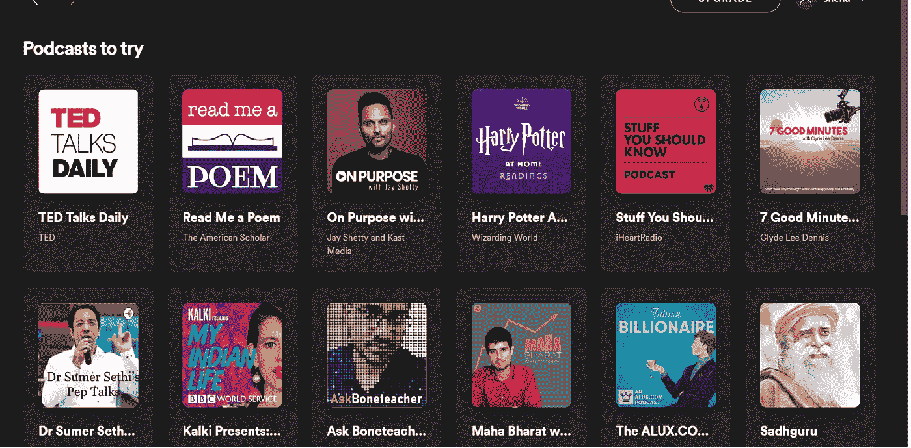

这是 Spotify 上的一些播客

# ***什么是播客:***

播客是一段关于新闻、喜剧、商业等的信息，它是一系列口头数字音频文件，用户可以下载到个人设备上以便于收听。流媒体应用和播客服务提供了一种方便、集成的方式来管理跨许多播客源和播放设备的个人消费队列。

# ***什么是推荐引擎？:***

我们都知道，推荐意味着根据我们获得的信息推荐他人，而这些信息可能对他人有用。推荐引擎是基于数据分析向用户推荐产品、服务和信息的系统。尽管如此，推荐可以源自各种因素，诸如用户的历史和类似用户的行为。

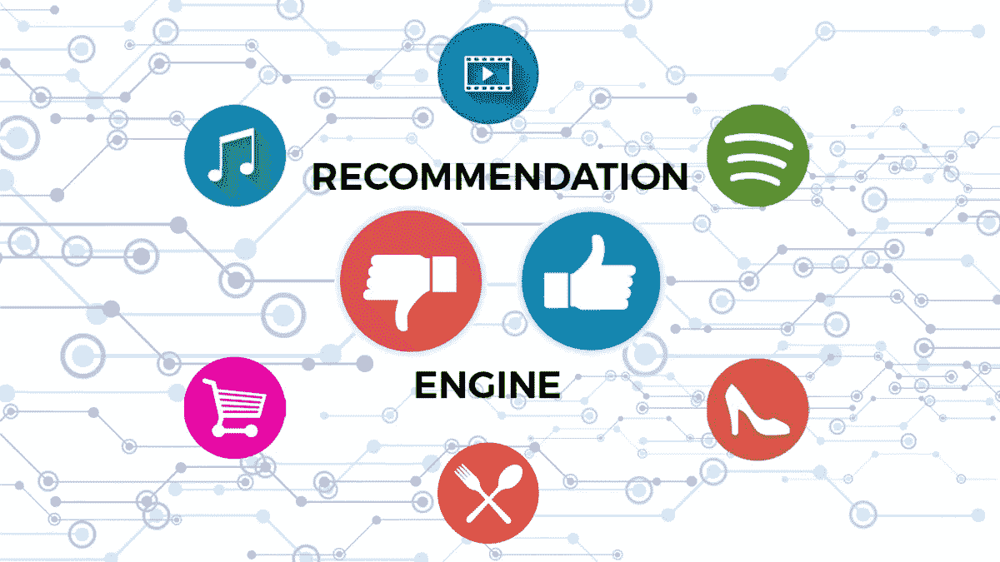

推荐引擎基本上是数据过滤工具，它利用算法和数据向特定用户推荐最相关的项目。

推荐系统正迅速成为用户通过体验、行为、偏好和兴趣接触整个数字世界的主要方式。在一个信息密集和产品超载的世界里，推荐引擎为公司提供了一种向消费者提供个性化信息和解决方案的有效方式。

网飞、YouTube、亚马逊、Spotify 都是推荐系统的例子。

## ***一点词汇:***

评级:这是一种偏好的表达。评级有两种形式:

*   **显式评级:-** 有一种显式评级，它是用户表达的东西(直接来自用户)，即明确表达用户有多喜欢特定的东西并对其进行评级。网飞就是一个例子。
*   **隐性评分:-** 当一个人开始在一个应用程序中列出一个播客，并在它完成之前结束它，并且不再回来。可以合理地理解，这个人不喜欢听到的东西。基于人类行为，我们可以推断出他们有多喜欢应用程序中的某个播客。Spotify 就是一个例子。

**预测:**预测是对我们认为他们会喜欢这些物品的偏好程度的估计。通常是他们过去没见过的物品。根据之前的偏好推荐其他商品。

# ***推荐系统类型:***

有 4 种主要类型的推荐系统，即

*   ***知识型推荐***
*   **基于内容的过滤**
*   **协同过滤**
*   **混合动力推荐**

## **基于知识的推荐-**

当推荐系统不是基于用户的评级历史，而是基于用户做出的特定查询来进行推荐时，它是基于知识的。它可能会提示用户给出一系列关于结果应该是什么样子的规则或指南。

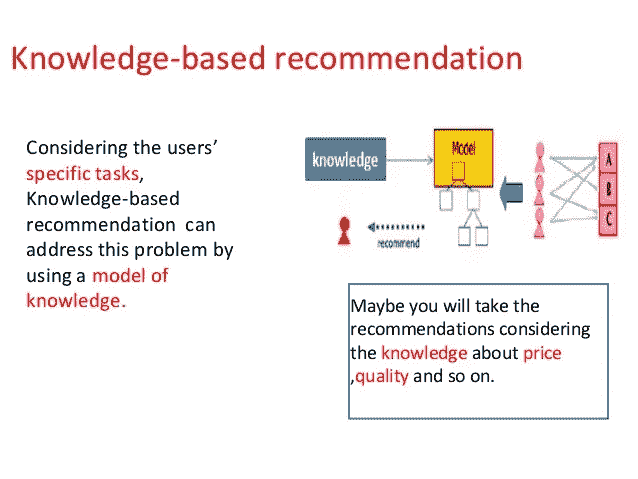

## **基于内容的过滤-**

基于内容的过滤基于单个用户的交互和偏好选择。对从用户历史和交互中收集的元数据进行推荐。内容是播客中或关于播客的属性或文本。对于一篇新闻文章来说，它是标题和概要。

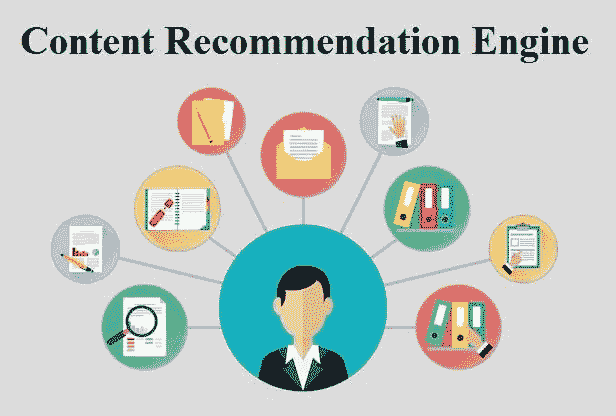

让我们考虑一个 Spotify 的例子。它们以向量形式保存与每个用户相关的所有信息。该向量包含用户的过去行为，即他最常听的播客类型，如 TED Talks Daily、Modern Love、Sadhguru…并跟随它们。这个向量被称为轮廓向量。与播客相关的所有信息都存储在 item vector 中。项目向量包含简档向量的细节，假设 TED 每天演讲，那么项目向量是谁是演讲者。

**余弦相似度**:基于内容的过滤算法求轮廓向量和项目向量之间夹角的余弦，即余弦相似度。假设 A 是简档向量，B 是项目向量，那么它们之间的相似度可以计算为:

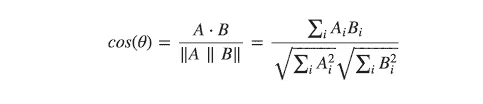

**欧几里德距离**:如果在 n 维空间中绘图，相似的项目将彼此非常接近。因此，我们可以计算商品之间的距离，并基于该距离向用户推荐商品。欧几里德距离的公式由下式给出:

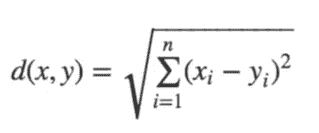

皮尔逊相关性:它告诉我们两个项目的相关程度。相关性越高，相似性就越大。

## ***协同过滤-***

用户与喜欢这个播客的人互动的方式，喜欢这个播客的人可能会喜欢另一个播客。这类问题是协作性的问题，因为它们关注的是用户群体一起做什么或不做什么，以及他们在这种环境下出现的行为模式。

播客推荐引擎是使用隐式数据的协作过滤的一个例子。

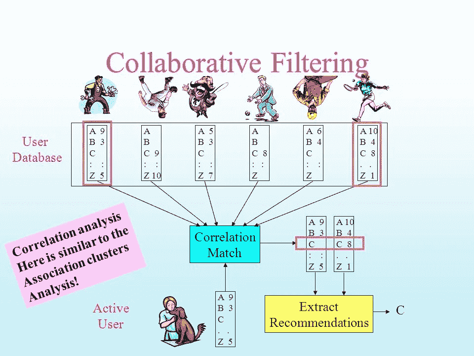

## 用户-用户协同过滤:-

在这里，我们试图寻找长相相似的顾客，并根据他/她的长相相似者的选择提供产品。这种算法非常有效，但需要大量的时间和资源。这种类型的过滤需要计算每个客户对信息，这需要时间。因此，对于大型基础平台，这种算法很难实施。

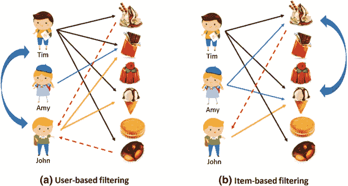

## 项目-项目协同过滤:

它与前面的算法非常相似，但是我们不是寻找看起来相似的顾客，而是尝试寻找看起来相似的商品。一旦我们有了商品相似度矩阵，我们就可以很容易地向听过商店中任何商品的顾客推荐相似的商品。这种算法比用户-用户协同过滤需要更少的资源。因此，对于一个新客户，该算法比用户-用户协作花费的时间少得多，因为我们不需要客户之间的所有相似性得分。Spotify 在其推荐引擎中使用这种方法来显示他们可能感兴趣的相关播客。

## ***混合推荐系统:***

协同推荐和基于内容的推荐相结合会更有效。混合方法可以通过分别进行基于内容和基于协作的预测，然后将它们结合起来来实现。此外，将基于内容的能力添加到基于协作的方法中，反之亦然；或者将这些方法统一到一个模型中。

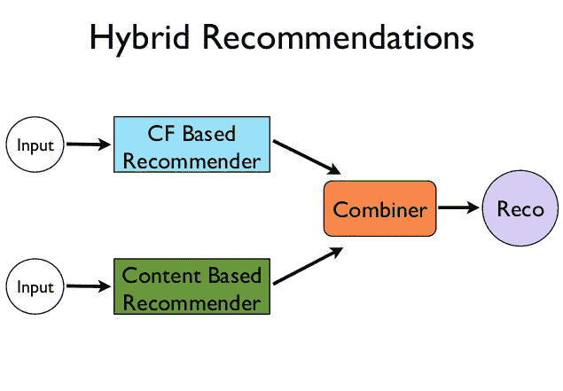

***制作推荐:***

计算建议基本上包括两个阶段。在第一阶段，我们基于“隐式反馈”数据建立用户兴趣模型，其中我们仅观察用户与项目交互(即关注)的指标。我们将此隐式反馈数据表示为二进制矩阵。例如，他们过去的播客或他们最喜欢的列表(那些不熟悉矩阵和线性代数的人可以看这篇综述)。这些模型提供了用户和项目的向量表示，它们的内积给出了用户对项目的感兴趣程度的估计(较高的值表示估计的兴趣程度较高)。在第二阶段，我们通过为每个用户找到一组近似最大化兴趣估计的项目来计算推荐。

用户和项目的模型也可以以其他方式使用，例如寻找具有相似兴趣的用户、从“品味”角度来看相似的项目、互补并可被收听的项目等。在用户喜欢该项目(即跟随它)的情况下，元素是 1，如果用户不喜欢，元素是 0。零不一定表示用户对该项目不感兴趣，而只是表示他们到目前为止还没有表示出兴趣。这可能是由于不感兴趣或漠不关心，或者由于用户在浏览时还没有看到该项目。在产生推荐时，要使用户和项目的模型适合数据。

***矩阵分解:***

矩阵分解模型使得用户和项目之间的密切关系由低维线性模型来解释。这意味着每个项目和用户实际上对应于某个小维度的未观察到的真实向量。空间的坐标对应于项目的潜在特征(这些可以是诸如项目是否是 TED 每日谈话，是否是迪恩·弗内斯等等。)，用户向量的元素描述了用户的偏好。我们可以将这些向量堆叠成矩阵，一个用于用户，一个用于项目，然后理论上通过取这两个未知矩阵的乘积并添加噪声来生成观察到的数据:

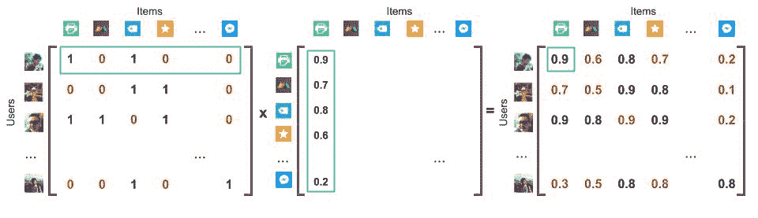

因此，我们为每个用户和每个项目找到一个向量表示。我们计算这些向量，使得用户向量和项目向量之间的内积将接近隐式反馈矩阵中的观察值(即，在用户关注该项目的情况下，它将接近 1，如果用户不关注该项目，则接近 0)

***交替最小二乘法:***

大小为 u x i 的原始矩阵 R，包含我们的用户、项目和某些类型的反馈数据。具有大小为 u x f 的用户和大小为 f x i 的隐藏特征的矩阵。在 U 和 V 中，我们对每个用户/项目与每个特征的关系进行加权。我们计算 U 和 V，使它们的乘积尽可能接近 R:R≈U x V。

通过随机分配 U 和 V 中的值并迭代使用最小二乘法，我们可以得出 r 的最佳近似值。最小二乘法的基本形式是用某条线来拟合数据，测量所有点到该线的平方距离之和，并尝试通过最小化该值来获得最佳拟合。

对于交替最小二乘法，我们使用相同的思想，但是在优化 U 和固定 V 之间反复交替，反之亦然。我们对每次迭代都这样做，以便更接近 R = U x V。

我们假设缺失值为低置信度的负偏好，现有值为高置信度的正偏好。我们可以使用播放次数、在页面上花费的时间或其他形式的交互作为计算我们自信的基础。

Pui 优选其反馈数据 r 的二进制表示。

Cui 是使用 r 的大小计算的置信度。我们的置信度增加的速率通过线性比例因子α设置。我们也加 1，所以即使α x r 等于零，我们也有最小的置信度。

为了在特征维度中找到每个用户(xu)和项目(yi)的向量，这意味着我们想要最小化以下损失函数:

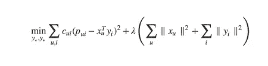

使用点积来计算相似性

要计算每个用户项目的推荐分数:

# ***推荐系统面临的常见挑战有哪些？***

1.  **数据的稀疏性:**用一行又一行包含空白或零值的值填充的数据集。因此，找到使用数据集密集部分和有信息部分的方法至关重要。

2.**可扩展性:**产品和客户的多样性已经让传统方法不堪重负。随着数据集变宽，这将成为一个挑战，并可能导致性能下降。

# ***一个产品推荐引擎的好处:***

使用推荐引擎有两个主要好处，即收入和客户满意度。

**收入:** -收入取决于客户满意度，因为当喜欢一个项目的客户查看更多与该播客相关的项目时，收入可能会增加。

**客户满意度:-** 很多时候，客户倾向于查看他们上次浏览的播客推荐。主要是因为他们认为他们会找到更好的机会观看播客。当他们离开应用程序并稍后回来时；如果他们以前的浏览数据是可用的，那将会很有帮助。这种类型的客户满意度导致客户保持。

**发现**:——例如，iTunes 的“天才推荐”功能，Amazon.com 的“经常一起购买”会做出令人惊讶的推荐，这些推荐与我们已经喜欢的相似。人们通常喜欢被推荐他们喜欢的东西，当他们使用一个与他/她的选择非常相关的网站时，他/她必然会再次访问该网站。

**提供报告:-** 提供关于客户对什么类型的播客感兴趣以及他们检查了多少类似类型的播客的信息，最少考虑的项目。

## 目前 Spotify、苹果播客最受欢迎。

建议不胜感激。随意鼓掌。这是鼓励写博客的一种方式。

**参考文献:**

[https://medium . com/radon-dev/als-implicit-collaborative-filtering-5ed 653 ba 39 Fe](/radon-dev/als-implicit-collaborative-filtering-5ed653ba39fe)

[https://www . analyticsvidhya . com/blog/2018/06/comprehensive-guide-recommendation-engine-python/](https://www.analyticsvidhya.com/blog/2018/06/comprehensive-guide-recommendation-engine-python/)