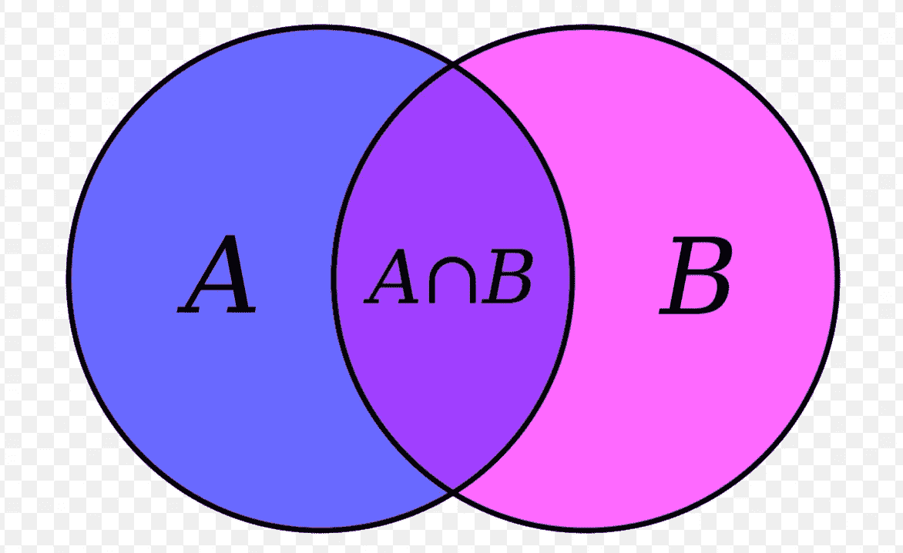

# 诗歌和编程

> 原文：<https://medium.com/analytics-vidhya/poetry-and-programming-5205844a02fb?source=collection_archive---------9----------------------->

我是一名程序员。我是个诗人。我在 Thoughtworks Technologies 公司工作，是一名开发人员，人们经常问我，我的职业是程序员，还是激情的诗人。我不敢苟同。我同样喜欢这两种写作形式(代码和诗歌)。他们已经成为我生命中的两部分。因为它们占据了我一天中的大部分时间，所以必然会发生相互交织的情况，最终我在这两者中找到了很多相似之处。这是一个类似的例子——树的遍历和思维顺序。

**快速声明:**如果 A = {所有程序员} —蓝房子和 B = {所有诗人}—粉红房子，我的目标是 A ∪ B ie。每个人都是蓝色、粉色和紫色的。如果你恰好落在 A ∩ B，即。紫色区域，当您发现一些概念重复或过于冗长时，请耐心等待。

**树:**

回到你的初级课程，一棵树是什么样子的？一棵树由哪些部分组成？

图片来自互联网

在计算机科学中，关于树也有类似的概念。你有一个根，然后分支从他们那里旋转出来。树枝和小树枝之间的关节是一个节。根也是一个节点。叶子形成最后一个节点。树枝和细枝叫做边。这是一棵树在计算机科学中的样子。

图片来自互联网

节点在这里非常重要，它们是承载信息的。在图中，你看到的所有圆圈都是节点。

**什么是树遍历？**

正如我提到的，节点包含信息。为了处理这些信息，您可能需要遍历/读取所有节点。遍历节点称为遍历。现在，您可以遍历它们，或者说以多种方式遍历它们。这会导致不同的输出。

广义地说，树遍历分为广度优先遍历和深度优先遍历。

在广度优先遍历中，你会先找到兄弟节点。在深度优先遍历中，您会先找到孩子(以及他们的孩子)。哪个子节点和父节点的顺序再次导致进一步的分类-前顺序、按顺序和后顺序。

不同树的所有后续遍历将导致 1，2，3，4，5 作为处理后的信息返回。为了简洁起见，我们将只讨论 BFS 和有序 DFS。

图片来自互联网

**思想:**

闪烁，闪烁，小星星，我多么想知道你是什么！
高高在上，像天空中的一颗钻石。

诗歌有很多元素。“思想”是第一要素，也是你这首诗的关键。围绕着基本思想你会再次产生过多的思想。你如何排列这些想法是非常重要的。这也导致了这首诗的抑扬顿挫或节奏。节奏经常与押韵混淆，但并不相同。押韵虽然有助于节奏，但并不总是必要的。许多自由诗也有节奏或节拍。

我们上面读(或唱)的童谣有一个基本思想——星星。这也是这首诗的标题。

闭上眼睛一分钟，想想所有你能联想到的明星。我们在上面一节中看到的一个例子是“钻石”。

当我闭上眼睛的时候，我能想到——夜晚、阳光、黑白生活、对失落者的希望等等。你说了什么？请在评论中告诉我。

这首五节诗的下两节看起来像这样—

*烈日当空，
什么也照不到，
你就亮出你的小灯，
一闪一闪，整夜。*

*然后是黑暗中的旅行者，
感谢你的小火花，
他看不清路，
如果你不这样闪烁。*

不管我在上面记下了什么，你可以看到所有的东西都构成了这首诗的下一行。没有被收录的是黑白生活。现在，那会发生，因为我们的诗谈论的是积极的，黑色和白色会把它转移到一些更中性的东西上。并且会打破我所说的序列。(简·泰勒的列表中也可能没有这个词)。

**树遍历 vs 思维顺序:**

在这种情况下，我观察到的相似之处是过多的思想如何形成一棵树的节点，遍历可以导致结构完全不同的不同诗歌。用边连接的节点有助于形成一个序列。

让我们举个例子:

在喝水的时候，我想到选择**水**作为我的基本思想，也就是我的根节点。现在我还能围绕它想些什么呢？我认为水是无臭无色的，所以我说**纯净**。这形成了另一个节点。水也让我想起了**河。它变换成任何形状的能力让我认为它也是可调节的 T21，我觉得它可以比作女人。**

如果我们有更多的想法，我们可以进一步扩展这些节点。这是我所拥有的:

现在，让我们看看如何遍历这棵树。我通常只遍历单向边。

这将给予爱——纯洁——水，因此会导致说类似“你的爱像水一样纯洁”的话。我在网上找到一个——
“爱情如水。我们可以掉进去。我们会淹死在里面。但是我们不能没有它。——[purelovequotes.com](https://www.purelovequotes.com/)

其他边缘可以把你带到其他地方，比如我们看到的环境——污染——河流——水，可以引出一首关于环境和污染问题的诗。我用印地语写作，早在 2009 年，我就写过几首比较女人和水的诗。

上面的例子只是提到了几个词作为思想和节点，这可能并不总是如此。你可以把一个完整的想法放在一个节点里。

当心！形成的一些边可以是有效的句子，但是当与到目前为止你拥有的其他边相关时，可能是一个死胡同，你仍然需要能够丢弃那些边。

你也可以在第 0 层使用节点(为了广度),并围绕它写一些东西。我写的一首关于交通信号的诗就属于这一类。它讲述了一个交通信号，一个 It 员工，一个乞讨的孩子，一个讨钱的太监，以及你在交通信号上看到的彼此无关的一切，以及我们如何在结尾说“我不在乎”。

可以看这里—[http://anshupitlia.blogspot.com/2016/11/blog-post.html](http://anshupitlia.blogspot.com/2016/11/blog-post.html)

最后，我只想说，这不是一个写诗的机制，而是组织思想的机制，可以在写作任何其他东西时使用，如文章，散文或可以帮助你的日常对话。作为一个诗人和一个富有想象力的人，我倾向于偏离我最初的想法，并保持多个分散的想法，一棵树(或图形或链表)一样的结构给我的工作带来了连贯性和一致性。看到编程和诗歌交织在一起很有趣。