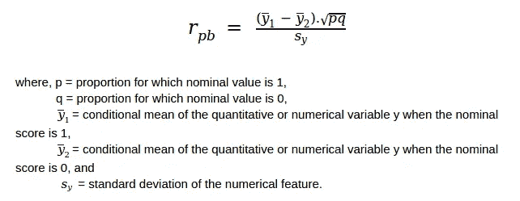

# 点双列相关系数

> 原文：<https://medium.com/analytics-vidhya/point-biserial-correlation-coefficient-b572fcad80aa?source=collection_archive---------10----------------------->

## [来自统计学家(正在制作)](/tag/from-a-statistician)

## 名词的相关性

皮尔逊相关系数传达了两个比率(也称为数值)特征之间的线性关系的强度。但是，如果一个人想找到一个相似的衡量一个名义或分类和一个数字特征？

让我们考虑一个研究者想要调查性别(即男性或女性)与大学考试中获得的数学分数之间的关系程度。那么使用的公式是:

点双列相关系数公式

点双列相关系数位于[-1，1]范围内，其解释非常类似于皮尔逊的乘积矩相关系数，即点双列相关系数的值越大，两个变量(一个定性变量和一个定量变量)之间的关系越强，反之亦然。

现在，点双列相关系数变成了皮尔逊相关的一个特例，并且和它是等价的。*(万一你对证明感兴趣，看这个* [*线程*](https://stats.stackexchange.com/questions/105542/proof-of-point-biserial-correlation-being-a-special-case-of-pearson-correlation) *)。那么，当皮尔逊相关系数完成这项工作时，为什么还要使用另一种方法呢？*

> 你有没有试过用勺子吃面条，一个适合用叉子的工作？

勺子假定你会用它喝汤、吃蛋羹、冰淇淋或类似的东西。虽然它可以拿起面条，但它真的是完成任务的合适工具吗？同样，Pearson 相关系数假设每个数据集是正态分布的，这对于分类变量是无效的。你得到一个相似值的唯一原因是，名义类别被表示为数字，而数字，一般来说，应该是定量的。因此，本质上，这两个变量被皮尔逊相关系数视为定量，尽管其中一个是定性的。

因此，如果您有兴趣研究一个名义特征和一个数字特征之间的关系，点双列相关系数是您应该选择的。该测量的实现在 Scipy 库中以函数 [pointbiserialr(x，y)](https://docs.scipy.org/doc/scipy/reference/generated/scipy.stats.pointbiserialr.html) 的形式出现，并可用于计算。

这篇文章是统计学家系列文章的一部分，在这篇文章中，我谈论了统计世界中不同的微小而重要的细节，这些细节肯定会帮助一个人成为更好的数据科学家。