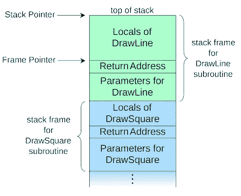
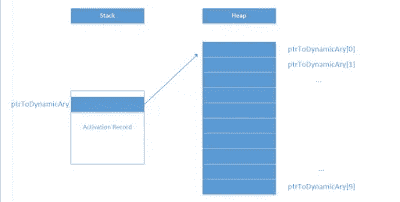

# C++中的指针和动态内存

> 原文：<https://medium.com/analytics-vidhya/pointers-and-dynamic-memory-in-c-50cf0a0ce70b?source=collection_archive---------15----------------------->

# 指针和动态内存

当你不知道编译时的内存需求时，动态内存是很有用的。

## 堆栈和堆

内存分为*堆栈*和*堆*或*空闲存储*。堆栈内存是自动管理的，而堆内存不是。*激活记录*是堆栈上用于实现功能的内存块。比如当`main`调用`foo`时，`foo`的激活记录在栈顶。一旦`foo`返回，`foo`的激活记录被标记为解除分配，另一个函数调用可以使用那个空间。从`main`传递到`foo`的任何参数都被复制到`foo`的激活记录中。下面是维基百科中激活记录的图示:



在堆上分配的内存独立于函数调用而存在。必须确保释放堆上分配的内存。一些语言如 C#和 Python 有垃圾收集(GC)功能，但 C++没有。然而，“智能指针”有助于自动释放内存。要在堆上显式分配内存:

```
int* pointerToInt;
```

`pointerToInt`当前是一个未初始化的指针。使用未初始化的指针可能会导致程序崩溃。应该总是初始化指针。它们可以设置为空(使用`nullptr`)，并对照空进行检查。`nullptr`用于布尔表达式时转换为 false。示例:

```
if(!pointerToInt)
{
    //execute code that handles null pointer case
}
```

new 运算符用于分配内存。

```
pointerToInt = new int;
```

要访问新分配的值，必须*解引用*指针，或者跟随指针的地址到内存。例如，可以按如下方式设置上面指针的值:

```
*pointerToInt = 42;
```

要释放内存，必须使用`delete`操作符，最佳做法是将指针设置为`nullptr`:

```
delete pointerToInt;
pointerToInt = nullptr;
```

也可以声明和初始化指向堆栈上变量的指针。要获得指向变量的指针，使用操作符的`&`或*地址:*

```
double k = 42.0
double* kPtr = &k;
```

通常，要通过指针访问结构的字段，必须执行以下操作:

```
Person * person = getPerson();
double address = (*person).address;
```

`(*ptr).`符号有一个简写，就是箭头符号。相同的代码可以编写如下:

```
Person *person = getPerson();
double address = person->address;
```

为了避免使用无效指针，可以利用短路逻辑:

```
bool hasValidAddress = (person && person->address != "")
```

## 动态分配的数组

要在堆上分配数组，请使用`new[]`操作符，如下所示:

```
int arySize = 10;
int* ptrToDynamicAry = new int[arySize];
```

下图显示了执行前面的代码后，程序员的心理记忆模型:



当使用完数组时，必须从堆中释放数组。删除操作符的“数组”版本应该用于此:

```
delete[] ptrToDynamicAry
ptrToDynamicAry = nullptr;
```

## 智能指针

为了避免内存泄漏，可以使用智能指针。下面两个指针`std::unique_ptr`和`std::shared_ptr`是最常用的，在`<memory>`头文件中有定义。`unique_ptr`类似于原始指针，但在超出范围或被删除后会自动释放内存。`unique_ptr`是它所指向的对象的唯一所有者。即使抛出异常，唯一指针指向的内存也会被释放。`unique_ptr`的语法如下:

```
auto person = std::make_unique<Person>();
```

在 C++14 之前，人们必须做以下事情:

```
std::unique_ptr<Person> person(new Person);
```

`unique_ptr`可以像普通指针一样使用，因为它重载了箭头操作符(`->`)和索引操作符(`[]`)。

使用`unique_ptr`时，动态数组的前一个示例转换为以下内容:

```
auto myAry = std::make_unique<int>(10);
cout << "Integer at position 5 is " << myAry[4] << endl;
```

# 参考资料:

m .格雷瓜尔(2018)。*专业 C++* 。印第安纳州，约翰·威利的儿子们。

[](https://codingadventures1.blogspot.com/2020/01/c-tour-part-ii.html) [## C++教程第二部分

### 当你不知道编译时的内存需求时，动态内存是很有用的。内存分为堆栈…

codingadventures1.blogspot.com](https://codingadventures1.blogspot.com/2020/01/c-tour-part-ii.html)