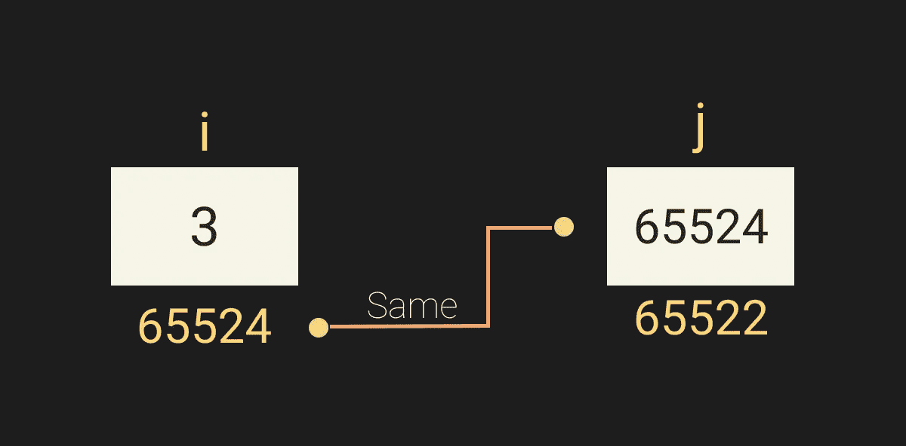
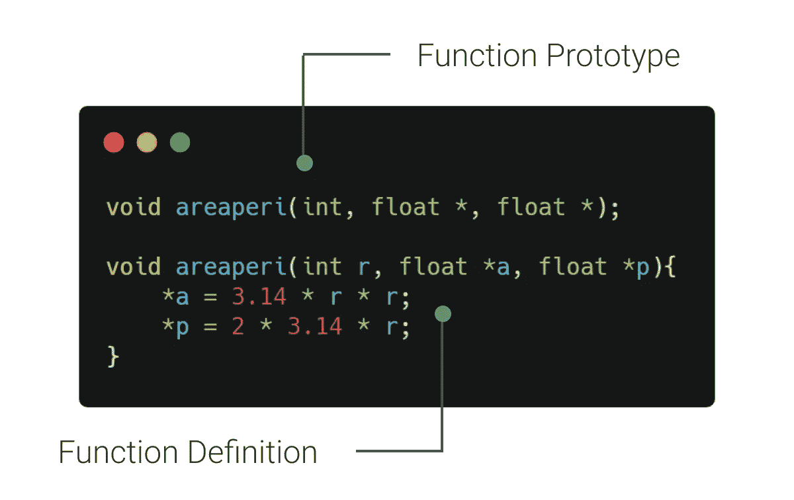
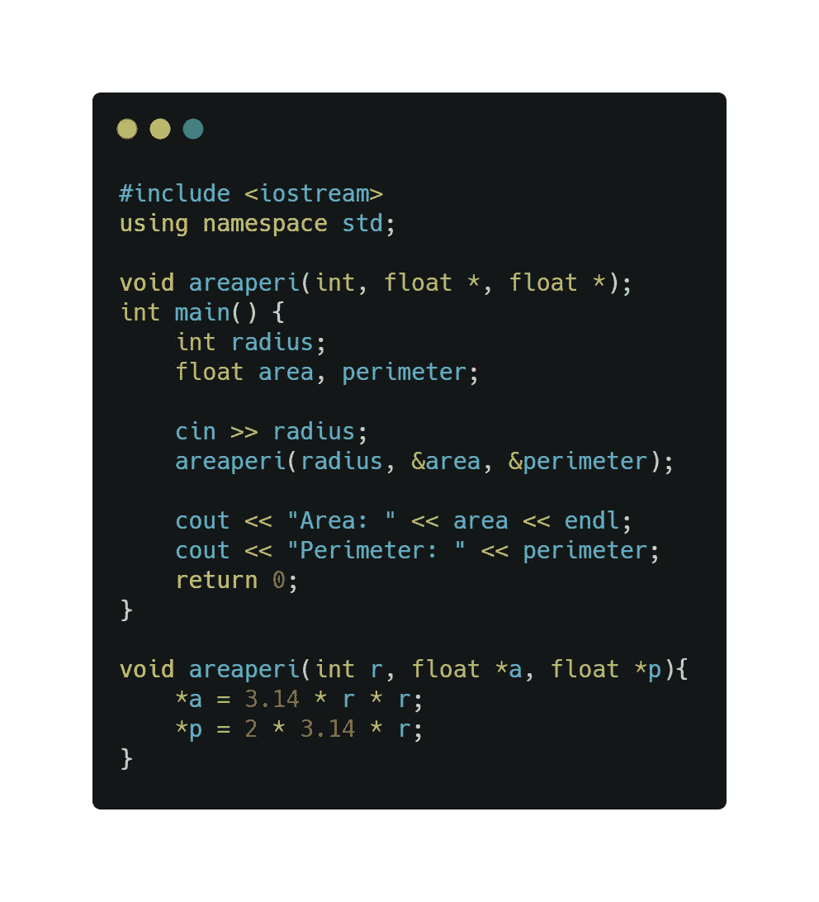
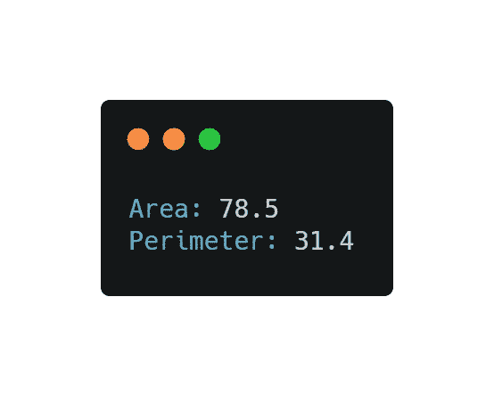
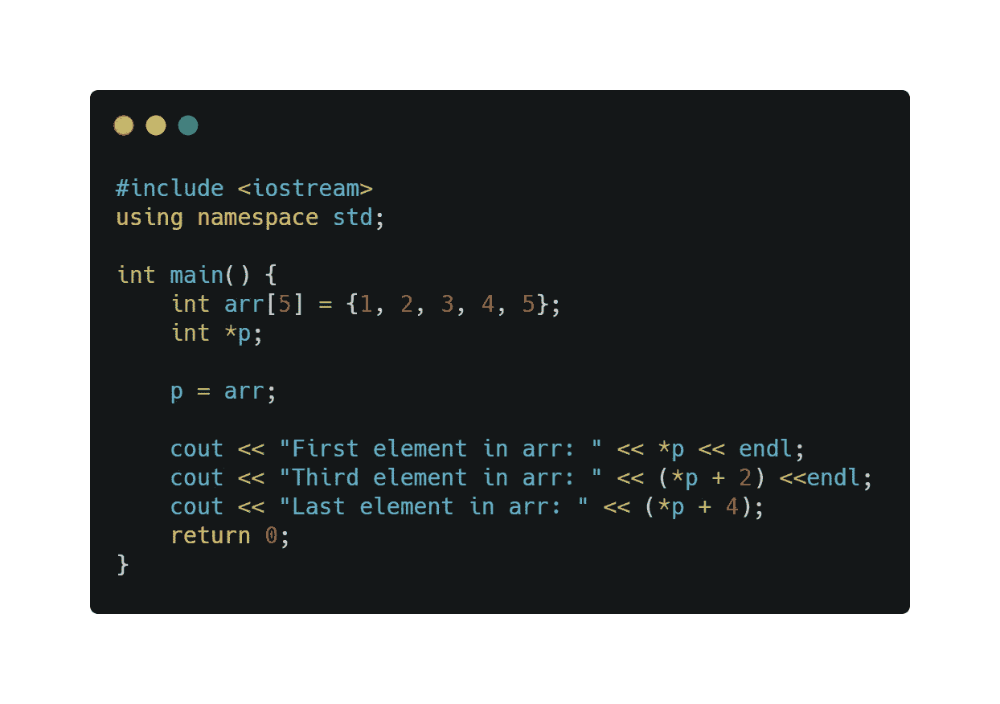
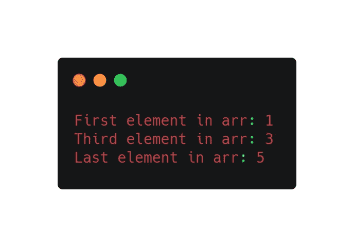

# C/C++中的指针

> 原文：<https://medium.com/analytics-vidhya/pointers-in-c-c-bb2f15e3ff7?source=collection_archive---------26----------------------->

## 消除只返回一个值的限制

**指针**与一个变量相同，但存储另一个变量的地址。指针的数据类型将与变量的数据类型相同。对函数的**引用调用**方法参数将参数的地址复制到形参中。变量存储值，指针存储变量的地址。在下面给出的例子中，您可以直观地看到不同之处。编译器必须为变量做以下三件事:

*   在内存中保留空间来保存整数值
*   将名称 **i** 与该内存位置相关联。
*   将值 **3** 存储在该位置。

函数是一个独立的语句块，执行某种连贯的任务。函数原型是函数的声明，它指定了函数的名称和类型签名(arity、参数的数据类型和返回类型)，但丢弃了函数体。

指针也可以用来间接返回值。下面的代码演示了如何使用指针间接返回多个变量。将两个变量的地址发送给函数，然后对这些变量进行数据操作，这样就无需返回任何变量就可以更新数据。

指针可以用来指向一个数组。数组是由具有相似数据类型的同质元素组成的数据结构。存储数组，使得每个元素的位置可以通过数学公式从其索引元组中计算出来。数组第一个元素的内存地址称为第一个地址、基础地址或基址。

上面的代码提示了什么时候 ***p** 显示数组的第一个元素， ***p+2** 显示第三个元素，依此类推。因此，您可以使用指针来访问数组中的元素。

感谢您的阅读。