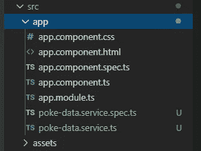
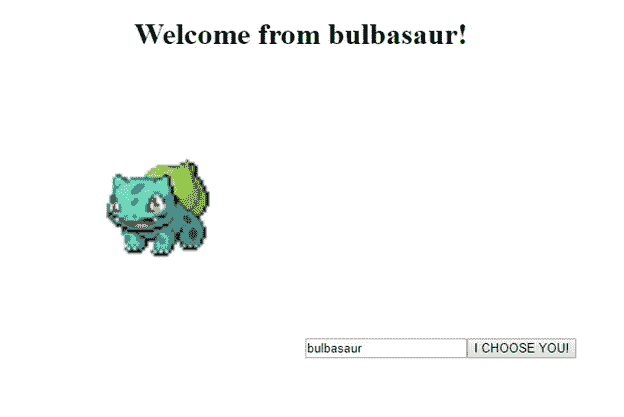

# Poke-API — HttpClient 获取教程

> 原文：<https://medium.com/analytics-vidhya/poke-api-get-tutorial-4e1f9838c669?source=collection_archive---------9----------------------->

我还没见过一个开发者对口袋妖怪没有一点欣赏——如果不是像我这样的童年痴迷的话。所以，我决定用 Poke-API 来说明最重要的基础 Web 开发(和数据挖掘/可视化/分析)技能之一——API，这会很有趣。

你可能会问什么是 API？API 代表应用程序编程接口，根据谷歌的说法，它被定义为*一组允许创建访问操作系统、应用程序或其他服务的功能或数据的应用程序的功能和过程。*用更基本的术语来说，API 是允许一个应用程序与另一个应用程序对话的指令集。

虽然 API 可以有许多不同类型的调用，但最常见的两种是 GET(从远程实体读取)和 POST(写回远程实体)。然而，用于进行这些调用的语法会因语言和平台的不同而有很大差异。本教程将向您展示如何创建一个基本的 Angular 应用程序来调用 Poke-API 服务器。我们上车吧！

**打造新棱角项目**

```
ng new poke-tutorial
cd poke-tutorial
```

**创建一个从 Poke-API 获取数据的服务**

```
ng g service pokeData
```

在您的文件目录中，您会看到两个新文件



在 **poke-data.service.ts** 中，导入 Angular 的 HttpClient

```
import {HttpClient} from '@angular/common/http';
```

并将 HttpClient 作为参数包含在构造函数中

```
constructor(private http:HttpClient) { }
```

现在，在这个服务文件中创建一个 GET 函数。它接受一个 URL 字符串并进行调用。

```
getData(url:string){ return this.http.get(url)}
```

**将 HttpClientModule 添加到 app.module.ts 中**

```
import {HttpClientModule} from '@angular/common/http';...imports: [ BrowserModule, HttpClientModule],
```

**编辑我们的 app.component.ts 以使用服务**

首先，导入 OnInit 和我们的服务，并将服务添加为提供者

```
import { PokeDataService} from './poke-data.service'import { Component, OnInit } from '@angular/core';@Component({ selector: 'app-root', templateUrl: './app.component.html', styleUrls: ['./app.component.css'], providers: [PokeDataService]})
```

用构造函数实现 OnInit 并接受服务

```
export class AppComponent implements OnInit{constructor(private srv: PokeDataService){}ngOnInit(){}
}
```

写 getPoke 函数。调用服务，将字段 this.poke 设置为 HTTP 请求返回的对象。

```
export class AppComponent implements OnInit{poke: any;url = 'https://pokeapi.co/api/v2/pokemon/growlithe/'constructor(private srv: PokeDataService){}getPoke():void{ this.srv.getData(this.url).subscribe(data=>this.poke=data)}ngOnInit(){this.getPoke()}}
```

**编辑我们的 HTML 以显示从 Poke-API 服务器收到的口袋妖怪**

```
<div style="text-align:center"><h1>Welcome from {{ poke.name }}!</h1></div>
```

当你使用你的应用程序时，你应该看看这个！


**向前迈进一步…添加用户输入！**

向我们的 HTML 添加一个输入和按钮

```
<div style="text-align:center"><h1>Welcome from {{ poke.name }}!</h1><input id = "Pokemon2GET"><button id = "iChooseYou">I CHOOSE YOU!!</button></div>
```

添加事件侦听器和函数来更改 url

```
constructor(private srv: PokeDataService){ let self = this; window.onload=function(){ let btn = document.getElementById("iChooseYou"); btn.addEventListener("click", (e:Event) => self.changeURL()); }}changeURL():void{let pokemon2use = (<HTMLInputElement>document.getElementById("Pokemon2Get")).valuethis.url = 'https://pokeapi.co/api/v2/pokemon/'+ pokemon2use + '/'console.log(this.url)this.getPoke()}
```

现在当你服务你的应用程序时，你可以输入一个新的口袋妖怪，然后按“我选择你！!"按钮



恭喜你！你现在有一个超级书呆子的 API 应用程序，你可以向你的朋友炫耀。一定要把这个加入 Github。但是严肃地说，这个项目可以作为使用 API 调用的更密集工作的主干。所以玩一玩，体验一下，享受一下，并留下评论让我知道进展如何，或者只是你最喜欢的口袋妖怪是什么(我的是妙蛙种子)。

保持金色，每个人❤