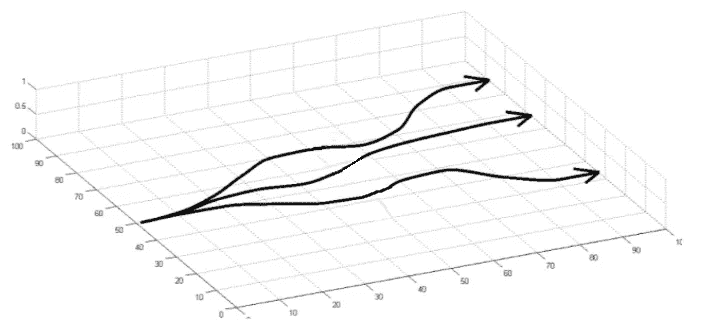
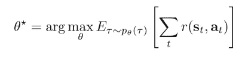
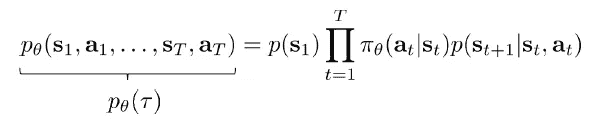
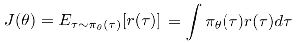
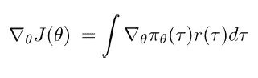
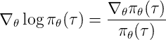
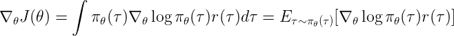
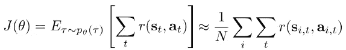
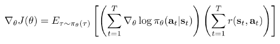
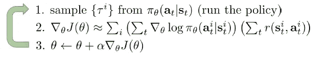

# 策略梯度和强化算法

> 原文：<https://medium.com/analytics-vidhya/policy-gradients-and-reinforce-algorithms-efeb491c1e02?source=collection_archive---------12----------------------->

在本文中，我将解释什么是策略梯度方法，它相对于价值函数方法的优势，策略梯度的推导，以及最简单的基于策略梯度的算法——加强算法。

我假设您熟悉强化学习的基础知识，如策略、值/Q 函数和概率论的基础知识。

如果你没有强化学习或概率论的背景，你应该先阅读这些文章。

 [## 强化学习导论

### 如今，每个人都在为机器学习大做文章。当谈到机器学习，强化…

towardsdatascience.com](https://towardsdatascience.com/an-introduction-to-reinforcement-learning-1e7825c60bbe)  [## 概率——机器学习的基础(第一部分)

### 机器学习所需的概率论概念概述

towardsdatascience.com](https://towardsdatascience.com/probability-fundamentals-of-machine-learning-part-1-a156b4703e69) 

所以…

# **政策梯度法到底是什么？**

策略梯度方法是一类通过使用关于其参数θ可微分的参数化策略π来解决强化学习问题的方法，这些方法的目标是直接改进策略以最大化 RL 目标，即最大化从时间步长 *t* =0 到 *t* = *T* 的累积回报，其中 *T* 对于情节问题是有限的，对于无限时域问题是无限的。

与价值函数方法相比，这些方法的优势在于其能够表示随机策略(这是您在部分可观测的 MDP 中想要的)，在处理连续行动空间时更实用，以及它直接用于改善 RL 目标的事实。然而，纯策略梯度的一个关键缺点是其数据低效，这意味着它需要大量数据(经验)来收敛，这个问题主要是由于其高方差，可以通过使用基线、因果关系和批评来解决。

但是现在我们将只关注简单的政策梯度，把它的问题留给以后的文章。

# 政策梯度推导

现在让我们来了解一下政策梯度是如何推导出来的，这并不复杂，我会尽可能地解释每一步。

首先，我们将从 RL 目标开始

强化学习的目标是最大化代理生命周期内的回报总和，代理生命周期将被表示为轨迹的τ，该轨迹由代理分别遇到和执行的每个状态和动作组成，您可以将此可视化为(状态、动作、时间)空间中向前方向的一些曲线，如下所示。

[来源](http://rail.eecs.berkeley.edu/deeprlcourse/static/slides/lec-5.pdf)

假设代理处于随机环境中，我们使用参数化策略，我们希望找到在代理轨迹上最大化期望回报总和的参数。

[来源](http://rail.eecs.berkeley.edu/deeprlcourse/static/slides/lec-5.pdf)

其中 p 是策略参数θ下的轨迹分布

[来源](http://rail.eecs.berkeley.edu/deeprlcourse/static/slides/lec-5.pdf)

目标将被表示为 *J(θ)* ，奖励的总和被表示为 *r(τ)。*

从期望的定义，我们可以把 *J(θ)* 写成

[来源](http://rail.eecs.berkeley.edu/deeprlcourse/static/slides/lec-5.pdf)

为了由此得出政策梯度，我们将目标与 *θ相区分。*

[来源](http://rail.eecs.berkeley.edu/deeprlcourse/static/slides/lec-5.pdf)

但是在我们继续前进之前，我们应该问一个重要的问题，我们如何在深度学习算法中评估这一点，在神经网络的导数上评估积分(这是我们对策略的假设)将非常昂贵，并且在每一步中都这样做是不切实际的，为了克服这一点，我们将使用来自微积分的恒等式来将策略梯度转换为可以通过采样近似评估的期望。

在微积分中，我们知道函数 f(t)的自然对数的导数等于函数对函数本身的导数，因此，策略的导数可以写成

[来源](http://rail.eecs.berkeley.edu/deeprlcourse/static/slides/lec-5.pdf)

我们把这个代入前面的等式

[来源](http://rail.eecs.berkeley.edu/deeprlcourse/static/slides/lec-5.pdf)

由于政策梯度被表示为期望值，我们可以通过在括号之间取多个样本值并对其取平均值来近似它，我们收集的样本越多，政策梯度就越准确，评估 RL 目标时也适用相同的原则。

[来源](http://rail.eecs.berkeley.edu/deeprlcourse/static/slides/lec-5.pdf)

[来源](http://rail.eecs.berkeley.edu/deeprlcourse/static/slides/lec-5.pdf)

# 加固

加强是最简单的策略梯度算法，它的工作原理是通过使用奖励的总和作为权重乘以梯度来增加执行好的行动比坏的行动的可能性，如果采取的行动是好的，那么总和将相对较大，反之亦然，这本质上是一种试错学习的公式。

[来源](http://rail.eecs.berkeley.edu/deeprlcourse/static/slides/lec-5.pdf)

# **参考文献**

*   [加州大学伯克利分校深度 RL 课程第 5 讲](http://rail.eecs.berkeley.edu/deeprlcourse/static/slides/lec-5.pdf)
*   强化学习:理查德·萨顿和安德鲁·g·巴尔托的介绍第 13 章。