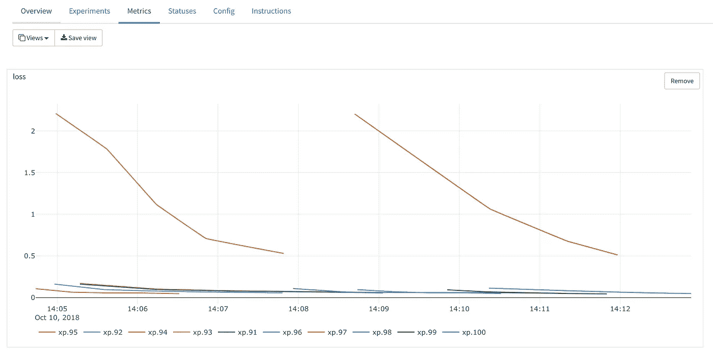

# Polyaxon、Argo 和 Seldon，用于在 Kubernetes 进行模型培训、打包和部署

> 原文：<https://medium.com/analytics-vidhya/polyaxon-argo-and-seldon-for-model-training-package-and-deployment-in-kubernetes-fa089ba7d60b?source=collection_archive---------0----------------------->

## Kubernetes 中模型管理开源框架的终极组合？


n 最简单的形式，模型管理可以被看作是训练一个机器学习模型，然后用不同的数据、参数、特征和算法重复这个数十次、数百次或数千次，最终部署*“最佳”*的那个。一个更完整的定义是，模型管理涉及为数据科学家开发工具和管道，以进行开发、部署、测量、改进和迭代，以便他们不仅可以为一个特定问题，而且可以为更广泛的数据集和算法继续制作更好的模型。

同时，模型管理包括更多传统应用的所有需求，例如 API 开发和版本控制、包管理、容器化、可再现性、规模、监控、日志等等。

本文的目标是提出一个可重复的管道，使您的生活更容易，并使迭代更快。我认为这句话很好地抓住了精神。

> 我们不部署一个模型，我们部署重复制造更多模型的过程。当您将一个 ML 模型部署到产品中时，您并不是说“这是最好的模型，我们应该永远使用它”。它实际上意味着为模型构建部署管道，并使其更具可重复性。
> 
> [朱丽叶·侯格兰 ](https://www.youtube.com/watch?v=Z7_AatHRXjI)

# 我们是怎么来到这里的

今年，我们看到了许多机器学习平台的崛起，就在 [Strata](https://conferences.oreilly.com/strata) ，我们看到了从数据存储解决方案，到这些存储解决方案中的数据 SQL 引擎，到 Spark，到数据科学平台，再到现在流行的机器学习平台的潮流变化。

就像谷歌发布了 MapReduce 和其他文件，供世界其他地方在 Hadoop 生态系统中遵循一样，谷歌和其他几家大型科技公司的工具也出现了，以解决机器学习问题。我甚至将这与两年前还很年轻的 Kubernetes 联系起来，现在它已经成为每个云提供商产品的重要组成部分。在这种情况下，不在 [CNCF 筹码](https://www.cncf.io/)上下赌注是愚蠢的。Projects 还包括 [TensorFlow](https://www.tensorflow.org/) 和最近的 [KubeFlow](https://www.kubeflow.org/) ，后者提供了关于工具组合的更多指导。

一个 ML 模型有很多不同的需求，对于开发/培训来说，你需要 GPU，打包比 JAR 文件更复杂，因为没有一种语言可以用于所有事情，你需要 Python，R 以及用 C 和 C++编写的其他部分。由于模型中包含大量数据，应用程序从几十 Mb 增加到+100 Mb。它们从基本上需要几毫秒的数据库操作的端点，发展到进行预测但需要更长时间执行、需要更多 CPU 和更多 RAM 的更智能的操作。

与此同时，传统的日志、监控、安全性、可伸缩性以及其他更传统的应用程序所具有的要求也是这些新型应用程序所需要的。如果您对网站的部分进行了 A/B 测试，现在您将对所有的 ML 模型进行 A/B 测试，以查看哪一个模型的性能更好。如果您扩展了一个节点 web 服务器，现在您需要扩展一个 TensorFlow 服务服务器，依此类推。同时，ML 模型的开发也更加复杂，需要更多的时间，因为它需要测试算法、特征等等的组合。

与传统应用程序相比，您可以从 ML 中获得如此多的价值，但是您需要在许多领域进行巨大的投资。

# 这个实验

本文探索了模型管理的两种新技术的组合，以提供一个解决三组主要问题的管道:

1.  分布式超参数训练，也可用于实际的分布式训练:[多轴](https://polyaxon.com/)
2.  使用 [s2i](https://github.com/openshift/source-to-image) : [Argo](https://applatix.com/open-source/argo/) 的容器映像构建管道
3.  能够处理单一或更复杂部署的模型的部署: [Seldon](https://www.seldon.io/)


最终的输出是一个 ML 管道，它训练多个模型，探索度量标准以(手动)挑选最好的，将模型打包为 docker 映像，并将其部署为 REST API。


工作流程图

所有需要遵循的代码都可以在这里找到:[Daniel frg/polyaxon-Argo-seldon-example](https://github.com/danielfrg/polyaxon-argo-seldon-example)。在本地，你只需要几个客户端 CLI 和克隆几个回购协议。

```
$ brew install kubectx
$ brew install kubernetes-helm
$ pip install polyaxon-cli
$ brew install argoproj/tap/argo$ git clone https://github.com/danielfrg/polyaxon-argo-seldon-example.git
$ git clone [https://github.com/SeldonIO/seldon-core.git](https://github.com/SeldonIO/seldon-core.git)
```

# 基础设施和安装

这一节是每个项目文档的一个小参考，所以如果这里有什么不工作或者过时了，请务必阅读。

接下来的几节将介绍五个组件的安装和配置，我们将使用它们来构建模型部署管道:

1.  库伯内特星团，
2.  用于持久存储的 NFS，
3.  用于分布式模型训练的 Polyaxon，
4.  Argo 建立一个集装箱化工作流程模型，以及
5.  谢顿进行模型部署。

一旦我们安装和配置了这些组件，我们将从“Polyaxon:训练模型”一节开始训练、构建和部署一个模型。所以如果你想跳过所有的安装步骤，就去那里。

# 库伯内特星团

我使用的是 GKE，但也可以是任何 Kubernetes 集群，要么使用 GCP 控制台，要么使用如下命令:

```
$ gcloud beta container --project "<project-name>" clusters create "model-mgmt" --zone "us-central1-a" --cluster-version "1.10.7-gke.2" --machine-type "n1-standard-2" --image-type "COS" --disk-size "10" --num-nodes "3" --network "default"
```

配置您的本地`kubectl`:

```
$ gcloud container clusters get-credentials model-mgmt --zone us-central1-a
```

# NFS:单节点文件服务器

这是保存所有代码、模型和数据的地方。使用这个 GCP [单节点文件服务器模板](https://console.cloud.google.com/marketplace/details/click-to-deploy-images/singlefs)创建一个超级容易。


NFS 服务器模板

我们需要在 NFS 服务器中创建几个目录，因此通过复制安装后屏幕中可用的命令或单击*“SSH to…”*按钮，SSH 进入节点。


SSH 进入 NFS 服务器

在实例中，稍后为 Polyaxon 和 Jupyter 实验室和 Argo 创建一些目录结构。

```
$ cd /data
$ mkdir -m 777 data
$ mkdir -m 777 outputs
$ mkdir -m 777 logs
$ mkdir -m 777 repos
$ mkdir -m 777 upload$ cd repos
$ mkdir deployments/
$ chmod 777 deployments/
```

使用下面的命令获取 NFS 服务器的(私有)IP，或者在虚拟机的 Google Cloud 控制台上搜索。在我的例子中，它是`10.240.0.8`

```
$ gcloud compute instances describe polyaxon-nfs-vm --zone=us-central1-f --format='value(networkInterfaces[0].networkIP)'
10.240.0.8
```


查找 NFS 服务器 IP

最后，为 Polyaxon 和其他要使用的工具创建一些 PVC。**注意**您需要编辑`*-pvc.yml`文件并添加正确的 IP 地址:

```
$ cd <polyaxon-argo-seldon-example repo>
$ cd gke/# And replace with the right ip address in all the files
$ vi data-pvc.yml
$ vi outputs-pvc.yml
$ vi logs-pvc.yml
$ vi repos-pvc.yml
$ vi upload-pvc.yml# Create the k8s resources
$ kubectl create namespace polyaxon
$ kubens polyaxon
$ kubectl apply -f data-pvc.yml
$ kubectl apply -f outputs-pvc.yml
$ kubectl apply -f logs-pvc.yml
$ kubectl apply -f repos-pvc.yml
$ kubectl apply -f upload-pvc.yml
```

# 安装 Polyaxon

有了已经创建的 PVC，基于文档安装它[就相对容易了。首先是 tiller (helm server)服务帐户的一些权限。](https://docs.polyaxon.com/)

```
# Configure tiller to have the access it needs
$ kubectl --namespace kube-system create sa tiller
$ kubectl create clusterrolebinding tiller --clusterrole cluster-admin --serviceaccount=kube-system:tiller
$ helm init --service-account tiller# Add polyaxon charts
$ helm repo add polyaxon https://charts.polyaxon.com
$ helm repo update
```

现在我们可以使用 Helm 启动 Polyaxon，我们唯一需要的额外东西是一个`polyaxon-config.yml`配置文件并运行 Helm:

```
rbac:
  enabled: **true**ingress:
  enabled: **true**serviceType: ClusterIPpersistence:
  logs:
    existingClaim: polyaxon-pvc-logs
  repos:
    existingClaim: polyaxon-pvc-repos
  upload:
    existingClaim: polyaxon-pvc-upload
  data:
    data1:
      existingClaim: polyaxon-pvc-data
      mountPath: /data
  outputs:
    outputs1:
      existingClaim: polyaxon-pvc-outputs
      mountPath: /outputs$ cd <polyaxon-argo-seldon-example repo>
$ cd polyaxon$ helm install polyaxon/polyaxon --name=polyaxon --namespace=polyaxon -f polyaxon/polyaxon-config.yml
```

当该命令完成时，您将得到类似如下的内容:

```
Polyaxon is currently running:1\. Get the application URL by running these commands:
    export POLYAXON_IP=$(kubectl get svc --namespace polyaxon polyaxon-polyaxon-ingress -o jsonpath='{.status.loadBalancer.ingress[0].ip}')
    export POLYAXON_HTTP_PORT=80
    export POLYAXON_WS_PORT=80 echo [http://$POLYAXON_IP:$POLYAXON_HTTP_PORT](http://$POLYAXON_IP:$POLYAXON_HTTP_PORT)2\. Setup your cli by running theses commands:
  polyaxon config set --host=$POLYAXON_IP --http_port=$POLYAXON_HTTP_PORT  --ws_port=$POLYAXON_WS_PORT3\. Log in with superuser USER: root
  PASSWORD: Get login password with kubectl get secret --namespace polyaxon polyaxon-polyaxon-secret -o jsonpath="{.data.POLYAXON_ADMIN_PASSWORD}" | base64 --decode
```

所以执行这些指令并使用`polyaxon-cli`登录。默认的`username:password`对是:`root:rootpassword`:

```
$ polyaxon login --username=root --password=rootpassword
```

您也可以访问打印的 URL 来访问 Polyaxon UI。


多轴项目

# 安装 Argo

[完整文档此处](https://github.com/argoproj/argo/blob/master/demo.md)(权限部分很重要)，基本上:

```
$ kubectl create ns argo
$ kubectl apply -n argo -f https://raw.githubusercontent.com/argoproj/argo/v2.2.1/manifests/install.yaml
$ kubectl create rolebinding default-admin --clusterrole=admin --serviceaccount=default:default
$ kubectl patch svc argo-ui -n argo -p '{"spec": {"type": "LoadBalancer"}}'
```

现在，我们可以通过几个工作流访问 Argo 用户界面，如下所示:


Argo 工作流

# 安装 Seldon

有多种方法可以安装谢顿，我决定使用头盔，因为我真的不完全理解 Ksonnet。

```
$ cd <seldon-core repo>$ kubectl create namespace seldon
$ kubens seldon
$ kubectl create clusterrolebinding kube-system-cluster-admin --clusterrole=cluster-admin --serviceaccount=kube-system:default$ helm install ./helm-charts/seldon-core-crd --name seldon-core-crd --set usage_metrics.enabled=true
$ helm install ./helm-charts/seldon-core --name seldon-core --namespace seldon  --set ambassador.enabled=true
```

在另一个终端中运行这个命令来代理大使服务:

```
$ kubectl port-forward $(kubectl get pods -n seldon -l service=ambassador -o jsonpath='{.items[0].metadata.name}') -n seldon 8003:8080
```

我们终于安装了所有需要的东西，让我们来训练和部署一些模型吧！

# Polyaxon:训练模型

[Polyaxon](https://polyaxon.com/) 是一个可重复机器学习的工具。它允许你将参数化的代码，例如 TensorFlow 或 PyTorch，推入 Polyaxon，在他们所谓的实验中运行。[实验](https://docs.polyaxon.com/experimentation/concepts/#experiment)可以是[实验组](https://docs.polyaxon.com/experimentation/concepts/#experiment-group)的一部分，用于进行超参数搜索。

Polyaxon 负责根据命令性定义执行作业，与 Kubernetes 的方式类似，它还负责保存作业的指标和输出，以供分析和选择。它有一些功能，我们不会在这里使用[分布式训练](https://docs.polyaxon.com/experimentation/distributed_experiments/)或使用 [Tensorboard](https://docs.polyaxon.com/experimentation/tensorboards/) 。

遵循 Polyaxon 文档，我们可以基于示例创建一个新项目。

```
$ polyaxon project create --name=mnist --description='Train and evaluate a model for the MNIST dataset'
$ polyaxon init mnist
```

我想测试超参数搜索，因此 polyaxon 文件如下所示:

```
---
version: 1kind: grouphptuning:
  concurrency: 5
  random_search:
    n_experiments: 10 matrix:
    lr:
      linspace: 0.001:0.1:5
    momentum:
      uniform: 0.5:0.6declarations:
  batch_size_train: 128
  batch_size_test: 1000
  epochs: 5
  train_steps: 400build:
 image: pytorch/pytorch:latest
 build_steps:
   - pip install --no-cache-dir -U polyaxon-helperrun:
  cmd: python run.py  --batch-size={{ batch_size_train }} \
                       --test-batch-size={{ batch_size_test }} \
                       --epochs={{ epochs }} \
                       --lr={{ lr }} \
                       --momentum={{ momentum }} \
                       --epochs={{ epochs }}
```

现在我们可以进行实验了:

```
$ cd <polyaxon-argo-seldon-example repo>
$ polyaxon run -u -f polyaxonfile_hyperparams.yml
```

基于参数空间，该命令将创建一个实验组，该组中有 10 个实验。你可以在 Polyaxon UI 中看到进度、日志、参数、环境等等。


多轴实验

当实验完成后，您将拥有 10 个经过训练的模型，您可以使用 Polyaxon 查看这些模型的指标，并选择性能最佳的模型进行部署。Polyaxon 内部的另一个选项是部署 Tensorboard 服务器来查看那里的指标，如果您已经以该格式保存了输出，这里我只使用了本机 Polyaxon 指标。



多轴自然度量

您可以查看并下载经过训练的模型，只需查看我们之前启动的 NFS 服务器，然后转到 group and experiment 目录，例如:


多轴输出

# 从波利亚克森到阿尔戈

既然我们已经训练和序列化了模型，我们需要使用 Seldon 对其进行打包和部署。这需要一些手工工作，因为你需要创建一个 Python 类供 Seldon 使用，创建`requirements.txt`并将序列化的模型移动到正确的位置。最后，我们需要使用 [s2i](https://github.com/openshift/source-to-image) 来创建使用基本塞尔顿图像的图像。

所有这些过程都可以通过下载序列化模型并使用 [s2i](https://github.com/openshift/source-to-image) 在本地手动完成，但是本着自动化的精神，我决定使用 **Argo** 来完成这个任务。

我还希望将大多数内容保存在 Kubernetes 集群中，其中模型/数据和其他内容彼此接近，因此我使用了一个 Jupyter 实验室服务器，您可以使用这个 Kubernetes yaml 规范启动并运行它:

```
apiVersion: apps/v1
kind: Deployment
metadata:
  name: jupyter
  labels:
    app: jupyter
spec:
  replicas: 1
  selector:
    matchLabels:
      app: jupyter
  template:
    metadata:
      labels:
        app: jupyter
    spec:
      containers:
      - name: jupyter
        image: jupyter/datascience-notebook
        command: ["start-notebook.sh"]
        args: ["--NotebookApp.token="]
        env:
        - name: JUPYTER_ENABLE_LAB
          value: "1"
        ports:
        - containerPort: 8888
        volumeMounts:
        - mountPath: /home/jovyan
          name: work-volume
        - mountPath: /output
          name: outputs-volume
      volumes:
      - name: work-volume
        persistentVolumeClaim:
          claimName: polyaxon-pvc-repos
      - name: outputs-volume
        persistentVolumeClaim:
          claimName: polyaxon-pvc-outputs
---
kind: Service
apiVersion: v1
metadata:
  name: jupyter
spec:
  selector:
    app: jupyter
  type: LoadBalancer
  ports:
  - protocol: TCP
    port: 80
    targetPort: 8888
```

Jupyter Lab 的安装将为您移动系列型号提供合适的支架:

```
$ cp /output/root/mnist/groups/12/120/model.dat /home/jovyan/deployments/mnist/
```

然后创建谢顿所需的文件:谢顿的 Python 类、包含`environment`文件的`.s2i`目录和`requirements.txt`。所有这些都可以在回购协议中获得。最后应该是这样的:


带有谢顿码的朱庇特实验室

谢顿实际使用的 Python 类是这样的:

```
**import** torch
**from** network **import** Network
**from** torchvision **import** datasets, transforms**class** **MnistModel**(object):

    **def** __init__(self):
        self**.**model **=** Network()
        self**.**model**.**load_state_dict(torch**.**load("./model.dat")) **def** **predict**(self, X, feature_names):
        tensor **=** torch**.**from_numpy(X)**.**view(**-**1, 28, 28)
        t **=** transforms**.**Normalize((0.1307,), (0.3081,))
        tensor_norm **=** t(tensor)
        tensor_norm **=** tensor_norm**.**unsqueeze(0)
        out **=** self**.**model(tensor_norm**.**float())
        predictions **=** torch**.**nn**.**functional**.**softmax(out)
        **print**(predictions)
        **return** predictions**.**detach()**.**numpy()
```

这基本上是在`__init__`函数中加载序列化的模型给后来的用户，在`predict`函数中，我们有一些简单的 PyTorch 代码来预处理模型期望的输入。

我们现在有了所有需要的东西，可以使用阿尔戈将模型打包成 docker 图像，这样谢顿就可以使用了。

# Argo:为模型创建 docker 图像

Argo 是 Kubernetes 的工作流管理器。我们将使用 Argo 构建一个可重用的容器原生工作流，将序列化的模型放入一个容器中，稍后可以使用 Seldon 进行部署。

为了支持这一点，我创建了一个简单的 docker 映像，它执行 s2i 并推送一个映像， [Dockerfile 在这里](https://github.com/danielfrg/polyaxon-argo-seldon-example/tree/master/docker-s2i)，docker 映像作为 [danielfrg/s2i](https://hub.docker.com/r/danielfrg/s2i/) 可用。

因为我们要将一个图像推送到 Docker hub，所以首先我们需要创建一个带有登录注册中心的凭证的秘密。

```
$ kubectl create secret docker-registry regcred --docker-server=<your-registry-server> --docker-username=<your-name> --docker-password=<your-pword> --docker-email=<your-email>
```

有了映像，我们可以使用 Argo 来管理执行，Argo 管道将 3 样东西挂载到容器:

1.  Polyaxon 卷来访问我们在上一节中编写的代码。
2.  用于构建映像和推送的 Docker 套接字
3.  要推送到存储库的 Docker 凭据

```
apiVersion: argoproj.io/v1alpha1
kind: Workflow
metadata:
  generateName: model-pkg-
spec:
  entrypoint: model-pkg

  volumes:
  - name: work-volume
    persistentVolumeClaim:
      claimName: argo-pvc-repos
  - name: docker-sock-volume
    hostPath:
      path: /var/run/docker.sock
  - name: docker-config
    secret:
      secretName: regcred
      items:
      - key: .dockerconfigjson
        path: config.json templates:
  - name: model-pkg
    steps:
    - - name: s2i-push
        template: s2i - name: s2i
    container:
      image: danielfrg/s2i:0.1
      command: ["sh", "-c"]
      args: ["s2i build /src/mnist seldonio/seldon-core-s2i-python3 danielfrg/seldon-mnist:0.2 && docker push danielfrg/seldon-mnist:0.2"]
      volumeMounts:
      - name: work-volume
        mountPath: /src
      - name: docker-sock-volume
        mountPath: /var/run/docker.sock
      - name: docker-config
        mountPath: /root/.docker
        readOnly: **true**
```

然后只需执行 argo 管道

```
$ argo submit argo/pipeline.yaml
```

流水线使用 s2i 和基本的 Seldon 映像`seldonio/seldon-core-s2i-python3`，构建一个标记为`danielfrg/seldon-mnist:0.2`的映像，并将这个新映像推送到 [Docker hub](https://hub.docker.com/) 。Argo 将处理所有的执行，您可以在他们的 UI 中看到日志和更多内容:


一个工作流的 Argo 日志

现在我们在 Docker Hub 中有了一个映像，我们可以使用 Seldon 来部署该映像。

# 谢顿:模型部署

[Seldon](https://github.com/SeldonIO/seldon-core) 是一个在 Kubernetes 中管理模型的伟大框架。模型可以作为 REST APIs 或 gRPC 端点使用，您可以在模型之间进行复杂的路由，包括 A/B 测试和多臂土匪。Seldon 负责缩放模型，并使用标准 API 让它运行您的所有模型。

谢顿使用自己的 Kubernetes CRD，它只会使用 Argo 管道推出的 Docker 图像，谢顿部署 CRD 规范如下所示:

```
apiVersion: machinelearning.seldon.io/v1alpha2
kind: SeldonDeployment
metadata:
  name: mnist
  labels:
    app: seldon
  namespace: seldon
spec:
  name: mnist
  predictors:
  - componentSpecs:
    - spec:
        containers:
        - image: danielfrg/seldon-mnist:0.2
          imagePullPolicy: Always
          name: classifier
    graph:
      endpoint:
        type: REST
      name: classifier
      type: MODEL
    labels:
      version: v1
    name: mnist
    replicas: 1
```

这将创建几个 Kubernetes Pods，包括模型运行和处理其他路由内容。

完成所有这些工作后，我们终于可以查询模型了！

因为我们部署了一个 REST API，所以我们可以使用一点 Python 来查询这个部署的模型，以读取和成像并发出一个 HTTP 请求:

```
**import** requests
**import** numpy **as** np
**from** PIL **import** ImageAPI_AMBASSADOR **=** "localhost:8003" **def** **load_image**(filename):
    img **=** Image**.**open(filename)
    img**.**load()
    data **=** np**.**asarray(img, dtype**=**"int32")
    **return** data **def** **rest_request_ambassador**(deploymentName, imgpath, endpoint**=**API_AMBASSADOR):
    arr **=** load_image(imgpath)**.**flatten()
    shape **=** arr**.**shape
    payload **=** {"data":{"names":[], "tensor":{"shape":shape, "values":arr**.**tolist()}}}
    response **=** requests**.**post(
        "http://"**+**endpoint**+**"/seldon/"**+**deploymentName**+**"/api/v0.1/predictions",
        json**=**payload)
    **print**(response**.**status_code)
    **print**(response**.**text)rest_request_ambassador("mnist", "images/87.png")
```

其输出将是对该图像的预测，第 87 幅图像是 9，并且该预测实际上是 9。

```
{
  "meta": {
    "puid": "6rtbtvkvlftfeusuej5ni4197q",
    "tags": {
    },
    "routing": {
    },
    "requestPath": {
      "classifier": "danielfrg/seldon-mnist:0.2"
    }
  },
  "data": {
    "names": ["t:0", "t:1", "t:2", "t:3", "t:4", "t:5", "t:6", "t:7", "t:8", "t:9"],
    "tensor": {
      "shape": [1, 10],
      "values": [0.0, 0.0, 0.0, 0.0, 0.0, 0.0, 0.0, 0.0, 0.0, 1.0]
    }
  }
}
```

谢顿有很多其他的功能，这里没有探讨，检查[他们的网站](https://github.com/SeldonIO/seldon-core)。

# 思想

**这个看起来真的很难，一定有更好的办法！可能有更好的方法。大多数拥有大数据科学团队的公司都在构建类似的基础架构，其中一些可供使用，例如:**

1.  [TFX](https://www.tensorflow.org/tfx/) 来自 Google/TensorFlow，[论文此处](https://dl.acm.org/citation.cfm?id=3098021)
2.  [KubeFlow](https://github.com/kubeflow/kubeflow) ，一个同样来自谷歌的工具集合，它使用的是 Seldon
3.  来自 StictFix 的 [Folilla](https://github.com/stitchfix/flotilla-os) 。此外，请查看 Juliet Hougland 关于 [Stitch Fix 如何部署生产模型](https://www.youtube.com/watch?v=Z7_AatHRXjI)的精彩演讲
4.  [IBM/FfDL](https://github.com/IBM/FfDL)
5.  [优步·米开朗基罗](https://eng.uber.com/michelangelo/)
6.  [Clipper](http://clipper.ai/) ，一个为模特服务的更低级的工具
7.  [Instacart 绝杀](https://github.com/instacart/lore)

当然，也有一些公司的产品可供您购买:

1.  [蟒蛇企业](https://www.anaconda.com/enterprise/)(免责声明这是我工作的地方)
2.  [多米诺数据实验室](https://www.dominodatalab.com/)
3.  [数据块](https://databricks.com/)
4.  [全](https://azure.microsoft.com/en-us/services/machine-learning-studio/) [云](https://cloud.google.com/ml-engine/) [提供商](https://aws.amazon.com/sagemaker/)
5.  还有很多。

根据您的使用情况，选项是无穷无尽的，您应该选择并构建一切。Kubernetes 是一个真正的平台，你可以根据需要扩展它，这就是一个例子。您可以添加很多东西来创建最终的模型管理平台。例如，[监控](https://prometheus.io/)、多用户、认证和安全、审计、作为 docker 映像的模型目录、中央存储应该是 NFS 还是对象存储还是其他？

这些特性中的每一个都会显著增加成本。

**Jupyter Hub 和 Binder** 。这个过程与我之前在 Kubernetes 的 Jupyter Hub 上发布的关于多用户开发环境的一些工作整合得相当好。多用户协作是这一过程的关键部分。此外，不要忘记，最终结果通常不是 API，而是某种应用程序、仪表板或报告，这些应用程序的部署也很重要。

为什么不用 Argo 来做模型训练呢？你可以，我认为 Polyaxon 现在更适合模型训练，因为它就是这样做的，Argo 本质上更通用，这很好，但专用工具有时更好。 [Argo 的架构](https://applatix.com/open-source/argo/get-started/architecture)更加复杂和可扩展，所以其他工具可以建立在它的基础上，我想这最终会发生。

**这该怎么办？**将它作为一个简单的实验来展示在 Kubernetes 上使用开源框架进行模型管理的可能性。拿着这个，适应你的需要。目标是让你的生活更简单，让迭代更快，模型更好。

这条管道非常有用。然而，它还远远没有完成。这会节省你一些时间，但是一些手动的部分需要自动化。你需要将这个(或任何东西)整合到你现有的 Git 和 CI/CD 工作流程中。

## 我使用的其他链接和东西

1.  [多轴文件](https://github.com/polyaxon/polyaxon/blob/master/docs/templates/tutorials/gke_deployment/kubernetes_on_gke.md)
2.  [聚轴实例](https://github.com/polyaxon/polyaxon-examples)
3.  [FfDL-Seldon/py torch-model](https://github.com/IBM/FfDL/tree/master/community/FfDL-Seldon/pytorch-model)
4.  [塞尔顿核心](https://github.com/SeldonIO/seldon-core)
5.  [阿尔戈丁德](https://applatix.com/open-source/argo/docs/yaml/argo_tutorial_2_create_docker_image_build_workflow.html)