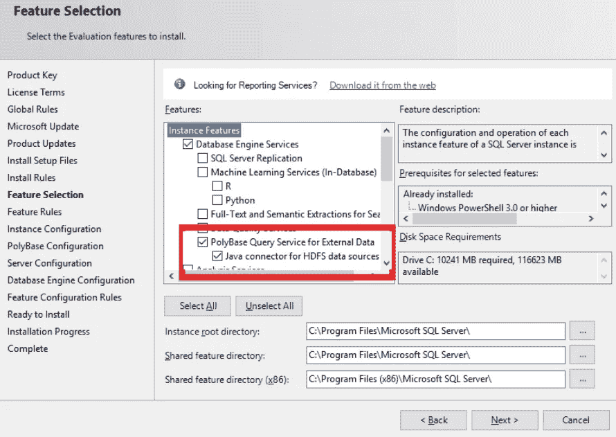
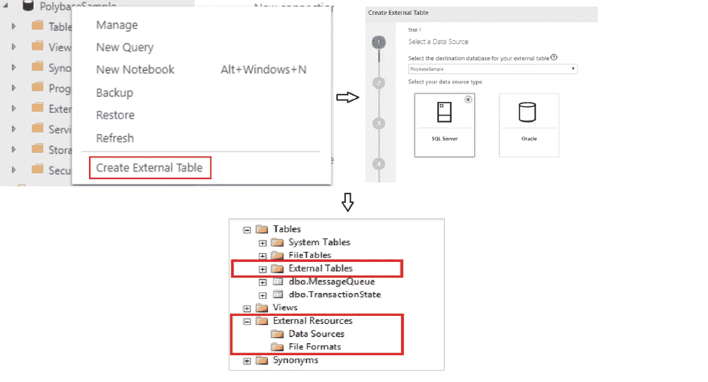

# SQL Server 中的 PolyBase 一个黑马 ETL 解决方案？

> 原文：<https://medium.com/analytics-vidhya/polybase-in-sql-server-a-dark-horse-etl-solution-99b3cfbc6c5c?source=collection_archive---------4----------------------->


截至 2020 年，有数以千计的组织和微软商店运行在 SQL Server 上，使用各种各样的 *ETL* 工具，如 SSIS (SQL Server 集成服务)和 Azure Data Factory，用于*提取、转换&加载*到各种不同数据源的数据。在这里，我们将看看 PolyBase 如何成为满足您所有 ETL 需求的一站式商店，因为它经常被忽略。

## 什么是 PolyBase？

PolyBase 允许 SQL Server 实例轻松访问外部数据源，如链接服务器或数据库链接。该功能首次在 SQL Server 2016 中引入，允许访问 Hadoop/HDFS 和 Azure Blob 存储。

随着 SQL Server 2019 的发布——除了 Hadoop 和 Azure Blob 存储，我们还可以访问存储在 SQL Server、Oracle、Teradata 和 MongoDB 中的外部数据。它还扩展到微软数据平台下的产品，即 PDW(分析平台)和 Azure Synapse Analytics(以前称为 Azure SQL 数据仓库)。

## 停下来。PolyBase 和链接服务器不是一样的吗？

不完全是，虽然[链接服务器](https://docs.microsoft.com/en-us/sql/relational-databases/linked-servers/linked-servers-database-engine?view=sql-server-ver15)已经存在很久了——poly base 是一个更加充实的功能，可以通过从外部来源获取数据来进行分析。PolyBase 和链接服务器之间的一些区别是:

PolyBase 是*数据库范围的*,在其中您可以有效地查询数据，就像从 Db 中的任何其他表查询数据一样，并且可以有效地使用横向扩展特性。另一方面，链接服务器是实例范围的，其中主机数据库有效地对外部数据库进行单线程调用。(*旁注:Oracle Db link 通过支持多线程调用在这里做得更好)*

PolyBase 使用 ODBC 连接，而 SQL Server 中的链接服务器使用 OLEDB。微软在这里有一个成熟的常见问题解答。

## 为什么使用 SSIS 和 Azure 数据工厂而不是 PolyBase？

虽然 PolyBase 使您的 SQL Server 成为访问外部数据源的一站式商店，但仍然需要使用微软生态系统中可用的成熟数据集成工具，即 Azure Data Factory 和 SSIS:

*   延迟和性能问题——SSIS 和 Azure Data Factory 都能很好地管理 lrage 工作负载，并允许细粒度控制，以避免延迟和性能障碍
*   花哨的拖放 UI——使用 PolyBase 的大部分基础工作和配置都是通过 SQL 查询完成的，而 Azure Data Factory 和 SSIS 都为构建强大的 ETL 管道提供了直观的界面

公平地说，PolyBase 并不意味着完全取代你的 ETL 管道。

## 那么，我们何时以及如何使用 PolyBase 呢？

根据我使用所有这些工具的经验，PolyBase 更适合 ODS 系统和 staging、QA 或测试环境，在这些环境中，需要在多个数据源之间进行快速原型制作和数据交换，或者需要导入固定数量的数据用于分析目的。

另一个强大的用例是从数据库或数据仓库导出旧数据进行归档，比如 Azure Blob 存储。

## 安装和使用 PolyBase



安装 SQL Server 时的功能选择

在安装 SQL Server 的过程中选中 PolyBase 复选框，最重要的是，我们需要通过运行以下查询来启用该功能:

```
exec sp_configure @configname = 'polybase enabled', @configvalue = 1;
RECONFIGURE
```

您还需要从 *services.msc* 重新启动 SQL Server 引擎

在 Linux (Ububtu)上:

安装 PolyBase 并重新启动 SQL Server:

```
sudo apt-get remove mssql-server-polybase
sudo apt-get update 
sudo apt-get install mssql-server-polybasesudo systemctl restart mssql-server
```

## 添加外部数据源和运行查询

您可以通过向导使用 SSMS (SQL Server Management Studio)添加外部数据源，并查看外部表下的表和外部资源下的数据源。



配置外部数据源

配置外部数据源的关键步骤包括:

1.  为机密&数据库范围的凭证创建主密钥
2.  创建外部数据源(Hadoop、Oracle、Azure Blob 存储等。)
3.  创建外部数据格式(CSV、拼花等)。
4.  创建外部表
5.  创建统计信息和索引(聚集、非聚集或列存储)

以上添加外部数据源和表的步骤，比如将数据导入 Azure Blob 存储和从 Azure Blob 存储导出数据——下面的 GitHub repo 中嵌入了一个示例用例:

[PolyBase-SQL server-AzureBlobStorage](https://github.com/robathija/PolyBase-SQLServer-AzureBlobStorage/blob/master/PolyBase-SQLServer-AzureBlob-Query.sql)

配置其他数据源如 Oracle 和 Hadoop 可以在[这里](https://docs.microsoft.com/en-us/sql/relational-databases/polybase/polybase-configure-oracle?view=sql-server-ver15)找到。

正如我们所看到的，PolyBase 可以而且应该与传统的 ETL 工具一起使用，以享受两个世界的好处。