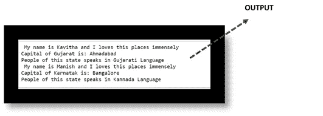
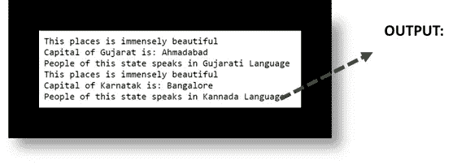

# PYTHON 中的多态性

> 原文：<https://medium.com/analytics-vidhya/polymorphism-in-python-4ee1f87c5bcf?source=collection_archive---------12----------------------->

简单来说，Poly 意味着不止一个——或者说“许多”。一个词有多种意思或用途。同一个词被用来表示多种事物…类似地，在 Python 程序中，一个函数有多种用法被称为多态性。

最简单的例子是将+与整数一起使用，目的是执行算术运算，当用于字符串时；它执行连接功能。

*使用'+'运算符的整数多态性示例:*

*使用'+'操作符的字符串多态性示例:*

还有很多其他的例子显示了不同的结果，比如长度；为了清楚起见，让我们用代码和图形来详细理解它。

这里“程序”上的 Len 给出了给定单词中的字母数，即= 9

在第二行，Len 给出了列表中元素数量的计数，即= 3

最后，我们给出了结果= 2 的字典集

相同的功能，即。(长度)根据数据类型(字符串、列表、字典)给出不同的输出

# **多态性类**

这是 OOPS 中使用的非常重要的功能。我们将演示如何在两个或多个定义的类上使用相同的代码。

类的优点是它允许不同的类有相同名称的方法，因此有助于在不同的类上使用循环生成单行代码的输出。

Python 中的代码:

注意事项:

这里我们有两个阶级**古吉拉特**和**卡纳塔克邦**。我们构建了与它相似的结构，它们应用了相同的方法，即 **details()、capital()和 language()。**

没有超类，或者没有创建到这些类的任何链接。但是我们将它们打包成一个元组，并使用一个名为 **People** 的公共变量进行循环。结果因为多态被拉。

# **多态性&遗传:**

python 中的多态性定义了子类中与父类中的方法同名的方法。在继承中，子类从父类继承方法。此外，还可以修改子类中从父类继承的方法。

这主要用于从父类继承的方法不适合子类的情况。这个在子类中重新实现方法的过程被称为[方法覆盖](https://www.edureka.co/blog/method-overloading-and-overriding-in-java/)。下面的例子展示了继承的多态性:

Python 中的代码:

注意事项:

在这里，我们可以看到在子类 2 中没有被覆盖的方法，比如 B.details()，已经从父类中使用了。

# 函数和对象中的多态性:

更进一步，多态性也可以用函数和对象来定义。假设我们已经创建了两个不同的类，即。古吉拉特邦和卡纳塔克邦——这两个类都分别有自己的首都、当地语言和显示信息，显示这些邦非常美丽。

我们现在创建一个名为 places 的函数，当调用这些 Places 时，所有的对象都被定义并取出。参见下面的代码。

**注意** : **方法重载**，一种创建多个同名但参数不同的方法的方法，在 Python 中是不可能的。