# 张量流中的多项式回归

> 原文：<https://medium.com/analytics-vidhya/polynomial-regression-in-tensorflow-53f958cef2d2?source=collection_archive---------2----------------------->

在线性回归中，模型的目标是绘制一条最能捕捉数据趋势的线，通常称为“最佳拟合线”例如，这是一条由模型生成的回归线，用于根据多年的工作经验预测工资。

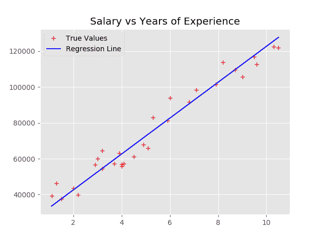

回归线图。

然而，并不是所有的数据都可以用一条线来有效地表示。这是一个数据集的例子，用线表示效果很差。

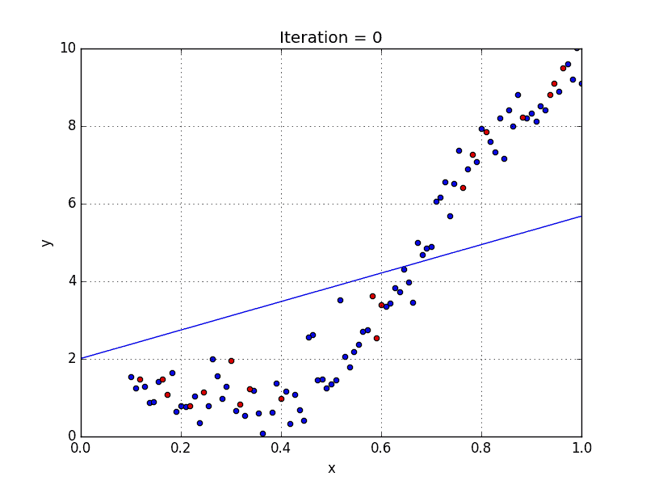

拟合差的数据集([http://www . aion line course . com/tutorial/machine-learning/polynomial-regression](http://www.aionlinecourse.com/tutorial/machine-learning/polynomial-regression))。

这个数据集用一个函数来表示要好得多，比如 *f* ( *x* ) = *x* 。对于这个模型来说，这意味着目标从解一个方程如*y*=θ⋅*x*+*b*转移到解一个方程如*y*=θ₁⋅*x*+θ₂⋅*x+*θ₃.随着函数次数的增加，图形的复杂性也会增加，如下所示:

多项式函数的图形([https://slideplayer.com/slide/9150060/](https://slideplayer.com/slide/9150060/))。

# **制作我们的数据**

让我们创建用于多项式回归的数据。

通过首先计算根来生成随机的 5 次多项式。

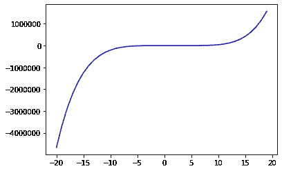

# **创建我们的模型**

该数据集是一个五次多项式。现在，我们将根据这些数据训练一个*线性回归*模型，看看它有多适合。

首先，让我们导入我们将需要的所有依赖项。

导入库。

现在让我们定义我们的参数并分割我们的数据。我们还将缩放数据，因为这在多项式回归中至关重要。如果没有缩放，我们的模型在权重上会有剧烈的变化。由于我们引入了θ₁ ⋅ x⁵这样的术语，θ₁的权重要比θ₅突出得多，这就是θ₅ ⋅ *x* 项的系数。这样做的原因是因为 *x* ⁵在数量级上比 *x* 大得多(假设 *x* 大于 1——如果不是，则相反)；因此，它对预测的影响要大得多。这导致像θ₅这样的术语实际上被忽略了，这对我们的模型没有好处。然而，缩放的作用是将我们所有的数据纳入一个范围内，这样每个权重的重要性就不会被削弱或放大。

当我们缩放数据时，我们用训练数据来调整我们的缩放器。然后，我们将这个定标器应用于训练和测试数据，因此两者都被相应地定标，并且我们的权重将它们都映射到它们相应的标签。

预处理数据。

现在我们可以创建我们的模型架构了。请记住，我们将首先绘制一条线性回归线来拟合数据，并观察它的表现。

为我们的线性回归模型创建架构。

现在，我们可以运行我们的模型，并绘制其随时间推移的成本、回归线和相关系数。

训练模型，并绘制结果。

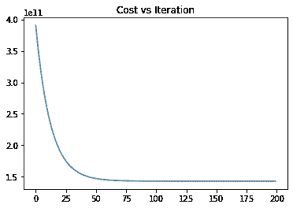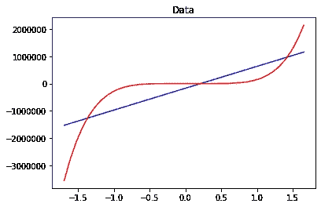

(左)成本与模型迭代的关系图。(右)蓝色的建议回归线，红色的真理线。

该模型在数据集上的表现相当差，完全没有捕捉到图形的形状。其 R2 相关系数仅为 0.6465。现在我们用*多项式回归*来试试。这里，我们不用函数 *y* = θ ⋅ *x* + *b* ，而是用*y*=θ₁⋅*x*⁵+θ₂⋅*x*⁴+θ₃⋅*x*+θ₄⋅*x*+θ₅⋅*x*+θ⊙这样我们就可以画出 5 次多项式了。

让我们从定义参数、数据和模型架构开始。

多项式回归的模型结构。

现在让我们运行我们的模型并评估它的性能。

训练模型和判断性能。

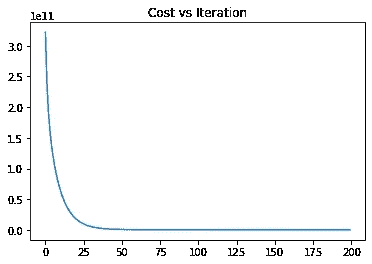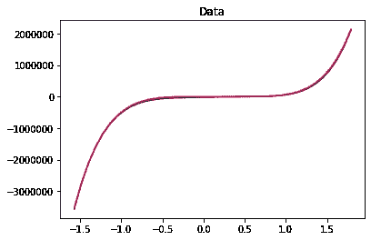

(左)成本与模型迭代的关系图。(右)蓝色的建议回归线，红色的真理线。

显然，多项式回归模型更适合数据集。它设法捕捉图形的曲线，并具有 0.99 的相关系数。

# **真实数据**

现在让我们尝试在真实数据集上使用我们的多项式回归方法。首先，让我们把它形象化。

加载数据并绘制图表。

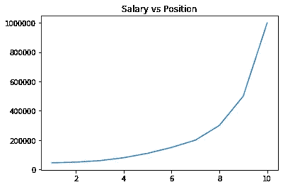

提供的数据图。

我们可以看到该图类似于一个 *x* 函数，所以让我们把它作为我们的目标(该图也类似于一个指数函数，但是我们在这里的目标是建立一个多项式模型，所以我们不讨论它)。下面是创建多项式回归模型的代码。这段代码与前面的例子几乎相同，除了我们用公式*y*=θ₁⋅*x*+θ₂⋅*x*+θ₃.定义了一个模型

模型架构。

现在让我们训练我们的数据，看看它在数据集上的表现如何。

培训和评估。

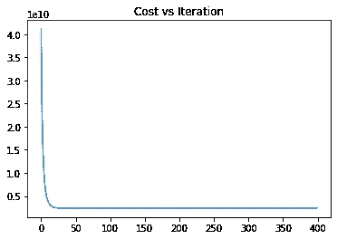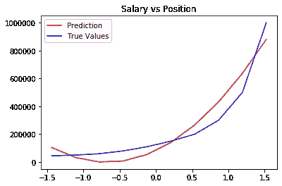

(左)成本与模型迭代的关系图。(右)蓝色的建议回归线，红色的真理线。

R2 相关系数为 0.913。正如我们所见，该模型可以相对较好地预测数据集的曲率。

# **过拟合**

多项式回归出现的一个问题是过度拟合。过度拟合是一个术语，指的是模型在训练集上训练得如此精确，以至于不能推广到测试集。

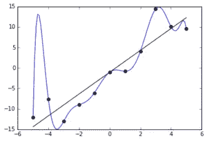

一个过度拟合数据集的例子([https://en.wikipedia.org/wiki/Overfitting](https://en.wikipedia.org/wiki/Overfitting))。

此图像显示了一个数据集，其中绘制了点。黑线应该是回归线，但是，模型过度拟合并绘制了蓝线。该模型在训练集上表现得非常好，因为它捕获了每一点，但在测试集上不能概括和表现很差。

当绘制的多项式的次数高于最佳次数时，就会发生这种情况。例如，不是训练一个模型来绘制一个 *x* 图，如果一个模型用 x⁴⁷图来训练，它可以很好地捕捉所有的测试数据点，但是会极度过度拟合。

我们如何抵消过度拟合？有许多方法，如辍学或提前停止，但我们将使用 L2 正则化。正则化的作用是增加每个θ变量的权重，这样模型就不会学习一个非常复杂或过度拟合的模型。我们用来表示权重的变量是λ，这是我们必须定义的另一个超参数。

我们通过在成本函数的末尾添加一个正则项来实现正则化。这一项在这个模型中是λ ⋅ L2 (θ₁ + θ₂ + θ₃)。

让我们用这个概念重新定义我们的模型，看看它的表现如何。

正则多项式回归。

让我们检查一下它是如何工作的。

培训和评估。

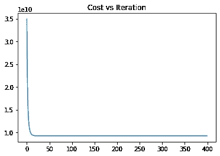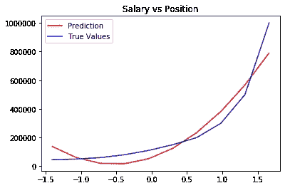

(左)成本与模型迭代的关系图。(右)蓝色的建议回归线，红色的真理线。

R2 相关系数为 0.907。对于这样的小数据集，变化并不明显。然而，在存在过度拟合问题的大型数据集中，正则化是多项式回归中的关键步骤。

# **偏差与方差**

哪里有过度拟合的概念，哪里就有拟合不足的术语。欠拟合是指模型不能很好地预测，即使是在训练数据中。这在我们训练线性回归模型的尝试中有所描述——这是拟合不足的一个例子。

然而，我们为该问题训练多项式回归模型的例子是过度拟合的例子——它几乎完美地预测了训练数据上的每一点。然而，这意味着它不太可能推广到测试数据。

欠拟合和过拟合也被称为偏差和方差。这引入了机器学习中的一个关键概念——偏差与方差的权衡。所有的机器学习模型都存在这样或那样的问题；该模型的目标是找到一个平衡，使两者都最小化。这允许模型准确地预测数据，也允许它很好地推广到看不见的数据。当一个模型具有高偏差时，它甚至不熟悉训练数据，因此推广到测试数据没有问题(尽管它很可能表现不好)。但是，如果一个模型具有很高的方差，它在训练数据上表现得非常好，但在测试数据上表现很差。当方差降低时，偏差往往会升高。当偏差降低时，方差往往会升高。这就是为什么找到两者之间的平衡以最大化模型的效率和有效性是至关重要的。

# **结论**

多项式回归是一种有用的回归形式，因为它能够学习比线性回归更复杂的关系。它还伴随着过度拟合的风险，并且需要考虑偏差与方差的权衡。然而，如果使用有效和适当，它可以是一个非常强大的工具。