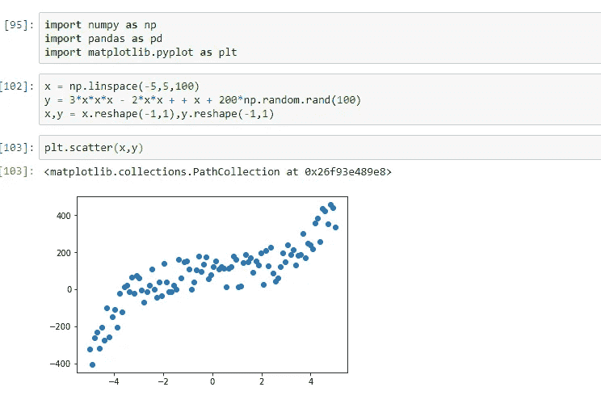
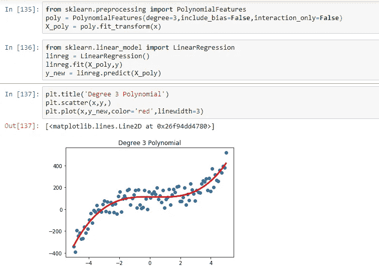
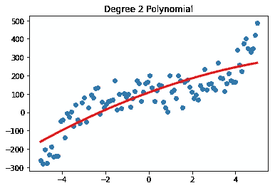
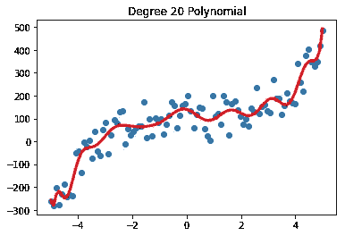
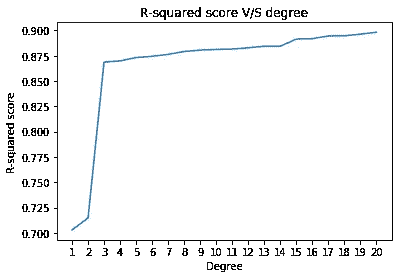

# 多项式回归——线性模型的“曲线”

> 原文：<https://medium.com/analytics-vidhya/polynomial-regression-the-curves-of-a-linear-model-bef70876c998?source=collection_archive---------8----------------------->

被忽视的真相

正如许多人会同意的那样，数据分析项目/报告最迷人的部分是机器学习算法使用数据施展魔法的部分。然而，这个过程中最容易被忽视的部分是数据的预处理。

更重要的工作是准备数据以拟合模型，而不是调整模型以更好地拟合数据。我们想要解决的一个预处理技术是**多项式回归**。

# **更深的潜水**

多项式回归的主要假设是特征(自变量)和目标(因变量)之间可能存在非线性关系。当线性模型不能捕捉数据中的趋势并且给出较差的 R 值时，也使用它。在这种情况下，多项式回归通过使用现有要素的更高功效和组合来添加“新”要素，从而增加了模型的复杂性。

多项式回归揭示了特征和目标之间的相互作用以及特征之间的相互作用，如果有的话。使用多项式回归可以使线性模型(如线性回归和逻辑回归)变得更加强大和复杂。

多项式回归的一个缺点是，它需要对其参数进行大量实验，因为没有与之相关的硬性规则。

# **可视化多项式回归**

先从正态分布在三次曲线 y = 3x -2x +x 周围的一些数据点说起。

准备数据以拟合启用了多项式要素的线性模型

乍看之下，简单的线性模型显然会遗漏数据中复杂的立方趋势，从而导致模型欠拟合。因此，接下来需要做一些调整。

使用 sklearn.preprocessing 中的*多项式特性*类可以填补简单线性模型和数据中复杂趋势之间的空白。

考虑一个特征矩阵 X，包含三个特征 X1，X2，X3。创建新的二次多项式特征向我们展示了这些新特征:

> **1、X1、X2、X3、X1*X2、X1*X3、X2*X3**

这些特征然后与原始特征一起用于预测，并且我们的线性模型相应地评估这些新特征的系数。

sklearn *多项式特性*有**三个**参数:

*   **次数:**决定新多项式特征的最高次幂
*   **include_bias:** 设置为 True 时，将在多项式特征集中包含一个常数项。默认为真。
*   **interaction_only:** 设置为 True 时，将只包括特性的交互项，而不包括单个特性的更高次幂。默认情况下，它为 False。

将我们目前所学应用于上述合成数据集:

我们引入了 3 次多项式特征来帮助提高性能，现在模型很好地拟合了数据。

多项式特征的次数与模型的整体复杂性之间有很强的相关性。因此，度数的取值必须经过详尽的实验。

现在来看看学位选择不当的影响:

学位值低；过于简单的模型；欠拟合

学位价值高；模型过于复杂；过度拟合

在 2 度和 3 度之间的分数有一个巨大的跳跃。如果我们超过 3，我们只是过度拟合数据，因此我们以泛化能力差为代价获得了更高的训练数据分数。

# **在使用多项式功能之前**

由于*多项式特征*使用现有特征，确保原始特征的正确性很重要。

当使用*多项式特性*时，数据中的缺失值会造成一个大问题。它遇到数据缺失会对你大吼大叫。因此，在实现之前处理丢失的数据是很重要的。

填充缺失数据的策略也起着关键作用。

考虑这样一种情况，所有丢失的值都被一个常数值替换，并且该值为 0。在这种情况下，所有的相互作用项将变成零，我们将得到意想不到的结果。

因此，正确选择处理缺失值的策略非常重要。

当接下来要执行多项式回归时，KNN、平均值和中值通常是处理缺失值的合适选择。

发现有用就留个掌声！