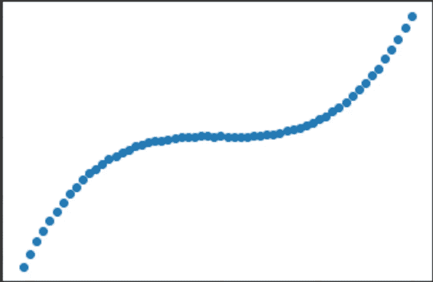
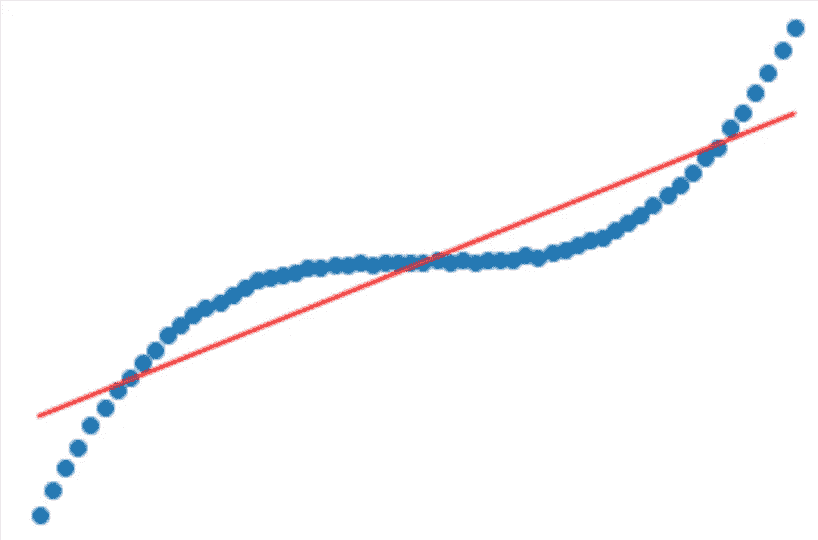
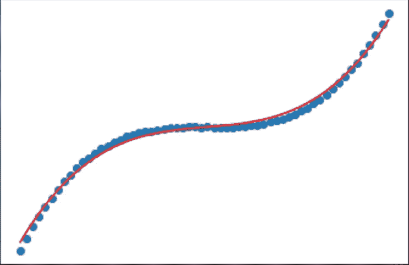
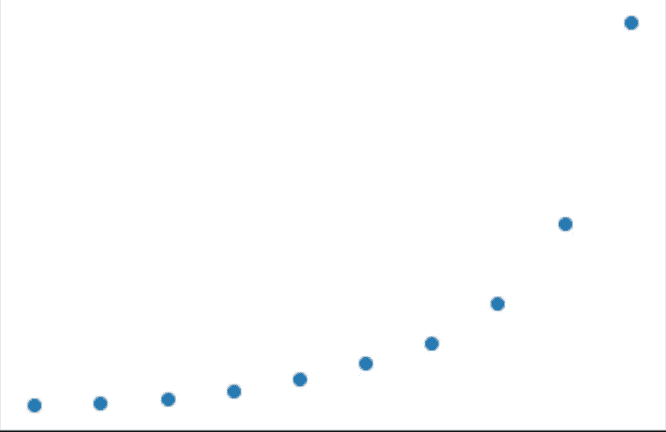
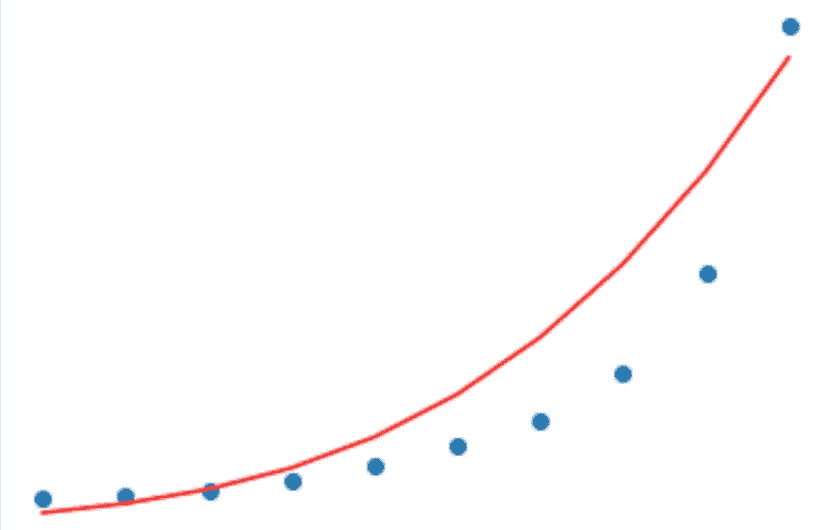

# 带 Keras 的多项式回归

> 原文：<https://medium.com/analytics-vidhya/polynomial-regression-with-keras-ef1797b39b88?source=collection_archive---------2----------------------->

多项式回归是用于预测建模以及分类问题的机器学习和神经网络的基础。

## 回归

回归就是寻找数据的趋势(变量之间的关系)。这使我们能够更好地理解数据分布，并预测新输入变量的值。

## 线性回归

当数据中的趋势为**线性、**时，即其形式为`y = ax + b`时，使用线性回归。另一种更常用的回归形式是多项式回归。

## 多项式回归

当数据趋势是“n”次多项式时使用的多项式回归，即其形式为 y = ax^n + bx^n-1+ … + n

现在，让我们进入使用 Keras 进行多项式回归建模的代码。第一个块显示了本教程所需的所有库。

```
import numpy as np
import matplotlib.pyplot as plt
from tensorflow.keras.layers import Input, Dense
from tensorflow.keras.models import Model
from tensorflow.keras.optimizers import Adam
from sklearn.preprocessing import PolynomialFeatures
```

让我们生成数据。如你所见，我们在这里使用了一个三次方程**。**我们也在 0-1 的范围内重新调整数据。否则，y 值以千计，导致训练时间过长。即使在 500 个时代之后，损失也是以千计。

```
*def* generate_data():
    X = np.arange(-30, 30, 1)
    y = 9*X**3 + 5*X**2 + np.random.randn(60)*1000
    return X, ytrX, trY = generate_data()
trX = trX/max(trX)
trY = trY/max(trY)
#plot the data
fig, ax = plt.subplots()
ax.scatter(trX, trY)
```



生成的数据

模型期望输入的要素与曲线的阶数一样多。因此，我们必须从数据中生成更多的特征。Scikit-learn 有这样一个方法。

```
n = 3
trX_expanded = np.expand_dims(trX, axis=1)
poly = PolynomialFeatures(n)# returns: [1, x, x^2, x^3]
trX_expanded = poly.fit_transform(trX_expanded)
```

首先，让我们尝试使用一个线性模型。模型的形式是 wx + b。

```
inp = Input((1)) 
out = Dense(1)(inp)
model_linear = Model(inputs=inp, outputs=out)
model_linear.compile(
optimizer=Adam(lr=1e-3), 
loss="mean_squared_error")
```

让我们训练模型，并绘制其曲线。

```
model_linear.fit(trX, trY, epochs=500)
ax.scatter(trX, trY)
ax.plot(trX, model_linear.predict(trX), color="red")
```



试图将曲线与数据拟合的线性模型

现在让我们试试多项式回归。

```
inp = Input((n+1)) 
#since one of the features is 1, we need an extra input
out = Dense(1)(inp)
model = Model(inputs=inp, outputs=out)
model.compile(optimizer=Adam(lr=1e-3), loss="mean_squared_error")
```

训练模型，并绘制数据集的最终预测:

```
model.fit(trX_expanded, trY, epochs=500)
ax.scatter(trX, trY)
ax.plot(trX, model.predict(trX_expanded), color="red")
```



多项式回归曲线

正如我们所见，在这种情况下，多项式回归要好得多，因为数据趋势不是线性的。其他这样的情况可以是基于某些因素预测房子的价格等。然而，在某些情况下，线性回归更适合。例如，预测一次驾驶要消耗多少燃料，或者找出一个电器的年龄和它的价格之间的关系。

需要注意的一件事是过度拟合，当模型过于完美地拟合曲线时就会发生这种情况。这听起来可能是一件好事，但实际情况是模型太习惯于训练数据。当我们向它展示新数据时，特定于训练数据的曲线不会工作得太好。

## 真实世界的例子

[这里的](https://drive.google.com/file/d/1tNL4jxZEfpaP4oflfSn6pIHJX7Pachm9/view)是一个虚构的公司职位及其薪水的数据集。让我们阅读并绘制数据。

```
import pandas as pd
filepath = "path/to/dataset.csv"
data_orig = pd.read_csv(filepath)
x_data = data_orig["level"].values
y_data = data_orig["salary"].values
x_data = x_data/max(x_data)
y_data = y_data/max(y_data)
x_data_expanded = poly.fit_transform(np.expand_dims(x_data))
fig2, ax2 = plt.subplots()
ax2.scatter(x_data, y_data) #plot the data
```



给定数据集

现在，让我们根据数据绘制出我们的模型预测的结果:

```
ax2.plot(x_data, model.predict(x_data_expanded), color="red")
```



如果我们用这些数据重新训练模型，曲线很容易得到改善。

多项式回归教程到此结束。它教授机器学习背后的核心概念，是该领域的良好起点！