# 爆米花数据——分析电影院座位模式(下)

> 原文：<https://medium.com/analytics-vidhya/popcorn-data-analysing-cinema-seating-patterns-part-ii-987fbde9d363?source=collection_archive---------9----------------------->

诺埃尔·马修·艾萨克和[万什卡·阿格拉瓦尔](https://medium.com/u/19e9504cf53f?source=post_page-----987fbde9d363--------------------------------)

*在第一部* [*，*](/@noelmathewisaac/popcorn-data-analysing-cinema-seating-patterns-part-1-a0b2a5c2c19a) *中，我们从邵氏影院网站上搜集数据，对其进行清理，并将其存储在数据库中。*

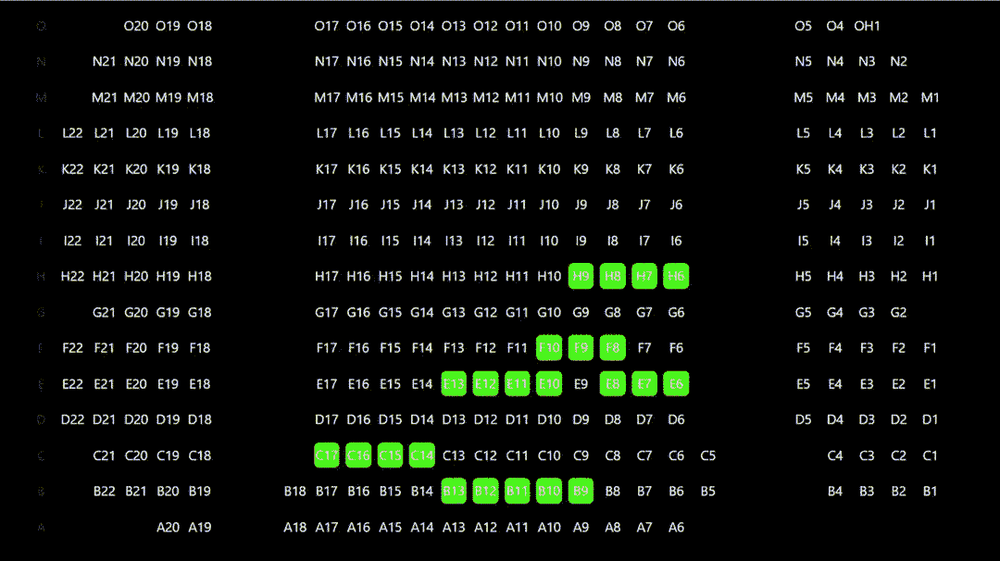

# 第二部分——分析和可视化网站上的数据

## 当发现剧院里你最喜欢的座位已经被预订时，你有没有感到极度失望？

## 你最喜欢的座位到底有多受欢迎？

我们想更多地了解新加坡的电影趋势——人们喜欢从哪个座位观看不同的电影。所以我们创建了[PopcornData](https://popcorn-data.herokuapp.com/)——一个通过搜集数据、发现有趣的见解并将其可视化来一窥新加坡电影趋势的网站。

我们从新加坡最大的连锁影院之一**邵氏影院**的网站上搜集并清理了 2020 年 1 月的数据。我们获得的数据包含所有电影放映的信息以及在这些放映中购买的座位。要更详细地了解我们是如何获得这些数据的，请参阅第一部分。

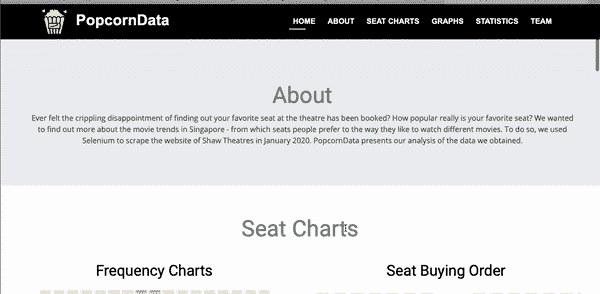

[PopcornData](https://popcorn-data.herokuapp.com) —最终网站。

> ***滚动到文末取乐事实我们发现了！***

# 1.分析数据

首先，我们头脑风暴想要找出的关键模式。

我们认为有价值的 3 个主要问题是:

1.  **各厅买座位是什么顺序，什么号码？**

*   这将突出更受欢迎的座位；与剩下的微不足道的座位相比，哪些座位先被抢走。
*   与此同时，我们可以看到有多少顾客去看电影——是夫妻、家庭还是独自一人？
*   这也可能会出现其他模式——也许对于不同的电影，不同的座位是首选吗？

**2。每个大厅哪个座位最受欢迎？**

*   比较**一个座位在大厅中的购买次数**将真正提供一个座位偏好的总体视图，潜在地**突出未使用的大厅空间**和设计缺陷。

**3。不同电影的票卖的有多快？**

*   买票率是指单位时间内**的买票量，其中时间递减表示电影放映时间的剩余天数。**
*   我们预计**会确定三条主要的购票率趋势线**—( a)首映上座率，(b)卧铺票，以及(c)在影院首映后几天内获得票房的电影。

# 2.将数据可视化

使用 jQuery-Seat-Charts 和 BokehJS，我们能够创建很酷的座位图和图表来可视化有趣的模式。

## a)座位受欢迎程度

【http://popcorn-data.herokuapp.com/frequencycharts 

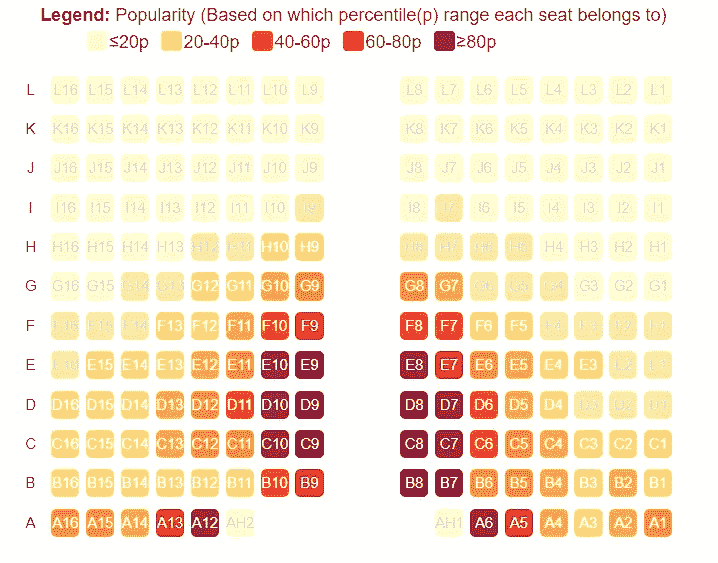

JCube Hall 4 的频率图

我们为每个大厅创建了**座位频率图表**，方法是获取大厅的座位布局，并根据购买的座位的**频率在其上生成**热图**，以查看哪些座位最受欢迎。**

为了获得这个数据，我们累计了整个一月份在特定大厅中每个座位被购买的次数。根据获得的频率范围，我们将它们分成百分位数，并相应地对座位进行颜色编码，深色的座位购买频率更高。

观察

*   过道座位是最受欢迎的。
*   与后排相比，前排通常是空的。这为大厅的重组带来了巨大的潜力，以改善客户体验。

## b)座位购买订单

[https://popcorn-data.herokuapp.com/seat-buy-order](https://popcorn-data.herokuapp.com/seat-buy-order)

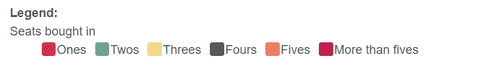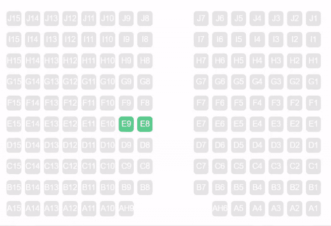

大厅的座位购买顺序——座位按照购买的顺序亮起，并根据购买的人群大小进行着色。

由于座位数据包括每个座位的购买时间，这是我们使用 **Javascript 来制作座位图**的机会，如上图所示。座位会按照购买的顺序亮起，并根据购买时的编号进行颜色编码。

将数据组织到 2D 数组中，我们使用**“席位购买时间”**对一起购买的**卖出席位进行分组**并对数组进行排序，以获得买入席位的顺序。

```
[[‘A_10’, ‘A_11’], [‘A_12’], [‘B_4’, ‘B_7’, ‘B_6’, ‘B_5’], [‘C_8’, ‘C_10’, ‘C_9’], [‘B_1’, ‘B_2’], [‘C_6’, ‘C_7’], [‘C_5’, ‘C_4’], [‘B_8’, ‘B_10’, ‘B_9’], [‘D_8’], [‘A_15’, ‘A_14’, ‘A_13’]]
```

在上面的示例数组中，座位“A_10”和“A_11”是一起购买的，然后是单独购买的“A_12 ”,依此类推。

## c)购票率

[https://popcorn-data.herokuapp.com/rateofbuying](https://popcorn-data.herokuapp.com/rateofbuying/)

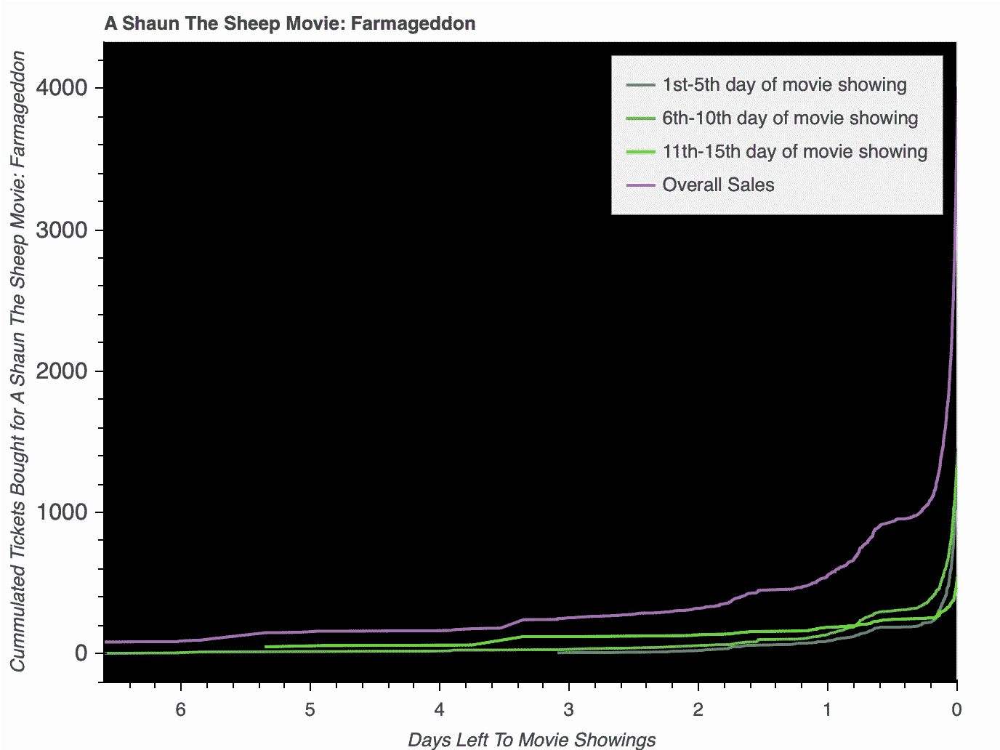

一部电影的购票率——累计购票数(y 轴)与放映前 T 天(x 轴)的比值。请参考图例，了解电影放映的时间段，在该时间段内，线条绘制数据。

门票购买率是使用 Python 中的**散景库绘制的——**这是一个强大的功能，它允许观众使用旁边的工具栏切换最终的图表，允许感兴趣的人进行更深入的调查。

每个图表提供了一部电影上映前 15 天的所有电影放映时间**的全面概述。每条绿线代表一个**为期 5 天的电影放映周期**，在此期间累积数据。比较这些线可以显示在最初快速销售后慢慢失去人气的电影或在放映时间内销售稳定的电影。**

每部电影的数据被组织到两个独立的字典中进行绘制。

**挑战:**如何让图表既全面又可读性强？

**解决方案:**我们分析了一部电影上映前 15 天的数据。每 5 天的数据被累积(三条绿线)到三个单独的图表中，允许分析电影受欢迎程度的进展，以及总体比率(紫线)。

正如上图所示，大多数顾客会在演出开始前几个小时买票。有趣的是，**这部电影在上映的第 6-10 天变得更受欢迎**(来自台词的重叠)，而**大多数电影慢慢失去观众。**

# 一些有趣的事实！

## 总体座位分布

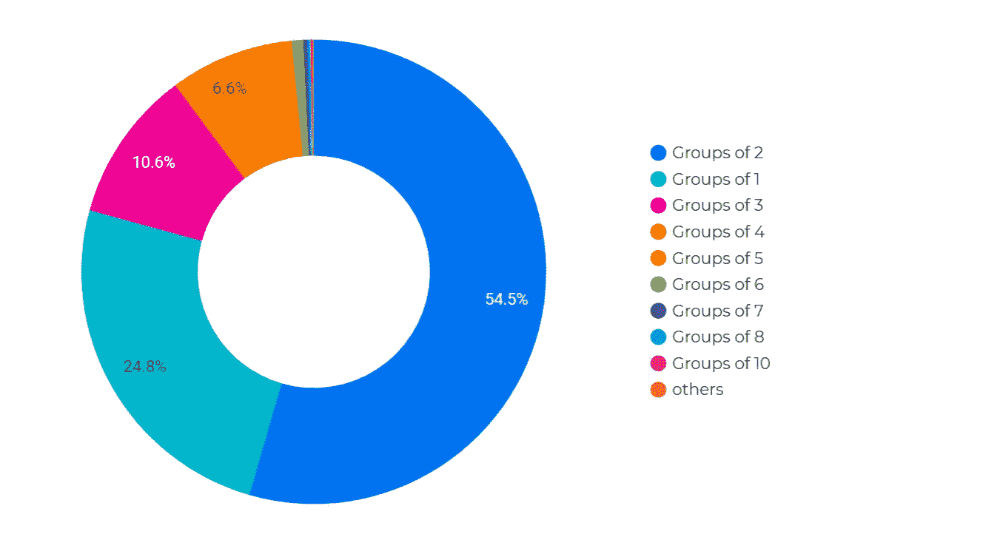

通过汇总各个电影时段的座位分布，我们能够找到人们更喜欢去看电影的群体的规模。

我们观察到的一个令人惊讶的事实是，许多新加坡的电影观众都是一个人去看电影！对于那些单身并准备交往的人来说，也许可以考虑把离你最近的剧院作为你的新去处？

## 人们更喜欢什么时候看电影？

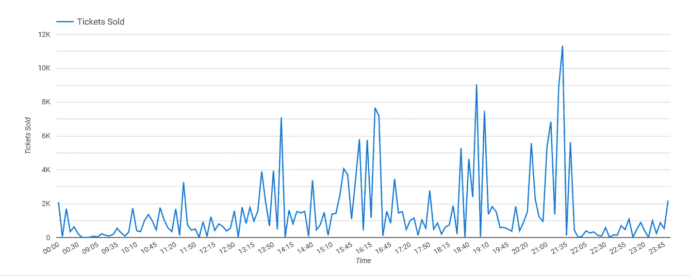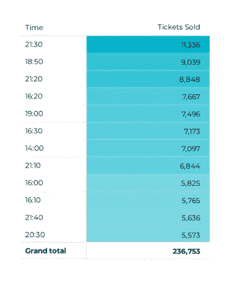

绘制一月份累计的电影放映时间售出的门票总数，我们发现**晚上/夜晚**是观看电影的首选时间，而 **21:30** 是最受欢迎的时间。

这可能是因为人们在工作日看电影往往是在晚上或下班/放学后。

## 购票率

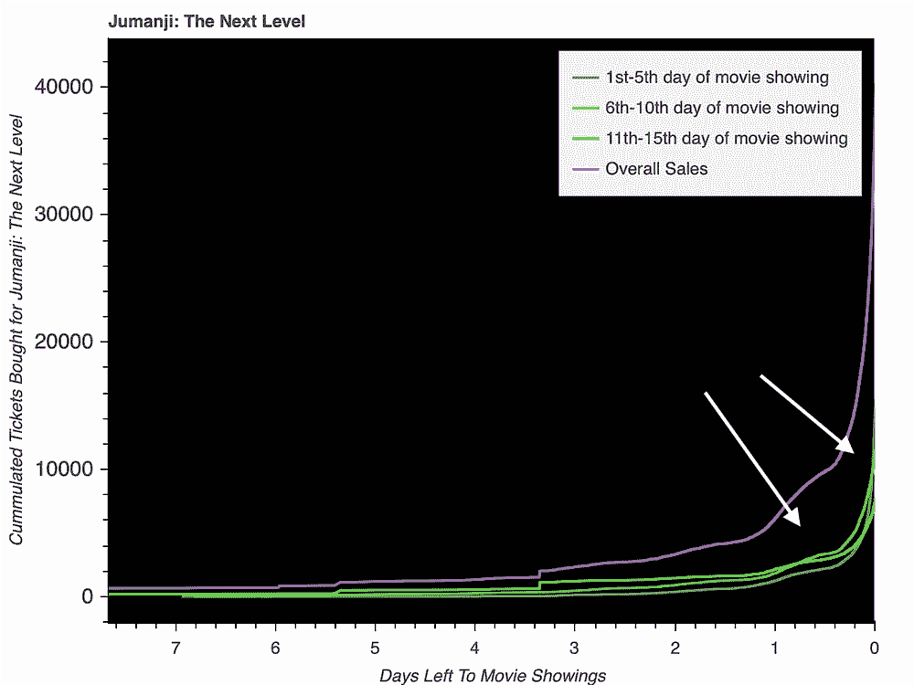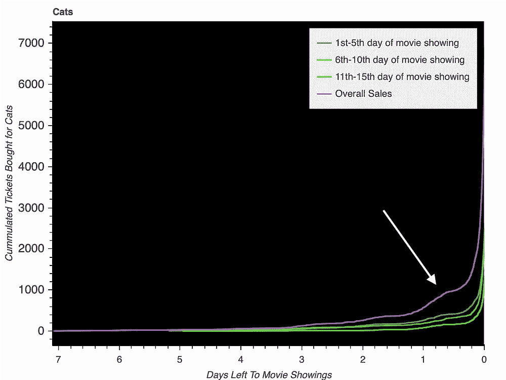

在电影放映的第 6-10 天，朱曼吉(左)的购买率上升，而猫(右)的购买率在电影放映期间下降。

*   《下一层》和它的演员阵容一样强大和可靠，因为它成功地在 15 天的电影放映中保持了收视率。
*   还记得电影《猫》带来的灾难吗？嗯，每个人都这么认为，因为在电影放映的三个阶段，观众人数迅速下降，购买的总门票只有 6500 张。

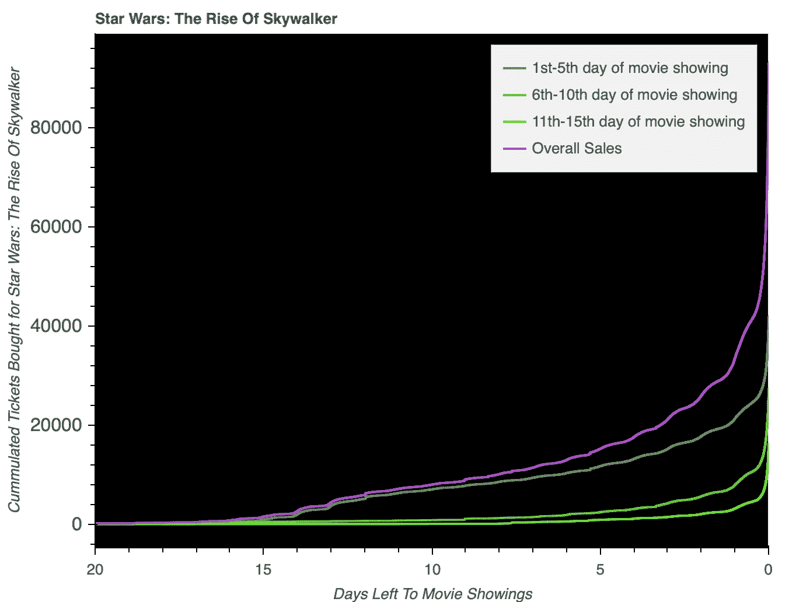

星球大战的购票率。

*   星球大战：天行者崛起:大多数星战迷都会同意三部曲的大结局没有达到预期**。**电影上映前几天就有异常高的座位购买量，这体现了电影最初的高人气，但在电影上映的第 6 至 10 天，这一数字迅速下降，因为失望的评论可能会阻止观众。

## 点击这里查看更多有趣和互动的事实和数据！

点按右下角的全屏选项以获得最佳体验。

# 3.创建网站

将可视化连接到后端

为此，我们使用了**Flask——一个基于 python 的 web 框架**，它允许我们快速构建和部署我们的站点。

对于像我们这样的 web 程序员新手来说，理解 Flask 最初是一项艰巨的任务。然而，随着我们掌握了窍门，它很快就成了我们的朋友。我们**从构建基本框架**开始，然后**在每个页面中放置相关的图表。**

## 显示座位购买订单图表的挑战性过程

对于座位购买订单，用户选择一部*电影*，然后选择它在其中播放的*厅*，然后选择*日期*，然后选择在该日期在该厅观看*电影的*时间*。(很多选项，是的)。我们必须确保所有选择的选项都对应于**相关的电影会话**，所以我们必须**动态生成按钮下拉选项**。*

为此，我们回到我们的数据库，获取每部电影的**嵌套字典，包含所有影院的所有放映时间。然后，**使用 JS，我们创建了一个过滤系统**,它接受用户输入的所选电影，并为电影中显示的大厅生成相关选项，然后生成电影的日期和时间。这些数据随后被发送到 url 中，使用该 URL 获取相关的 JSON 数据。**


！！图片来源:[https://www.nosegraze.com/colour-schemes-love/](https://www.nosegraze.com/colour-schemes-love/)

无可否认，网站建设的一个有趣的部分是在图表上玩颜色，在我们的座位购买订单图表上出现了一个“羽毛色调”的调色板。

另一个最受欢迎的是独特的深色主题的购买率图表，它与网站的其他部分结合得很好，同时也是可读的。

终于，在所有的艰苦工作和消耗大量爆米花之后，我们的网站准备好了！在[**【http://popcorn-data.herokuapp.com】**](http://popcorn-data.herokuapp.com/)**结账。**

该网站的代码可以在下面的 github repo 中找到:

[](https://github.com/PopcornData/popcorn-data-website) [## PopcornData/爆米花数据网站

### 在 GitHub 上创建一个帐户，为 PopcornData/popcorn-data 网站的开发做出贡献。

github.com](https://github.com/PopcornData/popcorn-data-website) 

请务必阅读我们文章的第一部分 (如果您还没有阅读的话)，其中记录了我们获取数据的过程！

## **我们很乐意在下面的评论中听到你注意到的任何有趣的模式:)**