# NLP 中流行的 Python 库:处理语言检测、翻译&超越！

> 原文：<https://medium.com/analytics-vidhya/popular-python-libraries-in-nlp-dealing-with-language-detection-translation-beyond-7b8e7cb2928e?source=collection_archive---------5----------------------->

互联网上充斥着各种文章和帖子，这些文章和帖子用于检测文本的语言，然后使用机器学习或深度学习 LSTM 模型、转移学习转换器模型(如 BERT、GPT-2 等)将其翻译成任何其他语言。并为开发自己的翻译模型建立深度神经网络。

但是如果你不想写很长的代码和开发你自己的算法，那么有一些 python 库可以很方便地在巨大的数据上完成这些任务，而且它们大多工作得很好。

下面是几个多功能的库，让你的生活变得简单。

# **谷歌翻译:**

这个库被命名为 ***Googletrans。*** Googletrans 是一个免费且无限制的库，它实现了 Google Translate API 来调用诸如 detect 和 Translate 之类的方法。它又快又可靠，使用的服务器和 translate.google.com 的一样。

易于安装:" **pip 安装 googletrans** "

它支持多种语言，包括一些印度语言，可以在下面的 python 代码中列出。

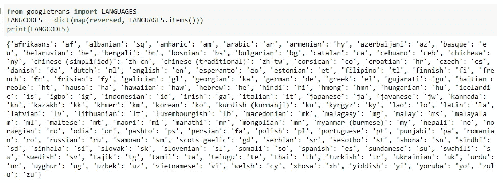

它检测不同语言的多个文本，检测结果的置信度在 0.0 和 1.0 之间。

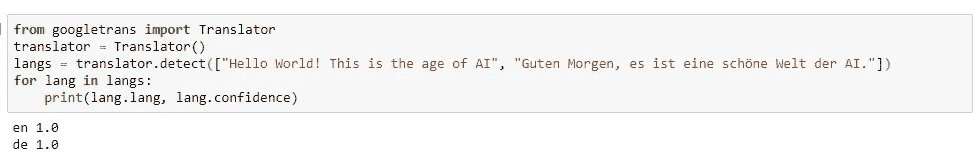

从一种语言翻译成另一种语言也很简单，如下面的代码所示。

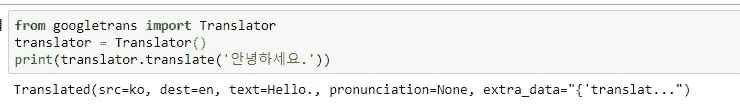

如果我们没有给出文本的源语言，这个库会自动尝试检测它并将其翻译成给定的目标语言。如果没有给出目标语言，如上面的示例代码所示，那么它会尝试将给定的文本翻译成运行它的机器的语言。在这种情况下，它将韩语翻译成英语，因为我的系统的默认设置语言是英语。

如果您想使用翻译文本进行文本预处理，请使用下面的示例代码:

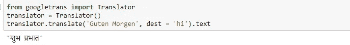

所以在这里，我试着把德语翻译成印地语。是不是很酷？让我们去下一个图书馆。

# 文本 Blob:

Textblob 是一个用于文本处理的 python 库，主要用于自然语言处理任务，如词性标注、名词短语提取、情感分析、分类、翻译等，可用于检测和翻译语言。

易于安装:" **pip 安装文本 blob** "

我们还需要使用下面的 python 语句下载必要的 NLTK 语料库:

**python-m textblob . download _ corpora**

## 语言检测:

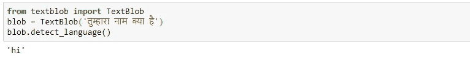

## 翻译:

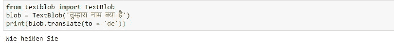

## 情感分析:

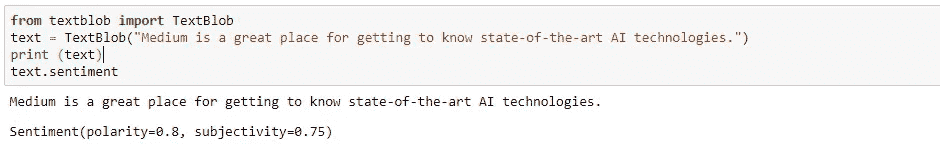

情感函数返回两个属性——极性和主观性。句子的极性是 0.8，说明情绪是积极的。极性属于“浮动”类型，在-1，1 范围内，其中 1 表示高度积极情绪，而-1 表示高度消极情绪。

输出还打印文本的主观性，在我们的例子中是 0.75。主观性也是“浮动”类型，在 0，1 的范围内。该值越接近 1，表明该句子主要是公众意见，而不是事实信息，反之亦然。

## 词性标注:

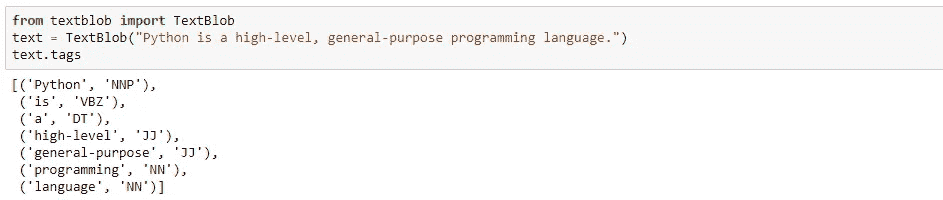

## 名词短语提取:

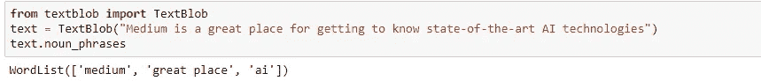

## 拼写纠正:

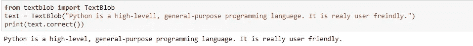

# StanfordNERTagger:

NLTK 是 python 中的一个领先平台，用于构建各种处理人类语言数据的程序，并且已经在自然语言处理领域创造了奇迹。这有用于文本预处理的所有内置功能，包括标记化、词干化、词条化、停用词去除、标点符号去除、词性标注、文本解析等。在这里，我们将不深入讨论这些细节，而是了解一个名为***StanfordNERTagger***的特殊包，它在文本预处理中也起着重要的作用，在文本预处理中，您想要提取命名实体，如人名、位置等。

StanfordNERtagger 是 NLTK 库中可用的一个 python 包，它是 NLTK 的命名实体识别(NER)分类器的替代。这种标记器在很大程度上被视为命名实体识别中的标准，但是由于它使用了一种高级的统计学习算法，所以它比 NLTK 提供的选项在计算上更加昂贵。

斯坦福 NER 标记器的一大好处是它为我们提供了不同的抽取命名实体的模型。我们可以使用以下任何一种方法:

*   识别地点、人员和组织的 3 级模型
*   用于识别位置、人员、组织和其他实体的 4 类模型
*   用于识别位置、人员、组织、时间、金钱、百分比和日期的 7 类模型

NER 分类器是用 JAVA 写的。这些都可以从[斯坦福自然语言处理小组](http://nlp.stanford.edu/software/CRF-NER.shtml#Download)免费获得。NTLK 还为 Stanford tagger 提供了一个包装器，因此我们可以在 python 中使用它。对于不同的语言，你需要下载 jar 文件。在这篇文章中，我们将展示一个仅适用于英语的示例代码函数。

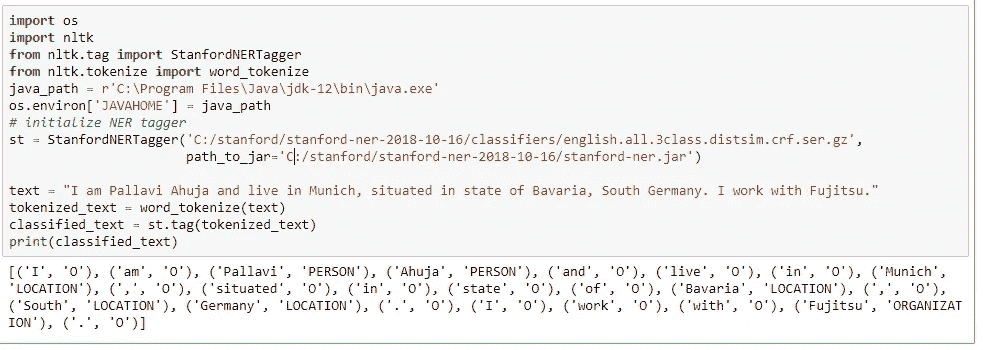

要使这个标记器工作，您需要在您的系统上安装 java。上面的代码显示了 java 应用程序的路径已定义。从上面给出的页面链接，您可以下载 jar 文件，然后需要初始化模型的路径。用于执行该模型的 gz 文件和 jar 文件的路径。在示例代码中，我们使用的是 class 3 模型。

代码的输出产生一个元组列表。每个令牌都用“人员”、“位置”、“组织”或“O”标记(使用 3 类模型)。“O”只是代表其他实体，即未命名的实体。

附注:如果你喜欢这篇文章，请在博客的评论中分享你的反馈或任何误导性信息，你可以通过*[***Linkedin***](https://www.linkedin.com/in/pallavi-ahuja-22590114/)与我联系。*