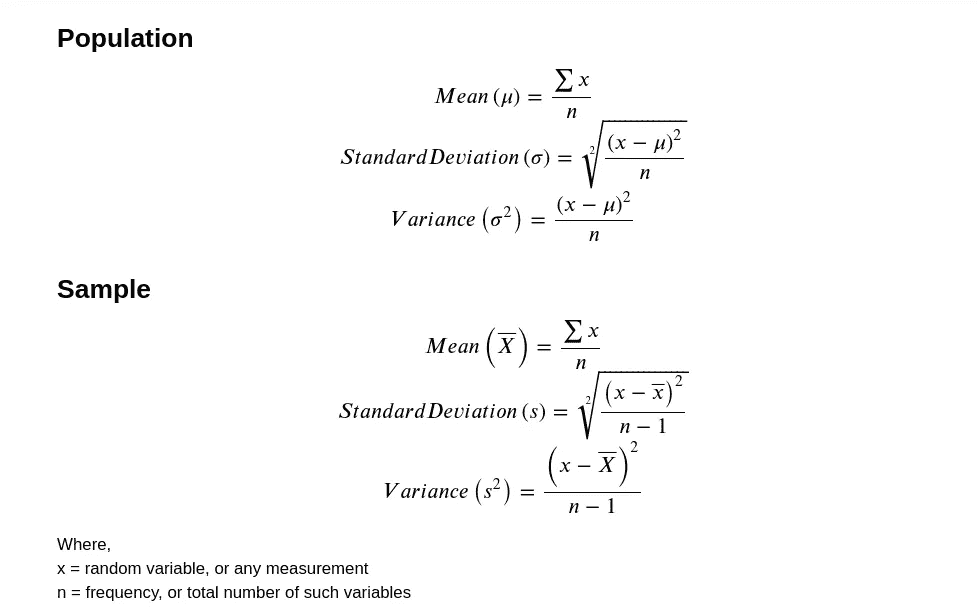
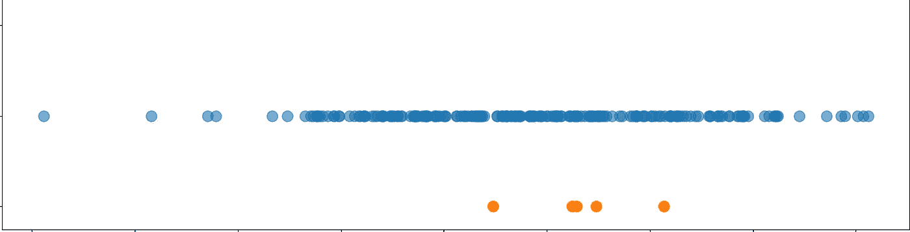
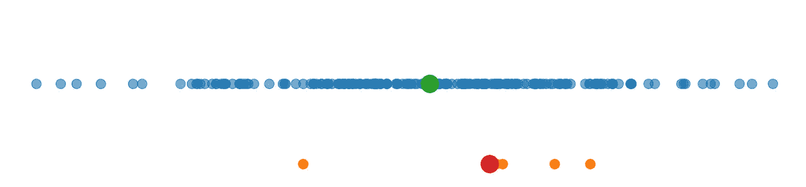
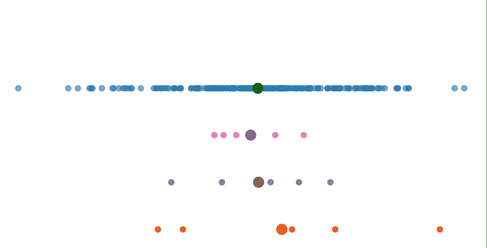

# 总体和样本参数

> 原文：<https://medium.com/analytics-vidhya/population-and-sample-parameters-86598dea03ce?source=collection_archive---------23----------------------->

我感觉我们大多数人，都很难抓住*的概念，意思是*、*标准*、*偏差*和*方差*之间**人口**和**样本。**什么是总体，为什么我们需要样本？最重要的是，为什么我们在计算样本方差时在分母中有一个 **n-1** 项，而在总体中有一个 **n** 项？

首先，我将给出一些术语的公式，这样，我们就不会被定义参数时使用的符号所迷惑。

图:公式

好，现在，什么是总体，什么是样本？

大多数时候，我们想要估计我们的数据会是什么样子，或者我们的[分布](/@CRLannister/distribution-33630fe42dcc)会是什么样子。很明显，我们不会有所有的数据，因为这可能是不可能的，或者我们可能会缺乏资金或时间限制。

例如，我们想找到人类的平均身高。因此，为了做到这一点，我们必须测量地球上的每一个人。但这可行吗？

所以，本质上，**人口**是我们整个数据的理想状态。总体是指我们数据集的一个完整集合，也就是说，没有其他数据不包括在总体中。我们总是想要人口测量值( *𝜇* ， *𝜎)* ，但是由于大多数情况下这是不可能的，所以我们估计它。怎么会？？

现在，来拯救样本！

样本，只不过是随机抽取的一小部分人口。因此，本质上，样本通常会提供与总体的某种相似性，因为它是随机选取的。此外，我们可以选择相当少量的测量值来处理。

例如，我们测量了世界上大约 10，000 人，并假设这一测量结果在整个人口中得到相似的结果。

好吧，但是我不相信…

图:人口和样本

图:样本和总体平均值

考虑一下，蓝点是总体，橙点是随机样本，绿点和红点分别是它们的平均值。现在，我们可以看到，样本是从总体中抽取的。此外，样本的平均值在某种程度上接近总体的平均值(情况可能并不总是如此)。

对于多个样本，我们有:

图:多个样本

因此，我们可以在这里看到一个模式。大多数情况下，(如果样本足够大)样本均值通常接近总体均值。现在，让我们深入研究一下标准差或方差(它们都表达了一些相同的东西，但是单位不同)

差异..这是什么意思？简单来说，就是我们的数据是如何变化的，即数据点之间的差异量。现在，对于一个群体，我们可以看到，范围可以从最左边到最右边。因此，我们通常在我们的人口中有很高的方差。

从其他角度来看，与样本数据点相比，群体极值(非常左/右数据)离群体平均值(*【𝜇】*)非常远。此外，样本平均值接近样本数据测量值，因此说明方差较小。

那是什么意思？有陷阱吗？

现在，样本的全部意义在于估计总体参数。显然，样本均值可以说是非常正确地估计了总体均值。但是，由于样本方差似乎小于总体方差(由于公式中分子的值相对较低)，我们也通过降低分母来补偿这种影响。因此，我们将 **n-1** 作为计算样本标准差和样本方差的分母。

从本质上讲，样本方差的计算只是一种数学/统计方法，以提供总体方差的更正确的表示。