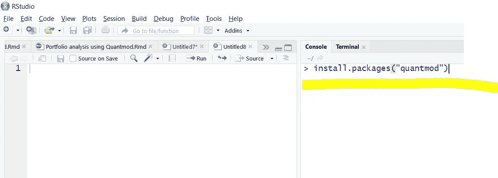
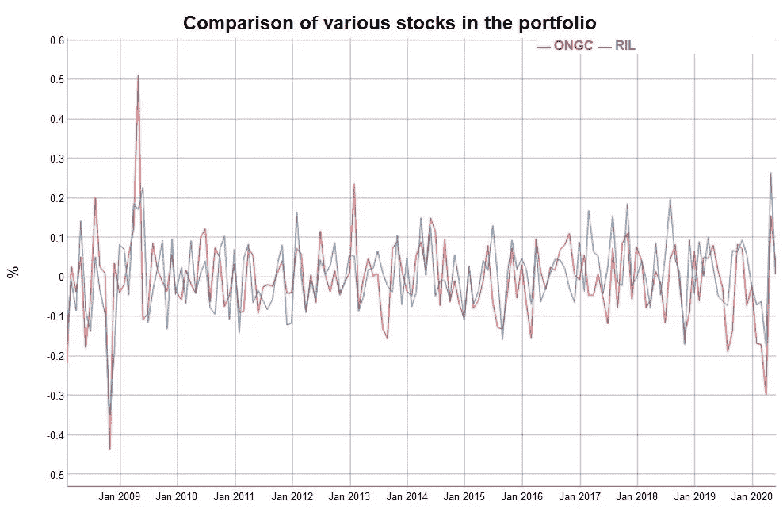
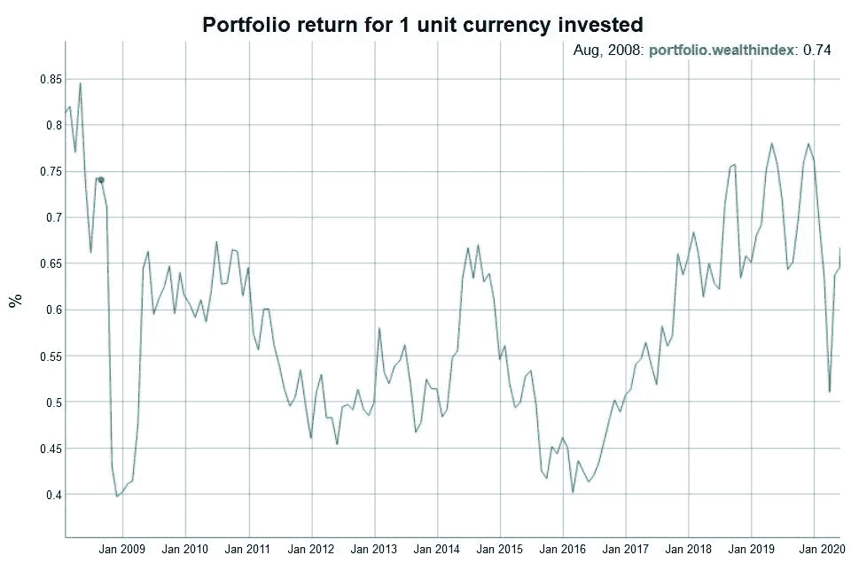

# 10 分钟印度股票投资组合分析

> 原文：<https://medium.com/analytics-vidhya/portfolio-analysis-of-indian-stocks-in-10-minutes-6a50f722a63c?source=collection_archive---------15----------------------->

在 [Unsplash](https://unsplash.com?utm_source=medium&utm_medium=referral) 上由 [Austin Distel](https://unsplash.com/@austindistel?utm_source=medium&utm_medium=referral) 拍摄的照片

当我刚进入金融分析领域时，我过去在试图分析一支股票时面临的最大挑战之一是找到一种循序渐进、对学习者友好、新手容易理解的方法。

但是，找到这样一种方法通常很费时间，而且新的学习者可能很难掌握书中的现有内容。最大的障碍不是代码的复杂性或方法背后的财务问题；是看哪里，找什么。在本帖中，我们将通过使用实际操作的方法，而不是进入太多的等式和技术细节，来寻找克服这一挑战的方法。

不管你是来自分析背景还是政治科学背景，这篇文章都是为你准备的。你不需要关于编码、数学、金融甚至安装必要软件的知识。这篇文章涵盖了这一切。

> “告诉我，我忘了。教我，我会记住。让我参与，我学习”
> 
> —本杰明·富兰克林

根据上面的引述，让我们开始动手实践活动:

# 投资组合分析:

投资组合分析将让你清楚地了解你的股票最近的表现，以及按照目前的趋势，它在不久的将来的表现。为了简单起见，我们只看:

*1。夏普比率
2。风险价值(VaR)
3。预期短缺*

**让我们逐一看看这些指标:**

我向你保证过解释会很简单。所以用外行人的话来说，这就是上面每个短语的意思:

S***harpe Ratio****:*假设有一个 10 年期的债券，它的收益率是固定的，固定在 6.7%。让我们称这个利率为无风险回报率，因为它不受市场波动的影响。夏普比率的作用是，它给出你的股票/投资组合收益减去无风险收益的差额。你可以在这里阅读更多关于夏普比率的信息。

V***alue at Risk(VaR)****:*这是指在 95%的概率下，您的投资组合在下一季度内预计承受的最大损失。然而，这并不是损失的极限。这只是一个对损失限额给出 95%置信度的度量。点击阅读更多关于这个[的内容。](https://www.investopedia.com/terms/v/var.asp)

E 这个值“X”的平均值就是你的预期短缺。

> 魔术马上就要开始了。到目前为止你和我在一起吗？

我们终于找到了好东西！您将需要以下工具来执行此分析。

1.  RStudio:如果你没有安装，请从[这里](https://rstudio.com/products/rstudio/download/)下载免费版本，或者从[这里](https://rstudio.cloud/)在线使用。
2.  耐心，是的！
3.  R 中的几个库:
    *-quant mod
    -dy graphs
    -TTR
    -tseries
    -performance analytics
    -DP lyr
    -tidy verse
    -RColorBrewer*

进入 RStudio 后，对上述所有库逐一运行**install . packages("*library name*")**命令(如下所示，在控制台上键入&然后按 enter 键)。记住保持大小写和上面一样，R 区分大小写。

**注意**:控制台可以在右边窗口，也可以在底部。最左边的窗格是“编辑器”,您可以使用“运行”按钮在上面键入并运行命令。

一旦安装了软件包，就可以加载库，如下所示:

现在设置已经完成，让我们开始分析。我们将分析以下股票

1.
ONGC 石油天然气有限公司 2。信实工业有限公司(RIL)

这两家公司都在美国国家证券交易所(NSE)上市。

您可以从以下代码中获取股票数据并计算股票的月回报率(自 2008 年起):

> 从现在开始，事情将变得丰富多彩&充满活力。

现在我们已经获取了两只股票的月收益记录，我们将合并两只股票的数据，并希望使用 dygraph 库看到一些趋势

运行上述代码后，您将得到一个漂亮的动态图形作为输出，只需将鼠标指针放在趋势线上的任意位置，就可以比较每一时间点的两只股票:

好吧，比较两只股票很酷，但是我们真的能看到这个投资组合的综合收益吗？

答案是肯定的，我们可以。为此，我们必须给投资组合分配权重。为了公平起见，我给了两只股票 0.5 的权重，这意味着我的投资组合中两只股票的价值相等。

为简单起见，我们将研究一个货币单位在这个投资组合中的表现。下面的代码片段可以用来做这件事:

代码的输出显示了投资组合的单位货币在十多年的给定时间内的表现。

我们已经完成了对我们股票的视觉分析。现在让我们来看看这个帖子开始部分讨论的 ***S V E*** *数字:*

这段代码将一次性计算所有三个数字:

上面的代码将为我们提供三个指标的结果。现在重要的问题是，我们如何解释这些结果。

> **部分结果解读**:

1.  **夏普比率:**该比率的负值表示风险投资组合呈现负回报。
2.  **VaR:**ONGC 的值为-0.15，表示在 95%的置信度下，ONGC 值的最大损失约为 15%。然而，损失可能更大，但这种情况发生的概率仅为 5%
3.  **预期亏空:**ONGC 的值为-0.1941，表示 ONGC 5%最大负回报的平均值约为 19%

**结论:**一般来说，相似的 VaR 和 es 值表明 ONGC 和 RIL 同样容易受到市场波动的影响。这是有道理的，因为这两家公司都是印度最大的石油和天然气公司。由于新冠肺炎危机，市场处于混乱状态，这解释了所有指标的负面趋势。

好了，暂时就这样吧！我们在这里仅仅触及了皮毛，还有很多东西需要学习。然而，这种分析会让你对如何分析股票有所了解，并且在重新平衡和投资决策时会派上用场。

*再次感谢你抽出时间阅读这篇文章。我希望你现在能够自己进行简单的投资组合分析。要重现结果，只需以相同的顺序复制并粘贴 github 代码片段中的所有代码，并更改您希望分析的股票的名称。*

一定要记得看看我用 RMarkdown 和 Shiny 做的这个**[***app***](https://manikhindwan.shinyapps.io/Portfolio_analysis_Quantmod/)**，里面有来自一个**实际投资组合**的 10 只这样的股票的分析。****