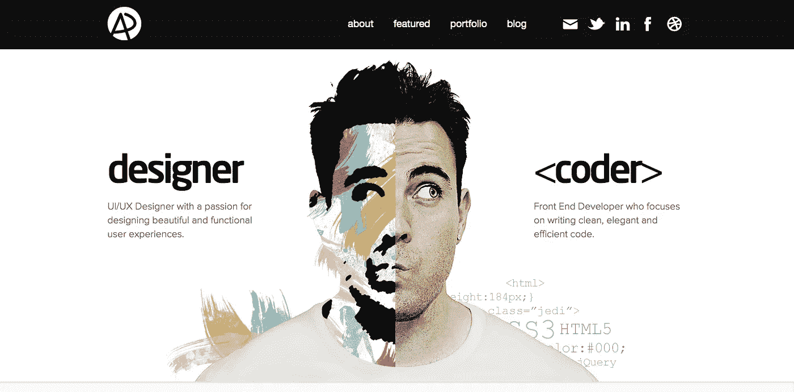
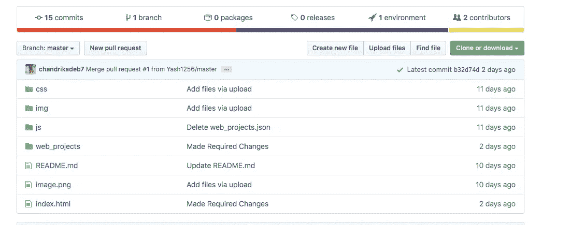
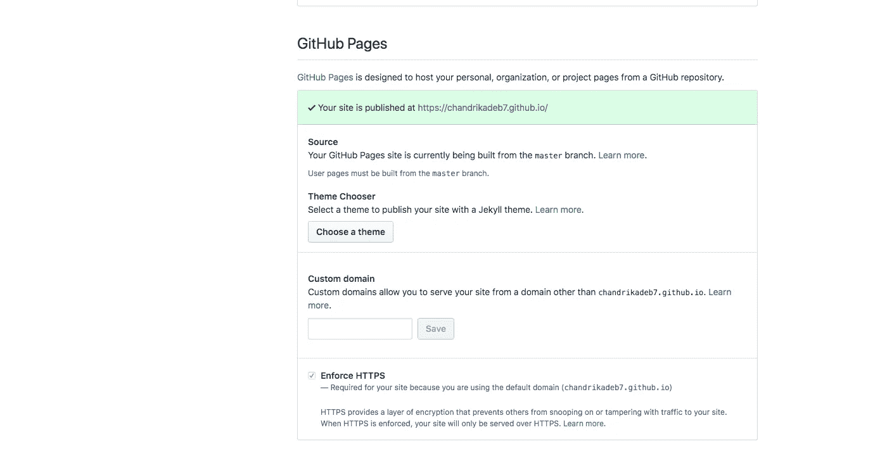

# 作品集网站——初学者之路！

> 原文：<https://medium.com/analytics-vidhya/portfolio-website-the-beginners-way-d43be855217e?source=collection_archive---------5----------------------->

[2020 年丹那威节](http://www.adhamdannaway.com/)

> ***你是否会因为滚动某人令人敬畏、反应灵敏的投资组合网站链接而感到不知所措或被吓倒，并且总是想知道如何为自己做一个？***

# ***所以，这里是关键！阅读到最后，并动手在不到一个小时的时间内制作自己的设计师作品集网站！***

约翰·施诺布里奇在 [Unsplash](https://unsplash.com?utm_source=medium&utm_medium=referral) 上拍摄的照片

# ***本教程结束博客:***

*   你将拥有自己的作品集网站。
*   可以免费使用 GitHub 页面在 web 上托管它！
*   最后，可以在你的简历中展示出来。

# 所以让我们开始吧..

1.  **下载作品集网站模板**

我们将首先在网上寻找一些免费的、反应灵敏的投资组合设计模板。我当然最喜欢的网站是**html 5 up【https://html5up.net/】()。它为个人投资组合提供了许多不错的选择，包括许多专业转换和 CSS/Bootstrap 之类的东西。**

[Pankaj Patel](https://unsplash.com/@pankajpatel?utm_source=medium&utm_medium=referral) 在 [Unsplash](https://unsplash.com?utm_source=medium&utm_medium=referral) 上拍摄的照片

## 下面列出了一些不错的模板选择:

*   [https://html5up.net/story](https://html5up.net/story)
*   [https://html5up.net/solid-state](https://html5up.net/solid-state)
*   [https://html5up.net/miniport](https://html5up.net/miniport)
*   [https://html5up.net/dimension](https://html5up.net/dimension)

点击右上角的**下载**选项，下载 ZIP 格式的模板。

> 耶！你现在离你的目标只有 25%的距离了！

## 2.相应定制！

现在从 ZIP 文件中提取文件并仔细查看。您可能会看到“*图像*”、“*资产*”等文件夹，以及“【index.html】”、“*license . txt”*和“*readme . txt”*等文件。

删除 *license.txt* 和 *readme.txt* 文件。在您的代码编辑器如 *VS Code* 或 *Sublime* 以及浏览器中打开**index.html**文件。从代码编辑器中开始对文本进行必要的更改，并通过刷新浏览器来反映这些更改。

您也可以通过更改**图像**文件夹中的图片来放置您自己的图像和背景，但请记住，放置的**与原来的** *【文件名】*相同。

> 一旦你完成并满意，你可以改变 CSS 和样式。如果你是一个完全的新手，这是完全可选的。

> 哇哦。已经完成了 50%的工作！进展顺利..

照片由[德鲁·比默](https://unsplash.com/@drew_beamer?utm_source=medium&utm_medium=referral)在 [Unsplash](https://unsplash.com?utm_source=medium&utm_medium=referral) 上拍摄

## 3.使用 GitHub 页面托管

最后，您的文件现在需要被推送到您的 GitHub 库，并且必须使用 GitHub 页面托管。GitHub Pages 托管您的作品集，供全世界免费查看！所以只要遵循几个简单的步骤:

*   转到[https://github.com/](https://github.com/)并点击左侧窗格“存储库”右侧的**新**选项。
*   将存储库命名为'*your-username . github . io*'。(例如，如果您的用户名是 *chandrika123* ，那么将存储库命名为 *chandrika123.github.io* )。
*   点击**创建存储库**。
*   现在从您的计算机上传所有必要的文件，并点击**提交更改。**

*   现在转到右上方的**设置**选项卡，向下滚动寻找 **GitHub 页面**选项。
*   现在在**源下拉菜单**中选择**主分支**，一两分钟后会出现一个通知，说明你已经准备好发布你的站点了。
*   点击通知**超链接**就可以了..你的作品集是免费托管在网上的！

> 这 75%是因为作品集网站在你的简历中看起来最好！

## 4.更新你的简历

最后，在你的简历中，甚至在你的 Instagram 简历中宣传你的投资组合链接！

> 是..完成了 100%的工作。尽情享受吧！！

照片由[杰克逊煨](https://unsplash.com/@simmerdownjpg?utm_source=medium&utm_medium=referral)在 [Unsplash](https://unsplash.com?utm_source=medium&utm_medium=referral) 上

> 最后，我在这里附上一些我喜欢看到和害怕的人的组合链接。看一看！
> 
> https://brittanychiang.com/
> 
> 【https://ashutosh1919.github.io/#/ 
> 
> [https://dalinhuang99.github.io/](https://dalinhuang99.github.io/)
> 
> [http://www.rleonardi.com/interactive-resume/](http://www.rleonardi.com/interactive-resume/)

## 如果你是 GitHub 新手，可以在这里参考我关于 GitHub 新手的故事:

 [## 适合初学者的 GitHub

### 这是一本帮助指南，面向所有渴望探索 GitHub 并为开源做出贡献但不了解 Git 的新手。

medium.com](/@chandrikadeb7/github-for-beginners-bb1b6d9911a4) 

希望这篇文章能有所帮助。如有任何疑问或帮助，请随意。

 [## Chandrika Deb -章节领导- GirlScript 基金会| LinkedIn

### 查看钱德里卡·德布在全球最大的职业社区 LinkedIn 上的个人资料。钱德里卡有 6 份工作列在…

www.linkedin.com](https://www.linkedin.com/in/chandrika-deb/) 

谢谢大家！