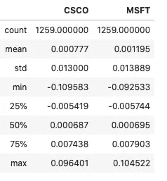
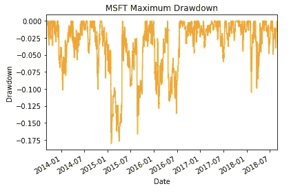

# 用 Python 实现两种风险资产的投资组合

> 原文：<https://medium.com/analytics-vidhya/portfolios-of-two-risky-assets-with-python-7a390cd84fe7?source=collection_archive---------7----------------------->

> 如何使用 Python 和 Pandas、NumPy、Matplotlib、Seaborn 和 Scipy 库构建两个风险资产的投资组合。


通过资产多样化，我们可以建立一个投资组合，为任何水平的预期回报提供尽可能低的风险。

Harry Markowitz 观察了一种常见的投资组合多样化实践，并准确地展示了投资者如何通过选择波动不完全一致的股票来降低投资组合回报的波动性。

两种风险资产的投资组合很容易分析，并显示适用于许多资产投资组合的原则。

## 资产

被选来演示使用 Python 语言计算有效边界的两家公司是思科和微软。没有考虑公司在其活动领域的多样化(两家公司都在技术领域)。降低投资组合风险还需要考虑其他因素，其中之一是分散投资(但这是另一篇文章的主题)。

选择的每日价格从 2013 年 3 月 9 日到 2018 年 8 月 31 日，从[雅虎财经](https://finance.yahoo.com)网站获得。关注一些关于公司的信息:

**思科系统公司(CSCO)——**该公司将其产品和技术分为几个类别，如交换；新一代网络路由(NGN)；协作；数据中心；无线；服务提供商视频；安全等产品

**微软公司(MSFT)** —微软是一家开发、许可和支持各种软件产品、服务和设备的技术公司

## 分析价格

首先，我们必须导入所有需要开始工作的库。

```
import pandas as pd
import numpy as np
import matplotlib.pyplot as plt
import seaborn as snsprice= pd.read_csv('price.csv', index_col= 0, sep=';', parse_dates=True, dayfirst=True,)
price.head()
```


下一个点显示了股价在五年中的表现。

```
# CSCO plot
plt.subplot(2, 1, 1) 
plt.plot(price.CSCO, color='b')
plt.ylabel('Price')
plt.title('CSCO Daily Returns')# MSFT plot
plt.subplot(2, 1, 2)
plt.plot(price.MSFT, color='g')
plt.ylabel('Price')
plt.title('MSFT Daily Returns')# Use plt.tight_layout() to improve the spacing between subplots
plt.tight_layout()
plt.show()
```


## 返回

我们可以通过使用函数 pct_change()来计算两项资产的日收益率。默认情况下，此函数计算前一行的百分比变化。正因为如此，我们使用函数 *dropna()* 删除第一天之前不存在的一天创建的 *NaN* 第一行。

```
returns = price.pct_change().dropna()
print(returns.head())
```


```
returns.info()
```


```
returns.describe()
```



```
fig = plt.figure(figsize=(10,10))# CSCO plot
plt.subplot(2, 1, 1) 
sns.distplot(returns.CSCO, color='b');
plt.xlabel('Return')
plt.ylabel('Probability')
plt.title('CSCO Returns')# MSFT plot
plt.subplot(2, 1, 2) 
sns.distplot(returns.MSFT, color='g')
plt.xlabel('Return')
plt.ylabel('Probability')
plt.title('MSFT Returns')plt.show()
```


根据柱状图和表格描述，CSCO 和 MSFT 投资的预期日回报率分别为 0.07%和 0.11%。此外，两者都有相似的可能收益，因此风险也相似。这种差异可以通过标准偏差来衡量。CSCO 投资的标准差为 1.3%，而 MSFT 的标准差为 1.38%。

## 最大水位下降

提取被定义为资产价格从其最高运行价格的下降。最大损失衡量的是这类投资者的最大损失。以下示例显示，MSFT 在 2016 年 2 月 10 日的最高提款率为 23%。

```
wealth_index_MSFT = (1+returns['MSFT']).cumprod()
previous_peaks_MSFT = wealth_index.cummax()
drawdowns_MSFT = (wealth_index - previous_peaks_MSFT)/previous_peaks_MSFT
drawdowns_MSFT.plot.line()
plt.ylabel('Drawdown')
plt.title('MSFT Maximum Drawdown')drawdowns_MSFT.min(), drawdowns_MSFT.idxmin()
```



## 相互关系

一种统计，其中协方差缩放到 1(完全负相关)和+1(完全正相关)之间的值。

```
corr = returns[['CSCO', 'MSFT']].corr()
print(corr)sns.scatterplot(x="CSCO", y="MSFT", data=returns)
```


两项资产的相关系数为 0.505。

## 年回报率

要计算日回报率，你需要将回报率乘以 252。日回报率 Rd 的年化公式为:


该公式以下列方式应用于下面的代码:

```
n_days = returns.shape[0]compounded_growth = (1+returns).prod()n_periods = returns.shape[0]
ann_returns =  compounded_growth**(252/n_days)-1ann_returns
```


## 年度波动率

我们通过将波动率乘以每次观察周期数的平方根来计算波动率，在本例中，[252/年](https://en.wikipedia.org/wiki/Trading_day)。

```
ann_vol = returns.std()*(252**0.5)
ann_vol
```


## 协方差

它衡量两种风险资产的回报同步变动的程度。

```
cov = returns.cov()
cov
```


正的协方差意味着资产收益一起移动。

## 投资组合回报

假设你正在考虑是投资思科还是微软的股票。根据上面显示的结果，思科的预期回报率为 19.0%，微软的预期回报率为 31.8%。另外，你可以看到思科汤和微软的回报率波动分别为 20.6%和 22.0%。微软提供更高的预期回报，但风险更大。

我们可以创建一个投资组合，而不是只持有一只股票，其预期回报只是这两只股票预期回报的加权平均值。

由 *wC* 表示的一部分投资于 CSCO 股票，而剩余的 1*wC*表示为 *wM* 投资于 MSFT 股票。投资组合的预期回报是以投资组合的比例作为权重的组成股票的预期回报的加权平均值:


我们可以用 python 把这个公式写成矩阵转置权重乘以回报。

## 投资组合波动

从下面的公式中可以看出，与预期收益不同，投资组合方差不是单个资产方差的加权平均值。


```
# Calculate the portfolio return
def portfolio_return(w, r):

    return w.T @ r# Calculate the portfolio volatility return
def portfolio_vol(w, covmat):

    return (w.T @ covmat @ w)**0.5 
```

## 效率限界

有效边界(曲线)说明了当你持有两只股票的不同组合时，预期回报率和标准差是如何变化的。

曲线的每个点(n_points=15)包含 15 个双资产权重的组合(weights =[NP . linspace(0，1，n_points)中 w 的 np.array([w，1-w])

例如:

*   **曲线的 0 点**

```
weights[0]
```


这意味着所有的投资都分配在一个资产上:CSCO 资产

*   **曲线的第二点**

```
weights[2]
```


这意味着 CSCO 资产的权重=85.7%，而 MSFT 资产的权重=14.3%。以此类推，直到曲线上的第 15 点，在这里所有的 MSFT 资产拥有总投资。

```
#Plot the efficient frontier of two assetsn_points = 15
weights = [np.array([w, 1-w]) for w in np.linspace(0, 1, n_points)]def plot_ef2(n_points, returns, cov):

    weights = [np.array([w, 1-w]) for w in np.linspace(0, 1, n_points)]
    rets = [portfolio_return(w, ann_returns) for w in weights]
    vols = [portfolio_vol(w, cov) for w in weights]
    ef = pd.DataFrame({
        "Returns": rets, 
        "Volatility": vols
    })
    return ef.plot.line(x="Volatility", y="Returns", style="o-")ax = plot_ef2(n_points, ann_returns, cov)
ax.set_ylabel('Expected Return')
ax.set_ylim(top=0.35)
ax.set_xlim(left = 0.0115, right=0.014)
```


蓝色的曲线显示了你通过两种股票的不同组合可以获得的预期收益和风险。
这里的目标是展示使用 python 创建的投资组合，但理想情况是不限于只投资两只股票。例如，您可能决定创建一个由 10 只股票组成的投资组合，在分析了每家公司的前景后，得出它们的回报预测。